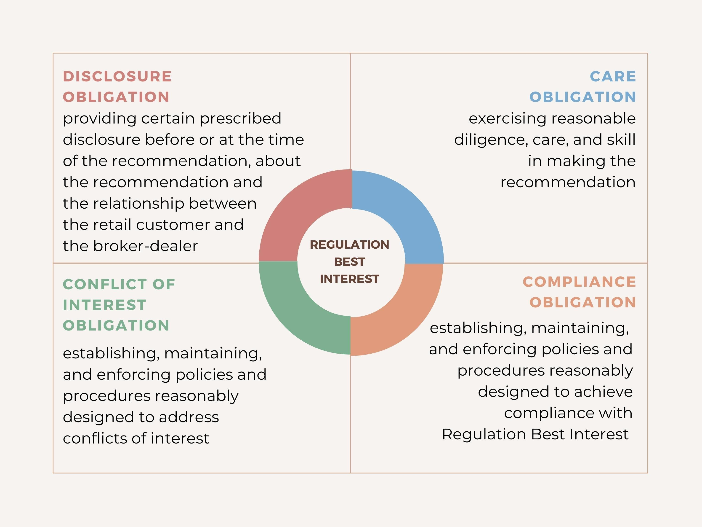

## Table of Contents

## What is Regulation Best Interest (Reg BI)?

Regulation Best Interest, or Reg BI, is a rule set by the U.S. Securities and Exchange Commission (SEC). It aims to make sure that when financial professionals give advice about investments, they do what's best for their clients. This rule applies to broker-dealers, who are people or firms that help buy and sell securities like stocks and bonds. Reg BI requires these professionals to put their clients' interests ahead of their own, which means they can't push products just because they make more money from them.

The rule has four main parts that broker-dealers must follow. First, they need to give advice that is in the best interest of the client. Second, they must clearly tell clients about any conflicts of interest, which means situations where the broker's interests might not match the client's. Third, they need to charge fair and reasonable prices for their services. And fourth, they have to have good policies and procedures in place to make sure they follow these rules. Overall, Reg BI helps make sure that clients get honest and helpful advice when making investment decisions.

## Who does Regulation Best Interest apply to?

Regulation Best Interest, or Reg BI, applies to broker-dealers and their associated persons. A broker-dealer is a person or firm that helps people buy and sell securities like stocks and bonds. When these professionals give advice about investments, they must follow the rules of Reg BI.

The main goal of Reg BI is to make sure that broker-dealers act in the best interest of their clients. This means they need to give advice that helps their clients, not just themselves. They also have to be honest about any conflicts of interest and charge fair prices for their services.

## What are the main obligations of brokers under Reg BI?

Under Regulation Best Interest, or Reg BI, brokers have to make sure they give advice that is best for their clients. This means they should think about what the client wants and needs, and suggest investments that will help the client reach their goals. Brokers can't just push products that make them more money. They need to look at all the different options and choose the ones that are really good for the client.

Brokers also have to tell their clients about any conflicts of interest. A conflict of interest happens when the broker might make more money from one investment than another, even if it's not the best choice for the client. They need to be clear and honest about these situations. Plus, brokers need to charge fair prices for their services and have good rules in place to make sure they follow all these requirements. This helps make sure clients get the best advice possible.

## How does Reg BI differ from the fiduciary standard?

Reg BI and the fiduciary standard both aim to make sure that financial professionals give good advice to their clients, but they have some key differences. Reg BI applies to broker-dealers, who help people buy and sell investments like stocks and bonds. It requires them to act in the best interest of their clients when giving advice. This means they need to consider what's best for the client, tell them about any conflicts of interest, charge fair prices, and have good rules in place to follow these requirements.

On the other hand, the fiduciary standard applies to investment advisers, who give ongoing advice and manage investments for clients. The fiduciary standard is stricter because it requires advisers to put their clients' interests ahead of their own in all situations, not just when giving advice. This means they must always act with the client's best interest in mind, avoid conflicts of interest whenever possible, and fully disclose any that cannot be avoided. In simple terms, the fiduciary standard sets a higher bar for loyalty and care compared to Reg BI.

## What are the specific disclosure requirements under Reg BI?

Under Reg BI, brokers need to tell their clients about any conflicts of interest. This means they have to be clear about situations where they might make more money from one investment than another, even if it's not the best choice for the client. They need to explain these conflicts in a way that's easy for the client to understand. This helps clients make better decisions because they know all the important details.

Brokers also have to give clients a special document called Form CRS, which stands for Client Relationship Summary. This form tells clients about the services the broker offers, how they get paid, any conflicts of interest, and how to get more information. It's important because it helps clients understand what they're getting into and how the broker works. By giving this information, brokers make sure their clients are well-informed and can trust the advice they receive.

## How should brokers handle conflicts of interest under Reg BI?

Under Reg BI, brokers need to be open about any conflicts of interest. This means they have to tell their clients about situations where the broker might make more money from one investment than another, even if it's not the best choice for the client. They need to explain these conflicts in a way that's easy to understand. By being honest about these situations, brokers help their clients make better decisions because they know all the important details.

Brokers also have to think about how to handle these conflicts in a way that's best for their clients. They should try to avoid conflicts of interest whenever possible, but if they can't, they need to manage them carefully. This means they might have to choose investments that are better for the client, even if it means less money for the broker. By doing this, brokers show they are putting their clients' needs first, which is what Reg BI is all about.

## What is the process for documenting compliance with Reg BI?

To make sure they follow Reg BI, brokers need to keep good records. They should write down all the advice they give to clients and explain why they think it's the best choice for them. This includes showing how they looked at different options and chose the one that fits the client's goals and needs. They also need to keep records of any conflicts of interest they told their clients about, like if they might make more money from one investment than another.

Brokers also need to have clear policies and procedures in place to make sure they follow Reg BI. They should write these down and make sure everyone in their firm knows about them. This helps make sure that everyone is doing what's best for the clients. By keeping good records and having strong rules, brokers can show that they are following Reg BI and putting their clients' interests first.

## Can you explain the 'Care Obligation' under Reg BI?

The 'Care Obligation' is a big part of Reg BI. It means that when brokers give advice to clients, they need to think carefully about what's best for them. Brokers should look at things like the client's goals, how much risk they want to take, and how long they plan to invest. They need to check out different investment options and pick the ones that will help the client the most. This is important because it makes sure the advice given is really good for the client, not just good for the broker.

To follow the Care Obligation, brokers also need to keep learning about their clients and the investments they suggest. If something changes, like the client's situation or the market, the broker should update their advice to make sure it's still the best choice. By doing all this, brokers show that they care about their clients and are working hard to give them the best possible advice.

## What are the potential penalties for non-compliance with Reg BI?

If brokers don't follow Reg BI, they could face serious consequences. The SEC, which is like a big boss watching over the financial world, can take action against them. This might mean they have to pay a lot of money as a fine, or they might even lose their license to work as a broker. The SEC can also make them give back any money they made by not following the rules.

These penalties are there to make sure brokers take Reg BI seriously and always put their clients first. If brokers know they could get in big trouble for not doing what's best for their clients, they are more likely to follow the rules. This helps keep the investment world fair and safe for everyone.

## How does Reg BI impact the relationship between brokers and their clients?

Reg BI changes how brokers work with their clients by making sure brokers always try to do what's best for them. Before, brokers might have suggested investments that made them more money, even if they weren't the best for the client. Now, they have to think about what the client wants and needs first. This means looking at different options and [picking](/wiki/asset-class-picking) the ones that help the client reach their goals. It's all about giving advice that really helps the client, not just the broker.

Because of Reg BI, clients can trust their brokers more. Brokers have to tell clients about any conflicts of interest, like if they make more money from one investment than another. They also need to charge fair prices and follow good rules to make sure they're doing the right thing. This openness makes clients feel more secure because they know their broker is looking out for them. Overall, Reg BI makes the relationship between brokers and clients stronger and more honest.

## What are some best practices for brokers to ensure compliance with Reg BI?

To make sure they follow Reg BI, brokers should always put their clients first when giving advice. They need to really understand what the client wants and needs, and look at all the different investment options to find the best ones for the client. Brokers should keep learning about their clients and the market, so they can update their advice if things change. They also need to be open and honest about any conflicts of interest, like if they might make more money from one investment than another. By doing this, brokers can show they are working hard to help their clients.

Brokers also need to have clear rules and procedures in place to make sure everyone in their firm follows Reg BI. They should write these down and make sure everyone knows about them. Keeping good records is important too. Brokers should write down all the advice they give and explain why they think it's the best choice for the client. By having strong rules and keeping good records, brokers can show they are doing what's best for their clients and following Reg BI.

## How has the implementation of Reg BI affected the financial industry as a whole?

The implementation of Reg BI has made a big difference in the financial industry. It has made brokers more careful about the advice they give. Now, they have to think about what's best for their clients, not just what makes them more money. This has made clients trust brokers more because they know their broker is looking out for them. Brokers also have to tell clients about any conflicts of interest, which means situations where the broker might make more money from one investment than another. This openness helps clients make better choices.

Because of Reg BI, the whole industry has had to change how it works. Firms have had to create new rules and ways to make sure their brokers follow them. This has sometimes made things more complicated, but it has also made the industry fairer and safer for everyone. Clients feel more secure knowing that their broker has to follow strict rules to protect them. Overall, Reg BI has pushed the financial industry to focus more on helping clients and being honest about how they make money.

## References & Further Reading

[1]: Securities and Exchange Commission (2020). ["Regulation Best Interest: The Broker-Dealer Standard of Conduct."](https://www.federalregister.gov/documents/2019/07/12/2019-12164/regulation-best-interest-the-broker-dealer-standard-of-conduct) 

[2]: Finnerty, J. D. (2010). ["Corporate Financial Management."](https://archive.org/details/corporatefinanci0000emer) John Wiley & Sons.

[3]: Malkiel, B. G. (2015). ["A Random Walk Down Wall Street: The Time-Tested Strategy for Successful Investing."](https://www.amazon.com/Random-Walk-Down-Wall-Street/dp/0393330338) W. W. Norton & Company.

[4]: Zhang, M. Y., Hu, Y., & head, E. S. A. (2000). ["Price Manipulation in a Controlled Experimental Market."](https://pubmed.ncbi.nlm.nih.gov/10704389/) Review of Financial Studies.

[5]: Aldridge, I. (2013). ["High-Frequency Trading: A Practical Guide to Algorithmic Strategies and Trading Systems."](https://www.amazon.com/High-Frequency-Trading-Practical-Algorithmic-Strategies/dp/1118343506) John Wiley & Sons.