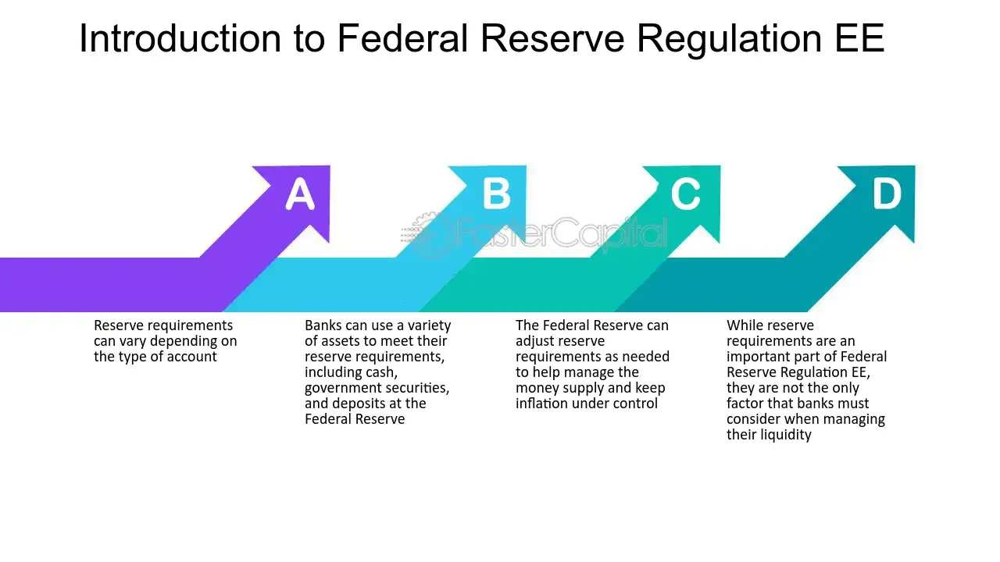

## Table of Contents

## What is Regulation EE?

Regulation EE is a set of rules made by the Federal Reserve in the United States. It's all about how banks and other financial companies handle electronic money transfers. This includes things like using ATMs, direct deposit, and paying bills online. The main goal of Regulation EE is to make sure these electronic transfers are safe and fair for everyone who uses them.

These rules help protect people by making sure their money is transferred correctly and on time. If there's a mistake or if someone steals money from an electronic account, Regulation EE tells people what they can do to fix it. It also says that banks have to give clear information about fees and how to report problems. This way, people can trust that their electronic money transfers are handled properly.

## Who does Regulation EE apply to?

Regulation EE applies to banks and other financial companies that offer electronic money transfers in the United States. This includes services like using ATMs, direct deposit, and paying bills online. The rule makes sure these companies handle electronic transfers in a safe and fair way for everyone.

The regulation also applies to people who use these electronic services. It helps protect them by making sure their money is transferred correctly and on time. If there's a mistake or if someone steals money from an electronic account, Regulation EE tells people what they can do to fix it.

## What are the main requirements of Regulation EE?

Regulation EE has some main rules that banks and financial companies need to follow when they handle electronic money transfers. One big rule is that they must make sure the money gets to the right place at the right time. They also need to keep electronic transfers safe and secure, so nobody can steal money from people's accounts. Another important rule is that banks have to tell people clearly about any fees they might charge for electronic transfers. They also need to give easy ways for people to report any problems or mistakes with their transfers.

For people who use electronic services, Regulation EE helps protect them. If there's a mistake with an electronic transfer, like money going to the wrong place or not arriving on time, the regulation tells people what they can do to fix it. People can ask their bank to look into the problem and get their money back if it was taken without their permission. The rules also say that banks must give clear information about how to report these issues, so everyone knows what to do if something goes wrong.

## How does Regulation EE affect financial institutions?

Regulation EE makes banks and other financial companies follow strict rules when they handle electronic money transfers. They have to make sure the money goes to the right place at the right time. They also need to keep the transfers safe and secure so no one can steal money from people's accounts. Banks must tell people clearly about any fees they might charge for these services. They also need to give easy ways for people to report any problems or mistakes with their transfers. This means banks have to spend time and money to make sure they follow all these rules correctly.

For banks, following Regulation EE can be a bit of a challenge. They need to set up good systems to keep track of electronic transfers and make sure everything is done right. If they don't follow the rules, they could get in trouble and might have to pay fines. But, following the rules also helps build trust with their customers. When people know their money is safe and that the bank will help fix any problems, they are more likely to keep using the bank's services. So, while it takes effort, following Regulation EE can be good for banks in the long run.

## What is the purpose of Regulation EE?

The purpose of Regulation EE is to make sure that banks and financial companies handle electronic money transfers safely and fairly. This includes things like using ATMs, direct deposit, and paying bills online. The main goal is to protect people who use these services by making sure their money gets to the right place on time and is kept safe from theft.

Regulation EE also helps people know what to do if something goes wrong with an electronic transfer. If there's a mistake or if money is stolen, the rules tell people how they can get their bank to fix it. By having these rules, banks have to be clear about any fees they charge and give easy ways for people to report problems. This helps build trust between banks and their customers.

## Can you explain the key components of Regulation EE?

Regulation EE is all about making sure banks and financial companies handle electronic money transfers the right way. It covers things like using ATMs, direct deposit, and paying bills online. The main thing is to keep these transfers safe and make sure the money gets to the right place on time. Banks also have to tell people clearly about any fees they might charge for these services. If something goes wrong, like a mistake or theft, Regulation EE says banks need to have a way for people to report it and fix the problem.

Another important part of Regulation EE is that it helps protect people who use electronic services. If there's a mistake with a transfer, like money going to the wrong place or not arriving on time, the regulation tells people what they can do to get their money back. It also makes sure banks give clear information about how to report these issues. This way, everyone knows what to do if something goes wrong with their electronic money transfers.

## How does Regulation EE interact with other regulations?

Regulation EE works together with other rules to make sure electronic money transfers are safe and fair. One important rule it connects with is the Electronic Fund Transfer Act (EFTA). The EFTA is a law that says banks have to follow certain rules when they handle electronic transfers. Regulation EE helps put these rules into action by giving more details on what banks need to do to keep transfers safe and tell people about fees and how to fix problems.

Another rule that Regulation EE works with is Regulation Z, which is about credit and loans. While Regulation Z mainly deals with things like credit cards and mortgages, it can also affect electronic transfers if they involve borrowing money. For example, if someone uses an electronic transfer to pay off a credit card, both Regulation EE and Regulation Z might apply. This means banks have to follow rules from both regulations to make sure they handle the transfer correctly and treat people fairly.

## What are the penalties for non-compliance with Regulation EE?

If banks or financial companies do not follow Regulation EE, they can get in trouble. The main penalty for not following the rules is that they might have to pay a fine. The amount of the fine can be different depending on how bad the mistake was and how many people were affected. The government agency in charge, like the Federal Reserve, decides how much the fine will be.

Besides fines, not following Regulation EE can also hurt a bank's reputation. If people find out that a bank is not keeping their money safe or is not fixing problems with electronic transfers, they might stop using that bank. This can make it hard for the bank to keep customers and make money. So, it's really important for banks to follow Regulation EE to avoid these problems.

## How has Regulation EE evolved over time?

Regulation EE has changed over time to keep up with new technology and ways people use electronic money transfers. When it first started, it was all about making sure banks followed the rules from the Electronic Fund Transfer Act (EFTA). This was important because more and more people were using ATMs and direct deposit. As time went on, the rules got updated to include new things like online banking and paying bills over the internet. This helped make sure that no matter how people were transferring money, it was still safe and fair.

More recently, Regulation EE has been adjusted to deal with new kinds of electronic transfers, like using mobile apps to pay for things. The rules now also cover things like peer-to-peer payments, where people send money to each other directly through their phones. These changes help keep up with how people use money today. The main goal is still the same: to make sure electronic money transfers are safe, happen on time, and that banks tell people clearly about fees and how to fix any problems.

## What are some common challenges in implementing Regulation EE?

One common challenge in implementing Regulation EE is keeping up with new technology. As people start using new ways to transfer money, like mobile apps and peer-to-peer payments, banks need to make sure these new methods follow the rules. This can be hard because technology changes fast, and banks have to update their systems and training to keep everything safe and fair.

Another challenge is making sure everyone understands the rules. Banks need to tell people clearly about any fees and how to report problems with electronic transfers. This can be tricky because people might not read all the information or might not understand it. Banks have to find good ways to explain things so that everyone knows their rights and what to do if something goes wrong.

## How can organizations ensure compliance with Regulation EE?

Organizations can ensure compliance with Regulation EE by setting up good systems to handle electronic money transfers. They need to make sure that the money gets to the right place on time and is kept safe from theft. This means they should use strong security measures and regularly check their systems to find and fix any problems. They also need to train their staff well so everyone knows how to follow the rules. By doing these things, organizations can make sure they are doing what Regulation EE says they should do.

Another important way to stay compliant is to be clear with customers about fees and how to report problems. Organizations should give easy-to-understand information about any fees for electronic transfers and make it simple for people to tell them if something goes wrong. They should also have a good process for looking into any issues and fixing them quickly. By being open and responsive, organizations can build trust with their customers and make sure they are following Regulation EE.

## What future changes might we expect in Regulation EE?

In the future, Regulation EE might change to keep up with new technology. As more people use their phones and apps to send money, the rules might need to cover these new ways of transferring money. This could mean adding new rules to make sure these transfers are safe and fair, just like with ATMs and online banking. The goal would still be to protect people's money and make sure they know about any fees and how to fix problems.

Another possible change could be making the rules easier to understand. Right now, some people might find it hard to know all the details about Regulation EE. In the future, the rules might be explained in simpler ways so that everyone can understand them better. This would help people know their rights and what to do if something goes wrong with an electronic transfer. Keeping the rules clear and up-to-date will help make sure electronic money transfers stay safe and fair for everyone.

## References & Further Reading

[1]: ["Netting: past, present and future"](https://aisel.aisnet.org/jit/vol39/iss1/8/) by the European Central Bank, provides an analysis of netting mechanisms.

[2]: Bliss, R.R., & Kaufman, G.G. (2003). ["Bank procyclicality, credit crunches, and asymmetric monetary policy effects: A unifying model"](https://papers.ssrn.com/sol3/papers.cfm?abstract_id=367166) Research in Banking and Financial Services.

[3]: Duffie, D., & Zhou, C. (2001). ["Credit derivatives in banking"](http://www.econ2.jhu.edu/People/Duffee/jme.pdf) The Journal of Monetary Economics, 48(1), 25-54.

[4]: Gregory, J. (2011). ["Counterparty Credit Risk: The new challenge for global financial markets"](https://books.google.com/books/about/Counterparty_Credit_Risk.html?id=WZ_vbGGx1z4C) John Wiley & Sons.

[5]: Rehlon, A., & Nixon, D. (2013). ["Central counterparties: what are they, why are they there and how do they work?"](https://papers.ssrn.com/sol3/papers.cfm?abstract_id=2281142) Bank of England Quarterly Bulletin, Q2.

[6]: ["Regulation EE: Beneficial netting practices"](https://www.investopedia.com/terms/r/regulation-ee.asp) by the U.S. Federal Reserve Board.

[7]: Cox, J.C., Ingersoll, J.E., & Ross, S.A. (1985). ["A theory of the term structure of interest rates."](https://pages.stern.nyu.edu/~dbackus/BCZ/discrete_time/CIR_Econometrica_85.pdf) Econometrica: Journal of the Econometric Society, 53(2), 385-407.