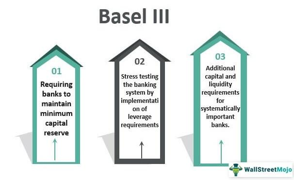

In today's financial markets, algorithmic trading has emerged as a dominant force, allowing for the execution of trades at unprecedented speeds and scales. Algorithmic trading, or algotrading, leverages computer algorithms to make rapid decisions in buying and selling securities, optimizing trade execution in ways that human traders cannot match. As a result, algotrading has increased market efficiency but has also introduced complexities that require careful regulatory oversight.

The expansion of algorithmic trading necessitates stringent regulatory frameworks to ensure market stability, fair trading practices, and consumer protection. These requirements are vital to prevent issues such as market manipulation and systemic failures, which can have far-reaching impacts on global financial stability. Regulatory bodies, including the U.S. Securities and Exchange Commission (SEC) and the Commodity Futures Trading Commission (CFTC), have developed guidelines and rules aimed at mitigating these risks by enforcing strict compliance measures.



Central to this regulatory landscape is Regulation F, which is pivotal in limiting risk exposure among federally-insured banks. This regulation, established by the Federal Reserve, mandates the implementation of sound risk management practices to protect financial institutions from excessive exposure during their interbank trading activities. By ensuring that banks maintain robust risk management protocols, Regulation F plays a crucial role in safeguarding against financial uncertainties and promoting systemic stability.

This article examines the complex interplay between consumer protection compliance, Regulation F, and algorithmic trading. It aims to guide stakeholders, including banks, algorithm developers, and traders, through the diverse regulatory environment. Understanding these intersections is crucial for navigating the regulatory terrain and ensuring both compliance with established guidelines and the safeguarding of market integrity.

## Table of Contents

## Understanding Consumer Protection in Algorithmic Trading

Consumer protection plays a crucial role in reinforcing the trust and safety of financial markets, especially with the integration of algorithmic trading. Regulations are foundational to safeguarding market participants from risks such as market manipulation, systemic failures, and unauthorized access to sensitive data. The surge in algorithmic trading has intensified the necessity for strong consumer protection protocols to ensure a level playing field for all investors and maintain overall market integrity.

Market manipulation represents a significant risk within algorithmic trading, manifesting in techniques like spoofing and layering. Spoofing involves submitting large orders with no intention to execute them, thereby misleading other traders about supply and demand. Layering, on the other hand, pertains to the placement of multiple false orders at distinct price levels to create artificial movement in stock prices. The Dodd-Frank Wall Street Reform and Consumer Protection Act is one critical piece of legislation designed to mitigate such manipulative practices by imposing stringent rules and severe penalties on offenders[1].

To effectively adhere to consumer protection standards, financial institutions must comply with comprehensive regulations that monitor trading practices and conduct. These regulations necessitate adopting advanced surveillance measures and risk controls, such as real-time monitoring systems capable of detecting unusual trading patterns indicative of manipulation.

Moreover, [algorithmic trading](/wiki/algorithmic-trading) must ensure robust data security frameworks to prevent unauthorized access and protect the sensitive financial data of market participants. This involves implementing encryption protocols, regular security audits, and secure authentication mechanisms to safeguard consumer information.

The inclusion of these regulatory measures is not only pivotal for protecting individual investors but also for ensuring broader financial stability, as systemic risks can have devastating impacts on global markets. By adhering to established regulations and continuously updating compliance practices, algorithmic traders can foster a reliable and trustworthy market environment conducive to both innovation and protection.

---

[1] U.S. Securities and Exchange Commission. "Dodd-Frank Wall Street Reform and Consumer Protection Act." Available at: https://www.sec.gov/spotlight/dodd-frank.shtml

## Regulation F: An Overview

Regulation F, promulgated by the Federal Reserve, serves as a crucial mechanism designed to limit the risk exposure faced by banks with federally-insured deposits. This regulation aims to ensure sound financial practices by requiring banks to enforce comprehensive risk management protocols. These protocols are essential for safeguarding against potential uncertainties that might arise during transactions with other financial institutions.

A significant component of Regulation F is its focus on credit exposure. By curtailing the amount of credit risk banks can assume, Regulation F plays a fundamental role in maintaining the stability of the financial system. This involves setting limits on the [volume](/wiki/volume-trading-strategy) of unsecured credit a bank can extend to another financial institution. Such limits are critical in preventing the cascading effects of defaults and ensuring that credit exposure remains manageable in the event of financial distress.

Additionally, Regulation F encompasses provisions related to the collection of checks. By regulating this aspect of banking operations, the Federal Reserve aims to enhance the efficiency and reliability of the check clearing process, minimizing risks related to the settlement of transactions. Efficient check collection is vital for maintaining [liquidity](/wiki/liquidity-risk-premium) and trust in the payment systems, further contributing to overall financial stability.

Beyond these, Regulation F addresses a range of other market financial transactions. These regulatory measures are designed to mitigate systemic risk and ensure that market operations proceed without disruptions that could adversely affect the broader financial ecosystem. By imposing requirements on banks to monitor and manage their transaction-related risks effectively, Regulation F plays an indispensable role in promoting a stable and secure banking environment.

In summary, Regulation F is a pivotal regulation that underpins the risk management frameworks of banks dealing with federally insured deposits. Its comprehensive approach towards managing credit exposure, checks collection, and other financial transactions is integral to achieving system-wide stability and safeguarding against unforeseen financial uncertainties.

## Algorithmic Trading and Regulatory Compliance

The Securities and Exchange Commission (SEC) and the Commodity Futures Trading Commission (CFTC) have established stringent compliance requirements for algorithmic trading to ensure market integrity and protect investors. One of the key regulations is the Market Access Rule, formally known as Rule 15c3-5, which obligates broker-dealers to implement effective risk management controls and supervisory procedures. This rule is designed to prevent erroneous trades that could potentially disrupt financial markets. It requires firms to systematically monitor trading activities, set pre-trade controls, and implement real-time monitoring to identify and mitigate anomalies promptly.

Compliance with these regulations necessitates more than just registration. It involves a detailed adherence to prescribed risk management and surveillance protocols. Firms engaged in algorithmic trading must register with appropriate regulatory bodies and maintain ongoing compliance with the established standards. This comprehensive compliance involves establishing systems capable of monitoring trading activities in real-time, flagging suspicious or potentially destabilizing transactions, and maintaining an audit trail to satisfy regulatory reviews.

An integral component of regulatory compliance is the use of advanced technologies that can keep pace with the speed and volume of algorithmic trades. This includes leveraging [machine learning](/wiki/machine-learning) algorithms to enhance surveillance systems and employing automated tools to ensure continuous compliance with the specified regulatory standards.

Additionally, firms are required to evaluate and test their algorithms under various conditions to assess their performance and ensure they do not inadvertently introduce systemic risks. By combining technological innovation with stringent regulatory adherence, algorithmic trading firms can effectively mitigate risks while maintaining operational compliance in today’s highly regulated financial markets.

## Risk Management in Algotrading: Lessons from Regulation F

Effective risk management is a foundational element emphasized by Regulation F, and it imparts valuable lessons applicable to the domain of algorithmic trading. Regulation F, designed to limit the risk exposure of banks holding federally-insured deposits, insists that these institutions implement robust risk management protocols to protect against uncertainties in their financial transactions. This insistence on sound risk management can provide a framework for algorithmic trading stakeholders to emulate.

To maintain market stability and consumer protection, banks under Regulation F are required to establish comprehensive internal risk controls and policies. Such controls include service reviews, continuous process audits, and risk assessments that ensure the integrity and security of financial operations. In algorithmic trading, the same level of diligence is necessary. Trading algorithms, often executing thousands of transactions within fractions of a second, must be subjected to stringent validations and controls akin to those in banking systems. Effective internal controls in algotrading can help in identifying potential faults or vulnerabilities, thereby reducing the likelihood of erroneous trades that could impact market dynamics.

Algorithm developers, similar to bank auditors, must prioritize rigorous testing and validation of their systems. This involves creating a robust framework for stress testing algorithms against historical and simulated data to ensure stable and secure operations. Developers often employ [backtesting](/wiki/backtesting) to evaluate how their algorithms would have performed in past market conditions. This process involves running the algorithm on historical data and analyzing performance metrics like profitability, [volatility](/wiki/volatility-trading-strategies), and risk exposure. A typical Python snippet for backtesting could be:

```python
import pandas as pd
import numpy as np

def backtest_strategy(data, signal, initial_capital=10000):
    positions = signal.diff()
    portfolio = pd.DataFrame(index=data.index)
    portfolio['holdings'] = (signal * data['Close'] * 100)**-1
    initial_capital += positions * data['Close']
    portfolio['cash'] = initial_capital - positions * data['Close'] * 100
    portfolio['total'] = portfolio['cash'] + portfolio['holdings']
    return portfolio

data = pd.read_csv('historical_data.csv')
signal = np.where(data['EMA_fast'] > data['EMA_slow'], 1.0, 0.0)
portfolio = backtest_strategy(data, signal)
print(portfolio)
```

This Python function provides a basic framework for assessing a trading strategy's effectiveness and risk potential, allowing developers to tweak parameters for optimized performance.

Furthermore, akin to internal audits in banking, continuous monitoring and validation of algorithmic systems are crucial. This involves real-time performance metrics analysis and anomaly detection, ensuring that any divergence from expected outcomes is promptly addressed. Advanced techniques, such as machine learning models, are increasingly being used to predict and identify potential risks in trading environments, allowing developers to preemptively mitigate issues.

In conclusion, the effective risk management principles enshrined in Regulation F are pertinent to ensuring robust, reliable algorithmic trading systems. By adopting structured risk controls, stringent testing protocols, and continuous monitoring processes, algorithmic trading can achieve higher safety and reliability, akin to the stability sought in federally-insured banking institutions.

## The Role of Technology in Compliance and Risk Management

Technological advancements have significantly enhanced compliance tracking and risk management strategies within algorithmic trading, providing robust mechanisms to ensure market integrity and protect against systemic risks. By leveraging these technologies, firms can better comply with regulatory standards and safeguard consumer interests.

AI and machine learning play pivotal roles in this enhancement by detecting potential manipulative behaviors and ensuring precise data analysis. These technologies are capable of processing vast amounts of trading data to identify patterns indicative of unfair practices like spoofing or layering. For instance, machine learning models can be trained to recognize abnormal trading behaviors that deviate from established norms. Anomalies detected by these models can trigger alerts for further investigation, thereby preventing potential market manipulation.

The use of AI extends to natural language processing (NLP) techniques, which can analyze textual data from news feeds, social media, and financial reports to predict market-moving events or sentiment shifts. This predictive capability assists in creating more robust trading strategies that account for external information, aligning with compliance requirements to avoid undue influence on market stability.

Furthermore, platforms like QuantConnect provide essential services for algorithm documentation and testing, crucial for meeting compliance standards. QuantConnect allows developers to backtest their trading algorithms on historical data, offering insights into performance and potential risks. This tool supports the creation of transparent and auditable trading strategies, simplifying the verification of compliance with regulatory requirements.

Incorporating such technological tools into the workflow not only ensures adherence to regulatory standards but also enhances the reliability and performance of algorithmic trading systems. Python, a widely used programming language in algo trading, facilitates this process by offering libraries such as `pandas` for data manipulation, `scikit-learn` for machine learning, and `numpy` for numerical operations. These tools enable developers to construct sophisticated models and perform comprehensive testing, ensuring compliance and risk management are integrated into every stage of the algorithmic trading process.

In summary, technology serves as a cornerstone in the compliance and risk management landscape of algorithmic trading. By utilizing advanced AI, machine learning, and platforms like QuantConnect, firms can effectively navigate regulatory frameworks, mitigate risks, and maintain the integrity of financial markets.

## Conclusion and Future Outlook

Regulation F and algorithmic trading regulations collaboratively play a vital role in maintaining the integrity and fairness of financial markets. By addressing consumer protection and mitigating systemic risks, these regulations ensure that both individual investors and large institutions operate on a level playing field. Such regulations are crucial for preventing exploitative and destabilizing practices in the rapidly evolving world of algorithmic trading.

As financial markets continue to advance technologically and operationally, staying informed about regulatory developments is essential for all market participants. Algorithmic trading, characterized by rapid decision-making and execution, must constantly adapt to new compliance standards to maintain operational integrity and trust. Ensuring compliance is not merely about adhering to existing guidelines but also about anticipating changes in regulatory landscapes that aim to keep pace with evolving market dynamics and technological innovations.

Looking ahead, future technological advancements will likely lead to further refinement of regulatory requirements. As algorithms become increasingly sophisticated, regulatory bodies may demand more comprehensive risk management frameworks and robust compliance strategies. The ability to quickly adapt to these changes, leveraging advanced technologies for real-time monitoring and analysis, will be critical for market participants. Embracing innovations such as machine learning and [artificial intelligence](/wiki/ai-artificial-intelligence) will be central in developing adaptable compliance and risk management methodologies that can swiftly respond to both market fluctuations and evolving regulatory standards. 

In conclusion, the symbiotic relationship between Regulation F, algorithmic trading laws, and technology will continue to evolve. Market participants must remain vigilant and proactive, ensuring that their practices meet regulatory expectations while also driving advancements in compliance and risk management strategies.

## References & Further Reading

[1]: U.S. Securities and Exchange Commission. ["Dodd-Frank Wall Street Reform and Consumer Protection Act"](https://www.sec.gov/rules-regulations/implementing-dodd-frank-wall-street-reform-consumer-protection-act).

[2]: Board of Governors of the Federal Reserve System. ["Regulation F: Limitations on Interbank Liabilities"](https://www.ecfr.gov/current/title-12/chapter-II/subchapter-A/part-206).

[3]: Commodity Futures Trading Commission. ["Spoofing and Manipulative Trading"](https://www.cftc.gov/PressRoom/PressReleases/8024-19).

[4]: Securities and Exchange Commission. ["Market Access Rule (Rule 15c3-5)"](https://www.sec.gov/files/rules/final/2010/34-63241.pdf).

[5]: U.S. Securities and Exchange Commission. ["Algorithmic Trading Compliance and Market Integrity"](https://www.sec.gov/files/Algo_Trading_Report_2020.pdf).

[6]: Christine A. Parlour and Uday Rajan. ["Algorithmic Trading and the Market for Liquidity"](https://www.aeaweb.org/articles?id=10.1257/aer.91.5.1311). Journal of Financial Economics.