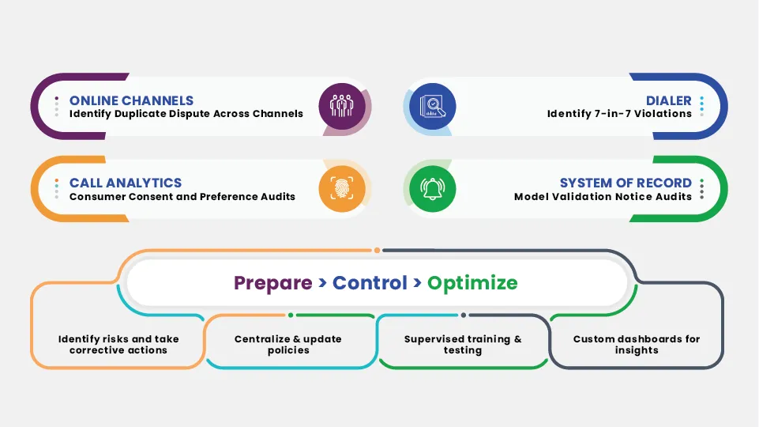

## Table of Contents

## What is Regulation F?

Regulation F is a set of rules created by the Federal Communications Commission (FCC) in the United States. It deals with how telemarketers and debt collectors can contact people. The main goal of Regulation F is to protect consumers from being bothered too much by these calls and to make sure that debt collectors follow fair practices.

The rules under Regulation F say that debt collectors must tell people clearly about any debts they owe. They also have to give people a way to stop being called if they want. This helps to make sure that people are treated fairly and know their rights when it comes to debt collection.

## Who does Regulation F apply to?

Regulation F applies to debt collectors. These are people or companies that try to get money back from people who owe debts. The rule says that debt collectors have to follow certain rules when they talk to people about their debts.

The rules are there to make sure that debt collectors treat people fairly. They have to tell people clearly about their debts and give them a way to stop being called if they want. This helps protect people from being bothered too much by debt collectors.

## When was Regulation F implemented?

Regulation F was put into place by the Federal Communications Commission (FCC) in the United States. It started being used on November 30, 2021. This rule is all about making sure that debt collectors follow fair practices when they try to get money back from people.

The main reason for Regulation F is to protect people from being bothered too much by debt collectors. It says that debt collectors have to tell people clearly about any debts they owe. They also have to give people a way to stop being called if they want. This helps make sure that people are treated fairly and know their rights when it comes to debt collection.

## What are the main goals of Regulation F?

The main goal of Regulation F is to protect people from being bothered too much by debt collectors. It wants to make sure that when debt collectors try to get money back from people, they do it in a fair way. This means that debt collectors have to be clear and honest when they talk to people about their debts.

Another important goal of Regulation F is to give people more control over how debt collectors contact them. The rule says that debt collectors have to tell people about their debts in a way that is easy to understand. They also have to give people a way to stop being called if they want. This helps make sure that people know their rights and can stop unwanted calls from debt collectors.

## How does Regulation F affect debt collection practices?

Regulation F changes how debt collectors can talk to people about their debts. It says that debt collectors have to be clear and honest when they tell people about what they owe. They can't use tricky words or hide information. This means that when a debt collector calls, they have to explain everything in a way that is easy to understand. This helps people know exactly what they owe and why.

Another big change from Regulation F is that it gives people more control over how they are contacted. Debt collectors have to give people a way to stop being called if they want. This could be by sending a letter or an email asking the debt collector to stop calling. If someone does this, the debt collector has to listen and stop making those calls. This rule helps people feel less bothered and more in control of their situation.

Overall, Regulation F makes debt collection fairer and more respectful. It stops debt collectors from calling too much or using unfair tricks. By making these rules, the government is trying to protect people and make sure they are treated well, even when they owe money.

## What are the key requirements of Regulation F for debt collectors?

Regulation F has some important rules that debt collectors must follow. One big rule is that debt collectors have to tell people clearly about their debts. They can't use confusing words or hide information. They need to explain everything in a simple way so that people can understand what they owe and why. This helps people know exactly what's going on with their debts.

Another key rule is that debt collectors have to give people a way to stop being called if they want. If someone asks the debt collector to stop calling, the debt collector has to listen and stop those calls. This can be done by sending a letter or an email. This rule helps people feel less bothered and gives them more control over their situation. It makes the whole process of debt collection more fair and respectful.

## How does Regulation F define 'debt' and 'debt collector'?

Regulation F defines 'debt' as any money that someone owes to another person or a company. This can be for things like credit card bills, loans, or medical bills. The rule says that if someone owes money for something they got before, it can be considered a debt.

A 'debt collector' is someone or a company that tries to get this money back from the person who owes it. This includes people who work for a company that collects debts, as well as lawyers who are trying to get money back for their clients. The rule makes sure that these debt collectors follow fair practices when they talk to people about their debts.

## What are the consumer protections under Regulation F?

Regulation F helps protect people from being bothered too much by debt collectors. One big way it does this is by making sure that debt collectors have to tell people clearly about their debts. They can't use confusing words or hide information. They need to explain everything in a simple way so that people can understand what they owe and why. This helps people know exactly what's going on with their debts and feel less stressed.

Another important protection under Regulation F is that it gives people a way to stop being called by debt collectors if they want. If someone asks the debt collector to stop calling, the debt collector has to listen and stop those calls. This can be done by sending a letter or an email. This rule helps people feel less bothered and gives them more control over their situation. It makes the whole process of debt collection more fair and respectful.

## How should debt collectors communicate under Regulation F?

Under Regulation F, debt collectors have to be clear and honest when they talk to people about their debts. They can't use tricky words or hide information. They need to explain everything in a simple way so that people can understand what they owe and why. This helps people know exactly what's going on with their debts and feel less stressed.

Another important rule is that debt collectors have to give people a way to stop being called if they want. If someone asks the debt collector to stop calling, the debt collector has to listen and stop those calls. This can be done by sending a letter or an email. This rule helps people feel less bothered and gives them more control over their situation. It makes the whole process of debt collection more fair and respectful.

## What are the penalties for non-compliance with Regulation F?

If debt collectors do not follow Regulation F, they can get in big trouble. They might have to pay a lot of money as a fine. The Federal Trade Commission (FTC) and other government groups can make them pay these fines. The fines can be different depending on how bad the rule-breaking was. If a debt collector keeps breaking the rules, the fines can be even bigger.

Another thing that can happen if debt collectors do not follow Regulation F is that people who were treated badly can take them to court. If someone wins in court, the debt collector might have to pay them money too. This is called damages. People can also complain to the government about the debt collector, and this can lead to more checks and fines. So, it's really important for debt collectors to follow Regulation F to avoid these problems.

## How does Regulation F interact with other laws like the FDCPA?

Regulation F works together with other laws like the Fair Debt Collection Practices Act (FDCPA) to make sure debt collectors treat people fairly. The FDCPA is a law that has been around for a long time and it stops debt collectors from using unfair or mean ways to get money back from people. Regulation F adds more rules on top of the FDCPA, focusing on how debt collectors can contact people and what they have to tell them about their debts. Both laws help protect people from being bothered too much by debt collectors.

The main way Regulation F and the FDCPA work together is by making sure debt collectors follow clear and fair rules. For example, the FDCPA says debt collectors can't call people at weird times or use threats to get money. Regulation F goes further by saying debt collectors have to explain debts clearly and give people a way to stop being called if they want. So, while the FDCPA sets the basic rules for fair debt collection, Regulation F makes those rules even stronger and more detailed.

## What are some best practices for debt collectors to ensure compliance with Regulation F?

To make sure they follow Regulation F, debt collectors should always be clear and honest when they talk to people about their debts. They need to explain everything in a simple way so that people can understand what they owe and why. This means no tricky words or hidden information. Debt collectors should also keep good records of all their talks with people. This helps them show they are following the rules if someone complains or if there's a check.

Another important thing for debt collectors is to respect people's wishes if they want to stop being called. If someone sends a letter or an email asking the debt collector to stop calling, the debt collector has to listen and stop those calls right away. They should also train their workers well on these rules and check often to make sure everyone is following them. By doing these things, debt collectors can stay out of trouble and treat people fairly.

## References & Further Reading

[1]: U.S. Securities and Exchange Commission. ["Dodd-Frank Wall Street Reform and Consumer Protection Act"](https://www.sec.gov/rules-regulations/implementing-dodd-frank-wall-street-reform-consumer-protection-act).

[2]: Board of Governors of the Federal Reserve System. ["Regulation F: Limitations on Interbank Liabilities"](https://www.ecfr.gov/current/title-12/chapter-II/subchapter-A/part-206).

[3]: Commodity Futures Trading Commission. ["Spoofing and Manipulative Trading"](https://www.cftc.gov/PressRoom/PressReleases/8024-19).

[4]: Securities and Exchange Commission. ["Market Access Rule (Rule 15c3-5)"](https://www.sec.gov/files/rules/final/2010/34-63241.pdf).

[5]: U.S. Securities and Exchange Commission. ["Algorithmic Trading Compliance and Market Integrity"](https://www.sec.gov/files/Algo_Trading_Report_2020.pdf).

[6]: Christine A. Parlour and Uday Rajan. ["Algorithmic Trading and the Market for Liquidity"](https://www.aeaweb.org/articles?id=10.1257/aer.91.5.1311). Journal of Financial Economics.