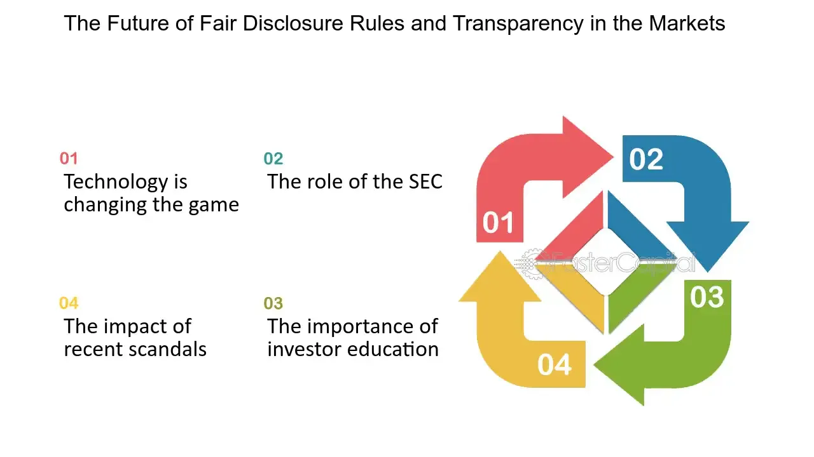

## Table of Contents

## What is Regulation Fair Disclosure (Reg FD)?

Regulation Fair Disclosure, or Reg FD, is a rule set by the U.S. Securities and Exchange Commission (SEC). It was made to make sure that all investors get the same important information at the same time. Before Reg FD, companies could share important news with some investors before others. This wasn't fair, so Reg FD was created to stop this from happening.

Reg FD says that if a company shares important information with anyone, like investors or analysts, they have to share it with everyone at the same time. This can be done by putting the information on the company's website or sending it out in a press release. This way, no one gets an unfair advantage, and all investors can make decisions based on the same information.

## When was Reg FD implemented and why was it necessary?

Reg FD was implemented on October 23, 2000. Before this rule, companies could tell some investors or analysts important news before telling everyone else. This meant that some people could buy or sell stocks based on information that others didn't have yet. This wasn't fair and could lead to people making a lot of money unfairly.

The SEC made Reg FD to stop this from happening. They wanted to make sure that all investors, big or small, had the same chance to know what was going on with a company. By making companies share important news with everyone at the same time, the SEC hoped to make the stock market more fair and honest for everyone.

## Who does Reg FD apply to?

Reg FD applies to all companies that have to report to the SEC, like those listed on stock exchanges. This includes big companies that people can buy and sell shares of. It also applies to the people who work for these companies, like CEOs and other top bosses. They have to make sure they follow the rules when they share important news.

The rule says that if these companies or their bosses share important information with anyone, like investors or people who analyze stocks, they have to share it with everyone at the same time. This means they can't tell some people before others. They can share the news by putting it on their website or sending out a press release. This way, everyone gets the same information at the same time, which makes things fair for all investors.

## What are the main goals of Reg FD?

The main goal of Reg FD is to make sure that all investors get the same important information at the same time. Before Reg FD, companies could tell some investors or analysts important news before telling everyone else. This was not fair because some people could buy or sell stocks based on information that others did not have yet. Reg FD stops this from happening by making sure that when a company shares important news, it has to share it with everyone at the same time.

Another goal of Reg FD is to make the stock market more fair and honest. By making companies share important news with everyone at the same time, the SEC wanted to make sure that all investors, whether they are big or small, have the same chance to know what is going on with a company. This helps to prevent some people from making a lot of money unfairly and makes the stock market a better place for everyone to invest.

## How does Reg FD affect the way companies communicate with investors?

Reg FD changes how companies talk to investors by making sure they share important news with everyone at the same time. Before Reg FD, companies could tell some investors or analysts about big news before telling everyone else. This was not fair because some people could buy or sell stocks based on information that others did not have yet. Now, with Reg FD, if a company wants to share important news, they have to do it in a way that everyone can see it at the same time, like by putting it on their website or sending out a press release.

This rule makes companies think carefully about how they share information. They can't just call up a few favorite investors or analysts to give them a heads-up. Instead, they have to plan how to share news so that it reaches everyone at once. This means companies might use more public ways to communicate, like webcasts or press releases, to make sure they follow the rules and keep things fair for all investors.

## What are the key differences between Reg FD and other securities regulations?

Reg FD is different from other securities regulations because it focuses on making sure all investors get the same important information at the same time. Other regulations might deal with things like how companies report their finances, rules against insider trading, or how companies can sell their stocks. For example, the Sarbanes-Oxley Act focuses on improving the accuracy and reliability of corporate disclosures, while Reg FD is all about fairness in sharing information.

Another key difference is that Reg FD specifically targets the practice of selective disclosure, where companies used to tell some investors or analysts important news before telling everyone else. This was not fair and could lead to some people making money unfairly. Other regulations, like the Securities Act of 1933 and the Securities Exchange Act of 1934, have broader goals, like protecting investors and ensuring the integrity of the markets, but they do not focus as directly on the timing and fairness of information sharing as Reg FD does.

## Can you explain the concept of 'material information' in the context of Reg FD?

Material information is really important news about a company that could change what investors think about it. It's the kind of news that might make people want to buy or sell the company's stock. For example, if a company finds out it's going to make a lot more money than expected, or if it's going to be bought by another company, that's material information. Reg FD says that if a company shares this kind of important news with anyone, like investors or analysts, it has to share it with everyone at the same time.

The reason material information is so important in Reg FD is because it helps make the stock market fair for everyone. If only some people know about big news before others, they could make a lot of money unfairly. Reg FD stops this from happening by making sure that when a company shares material information, it does it in a way that everyone can see it at the same time, like by putting it on their website or sending out a press release. This way, all investors have the same chance to make decisions based on the same information.

## What are the penalties for non-compliance with Reg FD?

If a company does not follow Reg FD, they can get in big trouble. The SEC, which is like the boss of the stock market, can make them pay a lot of money as a fine. They can also stop the company from doing certain things in the stock market for a while. This is to make sure that companies take the rule seriously and don't share important news with just a few people before everyone else.

The people who work at the company, like the CEO or other top bosses, can also get in trouble if they break Reg FD. They might have to pay fines too, and they could even be banned from working in the stock market for a while. This helps make sure that everyone at the company follows the rule and shares important news with everyone at the same time.

## How has Reg FD impacted market transparency and fairness?

Reg FD has made the stock market more open and fair for everyone. Before Reg FD, companies could tell some investors or analysts important news before telling everyone else. This was not fair because some people could buy or sell stocks based on information that others did not have yet. Now, with Reg FD, when a company shares big news, they have to share it with everyone at the same time. This means no one gets a secret heads-up, and all investors can make decisions based on the same information.

This change has helped to make the stock market more honest. When everyone gets the same news at the same time, it's harder for some people to make a lot of money unfairly. This makes the market a better place for everyone to invest, whether they are big investors or small ones. By making companies share important news openly, Reg FD helps to build trust in the stock market and makes sure that everyone has a fair chance.

## What are some common challenges companies face in complying with Reg FD?

One big challenge companies face with Reg FD is figuring out what counts as important news. They have to decide if the information they want to share could change what investors think about the company. This can be hard because what seems small to the company might be a big deal to investors. If they get it wrong, they could accidentally break the rule by telling some people before everyone else.

Another challenge is making sure they share the news with everyone at the same time. Companies have to be careful about how they talk to investors and analysts. They can't just call up a few people to give them a heads-up. Instead, they have to use public ways to share the news, like putting it on their website or sending out a press release. This can be tricky because they need to plan ahead and make sure everyone gets the information at the same time.

## How do companies ensure they are in compliance with Reg FD?

Companies make sure they follow Reg FD by being very careful about how they share important news. They have to think about what counts as important news and make sure it's shared with everyone at the same time. To do this, they often use public ways to share the news, like putting it on their website or sending out a press release. This way, no one gets a secret heads-up, and all investors can see the news at the same time. Companies also set up rules and training for their employees to make sure everyone knows how to share information the right way.

Another way companies stay in line with Reg FD is by keeping good records of who they talk to and what they say. If the SEC ever checks to see if they followed the rules, having these records can help show that the company did everything right. Companies might also have lawyers or compliance officers who watch over how information is shared to make sure they don't break any rules. By being careful and organized, companies can make sure they follow Reg FD and keep the stock market fair for everyone.

## What future developments or amendments might we see to Reg FD to enhance its effectiveness?

In the future, Reg FD might be updated to work better with new technology. Right now, companies share important news through websites and press releases. But as more people use social media and other online tools, Reg FD might change to include these new ways of sharing information. This would help make sure that everyone gets the news at the same time, no matter where they look for it. Also, the rules might become clearer about what counts as important news, so companies know exactly what they need to share with everyone.

Another possible change could be more strict rules about how companies talk to investors and analysts. Right now, companies have to be careful not to give some people a heads-up before others. In the future, the rules might get even stricter to make sure no one gets an unfair advantage. This could mean more training for company employees and better ways to keep track of who they talk to and what they say. By making these changes, Reg FD could keep the stock market fair and honest for everyone.

## References & Further Reading

[1]: Securities and Exchange Commission. (2000). ["Final Rule: Selective Disclosure and Insider Trading."](https://www.sec.gov/rules-regulations/2000/08/selective-disclosure-insider-trading) U.S. Securities and Exchange Commission.

[2]: Christian, B. (2015). ["The Aesthetic of Algorithmic Trading: Business News and The Financial Markets."](https://journals.sagepub.com/doi/10.1177/0263775815600444) SSRN.

[3]: Malkiel, B. G. (2015). ["A Random Walk Down Wall Street: The Time-tested Strategy for Successful Investing."](https://www.amazon.com/Random-Walk-Down-Wall-Street/dp/0393358380) W.W. Norton & Company.

[4]: Treleaven, P., Galas, M., & Lalchand, V. (2013). ["Algorithmic Trading Review."](https://www.researchgate.net/publication/262239006_Algorithmic_Trading_Review) Communications of the ACM, 56(11), 76-85.

[5]: "Markets in Financial Instruments Directive II (MiFID II)." (2014). [European Securities and Markets Authority](https://www.esma.europa.eu/publications-and-data/interactive-single-rulebook/mifid-ii).

[6]: Aldridge, I. (2010). ["High-Frequency Trading: A Practical Guide to Algorithmic Strategies and Trading Systems."](https://onlinelibrary.wiley.com/doi/pdf/10.1002/9781119203803.fmatter) Wiley.

[7]: Gomber, P., Arndt, B., Lutat, M., & Uhle, T. (2011). ["High-Frequency Trading."](https://papers.ssrn.com/sol3/papers.cfm?abstract_id=1858626) Financial Analysts Journal, 68(1), 16-24.