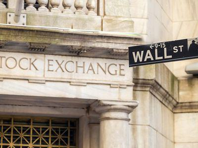

Regulation Fair Disclosure (Reg FD) is a pivotal rule established by the U.S. Securities and Exchange Commission (SEC) aimed at eliminating selective disclosure by publicly traded companies. Implemented in October 2000, this regulation fundamentally altered how companies share information, mandating that any release of material nonpublic information to certain securities market professionals and shareholders must be made available to the public simultaneously or promptly if the disclosure was unintentional. The primary objective of Reg FD is to foster an environment of transparency and equal access to information, thus promoting investor confidence in the fairness of the securities markets.

In the context of algorithmic trading, Reg FD plays a significant role as it impacts how information is accessed and acted upon by automated trading systems. Algorithmic trading, often characterized by high-speed trades and complex strategies developed using computer algorithms, relies heavily on the availability and timeliness of market information. The requirement for simultaneous public dissemination of material information under Reg FD ensures that all market participants, including algorithmic traders, have equal access to crucial information, thereby maintaining a level playing field.

This structure helps mitigate risks associated with insider trading and information asymmetry, where certain traders could have an unfair advantage due to privileged access to nonpublic information. By mandating fair and transparent dissemination practices, Reg FD supports the integrity of financial markets and encourages ethical trading behavior, critical in a technologically advanced trading environment. 

As technology continues to evolve, and algorithmic trading systems become more sophisticated, the balance between regulatory compliance and technological advancement becomes increasingly essential. Algorithmic traders need to align their strategies with these regulatory requirements to operate within legal boundaries while capitalizing on the efficiencies and opportunities provided by advanced trading technologies. This exploration highlights the intersection of fair market practices and continual technological progress in the financial sector.

## Table of Contents

## Understanding Regulation Fair Disclosure

Regulation Fair Disclosure (Reg FD) was introduced by the United States Securities and Exchange Commission (SEC) in October 2000. The primary objective of Reg FD is to ensure that all investors have equal access to material nonpublic information, thereby fostering a level playing field in the financial markets. This regulation seeks to eliminate the advantage that institutional investors and securities analysts might have if they were privy to selective disclosures of significant information by publicly traded companies.

Under Reg FD, companies are prohibited from selectively revealing material nonpublic information to specific individuals, such as analysts or institutional investors, without making the same information available to the general public. The regulation distinguishes between intentional and unintentional disclosures. If a company intentionally discloses material information, it must do so simultaneously to the public. In cases where unintentional disclosure occurs, the company is required to make the information public without delay.

The aim of Reg FD is to maintain investor confidence by promoting transparency and fairness in information dissemination practices. By reducing the occurrence of selective disclosures, the rule helps prevent situations where certain investors have an informational edge over others, which could potentially lead to market manipulation or a skewed perception of a company's value.

Reg FD applies to communications with specific groups, particularly securities market professionals and shareholders. This encompasses investment analysts, institutional investors, and other entities that play a significant role in influencing investor decisions and market dynamics. The regulation encourages publicly traded companies to establish and adhere to consistent policies regarding the public disclosure of information, thereby supporting a transparent and equitable investing environment.

## Algorithmic Trading: A Brief Overview

Algorithmic trading, commonly referred to as algo trading, is a form of trading where computers are programmed to execute trades based on predetermined sets of instructions or algorithms. These algorithms can account for various factors, including timing, price, and [volume](/wiki/volume-trading-strategy), allowing traders to capitalize on market events far quicker than human traders.

One of the primary advantages of [algorithmic trading](/wiki/algorithmic-trading) is its ability to improve market [liquidity](/wiki/liquidity-risk-premium) and reduce trading expenses. Algorithms are designed to react instantly to market conditions and can execute large volumes of trades without the need for manual intervention. This leads to more efficient market processes, reducing bid-ask spreads and transaction costs for all market participants.

Despite these advantages, algorithmic trading is subject to scrutiny due to its potential to cause market disruptions and increase [volatility](/wiki/volatility-trading-strategies). Flash crashes, such as the one that took place on May 6, 2010, underscore the potential risks associated with high-frequency and algorithmic trading. This particular event saw the U.S. stock market briefly lose nearly $1 trillion in market capitalization, only to recover shortly afterward, largely due to the actions of algorithmic trading systems.

Regulatory bodies have implemented several measures to govern the practice of algorithmic trading to mitigate such risks. In the United States, the Securities and Exchange Commission (SEC) enforces regulations aiming to prevent market manipulation and promote fair trading practices. Similarly, the European Markets in Financial Instruments Directive II (MiFID II) establishes a strong regulatory framework within the European Union to oversee algorithmic trading activities, emphasizing transparency and the reduction of systemic risks.

Algo traders are required to comply with various rules, including those related to insider trading, market manipulation, and risk management. For example, traders must ensure that their algorithms do not engage in fraudulent activities, such as spoofing — the act of placing a large order with the intent to cancel it before execution to manipulate prices. Additionally, effective risk management strategies, often involving sophisticated [backtesting](/wiki/backtesting) and real-time monitoring systems, are essential to maintain market integrity and investor confidence.

In summary, algorithmic trading remains a pivotal tool in modern financial markets, offering significant efficiency gains while presenting regulatory challenges that necessitate rigorous oversight to ensure fair and transparent trading practices.

## Reg FD's Impact on Algorithmic Trading

Regulation Fair Disclosure (Reg FD) has a significant impact on algorithmic trading strategies, primarily through its emphasis on transparency in information disclosure. Reg FD mandates that publicly-traded companies must make material nonpublic information available to all investors simultaneously, which affects how algorithmic traders operate. This change compels algorithmic traders to modify their strategies based on public information rather than relying on selective disclosures.

The requirement for simultaneous disclosure means that algorithmic traders must be quick to integrate new information into their trading models. Algorithms must be designed to process publicly disclosed information efficiently and rapidly, as the simultaneous release levels the playing field, ensuring no single investor has an undue advantage based on access to nonpublic information.

This transparency reduces the likelihood of illegal insider trading activities among algorithmic traders. By ensuring that all material information is released to the public at the same time, Reg FD limits opportunities for traders to benefit from asymmetric information. Algorithmic trading strategies are, therefore, designed to operate within the framework of equal access to information.

Reg FD promotes a fair trading environment by providing all investors with equal access to material information. This principle is critical in maintaining market integrity and investor confidence. As a result, algorithmic traders must align their strategies with transparent disclosure practices, ensuring that their algorithms react to the same information accessible to every market participant.

Moreover, algorithmic traders must incorporate robust compliance measures within their strategies to adhere to Reg FD requirements. This includes monitoring public disclosures continuously and updating their algorithms to respond to these disclosures in a timely manner. By embracing these practices, algorithmic traders can contribute to a fair and equitable market where information asymmetry does not unfairly advantage or disadvantage any party.

## Navigating Compliance in Algo Trading

Algorithmic traders operate in a highly regulated environment requiring them to implement comprehensive risk management systems to meet regulatory standards. These systems are critical in ensuring adherence to market regulations, minimizing errors, and maintaining the integrity of trading operations. Key components of robust risk management include pre-trade and post-trade risk controls. Pre-trade controls help in estimating potential risks associated with trades, making sure that traders do not breach any regulatory limits before executing trades. Post-trade controls are equally important as they focus on monitoring executed trades for discrepancies or compliance breaches, offering a mechanism to rectify any issues swiftly.

To ensure transparency and accountability, algorithmic traders are required to routinely submit detailed reports to regulatory bodies. These reports document trading activities, providing a comprehensive view to regulators and ensuring that trades are conducted in compliance with legal norms. The process involves meticulous record-keeping and analysis to highlight trading patterns and exceptions, facilitating a transparent trading environment.

Platforms such as Gridcap support traders by offering tools designed to ensure regulatory compliance. These platforms include Know Your Customer (KYC) procedures and intricate risk management systems tailored to meet the stringent demands of financial regulators. These tools enable traders to authenticate client identities and assess risk exposures proactively, fostering a compliant and secure trading framework.

A deep understanding of compliance practices is indispensable for success in algorithmic trading. This involves not only knowing the regulations but also actively integrating them into trading systems and strategies. Staying abreast of regulatory changes and evolving compliance norms is crucial for traders to maintain their competitive edge while ensuring ethical and legal trading practices. By prioritizing compliance and adopting advanced risk management solutions, algorithmic traders can effectively navigate the complex regulatory landscape, thereby contributing positively to market stability and integrity.

## Future Challenges and Ethical Considerations

Evolving regulations in the financial markets constantly challenge algorithmic traders to stay abreast of new rules and standards. The landscape of algorithmic trading is rapidly changing, with regulatory bodies worldwide frequently updating guidelines and mandates to address emerging market issues and technological advancements. For instance, the European Market Infrastructure Regulation (EMIR) and the Markets in Financial Instruments Directive II (MiFID II) are examples of regulatory frameworks affecting algorithmic trading in Europe, parallel to the SEC's rules in the United States.

Ethical trading practices are fundamental to maintaining market integrity and ensuring investor trust. Algorithmic traders need to develop and deploy algorithms that are not only efficient but also comply with both legal and ethical standards. This implies rigorous testing and validation of trading algorithms to ensure that they do not engage in manipulative or deceptive practices.

Furthermore, algorithmic traders must diligently manage potential conflicts of interest to maintain impartial trading decisions. Conflicts can arise when traders or associated parties have interests that could potentially influence trading strategies for personal gain, rather than for client benefit or market fairness. Avoidance of these conflicts demands clear policies and procedures, coupled with a strong organizational culture that prioritizes ethical behavior and compliance.

A key component of long-term success in algorithmic trading is fostering a culture of transparency and integrity. Algorithmic trading firms should promote open communication and ethical standards, ensuring that their employees and associated parties understand and adhere to the principles of fair trading. A transparent approach not only aids in regulatory compliance but also strengthens trust with clients and market participants, enhancing the firm's reputation and effectiveness in the market.

In summary, as the algorithmic trading environment continues to evolve, traders must remain vigilant and proactive in adapting to new regulations and ethical standards. This requires a commitment to continuous learning, ethical rigor, and strategic foresight, enabling traders to successfully navigate the complex interplay of technology, regulation, and market dynamics.

## Conclusion

Regulation Fair Disclosure (Reg FD) plays an essential role in ensuring transparency within financial markets by mandating that material nonpublic information is disseminated to all investors simultaneously. This regulatory framework poses significant implications for algorithmic traders who must adeptly manage the dual challenge of regulatory compliance and technological advancement. Successful algo traders are those who can deftly balance adherence to these regulations with the innovative potential of algorithmic trading.

Complying with Reg FD emphasizes the necessity for algorithmic traders to cultivate ethical trading practices. By committing to such practices, traders contribute to enhancing market confidence and integrity. Ethical conduct fosters an environment where all participants have equal access to information, thereby ensuring a level playing field crucial for market stability.

The landscape of algorithmic trading is continuously evolving, driven by rapid technological advancements and regulatory changes. This dynamic environment requires continuous vigilance and adaptability from algo traders. They must stay informed about regulatory updates and actively modify their strategies to align with the latest requirements. This proactive approach helps in mitigating risks associated with information asymmetry and insider trading.

In summary, Reg FD's significance in promoting transparency cannot be overstated. For algorithmic traders, marrying the principles of ethical trading with regulatory adherence while embracing technological innovation is pivotal. By doing so, they not only ensure compliance but also strengthen market trust, laying the foundation for a robust and transparent trading ecosystem.

## References & Further Reading

[1]: Securities and Exchange Commission. (2000). ["Final Rule: Selective Disclosure and Insider Trading."](https://www.sec.gov/rules-regulations/2000/08/selective-disclosure-insider-trading) U.S. Securities and Exchange Commission.

[2]: Christian, B. (2015). ["The Aesthetic of Algorithmic Trading: Business News and The Financial Markets."](https://journals.sagepub.com/doi/10.1177/0263775815600444) SSRN.

[3]: Malkiel, B. G. (2015). ["A Random Walk Down Wall Street: The Time-tested Strategy for Successful Investing."](https://www.amazon.com/Random-Walk-Down-Wall-Street/dp/0393358380) W.W. Norton & Company.

[4]: Treleaven, P., Galas, M., & Lalchand, V. (2013). ["Algorithmic Trading Review."](https://www.researchgate.net/publication/262239006_Algorithmic_Trading_Review) Communications of the ACM, 56(11), 76-85.

[5]: "Markets in Financial Instruments Directive II (MiFID II)." (2014). [European Securities and Markets Authority](https://www.esma.europa.eu/publications-and-data/interactive-single-rulebook/mifid-ii).

[6]: Aldridge, I. (2010). ["High-Frequency Trading: A Practical Guide to Algorithmic Strategies and Trading Systems."](https://onlinelibrary.wiley.com/doi/pdf/10.1002/9781119203803.fmatter) Wiley.

[7]: Gomber, P., Arndt, B., Lutat, M., & Uhle, T. (2011). ["High-Frequency Trading."](https://papers.ssrn.com/sol3/papers.cfm?abstract_id=1858626) Financial Analysts Journal, 68(1), 16-24.