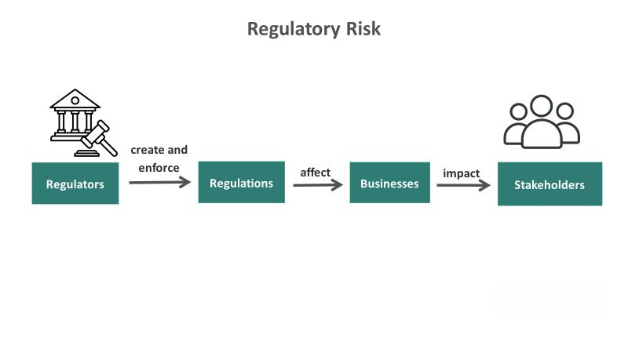

In the contemporary financial landscape, regulation plays a crucial role in maintaining market stability and integrity. This article explores financial regulation with a specific focus on Regulation I and the rules governing algorithmic trading in the banking sector.

Regulation I is integral to the Federal Reserve system, ensuring that member banks maintain a stake in their respective Federal Reserve Banks. By mandating that member banks hold 6% of their capital and surplus as stock in their Federal Reserve Bank, Regulation I fosters a commitment to the central banking system and reinforces the stability of the financial infrastructure. This requirement not only binds banks to the Federal Reserve's framework but also mitigates potential conflicts of interest by aligning the interests of individual banks with those of the central banking entity.



On the other hand, algorithmic trading offers both challenges and opportunities that necessitate specific regulatory oversight. The rapid execution and high volume of trades facilitated by sophisticated algorithms have revolutionized financial markets by enhancing efficiency and reducing transaction costs. However, these advancements also introduce risks such as market manipulation and systemic failures, underscoring the need for robust regulatory frameworks to ensure these technologies enhance market integrity rather than compromise it.

This article aims to provide a comprehensive overview of how these regulatory frameworks operate, their implications for banks engaging in algorithmic trading, and the broader impact on the financial industry. By examining Regulation I and algorithmic trading regulations, we can better understand the complex but necessary nature of financial oversight in fostering a robust and resilient financial ecosystem.

## Table of Contents

## Understanding Regulation I

Regulation I is a fundamental component of the Federal Reserve system, mandating that member banks acquire a specified amount of stock in their respective Federal Reserve Banks. This requirement is designed to ensure that banks maintain a vested interest in the overall functionality and stability of the Federal Reserve system. 

According to Regulation I, each member bank is required to purchase stock equating to 6% of its capital and surplus. This mandate underscores the commitment of each bank to actively participate in the Federal Reserve system. The stock purchased by banks is non-transferable and cannot be utilized as collateral, which ensures the independence and integrity of the Federal Reserve's operations.

The regulation also establishes guidelines on how banks can acquire and redeem this stock. Specifically, when a bank joins the Federal Reserve system or increases its capital and surplus, it must adjust its stock holdings to reflect the 6% threshold. Conversely, if a bank reduces its capital, surplus, or exits the Federal Reserve system, it is obliged to redeem the corresponding amount of stock. These provisions facilitate a dynamic relationship between member banks and the Federal Reserve Banks, reflecting changes in the financial position of the banks.

By enforcing these stipulations, Regulation I ensures that member banks are financially integrated and aligned with the Federal Reserve system's objectives, thereby enhancing overall systemic stability.

## Compliance with Regulation I

Compliance with Regulation I requires banks to meticulously manage their financial activities related to the procurement and holding of Federal Reserve stock. This compliance begins with an understanding of the fundamental requirement: member banks must purchase an amount of stock in their Federal Reserve Bank that is equivalent to 6% of their paid-in capital and surplus. This requirement ensures that these institutions have a vested interest in the Federal Reserve System.

For banks, the essential task is to adhere to procedures that align stock purchases with changes in capital and surplus to consistently maintain the mandated 6% threshold. This involves a dynamic process, considering that changes in a bank's capital structure can necessitate adjustments in stock holdings. The core formula used to determine stock purchase requirements can be described as:

$$
\text{Stock Holdings} = 0.06 \times (\text{Capital} + \text{Surplus})
$$

As capital and surplus fluctuate due to various financial activities, banks must recalibrate their stockholdings accordingly. This process is crucial for sustaining compliance and ensuring that the investment in Federal Reserve Bank stock accurately reflects current financial conditions.

Moreover, compliance also includes provisions for managing structural changes within a bank. Banks are required to follow specific procedures for redeeming or canceling Federal Reserve Bank stock if there is a change in membership status or if structural changes occur. This could involve mergers, acquisitions, or other transformations in the bank's organizational setup. During such transitions, banks must ensure that they remain within regulatory requirements, adjusting their stockholdings as needed to reflect new capital and surplus levels.

Banks can benefit from automation and real-time monitoring to ensure continuous compliance with Regulation I. This could involve developing Python-based tools to automate stock calculations and adjustments. A simple Python example might look like this:

```python
def calculate_stock_holdings(capital, surplus):
    return 0.06 * (capital + surplus)

# Example usage
capital = 1000000  # Example capital in dollars
surplus = 200000   # Example surplus in dollars
stock_holdings = calculate_stock_holdings(capital, surplus)
print(f"Required stock holdings: ${stock_holdings}")
```

Such a tool can help financial institutions quickly compute their stockholding requirements based on current financial data, facilitating ongoing compliance and proactive management of their obligations under Regulation I. By diligently applying these processes, banks not only comply with regulatory demands but also reinforce their commitment to the structural integrity of the Federal Reserve System.

## Algorithmic Trading in the Banking Sector

Algorithmic trading is a transformative force within the banking sector, employing complex algorithms to execute trades rapidly and at high volumes. This process has redefined financial markets, primarily through enhanced efficiency and reduced transaction costs. Algorithms can analyze vast datasets to identify trading opportunities, optimize execution strategies, and perform trades faster than traditional human methods.

However, the rise of [algorithmic trading](/wiki/algorithmic-trading) presents significant risks. Market manipulation, such as spoofing and layering, occurs when algorithms create false market demand to influence asset prices. Additionally, systemic failures can arise from programming errors and unforeseen market conditions, potentially leading to significant financial losses or market disruptions.

To mitigate these risks, a comprehensive regulatory framework is essential. Regulators worldwide have established rules to oversee and control algorithmic trading activities, ensuring these mechanisms operate within safeguards that protect market integrity. Paramount to these regulations is the requirement for trading firms to implement robust pre-trade risk controls. These ensure that trades do not exceed predetermined limits and that any algorithmic strategy remains within safe operational guidelines.

Moreover, the regulatory landscape mandates post-trade surveillance to monitor trading activities for anomalies and suspicious patterns indicative of market abuse. Financial institutions and traders must adhere strictly to compliance measures, including registration and reporting obligations enforced by bodies such as the Commodity Futures Trading Commission (CFTC) and the Securities and Exchange Commission (SEC) in the United States. The CFTC's Regulation Automated Trading (Reg AT), although not yet fully implemented, and the SEC's Market Access Rule are examples of regulations designed to govern algorithmic trading activities.

In summary, while algorithmic trading offers numerous advantages, it requires meticulous regulatory oversight to manage inherent risks. This regulatory environment ensures that algorithmic trading contributes positively to the financial system's overall stability and integrity.

## Regulatory Framework for Algorithmic Trading

Algorithmic trading, a technological advancement in modern financial markets, executes trades using algorithms at unparalleled speed and volumes. To address the unique risks it poses, the Commodity Futures Trading Commission (CFTC) and the Securities and Exchange Commission (SEC) have established regulatory frameworks that safeguard market integrity and investor trust.

The CFTC, a key regulatory body, introduced Regulation Automated Trading (Reg AT) to address algorithmic trading risks. One of its primary objectives is to mitigate market disruptions caused by rapid and high-[volume](/wiki/volume-trading-strategy) trading. Reg AT mandates stringent pre-trade and other risk controls, including the implementation of automated systems for managing trade velocity and preventing erroneous orders. For instance, algorithms must be subjected to rigorous testing before deployment to ensure they adhere to risk management standards. The CFTC's framework also necessitates detailed record-keeping, enabling effective audits and oversight.

Simultaneously, the SEC enforces the Market Access Rule (Rule 15c3-5), which focuses on broker-dealers, central to trading operations. This rule obliges these entities to enforce robust risk management protocols that govern algorithmic access to trading platforms. Key components include risk checks to monitor order flows, credit risks, and adherence to capital requirements. Moreover, the rule mandates that broker-dealers maintain effective controls to avert unauthorized or erroneous trades that could destabilize the markets.

Both the CFTC and SEC frameworks underscore transparency and compliance. They require regular reporting of algorithmic trading activities and stress the importance of maintaining comprehensive audit trails. These regulations are instrumental in preserving trust within trading environments by ensuring transparency and preventing activities that could potentially manipulate the market or hinder fair trading practices.

Through these measures, the regulatory landscape for algorithmic trading is designed to protect market stability, reduce systemic risks, and enhance the overall integrity of financial markets. As algorithmic trading continues to evolve, ongoing regulatory adaptations remain crucial to address emerging challenges and protect investor interests.

## Risk Management and Compliance for Algo Trading

Effective risk management in algorithmic trading is crucial for maintaining market stability and ensuring the integrity of trading operations. Key components of risk management involve both pre-trade risk controls and post-trade surveillance mechanisms. Pre-trade risk controls are designed to prevent erroneous or disruptive trading activity. This includes implementing systems that enforce trading limits, monitor order sizes, and evaluate market conditions in real time. For example, automated systems can be programmed to halt trading activity if certain thresholds are breached, thereby mitigating potential risks before they impact the broader market.

Post-trade surveillance mechanisms play an equally vital role by analyzing executed trades to detect signs of market abuse, such as spoofing or layering. These mechanisms rely on sophisticated algorithms that identify irregular trading patterns and generate alerts for further investigation. The effectiveness of post-trade systems often hinges on their ability to process large volumes of data with speed and accuracy, thereby allowing for timely detection and response to suspicious activities.

Traders and financial institutions also face stringent compliance obligations under regulatory frameworks established by the Commodity Futures Trading Commission (CFTC) and the Securities and Exchange Commission (SEC). The CFTC and SEC require entities engaged in algorithmic trading to register and regularly report their trading activities, ensuring transparency and accountability. These regulatory obligations are designed to prevent systemic risks and to promote fair trading practices.

Risk management frameworks in algorithmic trading also encompass a range of strategic and procedural controls. Essential among these are stress testing and scenario analysis, which help firms assess the robustness of their trading strategies under varying market conditions. By simulating adverse market events, firms can evaluate potential vulnerabilities and develop contingency plans to mitigate identified risks.

In addition to stress testing, disaster recovery plans are critical for ensuring operational continuity in the event of technical failures. Such plans outline specific measures for data backup, system restoration, and communication protocols in crisis situations. Implementing robust disaster recovery frameworks helps firms minimize downtime and maintain trading operations despite unforeseen disruptions.

Governance frameworks further reinforce risk management protocols by establishing a clear chain of accountability and oversight over algorithmic trading activities. Effective governance involves setting precise roles and responsibilities, conducting regular audits, and maintaining detailed records of trading operations and decision-making processes. By fostering a culture of accountability and compliance, governance frameworks help financial institutions build resilient and dependable trading systems.

Collectively, these risk management and compliance measures underscore the necessity for robust regulatory adherence in algorithmic trading. They are integral to safeguarding financial market integrity and ensuring that trading activities are conducted in a secure and efficient manner.

## Conclusion

In the contemporary financial landscape, regulations such as Regulation I and those governing algorithmic trading are indispensable for maintaining the stability and integrity of markets. Regulation I ensures that member banks have a financial stake in their Federal Reserve Banks by mandating stock purchases equivalent to a percentage of their capital and surplus. This requirement anchors banks' commitment to the Federal Reserve system, contributing to its stability.

Algorithmic trading, with its rapid execution and substantial volume, presents both opportunities and challenges. Its benefits in terms of efficiency and reduced costs are significant. However, the potential risks, including market manipulation and system disruptions, require comprehensive regulation. Regulatory frameworks, such as those established by the CFTC and SEC, are crucial in managing these risks and ensuring that trading activities remain transparent and equitable.

Compliance and risk management in algo trading involve rigorous adherence to pre-trade controls, continuous surveillance, and comprehensive reporting obligations. These aspects collectively prevent market disruptions and guarantee trading integrity, which are vital for maintaining investor trust and confidence.

In conclusion, compliance with Regulation I and algorithmic trading regulations is vital for banks and financial institutions. These regulations form a foundation for a resilient financial system by ensuring that key stakeholders maintain the appropriate regulatory stakes and adhere to essential risk management practices. The ongoing commitment to these regulatory standards encourages a robust financial ecosystem capable of weathering economic fluctuations while fostering sustainable growth.

## References & Further Reading

[1]: Acharya, V. V., Cooley, T., Richardson, M., & Walter, I. (2010). ["Regulating Wall Street: The Dodd-Frank Act and the New Architecture of Global Finance"](https://www.semanticscholar.org/paper/Regulating-Wall-Street%3A-The-Dodd-Frank-Act-and-the-Acharya-Cooley/7612070173671c54906cca898a62f6c63cd38ded). Wiley Finance.

[2]: Securities and Exchange Commission. ["Market Access Rule 15c3-5."](https://www.law.cornell.edu/cfr/text/17/240.15c3-5)

[3]: CFTC. ["Regulation Automated Trading (Reg AT)."](https://www.cftc.gov/sites/default/files/idc/groups/public/@newsroom/documents/file/federalregister112415.pdf)

[4]: Cartea, Á., Jaimungal, S., & Penalva, J. (2015). ["Algorithmic and High-Frequency Trading."](https://assets.cambridge.org/97811070/91146/frontmatter/9781107091146_frontmatter.pdf) Cambridge University Press.

[5]: Murphy, R. P. (2008). ["The Basics of Banking: The Federal Reserve and Lending Process."](https://quizlet.com/253358775/quiz-3-chapters-1415-16-18-flash-cards/) Mises Institute.