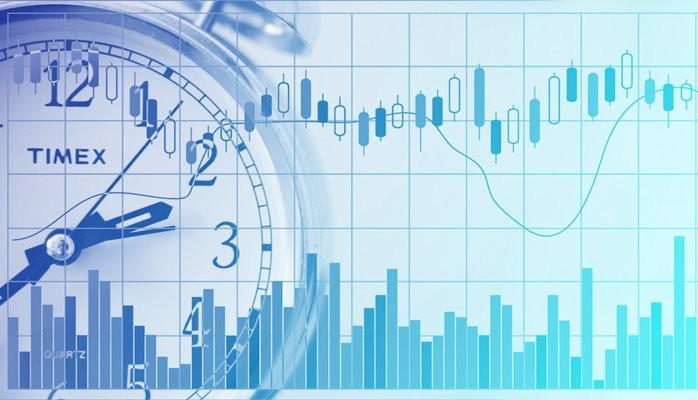

Algorithmic trading, commonly referred to as Algo Trading, has become a significant component of modern financial markets. This form of trading involves the use of pre-programmed trading strategies executed at high speeds through algorithms to transact in financial markets. The rise of technology has enabled this rapid transformation, allowing both institutional and retail traders to implement complex strategies that were once reserved for high-frequency trading firms. Consequently, regulators worldwide have recognized the pressing need to ensure the transparency, fairness, and responsibility of automated trading practices to safeguard market integrity.

Recent developments have intensified the focus on regulatory measures, particularly as retail traders increasingly leverage automated strategies through accessible platforms and Application Programming Interfaces (APIs). In India, the regulatory body responsible for overseeing securities markets, the Securities and Exchange Board of India (SEBI), has recently updated its framework to address the challenges presented by algorithmic trading. The goal is to better manage the risks associated with it, including potential market volatility and systemic disruptions.

This article examines the current state of algorithmic trading regulations with an emphasis on SEBI's recent updates. By exploring these changes, it aims to highlight the implications for different stakeholders, such as retail traders, stock brokers, and algo providers, while assessing the broader impact on the trading ecosystem. Through a detailed examination of these regulatory revisions, we aim to provide a comprehensive understanding of how these measures are designed to promote a safer and more structured trading environment.

## Table of Contents

## The Need for Regulation

Algorithmic trading, while offering the potential for maximized efficiency and speed in executing trades, poses significant risks to financial markets. The ability of algorithms to execute numerous trades in fractions of a second can exacerbate market volatility, leading to unpredictable price movements. This risk of market instability is compounded when there is a lack of regulatory oversight, as unsupervised and untested trading algorithms can act unpredictably, creating systemic disruptions.

Retail traders have increasingly begun to utilize application programming interfaces (APIs) to engage in algorithmic trading. This rising participation among retail investors, who may not have the resources or expertise to rigorously test and validate their algorithms, necessitates a structured regulatory oversight. Without such regulation, the proliferation of poorly designed algorithms could lead to significant market misalignments or even lead to large-scale financial crashes.

Regulation is critical to ensure that automated trading systems do not result in unchecked market movements. An unregulated algorithmic trading environment can cause abrupt price crashes or spikes by overwhelming the market with buy or sell orders. These rapid market movements can erode investor trust and lead to a breakdown in orderly trading practices.

A standardized regulatory framework ensures that all market participants adhere to a common set of rules, preserving market integrity and fairness. Such regulations require [algorithmic trading](/wiki/algorithmic-trading) strategies to undergo rigorous testing and validation, minimizing the likelihood of malfunctioning or rogue algorithms disrupting market operations. By enforcing standardized compliance measures, regulators seek to maintain a fair and transparent trading environment that benefits both institutional and retail investors.

In summary, effective regulation of algorithmic trading is essential to mitigate the inherent risks of market [volatility](/wiki/volatility-trading-strategies) and systemic disruptions. As participation in algorithmic trading grows among retail investors, structured oversight is crucial to safeguarding market stability and ensuring equity in the financial markets.

## SEBI’s Updated Framework for Algo Trading

The Securities and Exchange Board of India (SEBI) has instituted critical changes to regulate algorithmic trading, particularly to address the burgeoning involvement of retail traders. One of the primary modifications requires retail traders who develop their own algorithms to register these strategies when their trading activity surpasses a specified threshold. This initiative aims at ensuring that all trading activities are monitored and transparently recorded, enabling a level playing field across the financial markets.

Additionally, stock brokers now face heightened responsibilities and have been accorded expanded oversight concerning the algorithms operational on their platforms. SEBI mandates that brokers not only ensure adherence to compliance standards but also actively monitor algorithmic trading activities to preclude any potential misuse or market manipulation.

In an effort to amplify transparency, SEBI has outlined distinct prerequisites for algorithmic trading service providers—known as algo providers—seeking empanelment with stock exchanges. These requirements are intended to assure the integrity and reliability of the algorithms used, fostering an environment in which the precision and efficiency of algorithmic transactions can be optimized without compromising market stability. Through these regulatory enhancements, SEBI aims to sustain a balanced and secure ecosystem conducive to both innovation and safety in algorithmic trading.

## Impact on Stakeholders

Algorithmic trading, with its reliance on quantitative strategies and automated decision-making, has a profound impact on various stakeholders within the financial markets. The recent updates to the regulatory framework by the Securities and Exchange Board of India (SEBI) specifically address the needs and responsibilities of these stakeholders, leading to significant shifts in their roles and practices.

**Retail Traders**

Retail traders are set to benefit substantially from the updated regulations. The emphasis on a safer trading environment ensures that systems are more robust against potential market anomalies and manipulations. With enhanced security protocols for API access, individual traders can confidently engage in algorithmic trading, knowing that their trading systems and personal information are better protected from cyber threats and unauthorized access. The requirement for algorithm registration also means that traders can have better assurance regarding the reliability and compliance of the algorithms they choose to deploy.

**Stock Brokers**

The updated framework places greater accountability on stock brokers. Brokers are now required to ensure that all algorithms used on their platforms are registered with the appropriate authorities and comply with SEBI's stringent standards. This shift emphasizes the broker’s role as a gatekeeper, ensuring that only vetted and compliant algorithms are available for use. Stock brokers must therefore enhance their due diligence processes and possibly invest in additional compliance and monitoring technologies, which may involve incorporating automated checks or alerts to detect non-compliant algorithmic behavior.

**Algo Providers**

Algo providers, both individual developers and firms, face new empanelment criteria that are designed to heighten transparency and reliability. Providers must ensure that their algorithms meet SEBI's requirements and are registered with stock exchanges. This modification compels providers to maintain rigorous standards in algorithm development and operation. Additionally, the need for compliance could spur innovation, encouraging algo providers to adopt best practices in coding and testing to uphold their market presence and reputation.

**Stock Exchanges**

Stock exchanges hold a pivotal role in this regulatory environment as they are charged with monitoring and approving algorithmic trading activities. They must develop robust frameworks for scrutinizing algorithms to preempt market disruptions. This may involve deploying advanced surveillance systems leveraging [machine learning](/wiki/machine-learning) and [artificial intelligence](/wiki/ai-artificial-intelligence) to analyze trading patterns and detect anomalies in real-time. Exchanges are instrumental in ensuring market stability and integrity, thereby providing a conducive environment for all market participants to engage in trading activities safely and equitably.

In summary, SEBI's updated regulations delineate clear responsibilities and introduce measures aimed at safeguarding the interests of all stakeholders, thereby promoting a more secure and transparent trading ecosystem.

## Timeline for Implementation

SEBI has established August 1, 2025, as the effective date for the implementation of the new algorithmic trading regulations. Prior to this, by April 1, 2025, industry standards specific to brokers will be finalized in collaboration with SEBI. This staggered timeline is designed to provide all stakeholders ample opportunity to adapt to the new requirements and ensure complete compliance by the designated implementation date. The phased approach is intended to ease the transition process, allowing each entity involved in the algorithmic trading framework—retail traders, stock brokers, and algo providers—to modify their practices and systems in alignment with the updated regulations. By adopting this method, SEBI aims to promote a smoother integration of new regulatory measures into existing trading environments, thereby enhancing overall market stability and integrity.

## Conclusion

The updated regulations set by the Securities and Exchange Board of India (SEBI) represent a significant step forward in ensuring safer and more transparent practices within algorithmic trading. These regulations are meticulously crafted to enhance market stability by clearly defining the roles and responsibilities of each stakeholder involved in this trading segment. By delineating these roles, SEBI seeks to minimize the inherent risks associated with automated trading, thereby protecting market integrity.

A crucial aspect of these regulations is the emphasis on compliance and oversight, which collectively aim to foster a more secure and structured trading environment. This structured framework benefits all market participants by ensuring fair play and reducing the likelihood of market manipulations that could arise from unregulated algorithmic activities. The guidelines necessitate that all stakeholders, including retail traders, stock brokers, and algo providers, operate within a defined legal and ethical perimeter.

Looking ahead, it will be imperative for all involved parties to closely adhere to these guidelines. Consistent compliance with the regulations will be key to ensuring the continued growth and integrity of algorithmic trading within India's financial markets. Adhering to these standards not only mitigates potential systemic risks but also strengthens market confidence, ultimately contributing to a robust trading ecosystem poised for sustainable advancement.

## References & Further Reading

[1]: ["Algorithmic Trading and DMA: An introduction to direct access trading strategies"](https://archive.org/details/algorithmictradi0000john) by Barry Johnson

[2]: Aldridge, I. (2013). ["High-Frequency Trading: A Practical Guide to Algorithmic Strategies and Trading Systems."](https://www.ahmetbeyefendi.com/wp-content/uploads/2020/07/High-Frequency-Trading-Irene-Aldridge.pdf) Wiley.

[3]: Securities and Exchange Board of India (SEBI) Resources: [SEBI Official Website](https://sebi.gov.in/index.html)

[4]: Jovanovic, F., & Le Gall, P. (2001). ["Does God practice a random walk? The 'financial physics' of a nineteenth-century forerunner, Jules Regnault."](https://www.tandfonline.com/doi/abs/10.1080/09672560110062960) The European Journal of the History of Economic Thought.

[5]: Narang, R. (2013). ["Inside the Black Box: The Simple Truth About Quantitative Trading."](https://onlinelibrary.wiley.com/doi/book/10.1002/9781118267738) Wiley. 

[6]: ["The Handbook of High-Frequency Trading and Modeling in Finance"](https://onlinelibrary.wiley.com/doi/book/10.1002/9781118593486) by Greg N. Gregoriou 

[7]: Agapova, T., & Madura, J. (2011). ["An analysis of the impact of high-frequency trading on volatility, liquidity, and market efficiency."](https://pmc.ncbi.nlm.nih.gov/articles/PMC8803494/) Review of Quantitative Finance and Accounting.