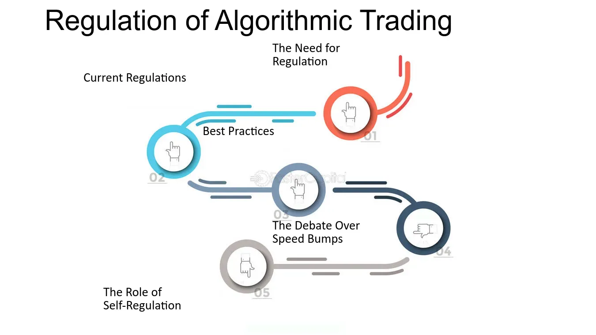

## Table of Contents

## What is algorithmic trading?

Algorithmic trading is when computers use math formulas to buy and sell things like stocks automatically. Instead of people making the decisions, a computer program does it much faster. The program follows rules that people set up, looking at things like price changes and news to decide when to trade.

People use algorithmic trading because it can be quicker and might make more money than trading by hand. It can also trade a lot at once, which is hard for a person to do. But, it can be risky because the market can change in ways the program doesn't expect, and sometimes it can cause big problems if lots of programs start trading at the same time.

## Why is regulation important in algorithmic trading?

Regulation is important in algorithmic trading to keep things fair and safe. Without rules, some people might use their computer programs to trick the market or make it unfair for others. Regulators make sure that everyone follows the same rules, so no one can cheat. This helps to keep trust in the market, which is important for everyone who buys and sells.

Also, regulation helps to stop big problems from happening. Sometimes, if lots of trading programs start buying and selling at the same time, it can cause the market to go crazy. This is called a "flash crash." Regulators can set up rules to slow things down or stop trading if it gets too wild. This protects people's money and keeps the market stable.

## What are the main regulatory bodies overseeing algorithmic trading?

In the United States, the main regulatory body for algorithmic trading is the Securities and Exchange Commission (SEC). The SEC makes rules to make sure that trading is fair and that no one is cheating. They watch over the stock market to stop bad things from happening, like people using their computer programs to trick others. The SEC also works to keep the market stable and protect people's investments.

Another important group is the Commodity Futures Trading Commission (CFTC). The CFTC looks after trading in things like oil, gold, and other commodities. They make sure that the rules are followed in these markets too. Just like the SEC, the CFTC wants to stop fraud and make sure that trading is done in a way that is fair for everyone.

In Europe, the main regulator is the European Securities and Markets Authority (ESMA). ESMA works to keep the financial markets safe and fair across different countries in Europe. They set rules for algorithmic trading to prevent problems and make sure that the markets work well for everyone involved.

## How do regulations aim to prevent market manipulation in algorithmic trading?

Regulations aim to prevent market manipulation in algorithmic trading by setting strict rules that everyone must follow. These rules make sure that no one can use their computer programs to trick the market or do things that are not fair. For example, regulators might say that you can't use your program to make the price of something go up or down on purpose, just to make money. They also watch the market closely to catch anyone who tries to cheat.

Another way regulations help is by making sure that all trades are done openly. This means that everyone can see what is being bought and sold, and at what price. If someone tries to do something sneaky, it's easier to spot because everything is out in the open. Regulators also have the power to punish people who break the rules, which makes it less likely that someone will try to manipulate the market.

## What are the key compliance requirements for firms engaging in algorithmic trading?

Firms that engage in algorithmic trading have to follow certain rules to make sure they are doing things the right way. They need to have strong systems to watch their trading programs and make sure they are working correctly. This means having good checks in place to stop their programs from causing big problems in the market. They also need to keep good records of all their trades, so regulators can check them if needed. This helps to make sure that everything is done fairly and openly.

Another important rule is that firms need to test their trading programs before they use them in the real market. This testing, called "backtesting," helps them see how their programs would have worked in the past. It's a way to make sure the programs are safe and won't cause trouble. Firms also have to report any big problems or mistakes to the regulators quickly. This helps to stop small issues from turning into big ones. By following these rules, firms can help keep the market fair and safe for everyone.

## How do regulations differ across major financial markets like the US, EU, and Asia?

In the United States, the main rules for algorithmic trading come from the Securities and Exchange Commission (SEC) and the Commodity Futures Trading Commission (CFTC). The SEC focuses on stocks and makes sure that trading is fair and that no one is cheating. They have rules about how fast trading can happen and how much information needs to be shared. The CFTC looks after trading in things like oil and gold, making sure that the rules are followed in these markets too. Both groups want to stop fraud and keep the market stable.

In the European Union, the European Securities and Markets Authority (ESMA) sets the rules for algorithmic trading. ESMA works to keep the financial markets safe and fair across different countries in Europe. They have strict rules about testing trading programs before they are used and making sure that all trades are done openly. ESMA also has rules to stop big problems from happening, like slowing down trading if things get too wild. This helps to protect people's money and keep the market working well for everyone.

In Asia, the rules can be different from country to country. For example, in Japan, the Financial Services Agency (FSA) oversees algorithmic trading and makes sure that it is done fairly. They have rules about how trading programs should be tested and monitored. In Singapore, the Monetary Authority of Singapore (MAS) sets the rules, focusing on keeping the market stable and stopping fraud. While the main goal of all these regulators is the same—to keep the market fair and safe—the specific rules and how they are enforced can vary a lot from one place to another.

## What are the common challenges faced by traders in adhering to algorithmic trading regulations?

Traders face many challenges when they try to follow the rules for algorithmic trading. One big challenge is keeping up with all the different rules that can change from one country to another. For example, the rules in the United States might be different from those in Europe or Asia. Traders need to make sure their trading programs follow all these rules, which can be hard because the rules can change often. They also need to have strong systems to watch their trading and make sure nothing goes wrong, which takes a lot of time and money.

Another challenge is testing their trading programs. Before using a program in the real market, traders have to test it to see how it would have worked in the past. This testing, called "backtesting," is important to make sure the program is safe and won't cause big problems. But testing can be tricky because it needs a lot of data and the right tools. If the testing is not done well, the program might not work as expected when it is used for real trading. This can lead to big mistakes and even fines from regulators if the rules are broken.

## How have regulations evolved in response to technological advancements in trading?

As trading technology has gotten better, the rules for trading have had to change too. At first, trading was done by people, and the rules were made for that. But when computers started doing the trading, new problems came up. For example, computers can trade much faster than people, which can cause the market to go crazy quickly. So, regulators made new rules to slow things down if needed and to make sure trading programs are tested well before they are used. These new rules help to keep the market fair and safe even as technology changes.

Now, regulators keep a close eye on new tech like artificial intelligence and machine learning. These technologies can make trading even faster and smarter, but they also bring new risks. Regulators are making rules to make sure these new tools are used the right way. They want to stop people from using them to trick the market or do unfair things. By keeping up with tech changes, regulators help to make sure that everyone can trust the market and that it stays stable no matter how fast trading gets.

## What role does the Financial Stability Oversight Council (FSOC) play in regulating algorithmic trading?

The Financial Stability Oversight Council (FSOC) is a group in the United States that watches over the whole financial system to make sure it stays stable. They don't make the rules for algorithmic trading directly, but they look at how these kinds of trading might affect the whole market. If they see that algorithmic trading is causing big problems or making the market too risky, they can tell other regulators, like the SEC or CFTC, to do something about it. This way, the FSOC helps to keep the market safe and stable for everyone.

The FSOC also keeps an eye on new technologies and how they might change the way trading works. They study things like artificial intelligence and machine learning to understand how these could make trading faster and smarter, but also riskier. By looking at these big changes, the FSOC can give advice on how to keep the market fair and safe as technology keeps getting better. This helps other regulators make good rules that work well with new tech.

## How can firms implement robust risk management systems to comply with algorithmic trading regulations?

Firms can implement robust risk management systems to comply with algorithmic trading regulations by setting up strong monitoring tools. These tools watch the trading programs all the time to make sure they are working the right way. If something goes wrong, the tools can stop the program from causing big problems. Firms also need to test their trading programs a lot. This testing, called "backtesting," helps them see how the program would have worked in the past. By doing this, they can find and fix any issues before using the program in the real market. Keeping good records of all trades is also important. This way, if regulators need to check, the firm can show that everything was done fairly and openly.

Another important part of risk management is having clear rules for what to do if something goes wrong. Firms should have a plan ready to stop trading quickly if needed. This can help prevent small problems from turning into big ones. They also need to report any big issues to regulators right away. This keeps everyone informed and helps to fix problems fast. By following these steps, firms can make sure their trading is safe and follows all the rules, which helps keep the market stable and fair for everyone.

## What are the potential impacts of over-regulation on the efficiency of algorithmic trading?

Too many rules can slow down algorithmic trading and make it less efficient. When there are a lot of rules, firms have to spend more time and money making sure they follow them all. This can mean they have to check their trading programs more often and do more testing. All this extra work can make trading slower because firms have to be very careful not to break any rules. It can also mean they might not want to try new ideas or use new technology because they are worried about getting in trouble.

On the other hand, too many rules can also make the market less exciting. If firms are too scared to trade because of all the rules, there might be fewer trades happening. This can make the market less lively and harder for people to buy and sell things quickly. While rules are important to keep things fair and safe, too many of them can make it harder for algorithmic trading to work well and help the market grow.

## How do regulators use technology to monitor and enforce compliance in algorithmic trading?

Regulators use special computer programs to watch over algorithmic trading and make sure everyone follows the rules. These programs can look at lots of trades very quickly and find anything that seems wrong or unfair. For example, if someone is trying to trick the market, the computer program can spot it and tell the regulators. They also use these tools to check if firms are keeping good records of their trades and if they are testing their trading programs the right way. By using technology, regulators can keep an eye on the market all the time and catch any problems fast.

Another way regulators use technology is by setting up systems that can slow down trading if things get too wild. This helps to stop big problems from happening, like a "flash crash," where the market goes crazy because of too much fast trading. They can also use technology to make sure that all trades are done openly, so everyone can see what's happening. This makes it easier to spot if someone is trying to do something sneaky. By using these tech tools, regulators can make sure the market stays fair and safe for everyone.

## References & Further Reading

[1]: ["Algorithmic Trading and DMA: An introduction to direct access trading strategies"](https://archive.org/details/algorithmictradi0000john) by Barry Johnson

[2]: Aldridge, I. (2013). ["High-Frequency Trading: A Practical Guide to Algorithmic Strategies and Trading Systems."](https://www.ahmetbeyefendi.com/wp-content/uploads/2020/07/High-Frequency-Trading-Irene-Aldridge.pdf) Wiley.

[3]: Securities and Exchange Board of India (SEBI) Resources: [SEBI Official Website](https://sebi.gov.in/index.html)

[4]: Jovanovic, F., & Le Gall, P. (2001). ["Does God practice a random walk? The 'financial physics' of a nineteenth-century forerunner, Jules Regnault."](https://www.tandfonline.com/doi/abs/10.1080/09672560110062960) The European Journal of the History of Economic Thought.

[5]: Narang, R. (2013). ["Inside the Black Box: The Simple Truth About Quantitative Trading."](https://onlinelibrary.wiley.com/doi/book/10.1002/9781118267738) Wiley. 

[6]: ["The Handbook of High-Frequency Trading and Modeling in Finance"](https://onlinelibrary.wiley.com/doi/book/10.1002/9781118593486) by Greg N. Gregoriou 

[7]: Agapova, T., & Madura, J. (2011). ["An analysis of the impact of high-frequency trading on volatility, liquidity, and market efficiency."](https://pmc.ncbi.nlm.nih.gov/articles/PMC8803494/) Review of Quantitative Finance and Accounting.