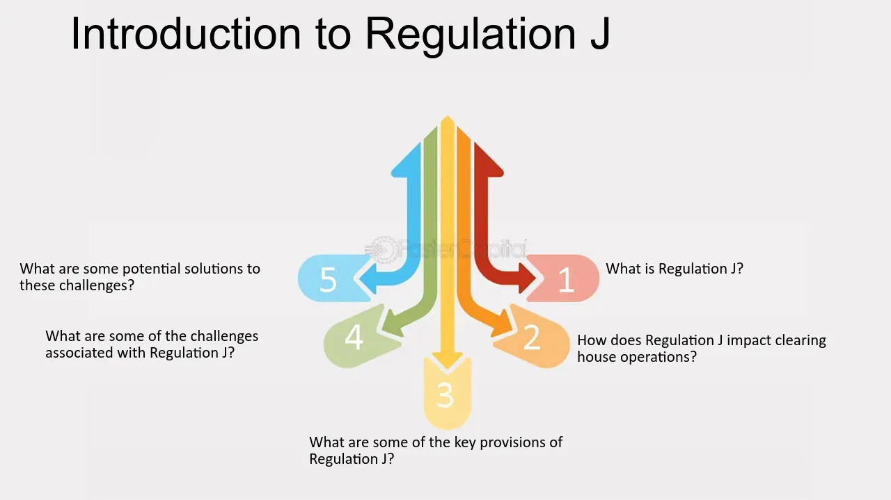

## Table of Contents

## What is Regulation J?

Regulation J is a set of rules made by the Federal Reserve in the United States. It deals with how banks and other financial institutions handle checks and other paper items when they are being moved around the country. This regulation helps make sure that these items are processed quickly and safely.

The main parts of Regulation J are about how banks send and receive checks, and how they should handle any problems that come up. It also covers the rules for sending checks electronically instead of using paper. This helps make the whole process faster and more efficient for everyone involved.

## Who enforces Regulation J?

The Federal Reserve enforces Regulation J. They make sure that banks and other financial institutions follow the rules about handling checks and other paper items. The Federal Reserve watches over the process to make sure it is done quickly and safely.

If there are any problems or if banks do not follow the rules, the Federal Reserve can take action. They can investigate issues and make sure that everything is fixed. This helps keep the whole system running smoothly and fairly for everyone.

## What is the primary purpose of Regulation J?

The main goal of Regulation J is to make sure that checks and other paper items move smoothly and safely between banks and other financial places in the United States. It sets rules for how these items should be handled when they are sent from one place to another. This helps make the process quick and reliable for everyone involved.

The Federal Reserve made Regulation J to keep an eye on how banks deal with checks. It covers things like sending checks electronically instead of using paper, which makes everything faster and easier. By following these rules, banks can avoid problems and make sure that money moves smoothly through the system.

## How does Regulation J affect financial institutions?

Regulation J affects financial institutions by setting rules on how they should handle checks and other paper items. Banks and other financial places have to follow these rules when they send and receive checks. This means they need to make sure the checks move quickly and safely from one place to another. If they don't follow the rules, the Federal Reserve can step in and take action.

The rules also help banks use electronic methods to send checks instead of using paper. This makes the whole process faster and more efficient. By following Regulation J, financial institutions can avoid problems and make sure that money moves smoothly through the system. This helps keep everything running smoothly and fairly for everyone involved.

## Can you explain the key components of Regulation J?

Regulation J has several key parts that help banks and other financial places handle checks and other paper items. One main part is about how banks should send and receive checks. It tells them to make sure the checks move quickly and safely from one bank to another. If there are any problems, like a check getting lost or delayed, banks need to follow the rules to fix these issues. This helps make sure that everyone's money moves smoothly through the system.

Another important part of Regulation J is about sending checks electronically. Instead of using paper, banks can use electronic methods to send checks. This makes everything faster and easier. The rules say how banks should do this and what to do if something goes wrong. By following these rules, banks can avoid problems and make sure the process is efficient. The Federal Reserve watches over all of this to make sure banks are doing things right.

## What are the differences between Regulation J and other related regulations?

Regulation J is different from other related regulations because it focuses on how banks handle checks and other paper items when they move them around the country. It's made by the Federal Reserve and covers things like sending checks electronically and what to do if there are problems. Other regulations might deal with different parts of banking, like how banks handle money transfers or how they should treat their customers. For example, Regulation E deals with electronic fund transfers, which is about moving money between accounts electronically, but it doesn't cover checks like Regulation J does.

Another regulation that's different from Regulation J is Regulation CC, which focuses on how long banks can hold funds from deposited checks before making them available to the account holder. While Regulation J is about the movement and processing of checks, Regulation CC is about the availability of funds. Both are important for how banks handle checks, but they deal with different stages of the process. Regulation J helps make sure checks move quickly and safely, while Regulation CC makes sure people can use the money from those checks soon after they deposit them.

## How has Regulation J evolved over time?

Regulation J has changed over time to keep up with new ways of doing things in banking. When it first started, it was all about how banks should send and receive paper checks. But as technology got better, the rules had to change too. Now, Regulation J also covers sending checks electronically, which makes everything faster and easier. The Federal Reserve keeps updating the rules to make sure they work well with new technology and to help solve any problems that come up.

The main goal of Regulation J has always been to make sure checks move quickly and safely between banks. But the way it does this has changed. For example, the rules now say how banks should handle checks that are sent electronically, and what to do if something goes wrong. These changes help keep the system running smoothly and make sure everyone's money moves through the system without problems. The Federal Reserve watches over all of this to make sure the rules are followed and to keep making improvements.

## What are the compliance requirements for banks under Regulation J?

Under Regulation J, banks need to follow rules about how they send and receive checks. They must make sure checks move quickly and safely from one bank to another. If there are any problems, like a check getting lost or delayed, banks have to fix these issues according to the rules. This helps make sure everyone's money moves smoothly through the system. Banks also need to use electronic methods to send checks instead of just using paper. This makes everything faster and easier, and banks need to follow the rules for doing this right.

The Federal Reserve watches over all of this to make sure banks are doing things correctly. If a bank doesn't follow the rules, the Federal Reserve can take action. They can investigate problems and make sure everything gets fixed. By following Regulation J, banks can avoid issues and make sure the process of handling checks is efficient and reliable. This helps keep the whole system running smoothly and fairly for everyone involved.

## How does Regulation J impact the process of check clearing?

Regulation J helps make the process of check clearing faster and safer. It tells banks how to send and receive checks, making sure they move quickly from one bank to another. If there are any problems, like a check getting lost or delayed, the rules say what banks should do to fix these issues. This helps make sure everyone's money moves smoothly through the system.

The rules also let banks use electronic methods to send checks instead of using paper. This makes everything faster and easier. By following Regulation J, banks can avoid problems and make sure the process of handling checks is efficient and reliable. The Federal Reserve watches over all of this to make sure banks are doing things right, which helps keep the whole system running smoothly and fairly for everyone involved.

## What are the penalties for non-compliance with Regulation J?

If banks do not follow Regulation J, they can face penalties from the Federal Reserve. The Federal Reserve can investigate any problems and take action if they find that a bank is not following the rules. This might mean the bank has to pay a fine or fix the issues they caused. The goal is to make sure banks handle checks correctly and keep the system running smoothly for everyone.

The penalties help make sure banks take the rules seriously. If a bank keeps breaking the rules, the Federal Reserve might take stronger action, like limiting what the bank can do or even stopping them from doing certain things. This is to protect everyone who uses the banking system and to make sure money moves safely and quickly.

## How do technological advancements influence the application of Regulation J?

Technological advancements have changed how Regulation J works. When it first started, it was all about moving paper checks from one bank to another. But now, with new technology, banks can send checks electronically. This makes everything faster and easier. Regulation J has rules about how banks should do this, so they can use the new technology while still following the rules. This helps make sure checks move quickly and safely, even when they're sent electronically.

The Federal Reserve keeps updating Regulation J to work well with new technology. As banks use more electronic methods, the rules need to change to cover these new ways of doing things. This helps solve any problems that come up and makes the whole system run smoothly. By keeping up with technology, Regulation J helps banks handle checks better and makes sure everyone's money moves through the system without issues.

## What future changes might we expect in Regulation J due to evolving financial systems?

As financial systems keep changing, Regulation J might need to change too. One big change could be more rules about using new technology. Banks are using more and more electronic ways to send checks, so Regulation J might need to cover these new methods even more. This would help make sure everything stays quick and safe, even as technology gets better. The Federal Reserve might also add rules about new types of payments, like digital wallets or cryptocurrencies, if they start being used more for sending money.

Another change we might see is more focus on making the system work better for everyone. As more people use electronic banking, Regulation J could have new rules to make sure everyone can use these services easily. This might mean making the rules clearer or adding ways to help people who have problems with the new technology. The Federal Reserve will keep watching how banks handle checks and other payments, and they'll update Regulation J to make sure it works well with all the new ways people are sending money.

## References & Further Reading

[1]: ["Regulation J: Collection of Checks and Other Items by Federal Reserve Banks and Funds Transfers through Fedwire"](https://www.ecfr.gov/current/title-12/chapter-II/subchapter-A/part-210), Board of Governors of the Federal Reserve System.

[2]: Laubach, B. A., & Olszweski, M. E. (2019). ["Understanding the Federal Reserve's Payment Systems: Fedwire and the National Settlement Service."](https://www.federalreserve.gov/2019-payment-systems.htm) Federal Reserve Bank.

[3]: ["Algorithmic Trading: Essential Insights & Tools for Industry Professionals"](https://www.wallstreetzen.com/blog/best-algorithmic-trading-software/), Wiley Financial Series.

[4]: Casey, M. J., & Vigna, P. (2019). ["The Truth Machine: The Blockchain and the Future of Everything."](https://books.google.com/books/about/The_Truth_Machine.html?id=37QoDwAAQBAJ) Harper Business.

[5]: Stigler, M. (2020). ["The Evolution of Payment Systems: A New Regulator's Guide."](https://www.sciencedirect.com/science/article/pii/S0275531922002410) SpringerLink.