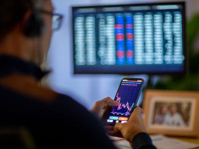

In a constantly globalizing economy, international banking regulations have become increasingly critical for financial institutions around the world. Among these, Regulation K stands out as a significant regulatory framework that governs the international banking operations of U.S. banks, as well as foreign banks operating within the United States. Introduced by the Federal Reserve Board and the Federal Deposit Insurance Corporation (FDIC), Regulation K plays an integral role in both facilitating and controlling the international banking environment, ensuring compliance and fair play in cross-border banking practices.

Regulation K is comprehensive in scope, addressing a myriad of issues related to international banking activities. As banks expand their operations across borders, they must navigate a complex regulatory landscape that includes various national and international requirements. This regulation provides a structured approach to managing international operations, promoting transparency, and safeguarding consumer interests.



Algorithmic trading, often referred to as algo trading, has become a major component of trading activities today. The rise of technology in the financial sector has revolutionized how banks operate, leading to faster and more efficient trading mechanisms. As algo trading becomes more prevalent, understanding its regulatory implications, such as those posed by Regulation K, becomes critical. This regulation intersects with the practices of algorithmic trading by establishing constraints and guidelines that aim to prevent market manipulation and ensure fair trading.

This article will explore Regulation K's impact on international banking and its relevance in the context of algotrading, as well as discuss the future of international banking regulations. By examining the intersection of Regulation K with emerging trading technologies, we aim to highlight the challenges and opportunities faced by financial institutions in a rapidly evolving global market.

## Table of Contents

## Overview of Regulation K

Regulation K is a pivotal framework established to oversee the international operations of U.S. banks and foreign banking entities with a presence in the United States. This regulation, promulgated by the Federal Reserve Board, is instrumental in ensuring that these international banking activities are conducted in a manner that promotes stability and integrity within the financial system.

The structure of Regulation K is organized into discrete sections, each addressing specific facets of international banking operations. Firstly, it delineates the parameters under which U.S. banks may extend their operations overseas. This includes guidelines for establishing branches, acquiring foreign banks, and making permissible investments in foreign enterprises. Such activities are governed with the aim of facilitating international trade and supporting global economic engagement while maintaining sound banking practices.

Secondly, for foreign banks operating within the United States, Regulation K sets forth standards that ensure these institutions adhere to the same rigorous norms as their U.S. counterparts. This harmonization is crucial for maintaining competitive fairness and protecting consumer interests within the U.S. financial landscape. The regulation mandates comprehensive reporting and disclosure obligations, enhancing transparency and enabling better regulatory oversight.

Additionally, Regulation K encompasses rules pertaining to export trading companies. This segment is designed to stimulate global trade by allowing banking institutions to invest in these entities under specific provisions. By doing so, Regulation K supports the expansion of U.S. exports and contributes to economic growth.

The final segment of Regulation K deals with international lending regulations. It outlines the permissible scope of lending activities that U.S. banks can engage in overseas, establishing limits to safeguard against excessive risk-taking that could potentially impact the domestic financial system.

Each component of Regulation K is crafted to address distinct aspects of international banking, collectively ensuring that the entire system remains robust and capable of withstanding cross-border financial challenges. By establishing these guidelines, Regulation K not only promotes prudent international financial practices but also bolsters confidence in the stability of the banking system across global markets.

## International Banking and Regulation K: Key Components

Regulation K provides essential guidelines for U.S. banks that aim to expand their operations internationally by establishing branches overseas. These guidelines are designed to facilitate international trade and financing activities under specific conditions, ensuring that U.S. banks operate within defined legal and regulatory frameworks when engaging in cross-border operations. This regulation allows banks to tap into international markets while complying with U.S. standards, thus aligning their overseas operations with national banking principles.

Moreover, Regulation K extends its regulatory scope to foreign banks operating within the United States, obligating them to adhere to the same standards imposed on domestic banks. This ensures a level playing field where both domestic and foreign banks are subject to equal regulatory requirements, promoting fair competition and stability within the U.S. financial system.

An integral component of Regulation K is its emphasis on rigorous reporting and disclosure practices. These practices are essential for maintaining transparency and protecting consumer interests. By mandating detailed financial reporting, the regulation ensures that banks provide clear and comprehensive information about their international activities, thereby facilitating informed decision-making by regulatory authorities and the public.

Additionally, Regulation K outlines specific guidelines for U.S. banks investing in foreign corporations. These guidelines are designed to align such investments with U.S. banking laws, thereby safeguarding against regulatory breaches and ensuring that international financial engagements do not compromise domestic legal standards. This aspect of the regulation helps maintain the integrity of U.S. financial institutions, allowing them to explore global opportunities without violating regulatory norms.

Through these components, Regulation K plays a critical role in managing the international banking activities of U.S. banks and foreign banks within the United States, contributing to the overall stability and efficiency of the global banking system.

## Regulation K and Algorithmic Trading

Algorithmic trading, or algo trading, employs sophisticated algorithms to automate the trading process, allowing transactions to be executed at high speeds that far exceed human capabilities. As [algorithmic trading](/wiki/algorithmic-trading) becomes an integral part of the global trading environment, it has significant implications for international banking operations. Regulation K impacts how banks use algo trading in several important ways.

Primarily, Regulation K imposes constraints on the types of financial instruments and practices banks can engage in within their international operations. By stipulating specific guidelines on international financial activities, the regulation ensures that banks adhere to consistent standards of conduct regardless of geographical location. This regulatory framework helps mitigate the risks associated with the rapid execution of trades that algorithmic systems provide, reducing the chances of market manipulation. 

Regulation K thus provides a necessary backdrop for algo trading by promoting transparency and stability across diverse international markets. The regulation assists in leveling the playing field for financial institutions by enforcing a uniform code of practice, thereby protecting market participants against unfair advantages that could be gained from algorithmic trading strategies. This ensures that while banks can leverage innovative trading technologies, they remain within the bounds of fair and ethical practices.

Evaluating the intersection between Regulation K and algorithmic trading involves assessing how financial institutions balance two potentially conflicting priorities: adopting cutting-edge technologies to remain competitive and maintaining strict regulatory compliance to avoid potential pitfalls that can impact both reputation and financial standing. Although algo trading enhances efficiency and opens new trading horizons, it also requires meticulous oversight to safeguard markets from systemic risks.

For instance, a Python-based algorithm for high-frequency trading might be optimized under Regulation K guidelines as follows:

```python
import numpy as np

def execute_trade(prices, threshold):
    # Assuming prices is a list of price movements for a particular asset
    signals = np.diff(prices) / prices[:-1]

    for signal in signals:
        if signal > threshold:
            # Execute buy or sell based on specific market conditions
            print("Trade executed")
        else:
            print("Hold position")

# Example usage
market_prices = [100, 101, 102, 101.5, 103]
execute_trade(market_prices, 0.005)
```

In this example, the algorithm makes trade decisions based on price movements and a defined threshold. Such strategies are designed to maximize gains while remaining within the regulatory constraints set forth by Regulation K. Banks, therefore, navigate the challenge of leveraging technology without overstepping regulatory limits, ensuring a harmonious integration of innovation and compliance in their operations.

## Challenges and Opportunities in Regulation K

As financial technology continues to advance at a rapid pace, maintaining regulatory frameworks that effectively address these innovations presents a significant challenge in the sphere of international banking. Regulation K, which governs the international activities of U.S. banking institutions, finds itself at the intersection of this challenge, especially with the rise of algorithmic trading.

Algorithmic trading, using complex mathematical models and high-speed execution algorithms, has transformed the landscape of financial markets. Regulation K poses challenges for financial institutions by imposing constraints that restrict certain high-frequency trading activities and financial instruments. These constraints ensure that such innovations do not compromise market stability or consumer interests. However, these restrictions can sometimes slow down the adoption of innovative trading strategies that could benefit both the institutions and their clients.

Despite these challenges, Regulation K also presents various opportunities for financial organizations. While it imposes certain restrictions, it simultaneously offers a robust framework in which banks can safely conduct international operations. By complying with Regulation K, banks can enhance transparency and build client trust, especially in international engagements where credibility is crucial. The regulation provides a structured environment that supports risk management and helps institutions navigate the complexities of global financial markets.

Moreover, Regulation K underscores the need for ongoing dialogue between regulatory bodies and financial institutions. This dialogue is essential for adapting regulation to keep pace with technological advances without stifling innovation. As part of this continuous engagement, regulatory agencies and financial institutions work together to refine and update guidelines, ensuring they remain relevant in a changing landscape.

With Regulation K compliance, banks can leverage their adherence to promote themselves as trustworthy partners capable of safely managing cross-border transactions. This aspect becomes particularly advantageous as banks operate in increasingly interconnected global markets. By aligning their operations with established regulatory frameworks, financial institutions can gain competitive advantages and strengthen relationships with international clients.

In summary, while Regulation K imposes certain constraints on algorithmic trading and other financial activities, it offers a secure operational framework for banks, facilitating international business in a manner that maintains market integrity and fosters trust. Recognizing and leveraging these opportunities allows banks to navigate the challenges of a dynamically evolving financial environment effectively.

## The Future of International Banking Regulations

The landscape of international banking regulations is poised for significant transformation, driven primarily by technological advancements such as blockchain and [artificial intelligence](/wiki/ai-artificial-intelligence) (AI). These innovations offer new opportunities for enhancing the efficiency and security of financial transactions. However, they also present challenges that existing regulations, such as Regulation K, must adapt to address. Regulation K, which currently governs cross-border banking activities, may serve as an effective template for new regulatory frameworks aimed at harmonizing international banking standards while encouraging technological progress.

Blockchain technology, with its decentralized and transparent nature, has the potential to revolutionize many facets of banking, including international transactions, by reducing fraud and increasing traceability. As blockchain becomes more integrated into banking systems, future adaptations of Regulation K might need to incorporate specific guidelines for its use. This could involve establishing protocols for transaction verification and data privacy, ensuring that blockchain applications comply with existing legal and regulatory standards.

Artificial intelligence is another area ripe for regulatory evolution. AI can significantly enhance risk assessment, fraud detection, and customer service within banks. However, it also raises concerns regarding data privacy, biased decision-making, and accountability. Regulators will need to formulate policies that address these issues, ensuring that AI technologies are deployed responsibly and ethically. Regulation K's future iterations could include AI-specific regulations that set standards for transparency and accountability in automated decision-making processes.

As the global economy becomes increasingly integrated, the necessity for robust international banking regulations that can uphold financial stability cannot be overstated. Cross-border collaboration among regulatory bodies will be essential in crafting guidelines that are not only consistent across different jurisdictions but also adaptable to the fast-paced technological changes. This global cooperation will help mitigate systemic risks and prevent regulatory [arbitrage](/wiki/arbitrage), where institutions might exploit differences in national regulations.

Integrating advanced technological safeguards into traditional banking regulations will likely be a focus of future adaptations of Regulation K. This evolution may include enhanced cybersecurity measures to protect against the growing threat of cyberattacks, ensuring that banks' digital infrastructures are resilient against disruption. Additionally, there will be a need to address the implications of digital currencies, which are becoming a notable component of international finance, by establishing clear rules for their issuance and use.

In summary, the future of international banking regulations, exemplified by possible developments in Regulation K, will be characterized by a balance between encouraging innovation and ensuring the integrity and stability of the global financial system. By proactively updating regulatory frameworks to include technological advancements like blockchain and AI, regulators can better safeguard consumers and financial institutions against the myriad of challenges that accompany rapid technological progress.

## Conclusion

Regulation K plays an integral role in governing international banking by providing a framework that ensures stability and safeguards consumer interests. It establishes rules and guidelines that banks must follow, which helps maintain an orderly and efficient international banking environment. In a landscape increasingly dominated by technological advancements, such as those seen in algorithmic trading, Regulation K serves as a bridge, balancing the need for regulatory oversight with the necessity for innovation.

The complexities of Regulation K are crucial for financial institutions aiming to succeed in global markets. By adhering to the standards set forth by Regulation K, banks can navigate the complexities of international finance while ensuring compliance and protecting stakeholder interests. Understanding this regulatory landscape enables financial institutions to operate effectively across borders, promoting transparency and accountability.

As the dynamics of international banking continuously change, driven by innovations like blockchain and artificial intelligence, the principles embedded within Regulation K will remain significant. However, these principles may require updates to address new challenges posed by technological and market developments. Therefore, Regulation K not only serves as a foundational regulatory standard but also as a flexible framework that must adapt to ensure the resilience and integrity of the global financial system.

## References & Further Reading

[1]: ["International Banking, Financial Crime Risk Management and Compliance: The Guide for Developing Countries"](https://www2.deloitte.com/content/dam/Deloitte/us/Documents/dcrs/Deloitte_IIF_The%20effectiveness%20of%20financial%20crime%20risk%20management.pdf) by Charles S. V. Ukeje

[2]: ["Regulation K: International Banking Operations"](https://www.ecfr.gov/current/title-12/chapter-II/subchapter-A/part-211) - Official Website of the Federal Reserve Board

[3]: Malkiel, B. G. (2019). ["A Random Walk Down Wall Street: The Time-Tested Strategy for Successful Investing."](https://www.amazon.com/Random-Walk-Down-Wall-Street/dp/1324002182) W. W. Norton & Company.

[4]: ["Algorithmic Trading: Winning Strategies and Their Rationale"](https://www.wiley.com/en-us/Algorithmic+Trading%3A+Winning+Strategies+and+Their+Rationale-p-9781118746912) by Ernest P. Chan

[5]: ["The Handbook of International Banking"](https://www.amazon.com/Handbook-International-Banking-Original-Reference/dp/1845422236) edited by A. W. Mullineux and Victor Murinde

[6]: ["Trading and Exchanges: Market Microstructure for Practitioners"](https://www.amazon.com/Trading-Exchanges-Market-Microstructure-Practitioners/dp/0195144708) by Larry Harris