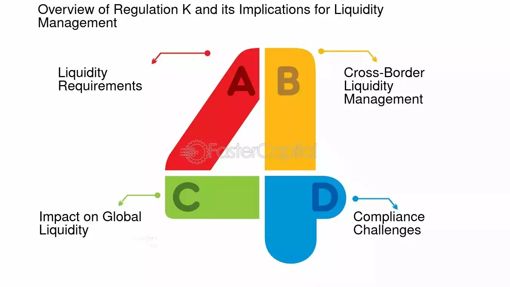

## Table of Contents

## What is Regulation K?

Regulation K is a set of rules created by the Federal Reserve in the United States. It mainly deals with how banks and financial institutions can operate internationally. This means it covers things like how banks can have branches in other countries, how they can invest in foreign companies, and how they can manage risks when dealing with international business.

These rules are important because they help make sure that banks are safe and stable when they do business around the world. By following Regulation K, banks can avoid big problems that might come from international activities. This helps protect the money of people who use these banks and keeps the overall financial system strong.

## Who does Regulation K apply to?

Regulation K applies to banks and financial institutions in the United States that want to do business in other countries. This includes big banks that have branches or offices abroad, as well as smaller banks that might invest in foreign companies or lend money to people in other countries.

The rules are there to make sure these banks follow certain guidelines when they operate internationally. This helps keep the banks safe and stable, which is important for everyone who uses them. By following Regulation K, banks can avoid big risks that come from doing business around the world.

## What is the purpose of Regulation K?

Regulation K is a set of rules made by the Federal Reserve to help banks in the United States do business in other countries safely. It tells banks how they can open branches abroad, invest in foreign companies, and manage risks when dealing with international business. The main goal is to keep banks stable and secure when they work around the world.

These rules are important because they help protect the money of people who use these banks. When banks follow Regulation K, they can avoid big problems that might come from international activities. This helps keep the whole financial system strong and reliable, which is good for everyone.

## How does Regulation K affect international banking operations?

Regulation K affects international banking operations by setting rules that banks must follow when they do business in other countries. These rules tell banks how they can open branches abroad, invest in foreign companies, and manage risks when dealing with international business. This means that banks need to be careful and follow these guidelines to make sure they are doing things the right way.

By following Regulation K, banks can avoid big problems that might come from international activities. This helps keep the banks stable and secure, which is important for everyone who uses them. When banks are safe and stable, it makes the whole financial system stronger and more reliable. This is good for people who have money in these banks and for the economy as a whole.

## What are the key components of Regulation K?

Regulation K has several important parts that help banks do business in other countries safely. One key part is about how banks can open branches or offices abroad. It tells banks what they need to do to set up these branches and how they should run them. Another part deals with investments in foreign companies. It gives rules on how much money banks can put into these companies and how they should handle these investments.

Another important part of Regulation K is about managing risks when banks do business internationally. It tells banks how to keep track of and control the risks that come from working in other countries. This includes things like making sure they have enough money to cover any losses and being careful about the countries they do business in. By following these rules, banks can avoid big problems and keep their operations safe and stable.

Overall, Regulation K helps make sure that banks are careful and responsible when they do business around the world. It protects the money of people who use these banks and keeps the whole financial system strong. By following these rules, banks can work internationally without causing big risks to themselves or the economy.

## How does Regulation K relate to the Federal Reserve?

Regulation K is a set of rules made by the Federal Reserve. The Federal Reserve is like a big boss for banks in the United States. It makes rules to make sure banks are safe and work well. Regulation K is one of these rules, and it is all about how banks can do business in other countries.

The Federal Reserve uses Regulation K to tell banks how they can open branches abroad, invest in foreign companies, and manage risks when working internationally. This helps keep banks stable and secure when they do business around the world. By following Regulation K, banks can avoid big problems and keep the money of people who use them safe. This is important because it helps keep the whole financial system strong and reliable.

## What are the compliance requirements under Regulation K?

Under Regulation K, banks need to follow certain rules when they do business in other countries. This means they have to be careful about how they open branches or offices abroad. They also need to follow guidelines on how much money they can invest in foreign companies. Banks must make sure they have the right paperwork and follow all the steps the Federal Reserve says they need to do.

Another important part of compliance is managing risks when banks work internationally. This means banks need to keep track of the risks that come from doing business in other countries. They have to make sure they have enough money to cover any losses and be careful about the countries they work in. By following these rules, banks can stay safe and stable, which helps protect the money of people who use them and keeps the financial system strong.

## How does Regulation K impact edge and agreement corporations?

Regulation K sets rules for edge and agreement corporations, which are special types of banks that focus on international business. These corporations are allowed to do things like lend money and invest in other countries. Regulation K tells them how they can do these things safely. It makes sure they follow certain steps when opening branches abroad and investing in foreign companies. This helps keep these corporations stable and secure when they work internationally.

By following Regulation K, edge and agreement corporations can avoid big problems that might come from their international activities. The rules help them manage risks and make sure they have enough money to cover any losses. This is important because it protects the money of people who use these corporations and keeps the whole financial system strong. When these corporations follow Regulation K, they can do business around the world without causing big risks to themselves or the economy.

## What are the differences between Regulation K and other banking regulations?

Regulation K is different from other banking regulations because it focuses on how banks in the United States can do business in other countries. While other regulations might deal with things like how banks should handle money at home or how they should treat their customers, Regulation K is all about international activities. It tells banks how they can open branches abroad, invest in foreign companies, and manage risks when they work around the world. This helps make sure banks are safe and stable when they do business internationally.

Other banking regulations might cover a wide range of topics. For example, Regulation D might tell banks how much money they need to keep in reserve, while Regulation E deals with electronic fund transfers. Regulation K is unique because it's specifically about international banking. It helps banks avoid big problems that can come from working in other countries by setting clear rules on how to handle international branches, investments, and risks. This keeps the banks and the people who use them safe and helps keep the whole financial system strong.

## How has Regulation K evolved over time?

Regulation K has changed a lot since it first started. When it began, it was mainly about helping banks open branches in other countries and invest in foreign companies. Over time, as the world got more connected and banks did more business around the world, the rules in Regulation K had to change too. The Federal Reserve added new rules to make sure banks could handle the new kinds of risks that come with international business. This helped keep banks safe and stable as they worked in more and more countries.

One big change happened after the financial crisis in 2008. The Federal Reserve saw that banks needed even stricter rules to avoid big problems. So, they updated Regulation K to include more detailed guidelines on how banks should manage risks when they do business abroad. This included rules on how much money banks should keep to cover losses and how they should watch the countries they work in. These changes made Regulation K even more important for keeping the whole financial system strong and reliable.

## What are some common challenges faced by banks in complying with Regulation K?

One common challenge banks face when trying to follow Regulation K is understanding and keeping up with all the rules. There are a lot of details in Regulation K about how banks can open branches in other countries, invest in foreign companies, and manage risks. It can be hard for banks to make sure they are following all these rules correctly, especially when the rules change or when they start doing business in new countries. Banks need to have good systems in place to keep track of everything and make sure they are doing things the right way.

Another challenge is managing the risks that come with international business. Regulation K tells banks they need to be careful about the countries they work in and make sure they have enough money to cover any losses. This can be tough because different countries have different rules and risks. Banks have to spend a lot of time and effort figuring out how to handle these risks and make sure they are following Regulation K. If they don't, they could face big problems that might hurt their business and the people who use their services.

## How does Regulation K influence global financial stability?

Regulation K helps keep the global financial system stable by making sure banks in the United States are careful and responsible when they do business in other countries. It sets rules on how banks can open branches abroad, invest in foreign companies, and manage risks. When banks follow these rules, they are less likely to have big problems that could hurt their business and the people who use their services. This helps keep banks safe and stable, which is important for everyone who depends on them.

By following Regulation K, banks can avoid risks that come from working internationally. This is good for the whole financial system because it means fewer chances of big financial problems spreading from one country to another. When banks are stable, it helps keep the economy strong and reliable. This is why Regulation K is important for global financial stability—it helps make sure that banks are doing business around the world in a way that keeps everything safe and secure.

## References & Further Reading

[1]: ["International Banking, Financial Crime Risk Management and Compliance: The Guide for Developing Countries"](https://www2.deloitte.com/content/dam/Deloitte/us/Documents/dcrs/Deloitte_IIF_The%20effectiveness%20of%20financial%20crime%20risk%20management.pdf) by Charles S. V. Ukeje

[2]: ["Regulation K: International Banking Operations"](https://www.ecfr.gov/current/title-12/chapter-II/subchapter-A/part-211) - Official Website of the Federal Reserve Board

[3]: Malkiel, B. G. (2019). ["A Random Walk Down Wall Street: The Time-Tested Strategy for Successful Investing."](https://www.amazon.com/Random-Walk-Down-Wall-Street/dp/1324002182) W. W. Norton & Company.

[4]: ["Algorithmic Trading: Winning Strategies and Their Rationale"](https://www.wiley.com/en-us/Algorithmic+Trading%3A+Winning+Strategies+and+Their+Rationale-p-9781118746912) by Ernest P. Chan

[5]: ["The Handbook of International Banking"](https://www.amazon.com/Handbook-International-Banking-Original-Reference/dp/1845422236) edited by A. W. Mullineux and Victor Murinde

[6]: ["Trading and Exchanges: Market Microstructure for Practitioners"](https://www.amazon.com/Trading-Exchanges-Market-Microstructure-Practitioners/dp/0195144708) by Larry Harris