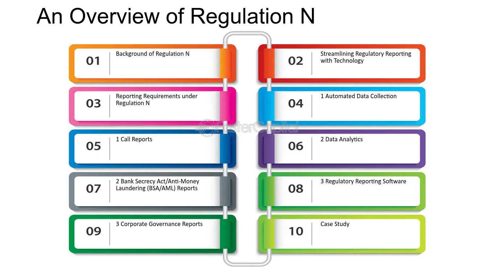

## Table of Contents

## What is Regulation N?

Regulation N is a set of rules created by the Securities and Exchange Commission (SEC) in the United States. It focuses on how foreign private issuers, which are companies from other countries that have securities traded in the U.S., need to follow certain rules. These rules help make sure that the information these companies share with investors is accurate and complete.

The main goal of Regulation N is to protect investors by making sure they have all the important information they need to make good decisions. It requires foreign private issuers to file regular reports and other documents with the SEC. This helps keep the market fair and transparent, so everyone can trust the information they see.

## Who does Regulation N apply to?

Regulation N applies to companies from other countries that have their stocks or bonds traded in the United States. These companies are called foreign private issuers. They need to follow the rules set by the SEC to make sure they give correct and complete information to people who might want to invest in their company.

The main idea is to keep investors safe by making sure they have all the important details they need. Foreign private issuers have to send regular reports and other papers to the SEC. This helps everyone trust the information and keeps the market fair and open.

## What is the purpose of Regulation N?

Regulation N is a rule made by the SEC in the United States. It is meant to help keep investors safe. The rule says that companies from other countries, which are called foreign private issuers, need to share correct and complete information with people who might want to invest in them.

The main goal of Regulation N is to make sure investors have all the important details they need to make good choices. Foreign private issuers have to send regular reports and other papers to the SEC. This helps keep the market fair and open, so everyone can trust the information they see.

## When was Regulation N established?

Regulation N was established by the Securities and Exchange Commission (SEC) in the United States. It was put into place to make sure that companies from other countries, called foreign private issuers, give correct and complete information to people who might want to invest in them.

The main goal of Regulation N is to protect investors by making sure they have all the important details they need to make good choices. Foreign private issuers have to send regular reports and other papers to the SEC. This helps keep the market fair and open, so everyone can trust the information they see.

## How does Regulation N affect financial institutions?

Regulation N affects financial institutions because they often work with foreign private issuers. These are companies from other countries that have their stocks or bonds traded in the U.S. Financial institutions need to make sure that these foreign companies follow the rules set by the SEC. This means they have to check that the information the foreign companies share with investors is correct and complete.

By following Regulation N, financial institutions help keep the market fair and open. They make sure that investors have all the important information they need to make good choices. This helps build trust in the market because everyone can believe the information they see. So, Regulation N helps financial institutions protect investors and keep the market working well.

## What are the key components of Regulation N?

Regulation N is a set of rules from the SEC in the United States that helps make sure companies from other countries, called foreign private issuers, share correct and complete information with investors. The main part of Regulation N is that these foreign companies need to file regular reports and other documents with the SEC. This helps investors know important details about the companies they might want to invest in.

Another key part of Regulation N is that it helps keep the market fair and open. By making sure foreign private issuers give accurate information, it builds trust among investors. This means financial institutions that work with these companies also need to make sure the rules are followed. This helps everyone in the market feel confident that the information they see is reliable.

## Can you explain the compliance requirements under Regulation N?

Regulation N has some rules that foreign private issuers need to follow. These companies, which come from other countries but have their stocks or bonds traded in the U.S., must send regular reports to the SEC. These reports need to have all the important information about the company, like how it's doing financially and any big changes happening. This helps investors know what's going on with the company and make smart choices about investing.

Another part of the compliance requirements is that the information these foreign companies share must be correct and complete. They can't leave out important details or give wrong information. Financial institutions that work with these companies also need to make sure they are following these rules. This helps keep the market fair and open, so everyone can trust the information they see and feel confident about investing.

## How does Regulation N interact with other financial regulations?

Regulation N works together with other financial rules to make sure the market is fair and safe for investors. It focuses on foreign private issuers, which are companies from other countries that trade their stocks or bonds in the U.S. These companies need to follow the rules set by the SEC, but they also have to deal with other regulations like the Sarbanes-Oxley Act, which makes sure companies keep good records and have strong financial controls. By working together, these rules help make sure that investors get all the important information they need.

Another way Regulation N interacts with other regulations is through the Dodd-Frank Act, which was created to stop another big financial crisis like the one in 2008. The Dodd-Frank Act has rules about how much risk banks can take and how they need to report their activities. When foreign private issuers follow Regulation N, they also have to think about these other rules to make sure they are doing everything right. This helps keep the whole financial system stable and trustworthy for everyone involved.

## What are the penalties for non-compliance with Regulation N?

If a foreign private issuer doesn't follow Regulation N, they can face big fines from the SEC. These fines are meant to make sure companies take the rules seriously and share correct information with investors. The amount of the fine can change based on how bad the mistake was and if the company did it on purpose or not.

Besides fines, the SEC can also stop the company from trading their stocks or bonds in the U.S. This is a big deal because it can hurt the company's business a lot. They might also need to fix any wrong information they shared and tell everyone about it. This helps keep the market fair and makes sure investors can trust the information they see.

## How has Regulation N evolved since its inception?

Since Regulation N was first made, it has changed a bit to keep up with new ways of doing things in the financial world. At first, it was all about making sure that companies from other countries, called foreign private issuers, shared correct and complete information with investors in the U.S. As time went on, the SEC, which makes the rules, saw that they needed to update Regulation N to fit with new technology and ways of doing business. This meant making the rules clearer and easier to follow so that these foreign companies could keep up with the changes.

One big change was making sure that the rules worked well with other financial laws, like the Sarbanes-Oxley Act and the Dodd-Frank Act. These laws help make sure that all companies, not just foreign ones, are playing by the same rules and keeping the market fair. By updating Regulation N, the SEC made it easier for foreign private issuers to know what they needed to do and how to do it right. This helped keep investors safe and made the whole financial system more trustworthy.

## What are some case studies or examples where Regulation N was applied?

One example of Regulation N being applied is the case of a big Chinese company called Alibaba. Alibaba wanted to sell its stocks in the U.S., so it had to follow Regulation N. This meant they needed to send regular reports to the SEC with all the important information about their business. Alibaba did this correctly, and it helped U.S. investors feel confident about putting their money into the company. This showed how Regulation N helps keep the market fair and open for everyone.

Another example is when a German car company, Volkswagen, got into trouble. They were found to be giving wrong information about their cars' emissions. Because Volkswagen had stocks traded in the U.S., they had to follow Regulation N. The SEC found out about the wrong information and made Volkswagen pay a big fine. This case showed that Regulation N is serious about making sure foreign companies tell the truth, and it helps protect investors from being tricked.

## What future changes or developments are anticipated for Regulation N?

In the future, Regulation N might change to keep up with new technology and ways of doing business. The SEC might make the rules easier to follow by using more digital tools. This could mean foreign private issuers can send their reports online more easily. The SEC might also want to make sure the rules work well with other laws, like ones about cybersecurity, to keep investors safe from new kinds of risks.

Another thing that might happen is that the SEC could look at how well Regulation N is working and make it better. They might talk to investors and companies to see what they think about the rules. If they find out that some parts of Regulation N are hard to understand or follow, they might change them. This would help make sure the market stays fair and open, and that investors can trust the information they see.

## References & Further Reading

[1]: ["Regulation N - Mortgage Acts and Practices"](https://www.ecfr.gov/current/title-12/chapter-X/part-1014), Consumer Financial Protection Bureau.

[2]: ["The Dodd-Frank Wall Street Reform and Consumer Protection Act of 2010"](https://crsreports.congress.gov/product/pdf/R/R41350), Public Law 111-203.

[3]: ["Credit Card Accountability Responsibility and Disclosure Act of 2009"](https://www.ftc.gov/legal-library/browse/statutes/credit-card-accountability-responsibility-disclosure-act-2009-credit-card-act), Public Law 111-24.

[4]: CFTC Notice of Proposed Rulemaking, "Regulation Automated Trading" ([Reg AT Proposal](https://www.cftc.gov/PressRoom/PressReleases/7283-15)).

[5]: SEC Market Access Rule (Rule 15c3-5) ([Final Rule](https://www.sec.gov/files/rules/final/2010/34-63241.pdf)).

[6]: Aldridge, I., "High-Frequency Trading: A Practical Guide to Algorithmic Strategies and Trading Systems," 2nd edition, Wiley Finance, 2013.

[7]: ["Artificial Intelligence and Ethics in Algorithmic Trading"](https://ieeexplore.ieee.org/document/9844014), Journal of Business Ethics.

[8]: U.S. Commodity Futures Trading Commission, ["Algorithmic Trading and the Risk Management of Algorithms"](https://www.akingump.com/en/insights/alerts/cftc-proposes-significant-new-regulations-for-algorithmic).