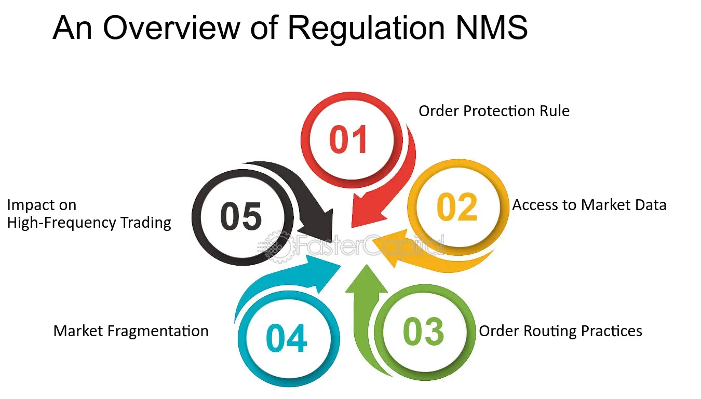

## Table of Contents

## What is Regulation NMS?

Regulation NMS, or National Market System, is a set of rules created by the U.S. Securities and Exchange Commission (SEC) to improve how stocks are traded in the United States. It was introduced in 2005 to make sure that investors get the best prices when they buy or sell stocks. The regulation aims to create a fair and efficient market by setting standards for how stock trades are handled and reported.

One important part of Regulation NMS is the "order protection rule." This rule says that brokers must try to get the best price available for their clients' trades. If a better price is available at another market, the broker should send the order there. Another key part is the "access rule," which makes sure that all markets can connect with each other easily. This helps to keep trading fair and efficient across different stock exchanges.

## What are the main goals of Regulation NMS?

The main goals of Regulation NMS are to make sure that investors get the best prices when they buy or sell stocks and to keep the stock market fair and efficient. The regulation wants to make sure that when you want to buy or sell a stock, you get the best deal possible. This means that if there's a better price for a stock at another market, your broker should try to get that price for you. This is important because it helps you save money and get a fair deal.

Another goal of Regulation NMS is to make sure that all stock markets can work together smoothly. This means that different stock exchanges should be able to connect with each other easily. When markets can work together well, it helps keep trading fair and makes sure that everyone has the same chance to get the best prices. This is good for investors because it makes the whole stock market system more reliable and efficient.

## Which organizations does Regulation NMS primarily affect?

Regulation NMS mainly affects stock exchanges and brokers. Stock exchanges are the places where stocks are bought and sold, like the New York Stock Exchange or NASDAQ. The rules in Regulation NMS make sure that these exchanges work together well and that they all follow the same standards. This helps keep the trading fair and efficient across all the different exchanges.

Brokers are also very important in this regulation. Brokers are the people or companies that help you buy and sell stocks. Regulation NMS says that brokers must try to get the best price for their clients' trades. If there's a better price at another exchange, the broker should send the order there. This rule helps make sure that investors get the best deals when they trade stocks.

Overall, Regulation NMS affects anyone involved in the buying and selling of stocks, but it mainly focuses on making sure that stock exchanges and brokers do their jobs in a way that is fair and good for investors.

## What are the key components of Regulation NMS?

Regulation NMS has a few important parts that work together to make the stock market fair and efficient. One key part is the order protection rule. This rule says that when you want to buy or sell a stock, your broker must try to get the best price available. If there's a better price at another stock exchange, the broker should send your order there. This helps you save money and get a fair deal.

Another important part of Regulation NMS is the access rule. This rule makes sure that all stock exchanges can connect with each other easily. When exchanges can work together well, it helps keep trading fair and makes sure everyone has the same chance to get the best prices. This is good for investors because it makes the whole stock market system more reliable and efficient.

The last key part is the sub-penny rule, which stops people from making trades at prices smaller than one cent. This helps keep the market fair by making sure that everyone is playing by the same rules. Together, these parts of Regulation NMS help make sure that the stock market works well for everyone.

## How does Regulation NMS impact the stock market?

Regulation NMS helps make the stock market better for everyone by making sure that when you buy or sell stocks, you get the best price possible. This is done through the order protection rule, which says that your broker must look for the best price across all stock exchanges. If there's a better price at another exchange, your broker should send your order there. This rule helps you save money because you always get the best deal available. It also makes the market more fair because everyone has the same chance to get good prices.

Another way Regulation NMS helps the stock market is by making sure that all stock exchanges can work together smoothly. This is important because it helps keep trading fair and efficient. The access rule in Regulation NMS makes sure that different stock exchanges can connect with each other easily. This means that if there's a better price for a stock at another exchange, it's easy for your broker to find it and get it for you. This helps make the whole stock market system more reliable and good for investors.

Lastly, Regulation NMS has a rule called the sub-penny rule, which stops people from making trades at prices smaller than one cent. This helps keep the market fair because it makes sure that everyone is playing by the same rules. All these parts of Regulation NMS work together to make the stock market a better place for everyone who wants to buy or sell stocks.

## What is the Order Protection Rule under Regulation NMS?

The Order Protection Rule is a part of Regulation NMS that helps make sure you get the best price when you buy or sell stocks. It says that your broker must look for the best price across all stock exchanges. If there's a better price at another exchange, your broker should send your order there. This rule helps you save money because you always get the best deal available.

This rule also makes the market more fair because everyone has the same chance to get good prices. It stops brokers from just sending orders to the exchange that pays them the most, which could mean you don't get the best price. By making sure brokers look for the best price everywhere, the Order Protection Rule helps keep the stock market fair and good for everyone who wants to trade stocks.

## How does the Access Rule of Regulation NMS work?

The Access Rule in Regulation NMS makes sure that different stock exchanges can work together easily. This rule helps keep trading fair and efficient by making sure that all markets can connect with each other. If there's a better price for a stock at another exchange, it's important that your broker can find it easily and get it for you. This helps make the whole stock market system more reliable and good for investors.

By making sure that all stock exchanges can connect easily, the Access Rule helps everyone get the best prices when they buy or sell stocks. It stops one exchange from being cut off from the others, which could make trading unfair. When all exchanges can work together smoothly, it means that your broker can always find the best deal for you, no matter where it is. This is good for the stock market because it makes sure that everyone has the same chance to get good prices.

## What is the Sub-Penny Rule and why was it introduced?

The Sub-Penny Rule is a part of Regulation NMS that stops people from making trades at prices smaller than one cent. This means you can't buy or sell stocks at prices like $10.001 or $10.002. The rule was introduced to keep the stock market fair and make sure everyone plays by the same rules. When people trade at prices smaller than a penny, it can make the market confusing and harder to keep track of prices.

The Sub-Penny Rule helps make sure that prices are clear and easy to understand. By not allowing trades at very small price differences, it stops some traders from trying to get a tiny advantage over others. This helps keep the market fair for everyone who wants to buy or sell stocks. The rule makes trading more straightforward and helps everyone trust that the prices they see are real and fair.

## How does Regulation NMS affect market data?

Regulation NMS helps make sure that the information about stock prices is shared fairly and quickly across all stock exchanges. When you want to buy or sell a stock, it's important to know the best price available. The rules in Regulation NMS make sure that everyone can see the same prices at the same time. This means that if there's a better price for a stock at another exchange, that information gets shared quickly so everyone can use it.

By making sure that market data is shared fairly, Regulation NMS helps keep the stock market honest and good for everyone. When all the stock exchanges can easily connect and share information, it stops one exchange from having secret prices that others can't see. This makes trading more fair because everyone has the same information to make their decisions. It also helps keep the stock market running smoothly because everyone can trust that the prices they see are the best available.

## What are the criticisms and controversies surrounding Regulation NMS?

Some people think Regulation NMS has made the stock market more complicated and harder to understand. They say that the rule about getting the best price for trades can make things slower because brokers have to check lots of different places for the best price. This can lead to delays and make trading less smooth. Also, some people worry that the rule about sharing market data might give too much information to big traders, which could make it harder for smaller investors to compete.

Another criticism is that Regulation NMS might have helped big stock exchanges too much. Some people think that the rules make it easier for big exchanges to stay on top and harder for smaller exchanges to grow. This could make the stock market less competitive. There are also worries that the rule about not trading at prices smaller than a penny might stop some new ways of trading from happening, which could slow down new ideas in the stock market.

## How has Regulation NMS evolved since its introduction?

Since Regulation NMS was introduced in 2005, it has been updated a few times to keep up with changes in the stock market. One big change was in 2018 when the SEC made new rules to make sure that the best price rule worked better. They wanted to make sure that when you buy or sell a stock, your broker really does find the best price for you, even if it means looking at lots of different places. This was to make the stock market even fairer and more efficient for everyone.

There have also been talks about making more changes to Regulation NMS. Some people think that the rules need to be updated to fit with new ways of trading and new technology. They want to make sure that the rules keep working well as the stock market changes. The SEC is always looking at these rules to see if they need to be changed to keep the stock market fair and good for everyone who wants to trade stocks.

## What future developments or amendments might we expect for Regulation NMS?

In the future, we might see more changes to Regulation NMS to keep up with new ways of trading and new technology. The SEC is always looking at the rules to make sure they work well for everyone. They might want to make the rules easier to understand and use, so that everyone can trade stocks fairly. They could also try to make sure that the best price rule works even better, so that your broker always finds the best deal for you, no matter how the stock market changes.

There's also a chance that the SEC will look at how to make the stock market more competitive. Some people think that the rules help big stock exchanges too much, so the SEC might try to make it easier for smaller exchanges to grow. They might also think about changing the rule about not trading at prices smaller than a penny, to see if it's stopping new ideas in the stock market. All these changes would be to make sure the stock market stays fair and good for everyone who wants to buy or sell stocks.

## References & Further Reading

[1]: Securities and Exchange Commission. (2005). ["Regulation NMS."](https://www.sec.gov/rules-regulations/2005/06/regulation-nms) SEC Release No. 34-51808.

[2]: O’Hara, M. (2015). ["High Frequency Market Microstructure."](https://www.sciencedirect.com/science/article/pii/S0304405X15000045) Annual Review of Financial Economics, 7, 133-170.

[3]: Budish, E., Cramton, P., & Shim, J. (2015). ["The High-Frequency Trading Arms Race: Frequent Batch Auctions as a Market Design Response."](https://academic.oup.com/qje/article/130/4/1547/1916146) The Quarterly Journal of Economics, 130(4), 1547-1621.

[4]: Aldridge, I. (2013). ["High-Frequency Trading: A Practical Guide to Algorithmic Strategies and Trading Systems."](https://www.amazon.com/High-Frequency-Trading-Practical-Algorithmic-Strategies/dp/1118343506) Wiley Finance.

[5]: Hendershott, T., & Menkveld, A. J. (2014). ["Price Pressures."](https://papers.ssrn.com/sol3/papers.cfm?abstract_id=1411943) The Review of Financial Studies, 27(3), 751-792.

[6]: Angel, J. J., Harris, L. E., & Spatt, C. S. (2011). ["Equity Trading in the 21st Century."](https://papers.ssrn.com/sol3/papers.cfm?abstract_id=1584026) Management Science, 57(12), 2006-2021.