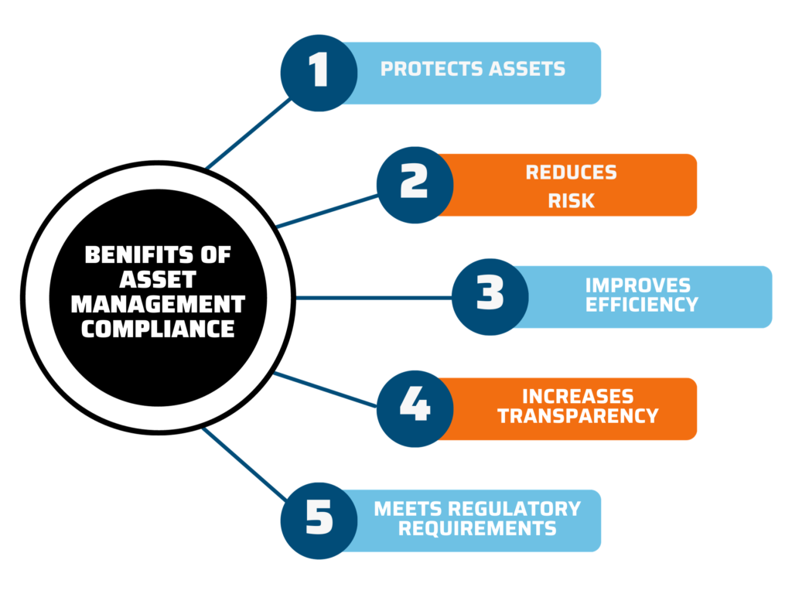

## Table of Contents

## What is an asset management firm?

An asset management firm is a company that helps people and organizations manage their money and investments. They take care of things like stocks, bonds, and real estate, making sure the money is used in a way that can grow over time. People who don't have the time or knowledge to manage their own investments often hire these firms to do it for them.

These firms have experts who study the market and make decisions about where to put the money. They aim to make the most profit while keeping the risk as low as possible. Clients pay the firm a fee, usually a percentage of the money being managed, for their services. This way, clients can focus on other things while their money is being looked after by professionals.

## Why is regulation important for asset management firms?

Regulation is important for asset management firms because it helps keep the financial system safe and fair. Without rules, some firms might take big risks or trick people to make more money. This could hurt investors and cause big problems in the economy. Regulations make sure that firms act honestly and carefully with the money they manage.

Regulations also help build trust. When people know that there are rules in place, they feel more comfortable putting their money into these firms. This trust is important for the firms to work well and for the economy to grow. If people don't trust the firms, they might not invest, and that can slow down everything.

Overall, regulations protect investors, keep the market stable, and make sure everyone plays by the same rules. This helps the whole financial system work better and helps people feel safe about their investments.

## Who are the primary regulatory bodies overseeing asset management firms?

In the United States, the main regulatory body for asset management firms is the Securities and Exchange Commission (SEC). The SEC makes sure that these firms follow the rules and treat their clients fairly. They check that the firms are honest about how they manage money and that they don't take too many risks with it.

Another important regulator is the Financial Industry Regulatory Authority (FINRA). FINRA works to keep the market fair and protect investors. They make sure that the people working at asset management firms are qualified and that the firms are following all the rules.

In other countries, different regulators do similar jobs. For example, in the United Kingdom, the Financial Conduct Authority (FCA) oversees asset management firms to make sure they are following the rules and protecting their clients. These regulators all work to keep the financial system safe and trustworthy.

## What are the main objectives of regulating asset management firms?

The main goal of regulating asset management firms is to protect people who invest their money with these firms. When people give their money to these firms, they want to make sure it's safe and being managed well. Regulations make sure that the firms are honest and don't take too many risks with the money. This helps keep the investors' money safe and makes sure they are treated fairly.

Another important goal is to keep the financial market stable. If asset management firms were allowed to do whatever they wanted, they might take big risks that could cause big problems. Regulations help prevent this by setting rules that everyone has to follow. This helps keep the market calm and prevents big crashes that could hurt the economy.

Lastly, regulations help build trust. When people know that there are rules in place to protect them, they feel more comfortable investing their money. This trust is important for the firms to do their job well and for the economy to grow. Without trust, people might not invest, and that can slow down everything.

## How do regulations protect investors in asset management?

Regulations protect investors in asset management by making sure that firms follow strict rules about how they handle money. These rules stop firms from taking big risks with the money they manage. They also make sure that firms are honest about what they are doing with the money. This means firms have to tell investors everything clearly, so there are no surprises. If a firm does something wrong, regulators can step in and make them fix it, or even punish them. This keeps the firms on the right path and protects the investors' money.

Another way regulations protect investors is by making sure that the people working at the firms are qualified and follow a code of conduct. This means that only people who know what they are doing can manage money, and they have to act in the best interest of the investors. Regulations also set up systems to watch over the firms and make sure they are doing what they are supposed to do. This constant monitoring helps catch any problems early and keeps the investors' money safe.

## What are the key compliance requirements for asset management firms?

Asset management firms have to follow many rules to make sure they are doing things the right way. One big rule is that they need to be honest and clear with their clients. This means they have to tell investors everything about how they are managing their money, what risks are involved, and any fees they are charging. They also need to keep good records of everything they do, so regulators can check that they are following the rules. If they don't follow these rules, they can get in big trouble.

Another important rule is that asset management firms need to manage the money carefully. They can't take big risks that could lose a lot of money for their clients. They also have to make sure that the people working at the firm are qualified and follow a strict code of conduct. This means that only people who know what they are doing can manage money, and they have to always act in the best interest of the investors. Regulators keep a close eye on the firms to make sure they are doing all of this correctly.

## How do regulations affect the operations and strategies of asset management firms?

Regulations make asset management firms change how they work and plan their strategies. They have to follow strict rules about being honest and clear with their clients. This means they need to tell investors exactly how they are managing their money, what risks are involved, and how much they are charging in fees. Because of these rules, firms have to spend time and money making sure all their information is correct and easy to understand. They also need to keep detailed records of everything they do, so regulators can check that they are following the rules. This can slow things down and make the firms more careful about what they do.

Regulations also affect how asset management firms handle risk and make decisions. They can't take big risks that could lose a lot of money for their clients. This means they have to think carefully about where to invest the money and make sure it's safe. Firms also need to make sure that the people working for them are qualified and follow a strict code of conduct. This means hiring the right people and training them well, which can be costly. But it's important because it helps keep the investors' money safe and makes sure the firm is doing things the right way. Overall, regulations make asset management firms more careful and focused on protecting their clients.

## What are the differences in regulatory frameworks across different countries?

Different countries have their own rules for asset management firms. In the United States, the main regulator is the Securities and Exchange Commission (SEC). The SEC makes sure firms follow the rules and treat clients fairly. They check that firms are honest about how they manage money and don't take big risks. In the United Kingdom, the Financial Conduct Authority (FCA) does a similar job. The FCA makes sure firms are following the rules and protecting their clients. Each country's rules are a bit different because they want to make sure their financial systems are safe and fair in their own way.

Some countries have stricter rules than others. For example, in Europe, the European Union has rules called MiFID II that make firms be very clear about how they manage money and charge fees. These rules are tougher than in some other places. In Asia, countries like Japan and Singapore have their own regulators, like the Financial Services Agency (FSA) in Japan and the Monetary Authority of Singapore (MAS). These regulators make sure firms follow the rules, but the rules can be different from those in the U.S. or Europe. This means that asset management firms have to understand and follow different rules depending on where they are working.

## How have regulations evolved in response to financial crises?

Regulations for asset management firms have changed a lot after big financial problems. When the economy has big crashes, like the one in 2008, governments see that the old rules weren't enough. They make new rules to stop the same problems from happening again. For example, after the 2008 crisis, the U.S. made a new law called the Dodd-Frank Act. This law made banks and asset management firms follow stricter rules about how much risk they can take and how they have to tell people about their investments.

These new rules also focus more on making sure firms are honest and clear with their clients. Governments want to make sure that people know exactly what is happening with their money. This helps build trust and keeps the financial system stable. Over time, as new problems come up, regulators keep updating the rules to make them even better. This way, they can keep protecting investors and the economy from future crises.

## What are the current challenges in regulating asset management firms?

Regulating asset management firms is hard because the world of money is always changing. New ways to invest and new technology, like using computers to trade, make it tough for regulators to keep up. They have to make rules that work for old and new ways of managing money. This means they need to understand a lot about different kinds of investments and how they can affect the economy. It's a big job to make sure the rules are fair and strong enough to protect everyone.

Another challenge is that asset management firms work all over the world. They might have clients in different countries, and each country has its own rules. This can make it hard for firms to follow all the different rules at the same time. Regulators have to work together across countries to make sure the rules fit together well. If they don't, firms might find ways to get around the rules, which can be risky for investors and the economy. Keeping everything safe and fair takes a lot of teamwork and careful planning.

## How do technological advancements influence the regulatory landscape for asset management?

Technological advancements are changing how asset management firms work and how they are regulated. New tools like computer programs that trade money automatically make things faster and more complex. This means regulators need to learn about these new technologies to make rules that keep everything safe and fair. They have to make sure these new ways of managing money don't create big risks for investors or the economy. It's like trying to keep up with a fast-moving train, and it's not easy.

Another way technology affects regulation is through things like data security and privacy. Asset management firms use a lot of personal information from their clients, and they need to keep it safe. New rules have to make sure firms are protecting this information well, especially as cyber attacks become more common. Regulators also need to think about how to use technology to watch over firms better. They can use computer systems to check if firms are following the rules, but they have to make sure these systems are fair and don't miss anything important.

## What future trends are expected in the regulation of asset management firms?

In the future, regulators will likely focus more on using technology to watch over asset management firms. They might use computer programs to check if firms are following the rules and to spot any problems quickly. This can help keep the market safe and fair. But it also means regulators need to keep learning about new technologies, like how to use them without missing important things or making mistakes. They will also need to make sure these new tools are used in a way that is fair to everyone.

Another big trend will be more rules about how firms use data. As more people use online services to manage their money, firms collect a lot of personal information. Regulators will want to make sure this information is kept safe and private. They might make new rules about how firms can use this data and how they need to protect it from hackers. This is important because people need to trust that their personal information is safe when they work with asset management firms.

## References & Further Reading

[1]: SEC. (n.d.). ["Investment Advisers Act of 1940."](https://www.sec.gov/investment/laws-and-rules)

[2]: FINRA. (n.d.). ["Role of FINRA."](https://www.finra.org/about)

[3]: CFTC. (n.d.). ["Technology and Information Management."](https://www.cftc.gov/PressRoom/PressReleases/9013-24)

[4]: Lopez de Prado, M. (2018). ["Advances in Financial Machine Learning."](https://www.amazon.com/Advances-Financial-Machine-Learning-Marcos/dp/1119482089) Wiley.

[5]: Aronson, D. (2006). ["Evidence-Based Technical Analysis: Applying the Scientific Method and Statistical Inference to Trading Signals."](https://www.amazon.com/Evidence-Based-Technical-Analysis-Scientific-Statistical/dp/0470008741) Wiley.

[6]: Jansen, S. (2020). ["Machine Learning for Algorithmic Trading."](https://github.com/stefan-jansen/machine-learning-for-trading) Packt.

[7]: Chan, E. P. (2008). ["Quantitative Trading: How to Build Your Own Algorithmic Trading Business."](https://github.com/ftvision/quant_trading_echan_book) Wiley.

