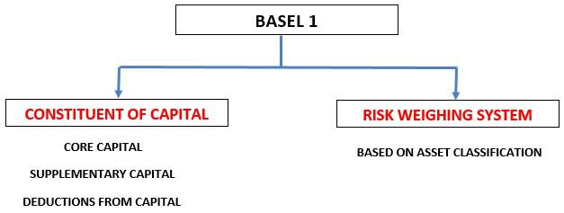

The financial industry has undergone a significant transformation with the integration of technological advancements, notably algorithmic trading. This evolution has reshaped how asset management and trading firms operate, as they now navigate an increasingly complex regulatory environment designed to protect investors and maintain market integrity. The intersection of finance, asset management regulations, and algorithmic trading is pivotal in molding the industry landscape, demanding a thorough understanding from professionals and stakeholders seeking compliance and growth.

Algorithmic trading, which employs sophisticated algorithms to execute trade orders at speeds and frequencies beyond human capability, exemplifies this technological shift. It offers several advantages such as enhanced efficiency and reduced costs, yet it also introduces new challenges and risks that necessitate regulatory oversight. Regulatory bodies, notably the Securities and Exchange Commission (SEC) and the Financial Industry Regulatory Authority (FINRA), play a crucial role in overseeing and guiding these financial activities. The SEC's regulatory mandate includes ensuring that firms managing considerable assets adhere to stringent standards, while FINRA focuses on enforcing these policies, especially within brokerage operations.

Understanding these regulatory frameworks and the technological innovations at play is critical for finance professionals. As the sector continues to evolve, the ability to balance regulatory compliance with the benefits of advanced trading technologies will determine the trajectory of future growth and stability. This sets the stage for an in-depth exploration of how finance asset management and algorithmic trading coalesce under regulatory scrutiny, shaping today's financial landscape.

## Table of Contents

## Understanding Finance Asset Management

Asset management serves as a pivotal financial service, offering advisory and financial planning solutions tailored to meet the unique needs of both individual and institutional clients. This sector's primary function involves the strategic allocation of various investment vehicles including mutual funds, fixed income, and equities, among others, to achieve specified client objectives.

Investment managers play a crucial role by developing comprehensive strategies that seek to balance potential returns with associated risks. The importance of efficiency in asset management cannot be understated, as it is vital in optimizing returns and minimizing risks. Efficiency in this context refers to the ability to select, manage, and adjust investment portfolios in a manner that consistently aligns with the financial goals of clients while adapting to market changes. The overarching aim is to facilitate stakeholders in reaching their individual financial aspirations through well-managed investment plans.

A critical governance component within asset management is the regulatory oversight provided by the Securities and Exchange Commission (SEC). The SEC is tasked with the responsibility of regulating firms that manage significant assets. These firms are required to comply with established standards that ensure the integrity and transparency of financial practices. The SEC's regulatory framework mandates a high level of accountability and transparency, aimed at safeguarding the investment interests of clients and maintaining trust in the financial system.

The interplay between regulatory compliance and asset management efficiency emphasizes the importance of robust governance structures within firms. This ensures that clients' investments are managed not only with the goal of maximizing returns but also with strict adherence to legal and ethical standards. In conclusion, understanding the mechanisms and regulatory frameworks governing asset management is crucial for both finance professionals and stakeholders striving for compliance and optimal financial performance in an ever-evolving market landscape.

## The Regulatory Landscape for Asset Management

Asset management firms in the United States operate within a stringent regulatory environment, predominantly overseen by the Securities and Exchange Commission (SEC) and the Financial Industry Regulatory Authority (FINRA). These organizations play crucial roles in ensuring the integrity and stability of financial markets, and their regulations significantly impact how asset management firms operate.

The SEC is the primary regulatory body for investment advisors managing significant assets. One of its core responsibilities is to ensure that these entities adhere to rules that protect market integrity. This includes enforcing compliance with the Investment Advisers Act of 1940, which mandates that advisors act in the best interest of their clients, maintain robust internal controls, and provide transparent reporting. The SEC's regulatory approach utilizes a combination of rulemaking, examinations, and enforcement actions to oversee the activities of asset managers.

FINRA, on the other hand, complements the SEC's efforts by focusing on the regulation of brokerage activities. As a self-regulatory organization, FINRA is responsible for enforcing SEC policies in the brokerage industry, ensuring that brokers operate fairly and transparently. One of FINRA's key functions is to monitor trading activities, prevent fraudulent practices, and mediate disputes between investors and brokers, thereby promoting a trustworthy trading environment.

Besides the SEC and FINRA, asset management firms must also comply with regulations from other bodies like the Federal Reserve and the U.S. Treasury. These entities provide additional oversight, particularly concerning systemic risk and prudential standards. For example, the Federal Reserve may impose capital requirements and conduct stress tests to evaluate the resilience of financial institutions in adverse economic conditions.

This multi-layered regulatory framework creates a complex environment for asset management firms. Navigating these regulations requires strategic planning and compliance measures. Firms must establish compliance teams, stay updated with regulatory changes, and implement internal systems to monitor adherence to relevant laws and guidelines. Failure to comply can result in significant penalties, reputational damage, and operational disruptions.

Overall, the regulatory landscape for asset management in the U.S. is designed to safeguard investors and ensure market stability. Asset management firms must continuously adapt their compliance strategies to thrive in this dynamic environment while maintaining the trust of their clients and stakeholders.

## Demystifying Algorithmic Trading

Algorithmic trading utilizes sophisticated computer algorithms designed to execute trades at velocities unattainable by human traders. These algorithms are advanced sets of instructions coded to automatically analyze extensive datasets to spot market trends and execute buy or sell decisions within fractions of a second. Such automation allows for more precise and efficient trading processes compared to traditional methods.

The principal advantage of [algorithmic trading](/wiki/algorithmic-trading) lies in its ability to lower transaction costs and minimize market impact. By automating trading processes, firms can execute strategies that potentially reduce the spread and latency costs, often achieved by breaking down large orders into smaller, strategically timed transactions. Algorithmic trading can also enhance market [liquidity](/wiki/liquidity-risk-premium) and depth by facilitating more frequent trading at narrower margins.

Despite its advantages, algorithmic trading is not devoid of challenges and risks. The 2010 Flash Crash serves as a notable example, where a series of rapid, high-frequency trades contributed to a sudden and dramatic drop, causing market instability. These systemic risks highlight the necessity for stringent regulation and oversight. 

Current regulations focus on maintaining transparency, preventing market manipulation, and ensuring robust risk management and data protection. Regulatory bodies such as the Securities and Exchange Commission (SEC) and the Commodity Futures Trading Commission (CFTC) enforce rules that target manipulative practices like spoofing—placing large orders with the intent to cancel before execution to manipulate prices—and layering, which further destabilizes market dynamics. 

Developing precise and adaptable regulatory frameworks is crucial to mitigate the risks associated with algorithmic trading. Ensuring that algorithms align with compliance standards involves frequent updates and rigorous [backtesting](/wiki/backtesting) against various market conditions. Additionally, firms are encouraged to implement comprehensive risk management systems which not only guard against unintended market disruptions but also enhance data security and integrity. 

As algorithmic trading continues to grow, maintaining an equilibrium between innovation and regulation is essential. This balance ensures that technological advancements in trading methodologies contribute positively to overall market efficiency and stability while safeguarding against potential threats.

## Navigating Regulatory Challenges in Algo Trading

Algorithmic trading involves the use of complex computer algorithms to make high-speed trading decisions, and with this complexity comes significant regulatory challenges. Key regulatory bodies such as the Securities and Exchange Commission (SEC) and the Commodity Futures Trading Commission (CFTC) play pivotal roles in overseeing these activities. Their oversight aims to ensure that markets remain fair, transparent, and free from manipulation.

A primary compliance challenge in algorithmic trading lies in adhering to regulations that address market manipulation tactics, including spoofing and layering. Spoofing involves placing large orders with the intent to cancel them before execution, thereby influencing prices. Layering is a similar strategy where traders place a series of orders at different levels to create a false impression of demand or supply. These practices are deceptive and distort market integrity, thus falling under the purview of regulatory enforcement.

To tackle these challenges, algorithmic trading firms need to implement robust risk management systems that can identify and mitigate potential threats to market stability. These systems often include real-time monitoring tools and analytics that can detect suspicious trading patterns indicative of manipulation. Failure to do so can lead to unintended market disruptions and severe regulatory penalties.

Moreover, successful algorithmic trading firms invest substantially in their compliance infrastructure. This includes not only technological safeguards but also the continuous updating of systems in response to emerging threats and regulatory changes. Training staff is equally important; employees must be well-versed in current regulations and best practices to prevent potential violations. For example, regular workshops and compliance programs can help ensure that staff stay informed about the latest regulatory requirements and technological advancements.

The SEC and CFTC's emphasis on transparency is evident in their regulations requiring comprehensive audit trails for trades. These requirements need firms to maintain detailed records of their trading activities, which can be reviewed during audits or investigations. This level of transparency helps regulators monitor the market effectively and take timely action against potential infractions.

Overall, navigating the regulatory landscape in algorithmic trading requires a proactive approach that combines advanced technology with a strong compliance culture. As the market evolves, firms must remain agile, continuously adapting to new regulations and leveraging technological advancements to enhance their trading strategies while ensuring regulatory compliance.

## The Future of Finance Asset Management and Algo Trading

As data analytics and [artificial intelligence](/wiki/ai-artificial-intelligence) (AI) advance, they are poised to significantly enhance the capabilities of asset management and algorithmic trading. AI techniques such as [machine learning](/wiki/machine-learning) offer the potential to process vast volumes of financial data to identify patterns and market trends more accurately and swiftly than ever before. This capability allows asset managers and traders to optimize their investment strategies, potentially boosting returns while managing risks more effectively.

Regulatory frameworks are expected to continue evolving to accommodate these technological advancements. Technologies like blockchain, with its inherent features of transparency and immutability, might play a crucial role in enhancing compliance and trust in financial transactions. Blockchain can facilitate real-time audit trails and simplify complex regulatory reporting processes, potentially transforming how compliance is maintained in asset management and trading.

Firms adopting these technological innovations must maintain vigilance regarding regulatory developments to ensure they remain compliant with ever-changing regulations. This involves not only deploying cutting-edge technologies but also investing in robust compliance infrastructures and regularly updating them as regulatory requirements evolve. Businesses that are proactive in aligning their operations with regulatory changes can mitigate risks associated with non-compliance and position themselves as leaders in the financial sector.

The convergence of regulation and technology is critical in shaping the next phase of growth and stability in the financial sector. As firms integrate advanced data analytics, AI, and blockchain into their core operations, they need to balance the drive for innovation with the necessity of regulatory compliance. Successfully navigating this intersection will define the competitive landscape in asset management and trading, offering opportunities for those who adeptly manage both technological and regulatory challenges.

## Conclusion

Finance asset management and algorithmic trading represent pivotal facets of the contemporary financial ecosystem. These components are integral to driving efficiency, optimizing returns, and managing risks in the financial markets. However, the complexity and interconnectedness of these activities necessitate strict adherence to regulatory requirements, underscoring the importance of compliance as a foundation for both firm success and investor protection.

Regulatory agencies such as the Securities and Exchange Commission (SEC), Financial Industry Regulatory Authority (FINRA), and the Commodity Futures Trading Commission (CFTC) play pivotal roles in shaping the rules and guidelines that ensure market integrity. These regulations are designed to mitigate risks associated with market manipulation, systemic threats, and data protection, thereby safeguarding the interests of all market participants. Compliance with these regulations is not merely a legal obligation but a strategic imperative that firms must navigate skillfully to function effectively in this dynamic environment.

Innovation in trading methodologies and asset management strategies is crucial for maintaining competitive advantage. The evolution of data analytics, artificial intelligence, and algorithmic techniques has transformed the capabilities of traders and asset managers. However, these innovations must be carefully aligned with regulatory expectations. Rigorous compliance, alongside robust risk management systems, ensures that the benefits of technological advancements can be fully realized without compromising market stability.

Looking forward, the future trajectory of the financial industry hinges on how adeptly firms can adapt to evolving regulations while leveraging new technologies. Blockchain and other emerging technologies hold potential for enhancing transparency and compliance, offering promising avenues for managing financial assets more efficiently. Ultimately, the sustainable growth and stability of the financial sector depend on the industry's ability to harmonize regulatory compliance with continued technological innovation, thereby fostering an environment conducive to economic growth and resilience.

## References & Further Reading

[1]: SEC. (n.d.). ["Investment Advisers Act of 1940."](https://www.sec.gov/investment/laws-and-rules)

[2]: FINRA. (n.d.). ["Role of FINRA."](https://www.finra.org/about)

[3]: CFTC. (n.d.). ["Technology and Information Management."](https://www.cftc.gov/PressRoom/PressReleases/9013-24)

[4]: Lopez de Prado, M. (2018). ["Advances in Financial Machine Learning."](https://www.amazon.com/Advances-Financial-Machine-Learning-Marcos/dp/1119482089) Wiley.

[5]: Aronson, D. (2006). ["Evidence-Based Technical Analysis: Applying the Scientific Method and Statistical Inference to Trading Signals."](https://www.amazon.com/Evidence-Based-Technical-Analysis-Scientific-Statistical/dp/0470008741) Wiley.

[6]: Jansen, S. (2020). ["Machine Learning for Algorithmic Trading."](https://github.com/stefan-jansen/machine-learning-for-trading) Packt.

[7]: Chan, E. P. (2008). ["Quantitative Trading: How to Build Your Own Algorithmic Trading Business."](https://github.com/ftvision/quant_trading_echan_book) Wiley.

