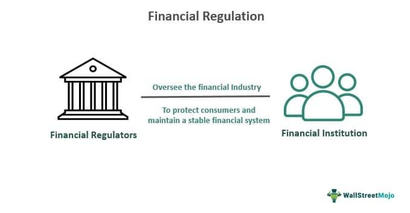

The financial services sector is a dynamic and complex industry that significantly contributes to the global economy, encompassing a wide range of businesses such as banks, investment houses, lenders, finance companies, real estate brokers, and insurance companies. This sector is integral for facilitating international trade, supporting infrastructure development, and managing personal wealth, underlying its importance in both developed and emerging economies.

Government regulations are fundamental to maintaining order and stability within the financial sector. These regulations govern various facets of financial operations, from banking practices to securities trading, aiming to protect consumers, ensure fair practices, and prevent financial crises. Regulatory bodies, such as the Securities and Exchange Commission (SEC) in the United States, enforce laws to protect investors and maintain the integrity of financial markets. Effective regulation strikes a balance by preventing mismanagement and systemic risks while fostering an environment conducive to innovation and growth.

Algorithmic trading represents a significant technological advancement within the financial sector, employing complex algorithms to execute trades at high speed and frequency. This form of trading has transformed financial markets by increasing efficiency, liquidity, and market depth. However, it also introduces challenges, such as the potential for flash crashes, which necessitate regulatory oversight to ensure market stability.

This article explores the intersection of financial services, government regulation, and algorithmic trading. It aims to outline the current regulatory landscape affecting these areas and discuss emerging trends and future directions for the financial industry. By examining how regulations adapt to technological innovations like algorithmic trading, we gain insight into the evolving nature of financial markets and the critical balance needed between fostering innovation and maintaining market stability.

## Table of Contents

## The Role of Government Regulation in the Financial Sector

Government regulation is pivotal to the functioning of the financial sector, ensuring its integrity and stability. Regulators establish frameworks within which financial institutions operate, thereby safeguarding the interests of investors and maintaining market equilibrium. 

**Key Regulatory Bodies and Their Functions**

Regulatory bodies such as the U.S. Securities and Exchange Commission (SEC) are instrumental in enforcing laws that protect investors and ensure fair market practices. The SEC oversees the securities industry to prevent malpractices such as insider trading, accounting fraud, and any deceitful activities in the stock markets. By mandating transparency and fairness, the SEC aims to foster investor confidence and ensure the smooth operation of financial markets.

**The Sarbanes-Oxley Act**

Enacted in response to notable corporate scandals in the early 2000s, the Sarbanes-Oxley Act (SOX) was designed to improve corporate accountability. It established stringent reforms to enhance corporate governance and restore investor trust. Key provisions of SOX include mandating that top executives certify the accuracy of financial statements and enhancing internal control measures. These requirements increase the compliance workload for firms but are integral to deterring fraudulent activities.

**Balancing Regulation and Innovation**

While regulations are critical for protecting stakeholders, they can also lead to increased compliance costs for financial companies. Compliance involves both direct expenses, such as reporting and audit costs, and indirect impacts, like reallocating resources to meet regulatory demands. However, these costs are balanced by the confidence that well-regulated markets inspire in investors, contributing to a robust investment environment.

Nevertheless, regulators must strike a delicate balance. Excessive regulation can inadvertently stifle innovation and burden financial institutions with unnecessary complexity. Conversely, inadequate regulation can lead to risk management failures, as witnessed during the 2007-2008 financial crisis. Therefore, regulatory frameworks are designed to be adaptable, ensuring they evolve with the financial sector without impeding progress.

In summary, government regulation forms the backbone of a fair and stable financial services sector. Through strategic enforcement and adaptive regulatory measures, it aims to protect participants while fostering a climate conducive to innovation and growth.

## The Impact of Algorithmic Trading on the Financial Markets

Algorithmic trading is a transformative force in the financial markets, leveraging complex algorithms to execute trades at speeds and frequencies beyond human capability. It enhances market efficiency by narrowing bid-ask spreads and providing [liquidity](/wiki/liquidity-risk-premium), thus facilitating smoother market operations. However, this high-speed trading also introduces risks, such as flash crashes, which are sudden, deep, and rapid declines in security prices, followed by a quick recovery. An example of this is the Flash Crash of May 6, 2010, where the Dow Jones Industrial Average plummeted about 1,000 points before rebounding within minutes.

To mitigate such risks, regulatory bodies have established measures to promote stability and fairness in markets. For instance, the U.S. Securities and Exchange Commission (SEC) and the Commodity Futures Trading Commission (CFTC) have implemented rules requiring risk management controls for [algorithmic trading](/wiki/algorithmic-trading). These rules often include circuit breakers that pause trading if a security's price changes too rapidly, allowing time for market participants to react.

The integration of Artificial Intelligence (AI) and [machine learning](/wiki/machine-learning) in algorithmic trading is increasingly prevalent, allowing traders to analyze vast datasets and identify patterns for more informed decision-making. These technologies help predict market movements with greater accuracy, but they also introduce complexities that necessitate updated regulatory frameworks. The adaptability of AI can sometimes lead to unforeseen strategies and results, posing challenges for regulatory oversight.

Balancing innovation with risk management remains crucial. While algorithmic and AI-driven trading offer significant advantages in terms of speed and efficiency, oversight must ensure these technologies do not undermine market integrity. This balance can be achieved by continually refining regulatory measures which incorporate advanced monitoring and transparent audit trails of trading algorithms.

In summary, algorithmic trading has reshaped financial markets, presenting both opportunities for enhanced efficiency and challenges related to market stability. Ensuring these technologies are used responsibly requires continuous adaptation of regulatory practices to address the rapid advancements in trading technology.

## Financial Services and Regulatory Challenges

Financial services firms continually face the task of adapting to regulatory changes, which can significantly affect their operations and profitability. The regulatory environment is not static; it evolves to address emerging challenges and technologies. Financial institutions must effectively manage this dynamic landscape to avoid potential penalties and reputational harm.

Environmental regulations and consumer protection laws represent additional compliance layers that firms must navigate. The growing focus on environmental, social, and governance ([ESG](/wiki/esg-investing)) criteria underscores the importance of sustainable financial practices. Compliance with such regulations is not merely about meeting legal requirements but also about aligning with societal expectations, which can impact a firm's reputation and client relations.

The financial crisis of 2007 serves as a stark reminder of the consequences of inadequate regulation. The crisis exposed significant flaws in financial oversight, leading to widespread economic hardships. In response, governments and regulatory bodies worldwide have introduced stringent measures to prevent the recurrence of similar crises. These measures aim to enhance transparency, reduce systemic risk, and protect consumers from financial mismanagement.

The Dodd-Frank Wall Street Reform and Consumer Protection Act of 2010 is a pivotal regulation introduced in the aftermath of the financial crisis. This comprehensive reform targets crucial areas like consumer protection, trading restrictions, and corporate governance. While such regulations are instrumental in safeguarding the financial system, they also contribute to increased operational complexity for firms. Companies must invest in robust compliance systems and processes to ensure adherence to these regulations, which can significantly impact their operational efficiency and cost structures.

To navigate this complexity, financial institutions are increasingly turning to technology. Compliance technologies, often powered by [artificial intelligence](/wiki/ai-artificial-intelligence) and machine learning, can help organizations efficiently manage regulatory requirements, reduce manual errors, and improve decision-making processes. By integrating these technologies, firms can better anticipate regulatory changes, thus minimizing disruptions to their operations.

Ultimately, while regulatory challenges pose significant obstacles, they also offer financial institutions the opportunity to enhance their operational practices and build more resilient business models. By staying abreast of regulatory developments and leveraging technology, firms can mitigate risks and maintain their competitive edge in the rapidly evolving financial landscape.

## Future Trends and Recommendations

The integration of artificial intelligence (AI) in financial services is revolutionizing the industry, offering the potential for enhanced efficiency, risk management, and customer personalization. As AI technologies become more prevalent, there is a pressing need to standardize regulations across different jurisdictions. Without standardized regulations, inconsistencies can arise, leading to regulatory [arbitrage](/wiki/arbitrage) and potential financial instability. Harmonizing AI regulations at both national and global levels can ensure that financial markets operate smoothly and securely, fostering investor confidence and facilitating cross-border financial activities.

Financial institutions are encouraged to invest in compliance technology to navigate the increasingly complex regulatory landscape. By adopting advanced compliance systems, institutions can reduce the risk of penalties and ensure adherence to evolving legal requirements. Compliance technology can automate processes such as reporting, monitoring, and risk assessment, thus allowing financial organizations to focus on innovation and strategic growth.

Continuous dialogue between regulators and industry stakeholders is paramount to addressing the challenges posed by rapidly advancing technologies. Engagement through forums, working groups, and consultations can help create a collaborative environment where insights are shared, and consensus is built on regulatory priorities and strategies. This cooperation can lead to regulations that are adaptive yet robust enough to prevent systemic risks while encouraging technological advances.

Moreover, balancing innovation with market integrity is vital for future regulatory frameworks. Policymakers need to ensure that regulations do not stifle innovation but rather provide a safeguard against potential threats such as market manipulation or algorithmic biases. Encouraging transparency and accountability in the development and deployment of AI solutions can promote trust in these technologies, ensuring their benefits are realized without compromising market stability.

In summary, the future of financial services lies in embracing AI while adhering to well-structured and standardized regulatory frameworks. By investing in compliance technology and fostering open communication between stakeholders, the industry can navigate the challenges of technological innovation and maintain robust, efficient, and transparent financial markets.

## Conclusion

The interplay between government regulation, financial services, and algorithmic trading is both intricate and continually evolving. As financial markets progress, the role of effective regulation becomes ever more critical in safeguarding investors and ensuring market stability. Regulatory frameworks help mitigate systemic risks, such as those posed by algorithmic trading, which, while enhancing market efficiency, also introduce potential [volatility](/wiki/volatility-trading-strategies) characterized by events like flash crashes.

Regulations, albeit challenging, also offer opportunities to construct more secure and efficient financial systems. They set the standards for accountability and transparency while instilling investor confidence and promoting fair trading practices. Financial institutions navigating these frameworks face increased compliance costs but benefit from the stability and trust fostered within the marketplace.

Looking ahead, the financial services sector's success will heavily rely on finding the right balance between regulation and technological advancement. The rapid development of technologies like artificial intelligence in finance necessitates updated and adaptable regulatory measures to accommodate new paradigms without stifling innovation.

To manage this dynamic landscape, continuous collaboration between regulators, industry stakeholders, and technology developers is paramount. Such engagement is crucial not only for keeping pace with technological innovations but also for shaping regulatory policies that uphold market integrity. Ultimately, fostering a financial environment that encourages innovation while maintaining robust protections will be pivotal for the sector's sustainable growth and resilience.

## References & Further Reading

[1]: Cumming, C., & Hirtle, B. (2011). ["The Challenges of Risk Management in Diversified Financial Companies."](https://www.researchgate.net/publication/5050416_The_Challenges_of_Risk_Management_in_Diversified_Financial_Companies) Federal Reserve Bank of San Francisco.

[2]: Menkveld, A. J. (2013). ["High Frequency Trading and the New-Market Makers."](https://www.sciencedirect.com/science/article/pii/S1386418113000281) Journal of Financial Markets.

[3]: Cartea, Á., Jaimungal, S., & Penalva, J. (2015). ["Algorithmic and High-Frequency Trading."](https://assets.cambridge.org/97811070/91146/frontmatter/9781107091146_frontmatter.pdf) Cambridge University Press.

[4]: U.S. Securities and Exchange Commission. ["The Sarbanes-Oxley Act of 2002."](https://www.sec.gov/rules-regulations/statutes-regulations)

[5]: Aldridge, I. (2013). ["High-Frequency Trading: A Practical Guide to Algorithmic Strategies and Trading Systems."](https://www.amazon.com/High-Frequency-Trading-Practical-Algorithmic-Strategies/dp/1118343506) Wiley Finance.

[6]: Lewis, M. (2014). ["Flash Boys: A Wall Street Revolt."](https://en.wikipedia.org/wiki/Flash_Boys) W. W. Norton & Company. 

[7]: "Dodd-Frank Wall Street Reform and Consumer Protection Act". (2010). Public Law 111–203. [Library of Congress](https://www.congress.gov/bill/111th-congress/house-bill/4173).

[8]: Van Liebergen, B. (2017). ["Machine Learning: A Revolution in Risk Management and Compliance?"](https://www.iif.com/portals/0/Files/private/32370132_van_liebergen_-_machine_learning_in_compliance_risk_management.pdf) Institute of International Finance. 

[9]: Lopez de Prado, M. (2018). ["Advances in Financial Machine Learning."](https://www.amazon.com/Advances-Financial-Machine-Learning-Marcos/dp/1119482089) Wiley.

[10]: Narang, R. (2013). ["Inside the Black Box: A Simple Guide to Quantitative and High-Frequency Trading."](https://onlinelibrary.wiley.com/doi/book/10.1002/9781118662717) Wiley.