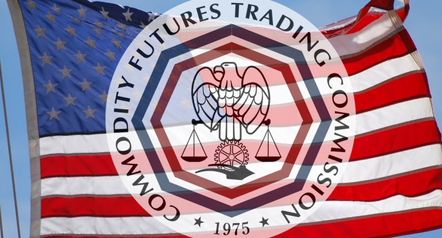

## Table of Contents

## What is a forex broker?

A forex broker is a company or person that helps you buy and sell different currencies. They act like a middleman between you and the big markets where currencies are traded. When you want to trade currencies, you go through the broker, who makes sure your trades happen smoothly.

Forex brokers make money by charging you a small fee or by adding a little difference between the buying and selling price of a currency. They also provide tools and information to help you make better trading decisions. This can include charts, news updates, and trading platforms where you can see and manage your trades easily.

## Why is regulation important for forex brokers?

Regulation is important for forex brokers because it helps keep trading safe and fair for everyone. When a broker is regulated, it means that they have to follow rules set by a government or financial authority. This makes sure that the broker is honest and doesn't do anything sneaky or harmful to their clients. If something goes wrong, like if the broker loses your money or doesn't give it back, you can complain to the regulator who can help you get your money back or take action against the broker.

Having regulation also builds trust. When you know that a broker is being watched by a regulator, you feel more confident in using their services. This is important because trading can be risky, and you want to be sure that the broker is not going to cheat you. Regulated brokers also have to keep your money in separate accounts, which means your money is safer even if the broker has financial problems. So, regulation helps protect you and makes the whole [forex](/wiki/forex-system) market more trustworthy.

## Which regulatory body oversees forex brokers in the United States?

In the United States, the main regulatory body that oversees forex brokers is the Commodity Futures Trading Commission (CFTC). The CFTC makes sure that forex brokers follow the rules and treat their customers fairly. They do this by checking that brokers are honest and don't do anything wrong with the money they handle. If a broker breaks the rules, the CFTC can take action against them, which can help protect traders.

Another important group is the National Futures Association (NFA). The NFA works closely with the CFTC and adds another layer of protection for traders. They also make sure that brokers follow the rules and can punish brokers who don't. The NFA also provides a way for traders to check if a broker is registered and in good standing, which helps traders feel more secure when choosing a broker.

## What are the main requirements for a forex broker to operate legally in the U.S.?

To operate legally in the U.S., a forex broker must be registered with the Commodity Futures Trading Commission (CFTC) and be a member of the National Futures Association (NFA). This means the broker has to follow strict rules set by these organizations. They need to show that they are honest and have enough money to run their business safely. The broker also has to keep their clients' money in separate accounts, so if the broker has financial problems, the clients' money stays safe.

The broker must also follow rules about how they treat their customers. They can't lie or trick people, and they have to give clear information about the risks of trading. They need to have good systems in place to make sure trades happen correctly and to protect against fraud. If a broker doesn't follow these rules, the CFTC and NFA can take action against them, which might include fines or even stopping the broker from operating. This helps keep the forex market fair and safe for everyone.

## How does the Commodity Futures Trading Commission (CFTC) regulate forex brokers?

The Commodity Futures Trading Commission (CFTC) keeps an eye on forex brokers to make sure they follow the rules. They do this by checking that brokers are honest and have enough money to run their business without risking their clients' money. The CFTC also makes sure that brokers keep their clients' money in separate accounts, so if the broker runs into financial trouble, the clients' money is safe. If a broker doesn't follow these rules, the CFTC can take action, like giving them a fine or stopping them from working.

The CFTC also works with the National Futures Association (NFA) to make sure brokers treat their customers fairly. They check that brokers give clear information about the risks of trading and don't lie or trick people. The CFTC and NFA together help make sure that the forex market is fair and safe for everyone. If a broker does something wrong, people can complain to the CFTC, who will look into it and help if needed.

## What is the role of the National Futures Association (NFA) in regulating forex brokers?

The National Futures Association (NFA) works with the Commodity Futures Trading Commission (CFTC) to make sure forex brokers in the U.S. follow the rules. The NFA checks that brokers are honest and have enough money to run their business safely. They also make sure brokers keep their clients' money in separate accounts, which protects it if the broker has financial problems. If a broker doesn't follow these rules, the NFA can take action against them, like giving them a fine or stopping them from working.

The NFA also helps keep trading fair by making sure brokers give clear information about the risks of trading. They check that brokers don't lie or trick people. The NFA has a way for people to check if a broker is registered and in good standing, which helps traders feel more secure when choosing a broker. If someone has a problem with a broker, they can complain to the NFA, who will look into it and help if needed.

## What are the differences between regulated and unregulated forex brokers?

Regulated forex brokers are watched by government or financial groups like the CFTC and NFA in the U.S. This means they have to follow strict rules to make sure they treat their customers fairly and keep their money safe. If a regulated broker does something wrong, the regulators can take action against them, like giving them a fine or stopping them from working. This makes trading with them safer and more trustworthy because you know there's someone looking out for you.

On the other hand, unregulated forex brokers don't have to follow these rules. They aren't watched by any official groups, so they can do things that might not be good for their customers. This means your money might not be as safe, and if something goes wrong, you don't have anyone to help you get it back. Trading with an unregulated broker is riskier because you have to trust them completely without any official protection.

In summary, choosing a regulated forex broker gives you more safety and trust because they are held accountable by regulators. Unregulated brokers might offer tempting deals, but the risks are much higher because there's no one making sure they play by the rules. Always check if a broker is regulated before you start trading with them.

## How can traders verify if a forex broker is regulated in the U.S.?

Traders can check if a forex broker is regulated in the U.S. by visiting the website of the National Futures Association (NFA). The NFA has a tool called the BASIC system where you can search for a broker by their name or NFA ID number. If the broker is registered and in good standing, you'll see their details and know they are regulated.

Another way to verify is by checking the Commodity Futures Trading Commission (CFTC) website. The CFTC also lists registered brokers and provides information on their regulatory status. By using these resources, traders can make sure they are dealing with a broker that follows the rules and is overseen by official bodies, which adds a layer of safety and trust to their trading activities.

## What are the common compliance issues faced by forex brokers in the U.S.?

Forex brokers in the U.S. often face compliance issues related to how they handle their clients' money. They must keep client funds in separate accounts to protect them if the broker has financial problems. If they mix client money with their own, they could be breaking the rules. Another big issue is making sure they give clear and honest information about the risks of trading. If they lie or trick people about how safe or profitable trading can be, they can get in trouble with regulators like the CFTC and NFA.

Another common problem is making sure all trades happen correctly and fairly. Brokers need good systems to stop fraud and make sure trades are done right. If they don't have these systems, or if they don't use them properly, they could be breaking the rules. Also, brokers need to make sure they have enough money to run their business safely. If they don't, they might not be able to pay back their clients if something goes wrong. Keeping up with all these rules can be hard, but it's important for keeping the forex market fair and safe for everyone.

## How do regulations protect traders from fraud and ensure fair trading practices?

Regulations help protect traders from fraud by making sure forex brokers follow strict rules. In the U.S., the CFTC and NFA watch over brokers to make sure they are honest and don't do anything sneaky. If a broker lies or tricks people, the regulators can give them a fine or stop them from working. This means traders can feel safer because someone is looking out for them. Also, brokers have to keep clients' money in separate accounts, so if the broker has money problems, the clients' money stays safe.

Regulations also make sure trading is fair by setting rules on how brokers treat their customers. Brokers need to give clear information about the risks of trading and can't hide anything important. They also need good systems to make sure trades happen correctly and to stop fraud. If a broker doesn't follow these rules, the regulators can take action. This helps keep the forex market fair for everyone, so traders know they are getting a fair deal and can trust the market.

## What are the recent changes or updates in U.S. forex broker regulations?

In recent years, the U.S. has made some changes to the rules for forex brokers to make trading safer and fairer. One big change is that brokers now have to give more clear information about the risks of trading. They need to tell traders in a simple way how much they could lose and what the chances are of making money. This helps traders make better choices and know what they're getting into. Another change is that brokers have to keep even closer watch on their systems to stop fraud and make sure trades happen the right way.

Also, the rules about how brokers handle clients' money have gotten stricter. Now, brokers have to keep clients' money in even more separate accounts to make sure it's safe if the broker has money problems. The CFTC and NFA have also stepped up their checks to make sure brokers are following all the rules. These changes help keep the forex market fair and safe for everyone, so traders can trust that their money and trades are being looked after properly.

## How do U.S. regulations compare to those in other major forex markets like the EU or Japan?

In the U.S., forex brokers are watched closely by the CFTC and NFA. They have to follow strict rules to keep clients' money safe and make sure trading is fair. For example, they must keep clients' money in separate accounts and give clear information about trading risks. If a broker does something wrong, the CFTC or NFA can give them a fine or stop them from working. These rules help protect traders and make the market trustworthy.

In the European Union, forex brokers are regulated by the European Securities and Markets Authority (ESMA). Like in the U.S., they have to keep clients' money separate and be honest about trading risks. But ESMA also has rules on how much traders can use leverage, which is borrowing money to trade. This helps limit how much traders can lose. In Japan, the Financial Services Agency (FSA) watches over forex brokers. They also have strict rules to protect clients' money and make sure brokers are honest. But Japan has different rules about how much brokers can charge and how they can advertise, which can be different from the U.S. and EU.

Overall, while the U.S., EU, and Japan all have strong rules to protect traders, there are some differences. The U.S. focuses a lot on making sure brokers are honest and keep clients' money safe. The EU adds rules about leverage to limit risk, and Japan has its own set of rules about fees and advertising. These differences show how each place tries to keep the forex market safe and fair in its own way.

## References & Further Reading

[1]: Commodity Futures Trading Commission. ["Overview of the CFTC."](https://www.govinfo.gov/content/pkg/GOVPUB-Y3_C73_5-PURL-gpo49551/pdf/GOVPUB-Y3_C73_5-PURL-gpo49551.pdf)

[2]: National Futures Association. ["About NFA."](https://www.nfa.futures.org/about/index.html)

[3]: Securities and Exchange Commission. ["Algorithmic Trading: What You Need to Know."](https://www.sec.gov/files/Algo_Trading_Report_2020.pdf)

[4]: ["Algorithmic and High-Frequency Trading"](https://www.amazon.com/Algorithmic-High-Frequency-Trading-Mathematics-Finance/dp/1107091144) by Álvaro Cartea, Sebastian Jaimungal, and José Penalva

[5]: Gomber, P., Arndt, B., Lutat, M., & Uhle, T. (2011). ["High-frequency trading."](https://www.researchgate.net/publication/271631628_High-Frequency-Trading) Working Paper Series of the Institute of Information Systems at the University of Frankfurt.