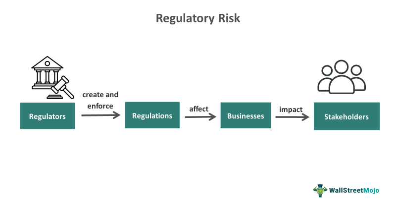

Privacy regulations play a vital role in safeguarding consumer information within the financial sector. As financial services increasingly rely on digital data processing and sharing, protecting consumer privacy has become paramount. Regulation P, also known as the Privacy of Consumer Financial Information, is a critical regulation that dictates how financial institutions handle consumer financial data. Established under the Gramm-Leach-Bliley Act, Regulation P mandates that financial institutions develop and disclose their privacy policies and practices along with measures for safeguarding consumer non-public personal information.

Regulation P serves as a cornerstone in maintaining consumer trust by ensuring that personal financial data is managed responsibly and transparently. This regulation requires financial institutions to provide customers with annual privacy notices, clarifying how their information is collected, used, and shared. Additionally, consumers must be informed of their rights to opt-out of having their information shared with non-affiliated third parties. These stipulations underscore the regulation's commitment to placing consumers in control of their personal information.

In the context of algorithmic trading, Regulation P holds significant importance. Algorithmic trading systems leverage vast amounts of data to make rapid, automated trading decisions. As these systems evolve and require more data to maximize efficiency and profitability, adhering to privacy regulations such as Regulation P becomes crucial to ensure compliance and protect consumer data integrity. Failure to adequately address privacy concerns can lead to regulatory penalties, reputational damage, and erosion of consumer trust.

Ultimately, Regulation P anchors the balance between utilizing consumer financial data for operational effectiveness and upholding a high standard of privacy protection. As such, it remains an essential regulation for financial institutions navigating the complex landscape of data-driven technologies while prioritizing data privacy.

## Table of Contents

## What is Regulation P?

Regulation P, officially known as Privacy of Consumer Financial Information, is a regulation issued by the Federal Reserve to safeguard consumer financial data held by financial institutions. It was established as a result of the Gramm-Leach-Bliley Act (GLBA), enacted in 1999, which aimed to enhance financial privacy for consumers. The regulation requires financial institutions to provide clear and conspicuous privacy notices to their consumers and to abide by specific conditions when disclosing personal financial information to non-affiliated third parties.

The Federal Reserve, alongside other regulatory bodies, played a pivotal role in formulating Regulation P. As a central bank responsible for regulating financial institutions and maintaining financial system stability, the Federal Reserve helped craft guidelines that balance consumer privacy with the operational needs of financial entities. One of the primary objectives of Regulation P is to ensure that consumers are informed about the information-sharing practices of these institutions, thereby enabling them to make informed decisions regarding their personal information.

The regulation outlines key components including requirements for privacy notices, conditions under which non-public information can be shared, and methods for consumers to limit the sharing of their information. Financial institutions are mandated to provide an initial privacy notice at the outset of a customer relationship and subsequently deliver annual privacy notices. These notices must detail the types of information collected, the nature of information-sharing practices, and how consumers can exercise their rights to opt-out of certain disclosures.

Historically, Regulation P has undergone several amendments to adapt to evolving privacy concerns and technological advancements. A notable change occurred in 2015 when the Fixing America's Surface Transportation (FAST) Act amended the GLBA. This amendment introduced an exception to the annual privacy notice requirement, allowing institutions that do not share information in a manner that triggers customer opt-out rights, and whose policies have not changed since the previous notice, to bypass the annual notice obligation. This adjustment aimed to reduce the regulatory burden on financial institutions while maintaining adequate consumer protections.

Overall, Regulation P is a crucial element in the landscape of financial data privacy, serving as a foundation for protecting consumer information amid growing concerns over data security and privacy breaches in the modern financial ecosystem.

## Scope of Regulation P

Regulation P primarily governs the privacy practices of financial institutions, ensuring the protection of consumer financial information. It applies to a wide array of entities that offer financial products or services. These entities include banks, credit unions, savings associations, and non-bank financial institutions like mortgage brokers, securities firms, and payday lenders. Essentially, any organization significantly engaged in financial activities must adhere to the stipulations set forth by Regulation P.

The regulation protects various types of consumer financial information, with the primary focus being on non-public personal information (NPI). NPI encompasses any information a consumer provides to a financial institution that is not publicly available, such as social security numbers, income, account balances, and transaction history. It also includes any information derived from data provided by a consumer or acquired through business transactions or services performed for the consumer.

Non-public information is central to Regulation P's protective measures. Financial institutions are obligated to implement stringent privacy policies to safeguard this information. These policies must delineate how consumer data is collected, utilized, and protected. Regulation P mandates that institutions provide customers with a clear and conspicuous notice that accurately reflects their privacy practices. Additionally, consumers must be given the choice to opt out of any disclosure of their NPI to unaffiliated third parties unless an exception applies.

The protection regime under Regulation P does not only focus on prohibiting unauthorized disclosures but also emphasizes the duty of financial institutions to ensure the confidentiality and integrity of the information. This involves implementing administrative, technical, and physical safeguards appropriate for the level of sensitivity and value of the protected data.

Overall, Regulation P establishes a comprehensive framework for the protection of consumer financial information, demanding robust compliance from covered financial institutions. The regulation's prescriptions ensure that consumer data is used appropriately and remain secure from unauthorized access or misuse, building a foundation of trust between financial entities and their customers.

## Compliance Requirements for Financial Institutions

Financial institutions operating in the United States are mandated to comply with Regulation P, which is pivotal in safeguarding consumer financial information. This compliance involves adhering to specific obligations that are designed to protect the privacy of consumer data and provide transparency in how this information is handled by financial entities.

### Detailed Look at Compliance Obligations under Regulation P

Regulation P obliges financial institutions to disclose specified practices regarding the handling of consumer financial information. This includes the requirement to prepare and deliver an annual privacy notice to their customers. This notice is a detailed statement that outlines how the institution collects, uses, and protects consumer information.

#### Essential Elements of the Annual Privacy Notice

The annual privacy notice must include several key elements:

1. **Categories of Information Collected**: Institutions must specify the types of nonpublic personal information they collect about consumers, such as account balances, transaction history, and payment records.

2. **Categories of Information Disclosed**: The notice should disclose the categories of nonpublic personal information that the financial institution may share with third parties.

3. **Categories of Affiliates and Nonaffiliated Third Parties**: Financial institutions must list the categories of affiliates and nonaffiliated third parties with whom information is shared.

4. **Opt-Out Rights**: Consumers must be informed about their rights to opt-out of certain types of information sharing, which limits the dissemination of their data to unaffiliated third parties.

5. **Security Measures**: A description of the institution’s security policies to protect customer information must be included in the notice.

6. **Updates to Policy**: If there are changes to how the information is shared that were not disclosed in previous notices, the institution must provide an updated privacy notice.

#### Consumer Rights under Regulation P, Including the Opt-Out Provision

Regulation P provides consumers with significant rights aimed at controlling their personal information. One of the critical provisions is the opt-out right, which allows consumers to prevent financial institutions from sharing their nonpublic personal information with nonaffiliated third parties, except under certain exceptions such as joint marketing agreements or as required by law.

The opt-out right necessitates that financial institutions offer a clear and reasonable means for consumers to exercise this choice. Institutions must provide an explanation of how consumers can opt-out, and consumers should be given a reasonable period before their information is shared to enact this preference.

In summary, Regulation P requires financial institutions to be transparent about their information practices and to honor consumer rights to privacy, particularly through the crucial opt-out provision. These requirements aim to enhance the protection of consumer financial information, ensuring that privacy is maintained throughout the financial industry.

## Impact of Regulation P on Algorithmic Trading

Regulation P, which governs the privacy of consumer financial information, plays a critical role in influencing data usage in [algorithmic trading](/wiki/algorithmic-trading). This form of trading relies heavily on data analysis and computational models to execute trades. Privacy regulations such as Regulation P impose constraints on the handling of consumer data, impacting the extent and manner in which data can be utilized by trading firms.

### Influence of Regulation P on Data Usage

Algorithmic trading strategies depend on vast amounts of data to generate trading signals and execute orders efficiently. This data can include public market information as well as non-public consumer financial data. Regulation P restricts the use and dissemination of non-public personal information, thus requiring financial institutions to ensure compliance in their data operations.

The application of algorithms in trading requires a careful balance between leveraging data for strategic advantage and adhering to privacy laws. Financial institutions must implement robust data governance frameworks to ensure that any consumer information used complies with privacy regulations. This can mean anonymizing data or securing explicit consent from consumers before their information is used for trading purposes.

### Balancing Data-Driven Strategies and Privacy Compliance

To maintain the balance between data-driven strategies and privacy compliance, financial institutions engage in several practices:

1. **Data Anonymization**: By anonymizing data, institutions can reduce the risk of violating privacy constraints. Techniques such as data masking help remove identifiable information from datasets.

2. **Consent Mechanisms**: Implementing mechanisms to gain consumer consent for specific data uses can allow firms to use more comprehensive datasets within the bounds of Regulation P.

3. **Regular Audits**: Conducting regular audits and compliance assessments helps ensure adherence to privacy rules and identify potential vulnerabilities in data handling processes.

### Challenges in Adhering to Regulation P

Trading firms face several challenges in adhering to Regulation P:

- **Complex Data Environments**: Algorithmic trading involves complex and dynamic data environments. Ensuring that all facets of data usage comply with privacy regulations requires significant resources and strategic planning.

- **Evolving Regulatory Landscape**: As privacy laws continue to evolve, firms must stay updated and adapt to new legal requirements. This often involves continual investment in compliance technologies and practices.

- **Data Integration Risks**: Combining multiple data sources to optimize trading strategies risks unintentional exposure of protected consumer information. Ensuring safe and compliant data integration is crucial but challenging.

Despite these challenges, compliance with Regulation P is vital. It not only preserves consumer privacy but also fosters trust in financial markets, both crucial elements for the stability and efficiency of algorithmic trading activities.

## Recent Developments and Future Trends

Recent amendments to Regulation P have brought about significant changes affecting financial institutions, particularly in the context of increased flexibility and modernization of compliance practices. Notably, these amendments have provided certain financial institutions with the opportunity to forego annual privacy notices under specific conditions. This change, enacted most notably through the Fixing America’s Surface Transportation (FAST) Act in 2015, simplified compliance for institutions that do not share customer information with third parties and have not changed their privacy practices. By eliminating redundant disclosures, financial entities can better focus resources on maintaining robust privacy protections without unnecessary administrative burdens.

Technological advancements are reshaping how financial institutions manage compliance with Regulation P. The integration of [artificial intelligence](/wiki/ai-artificial-intelligence) and [machine learning](/wiki/machine-learning) in data management processes offers improved capabilities for monitoring and ensuring compliance with privacy requirements. These technologies can automate the identification and protection of non-public personal information (NPI), making it easier for institutions to fulfill their obligations under Regulation P.

For example, financial institutions can implement machine learning algorithms to scan vast datasets in real-time, identifying NPI and ensuring that such information is appropriately protected and not inadvertently shared. The adoption of blockchain technology also holds promise in this sector. By providing an immutable and transparent ledger, blockchain can help financial institutions maintain and prove compliance with privacy regulations.

Looking ahead, the evolving landscape of privacy regulations may introduce more stringent data protection requirements. As public awareness and concerns about data privacy continue to grow, there is a likelihood of more rigorous regulatory standards being enacted. These changes might include enhanced consumer rights over personal data, such as more detailed consent and data portability requirements similar to those seen in the European Union's General Data Protection Regulation (GDPR).

Moreover, as financial markets continue to innovate, the intersection between privacy regulations and emerging technologies will likely prompt new compliance challenges. Financial institutions will have to adopt agile compliance strategies that can accommodate rapid technological advancements while upholding stringent privacy standards. This focus on dynamic adaptability will be essential in navigating the future regulatory environment, ensuring that institutions remain compliant while leveraging new technological opportunities.

## Conclusion

Regulation P plays a crucial role in safeguarding consumer financial privacy by establishing clear guidelines for the handling and dissemination of non-public personal information by financial institutions. Its importance cannot be overstated, as maintaining trust in the financial sector hinges on the ability to protect sensitive consumer data from unauthorized access and misuse. By delineating the responsibilities of financial institutions, Regulation P fosters transparency and accountability, ensuring that consumers are aware of their rights and have control over their personal information.

As privacy regulations continue to evolve, driven by technological advancements and changing consumer expectations, it is imperative for financial institutions to remain vigilant and adaptable. The dynamic nature of data privacy presents both opportunities and challenges, necessitating a proactive approach to compliance. Financial institutions must stay informed about regulatory updates and emerging trends to effectively integrate privacy protections within their operational frameworks.

In conclusion, Regulation P is a foundational component of financial privacy, establishing a regulatory baseline that supports consumer trust and the integrity of financial markets. The ongoing evolution of privacy regulations underscores the need for continuous learning and adaptation by financial institutions. By prioritizing compliance and fostering a culture of privacy, these institutions can enhance their competitive edge while meeting the growing demand for data protection.

## References

1. Federal Reserve Board - Detailed description of Regulation P: [Federal Reserve Board Website](https://www.federalreserve.gov).

2. Financial Industry Regulatory Authority (FINRA) - Guidelines and compliance standards: [FINRA Website](https://www.finra.org).

3. Consumer Financial Protection Bureau (CFPB) - Regulatory updates and consumer rights: [CFPB Website](https://www.consumerfinance.gov).

4. Securities and Exchange Commission (SEC) - Impact on trading practices: [SEC Website](https://www.sec.gov).

5. "Privacy Regulation in Finance: A Historical Perspective" - Scholarly article providing an overview of privacy regulation history and Regulation P's role (available on academic databases like JSTOR).

6. "Recent Amendments to Privacy Regulations in Finance" - Journal article discussing changes made to Regulation P in 2015 and beyond (available through platforms like Elsevier or Springer).

7. National Law Review - Articles covering legal aspects and changes in financial privacy regulations: [National Law Review Website](https://www.natlawreview.com).

8. Compliance Week - Insights and updates on compliance requirements: [Compliance Week Website](https://www.complianceweek.com).

9. Mondaq Business Briefing - Regular updates on global privacy regulations affecting the financial sector: [Mondaq Website](https://www.mondaq.com).

10. Thomson Reuters Cost Management Guide - Discussion on cost implications of compliance: [Thomson Reuters Website](https://legal.thomsonreuters.com).

These references provide comprehensive information on Regulation P, its implications, and how financial institutions can ensure compliance.

## References & Further Reading

[1]: ["Privacy Regulation in Finance: A Historical Perspective"](https://www.researchgate.net/publication/379603756_DATA_PRIVACY_LAWS_AND_THEIR_IMPACT_ON_FINANCIAL_TECHNOLOGY_COMPANIES_A_REVIEW) - Scholarly article providing an overview of privacy regulation history and Regulation P's role, available on JSTOR.

[2]: ["Recent Amendments to Privacy Regulations in Finance"](https://www.usatoday.com/story/money/personalfinance/2024/10/22/cfpb-rule-protect-privacy-control-financial-data/75784042007/) - Journal article discussing changes made to Regulation P in 2015 and beyond, available through Elsevier.

[3]: [Federal Reserve Board - Detailed description of Regulation P](https://www.federalreserve.gov/bankinforeg/regpcg.htm) - Official resource for understanding the regulation's requirements and implications.

[4]: [Consumer Financial Protection Bureau (CFPB)](https://www.consumerfinance.gov/) - Source for regulatory updates and consumer rights related to financial privacy.

[5]: [National Law Review - Articles covering legal aspects and changes in financial privacy regulations](https://natlawreview.com/type-law/financial-institutions-banking) - Insightful articles on the legal implications of Regulation P.

[6]: ["Advances in Financial Machine Learning"](https://www.amazon.com/Advances-Financial-Machine-Learning-Marcos/dp/1119482089) by Marcos Lopez de Prado - A book exploring data-driven strategies relevant to the financial sector.

[7]: [Compliance Week](https://www.corporatecompliance.org/about-scce/corporate-compliance-ethics-week) - Insights and updates on compliance requirements for financial institutions.

[8]: [Thomson Reuters Cost Management Guide](https://tax.thomsonreuters.com/en/tax-accounting/practice-management-growth/cost-management) - Discussion on cost implications of compliance with privacy regulations.