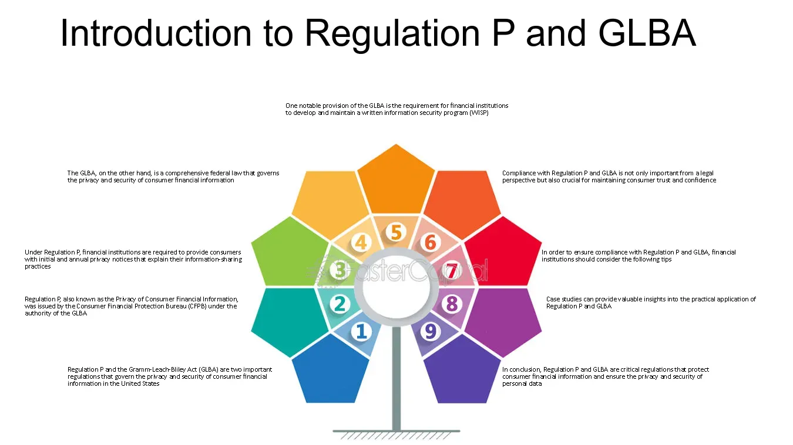

## Table of Contents

## What is Regulation P?

Regulation P is a rule set by the U.S. government to protect people's private financial information. It applies to banks and other financial companies. The rule says that these companies must tell their customers how they use and share their personal information. They also need to give customers a chance to stop, or "opt out," of some sharing of their information.

The main goal of Regulation P is to make sure that people's financial details stay safe and private. It was created because many people were worried about their information being shared without their permission. By following Regulation P, financial companies help build trust with their customers. This regulation helps people feel more secure about their financial privacy.

## Who does Regulation P apply to?

Regulation P applies to banks and other financial companies in the United States. This includes places like credit unions, insurance companies, and investment firms. These companies deal with people's money and personal information, so they need to follow the rules set by Regulation P.

The rule makes sure that these financial companies tell their customers how they use and share their personal information. It also gives customers the right to stop, or "opt out," of some sharing of their information. This helps protect people's privacy and makes sure their financial details stay safe.

## What is the main purpose of Regulation P?

The main purpose of Regulation P is to protect people's private financial information. It makes sure that banks and other financial companies in the United States tell their customers how they use and share their personal information. This helps people know what is happening with their private details.

Another important part of Regulation P is that it gives customers the right to stop, or "opt out," of some sharing of their information. This means people can choose to keep their financial details more private if they want to. By doing this, Regulation P helps build trust between financial companies and their customers, making sure people feel safe about their financial privacy.

## What are the key components of Regulation P?

Regulation P has a few main parts that help protect people's private financial information. First, it makes sure that banks and other financial companies tell their customers how they use and share their personal information. This means that when you use a bank or another financial service, they have to explain to you what they do with your details. This helps you understand where your information might be going.

Another important part of Regulation P is that it gives you the right to stop, or "opt out," of some sharing of your information. This means if you don't want your bank to share your details with other companies, you can tell them not to do it. This part of the regulation helps you keep your financial information more private if you choose to.

Overall, the key components of Regulation P work together to make sure that your private financial information stays safe. By making financial companies explain their practices and giving you the power to control how your information is shared, Regulation P helps build trust and protect your privacy.

## How does Regulation P protect consumer privacy?

Regulation P helps protect consumer privacy by making sure that banks and other financial companies tell their customers how they use and share their personal information. When you use a bank or another financial service, they have to explain to you what they do with your details. This way, you know where your information might be going and can feel more secure about it.

Another way Regulation P protects your privacy is by giving you the right to stop, or "opt out," of some sharing of your information. If you don't want your bank to share your details with other companies, you can tell them not to do it. This means you can keep your financial information more private if you choose to. By giving you this control, Regulation P helps make sure your private financial information stays safe.

## What are the requirements for financial institutions under Regulation P?

Under Regulation P, financial institutions like banks and insurance companies have to tell their customers how they use and share their personal information. This means they must give their customers a clear notice about their privacy policies. This notice explains what kind of information the company collects, how they use it, and who they might share it with. This helps customers understand what happens with their private details.

Another big requirement is that financial institutions must let customers stop, or "opt out," of some sharing of their information. If a customer does not want their information shared with other companies, they can tell the financial institution to not do it. This gives customers control over their privacy and helps them keep their financial details more private if they want to. By following these rules, financial institutions help build trust and make sure their customers feel safe about their financial privacy.

## How must financial institutions provide privacy notices to consumers?

Financial institutions must give their customers a privacy notice that explains how they use and share their personal information. This notice needs to be clear and easy to understand. They usually send it to customers when they first start doing business with them, like when someone opens a new bank account or gets a new credit card. The notice should tell customers what kind of information the company collects, how they use it, and who they might share it with.

They also need to send this privacy notice at least once a year to keep customers informed. This yearly notice reminds customers about the company's privacy practices and gives them a chance to review or change their choices about sharing their information. If the company changes its privacy policy in a big way, they must send out a new notice to all customers within a certain time to let them know about the changes.

## What are the opt-out provisions under Regulation P?

Under Regulation P, financial companies have to let customers stop, or "opt out," of some sharing of their personal information. This means if a customer does not want their bank or insurance company to share their details with other companies, they can tell the company not to do it. This helps customers keep their financial information more private if they want to.

To make this happen, financial companies need to tell customers how they can opt out. They usually include instructions in the privacy notice they send out. Customers can opt out by calling a special phone number, sending a written request, or using a website if the company offers it. This gives customers control over their privacy and helps them feel more secure about their financial details.

## How does Regulation P relate to the Gramm-Leach-Bliley Act?

Regulation P is part of the Gramm-Leach-Bliley Act (GLBA), which is a law in the United States that helps protect people's private financial information. The GLBA was passed in 1999 and it made rules for banks and other financial companies to follow. One of these rules is Regulation P, which focuses on how these companies handle and share their customers' personal information. 

Regulation P makes sure that financial companies tell their customers what they do with their private details. It also lets customers stop, or "opt out," of some sharing of their information if they want to. By being part of the GLBA, Regulation P helps make sure that the law's goal of protecting financial privacy is met. This way, people can feel safer about their personal information when they use banks and other financial services.

## What are the penalties for non-compliance with Regulation P?

If a financial company does not follow Regulation P, they can get into trouble. The government can fine them a lot of money. The fines can be different depending on how bad the mistake is and how many people it affects. The government wants to make sure that companies take people's privacy seriously, so the penalties can be big to make sure they follow the rules.

Also, if a company breaks Regulation P, it can hurt their reputation. People might not trust them anymore and take their business somewhere else. This can be bad for the company because they could lose customers and money. So, it's important for financial companies to follow Regulation P to keep their customers' information safe and keep their trust.

## How can financial institutions ensure compliance with Regulation P?

Financial institutions can ensure compliance with Regulation P by making sure they tell their customers about their privacy policies clearly and regularly. They need to send out a privacy notice when someone starts using their services, like opening a bank account, and then at least once a year after that. This notice should explain what information they collect, how they use it, and who they might share it with. By doing this, they keep their customers informed and help them understand what happens with their personal details.

They also need to make sure they let customers stop, or "opt out," of some sharing of their information. This means if a customer does not want their information shared with other companies, they should be able to tell the financial institution not to do it. The company should make it easy for customers to opt out, like by giving them a phone number to call, a website to use, or a way to send a written request. By following these steps, financial institutions can make sure they are doing what Regulation P says and keep their customers' financial information safe and private.

## What are the recent updates or amendments to Regulation P?

Regulation P has not had many big changes recently, but it's still important for banks and other financial companies to follow it carefully. The main rules about telling customers how their information is used and letting them stop some sharing of it are still the same. The last big update to Regulation P was in 2009, when it was changed to match some new rules in the Gramm-Leach-Bliley Act. These changes made sure that the privacy notices were easier to understand and that customers had more ways to stop their information from being shared.

Even though there haven't been many new changes, financial companies need to keep up with any small updates or new guidance from the government. This helps them make sure they are doing everything right to protect their customers' information. Keeping their privacy policies clear and up-to-date is a big part of following Regulation P and making sure their customers feel safe about their financial details.

## References & Further Reading

[1]: ["Privacy Regulation in Finance: A Historical Perspective"](https://www.researchgate.net/publication/379603756_DATA_PRIVACY_LAWS_AND_THEIR_IMPACT_ON_FINANCIAL_TECHNOLOGY_COMPANIES_A_REVIEW) - Scholarly article providing an overview of privacy regulation history and Regulation P's role, available on JSTOR.

[2]: ["Recent Amendments to Privacy Regulations in Finance"](https://www.usatoday.com/story/money/personalfinance/2024/10/22/cfpb-rule-protect-privacy-control-financial-data/75784042007/) - Journal article discussing changes made to Regulation P in 2015 and beyond, available through Elsevier.

[3]: [Federal Reserve Board - Detailed description of Regulation P](https://www.federalreserve.gov/bankinforeg/regpcg.htm) - Official resource for understanding the regulation's requirements and implications.

[4]: [Consumer Financial Protection Bureau (CFPB)](https://www.consumerfinance.gov/) - Source for regulatory updates and consumer rights related to financial privacy.

[5]: [National Law Review - Articles covering legal aspects and changes in financial privacy regulations](https://natlawreview.com/type-law/financial-institutions-banking) - Insightful articles on the legal implications of Regulation P.

[6]: ["Advances in Financial Machine Learning"](https://www.amazon.com/Advances-Financial-Machine-Learning-Marcos/dp/1119482089) by Marcos Lopez de Prado - A book exploring data-driven strategies relevant to the financial sector.

[7]: [Compliance Week](https://www.corporatecompliance.org/about-scce/corporate-compliance-ethics-week) - Insights and updates on compliance requirements for financial institutions.

[8]: [Thomson Reuters Cost Management Guide](https://tax.thomsonreuters.com/en/tax-accounting/practice-management-growth/cost-management) - Discussion on cost implications of compliance with privacy regulations.