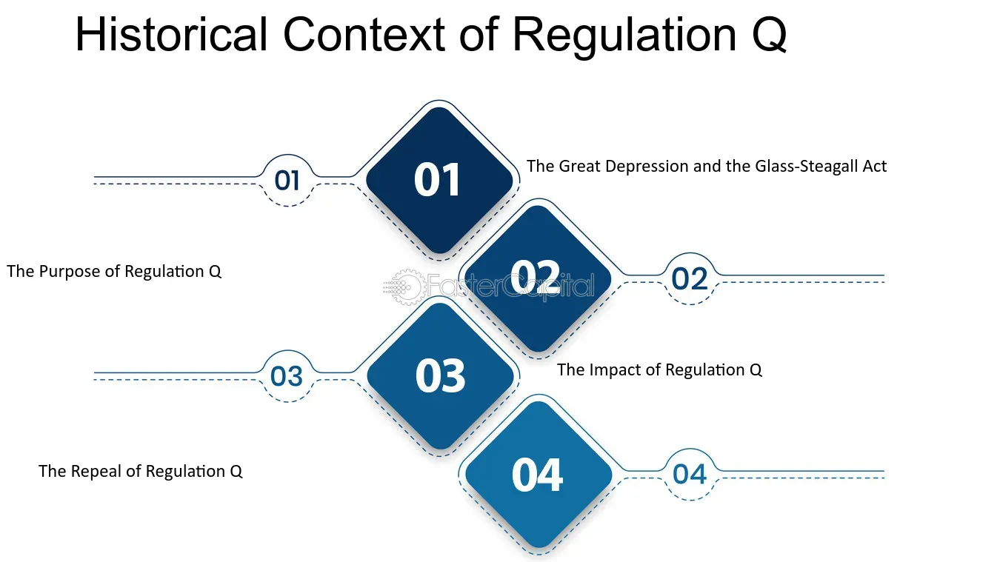

## Table of Contents

## What is Regulation Q?

Regulation Q was a rule set by the Federal Reserve in the United States. It started in 1933 and lasted until 2011. The main thing it did was stop banks from paying interest on checking accounts. This was to help control how much money was in the economy and to keep people from moving their money around too much.

The rule changed a lot over the years. In the 1960s, it also set limits on how much interest banks could pay on savings accounts. This was to make sure smaller banks could compete with bigger ones. By the 1980s, these rules were seen as old-fashioned and were slowly taken away. Finally, in 2011, the rule was completely removed, and banks could pay interest on checking accounts if they wanted to.

## When was Regulation Q introduced?

Regulation Q was introduced in 1933. It was a rule made by the Federal Reserve in the United States. The main goal of this rule was to stop banks from paying interest on checking accounts. This was done to help control the amount of money in the economy and to prevent people from moving their money around too much.

Over the years, Regulation Q changed a lot. In the 1960s, it also started to set limits on how much interest banks could pay on savings accounts. This was to help smaller banks compete with bigger ones. By the 1980s, many people thought these rules were outdated, and they were slowly removed. Finally, in 2011, Regulation Q was completely taken away, and banks were allowed to pay interest on checking accounts if they wanted to.

## What was the primary purpose of Regulation Q?

Regulation Q was a rule made by the Federal Reserve in the United States in 1933. The main reason for this rule was to stop banks from paying interest on checking accounts. This was done to help control how much money was in the economy. By not allowing interest on checking accounts, the Federal Reserve wanted to keep people from moving their money around too much, which could cause problems in the economy.

Over time, Regulation Q changed. In the 1960s, it also started to set limits on how much interest banks could pay on savings accounts. This was to help smaller banks compete with bigger ones. By the 1980s, many people thought these rules were old-fashioned and not needed anymore. They were slowly removed. Finally, in 2011, Regulation Q was completely taken away, and banks were allowed to pay interest on checking accounts if they wanted to.

## How did Regulation Q affect interest rates on savings accounts?

Regulation Q, which started in 1933, had a big impact on the interest rates that banks could offer on savings accounts. In the 1960s, the rule was changed to set limits on how much interest banks could pay on savings accounts. This was done to help smaller banks compete with bigger banks. The Federal Reserve wanted to make sure that smaller banks could still attract customers even though they might not be able to offer as much interest as bigger banks.

By setting these limits, Regulation Q helped to keep interest rates on savings accounts lower than they might have been without the rule. This meant that people who saved their money in banks did not earn as much interest as they could have. Over time, as the economy changed and people's needs changed, these limits started to seem outdated. By the 1980s, the rules were slowly taken away, and in 2011, Regulation Q was completely removed, allowing banks to set their own interest rates on savings accounts.

## What were the economic conditions that led to the introduction of Regulation Q?

Regulation Q was introduced in 1933 during the Great Depression, a time when the economy was in very bad shape. Banks were failing, and people were losing their money. The government wanted to do something to help fix the economy and make it more stable. One of the problems was that people were moving their money around a lot, trying to find the best deals on interest. This made it hard for banks to plan and could make the economy even more unstable. So, the Federal Reserve came up with Regulation Q to stop banks from paying interest on checking accounts. This was supposed to help keep people from moving their money around too much.

At that time, the government was trying many different things to help the economy. They wanted to make sure that banks could stay open and that people could trust them with their money. By not allowing interest on checking accounts, the Federal Reserve hoped to make the banking system more stable. This rule was part of a bigger plan to control how much money was in the economy and to help prevent another big crash like the one that started the Great Depression.

## How did Regulation Q impact the banking industry during its enforcement?

Regulation Q had a big impact on the banking industry while it was in place. Starting in 1933, it stopped banks from paying interest on checking accounts. This meant that people who kept their money in checking accounts did not earn any interest. The rule was made to help control how much money was in the economy and to keep people from moving their money around too much. Banks had to follow these rules, which made them focus more on other services to attract customers, like offering better customer service or more convenient banking options.

In the 1960s, Regulation Q was changed to also set limits on the interest rates that banks could pay on savings accounts. This was done to help smaller banks compete with bigger banks. The rule made sure that smaller banks could still attract customers even though they might not be able to offer as much interest as bigger banks. However, these limits also meant that people who saved their money in banks did not earn as much interest as they could have. Over time, as the economy and banking needs changed, Regulation Q started to seem outdated. By the 1980s, the rules were slowly removed, and in 2011, Regulation Q was completely taken away, allowing banks to set their own interest rates on both checking and savings accounts.

## When and why was Regulation Q repealed?

Regulation Q was completely repealed in 2011. The main reason for this was that the rule had become outdated and was no longer helping the economy. Over the years, the banking industry and the needs of people had changed a lot. The rule was first made to stop banks from paying interest on checking accounts, but by the time it was repealed, it was seen as a limit that was not needed anymore.

The process of repealing Regulation Q started much earlier, in the 1980s. At that time, people started to see the rule as old-fashioned and not very helpful. Banks were finding it hard to compete with each other because of the limits on interest rates. Slowly, parts of the rule were taken away. By 2011, all of Regulation Q was gone, and banks were free to set their own interest rates on checking and savings accounts. This allowed banks to offer better deals to their customers and made the banking industry more competitive.

## What were the immediate effects of repealing Regulation Q on the banking sector?

When Regulation Q was repealed in 2011, banks were finally allowed to pay interest on checking accounts. This change made the banking industry more competitive. Banks could now offer better deals to attract customers. They started to offer different interest rates on checking accounts to try and get more people to use their services. This was good for customers because they could now earn money on their checking accounts, something they couldn't do before.

The repeal also meant that the limits on interest rates for savings accounts were gone. Banks could now set their own rates, which led to more competition among them. This competition helped customers because banks tried to offer the best rates to attract more savings. Overall, the repeal of Regulation Q made the banking sector more dynamic and responsive to what customers wanted. It helped banks offer better services and gave people more choices for where to keep their money.

## How has the absence of Regulation Q influenced modern banking practices?

Since Regulation Q was taken away in 2011, banks have been able to pay interest on checking accounts. This has made the banking industry more competitive. Banks now offer different interest rates to attract customers. People can now earn money on their checking accounts, which they couldn't do before. This change has made banking more appealing to customers because they can get better deals and earn more on their money.

The absence of Regulation Q has also affected savings accounts. Without the old rules, banks can set their own interest rates for savings accounts. This has led to more competition among banks. They try to offer the best rates to get more people to save with them. This competition is good for customers because it gives them more choices and better rates. Overall, the end of Regulation Q has made banking more flexible and customer-friendly.

## What are the arguments for and against reintroducing a regulation similar to Regulation Q?

Some people think that bringing back a rule like Regulation Q could be good for the economy. They say it could help control how much money is in the economy and stop people from moving their money around too much. This could make the banking system more stable, just like it did during the Great Depression. Also, a rule like this might help smaller banks compete with bigger banks by setting limits on interest rates. This could make sure that everyone has a fair chance in the banking world.

On the other hand, many people are against bringing back a rule like Regulation Q. They say it would make banking less competitive and limit the choices that customers have. Without rules like Regulation Q, banks can offer better interest rates on checking and savings accounts. This means customers can earn more money on their savings. People also think that the economy has changed a lot since the Great Depression, and old rules like Regulation Q might not work well today. They believe that letting banks set their own interest rates helps the economy grow and gives people more freedom to choose where to keep their money.

## How does the historical context of Regulation Q inform current financial regulations?

The history of Regulation Q shows us how rules can change over time to fit what the economy needs. When Regulation Q was made in 1933, it was during the Great Depression. The economy was in bad shape, and the government wanted to make banks more stable. They did this by stopping banks from paying interest on checking accounts. This helped keep people from moving their money around too much, which could make things worse. As time went on, the economy got better, and the rule started to seem old-fashioned. By the 1980s, people were saying it wasn't needed anymore, and it was slowly taken away. Finally, in 2011, it was completely gone, and banks could set their own interest rates.

Today, the story of Regulation Q helps us think about how to make new financial rules. It shows that rules need to change as the economy changes. Now, banks can offer interest on checking accounts, and they compete to give the best rates to customers. This makes banking better for people because they can earn more on their money. But the history of Regulation Q also reminds us that sometimes rules are needed to keep things stable. So, when making new rules, we need to think about both helping the economy grow and keeping it safe.

## What lessons can policymakers learn from the implementation and repeal of Regulation Q?

Policymakers can learn that rules need to change with the economy. Regulation Q was made during the Great Depression to help make banks more stable. It stopped banks from paying interest on checking accounts so people wouldn't move their money around too much. But as time went on, the economy got better and the rule started to seem old-fashioned. By the 1980s, people were saying it wasn't needed anymore. This shows that rules made for one time might not work well later on. Policymakers need to keep an eye on how the economy is doing and be ready to change rules if they stop helping.

Another lesson is that rules can affect how competitive banks are. When Regulation Q was taken away in 2011, banks could start paying interest on checking accounts. This made them compete more to offer the best rates to customers. People liked this because they could earn more on their money. But the history of Regulation Q also shows that too much competition can be bad if it makes the economy unstable. So, policymakers need to find a balance. They should make rules that help the economy grow but also keep it safe. This means always checking how rules are working and being ready to make changes if needed.

## References & Further Reading

[1]: Gilbert, R. A. (1986). ["Requiem for Regulation Q: What It Did and Why It Passed Away"](https://www.mendeley.com/catalogue/b192c5eb-9617-3889-ab7f-80e41032b83d/). Federal Reserve Bank of St. Louis Review, 68(2), 22-37.

[2]: Gorton, G. (2010). ["Slapped by the Invisible Hand: The Panic of 2007."](https://www.atlantafed.org/-/media/Documents/news/conferences/2009/financial-markets-conference/gorton.pdf) Oxford University Press.

[3]: Mishkin, F. S. (1991). ["Asymmetric Information and Financial Crises: A Historical Perspective."](https://www.nber.org/papers/w3400) National Bureau of Economic Research Working Paper No. 3400.

[4]: White, E. N. (1991). ["The S&L Debacle: Public Policy Lessons for Bank and Thrift Regulation."](https://archive.org/details/sldebacle00lawr_1) Oxford University Press.

[5]: Bech, M. L., & Keister, T. (2017). ["Liquidity Regulation and the Implementation of Monetary Policy."](https://www.sciencedirect.com/science/article/pii/S0304393217300910) Journal of Monetary Economics, 92(C), 64-77.

[6]: Zigrand, J.-P. (2014). ["High-Frequency Trading: Implications for Markets and Investors."](http://igd-smp.lu/wp-content/uploads/2015/01/CV_Zigrand_May_2014.pdf) CFA Institute Research Foundation.

[7]: Johnson, H., & Kwak, J. (2010). ["13 Bankers: The Wall Street Takeover and the Next Financial Meltdown."](https://www.emerald.com/insight/content/doi/10.1108/17422041111149543/full/html) Pantheon Books.