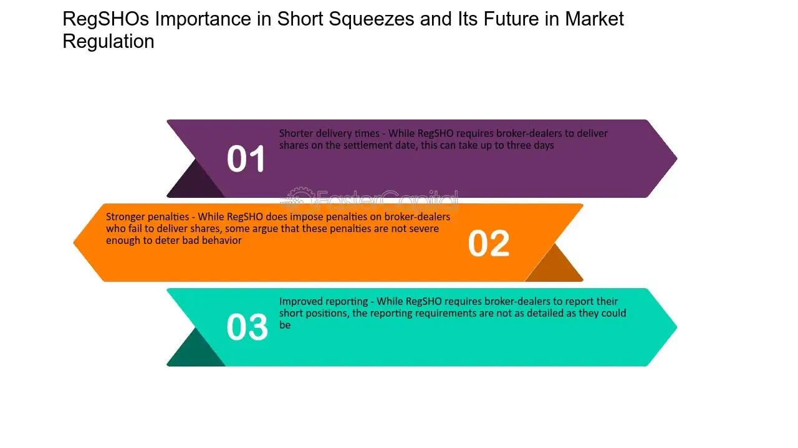

The financial markets operate within a framework of complexity, where numerous rules and regulations are essential to ensure stability and transparency. These rules not only safeguard the integrity of market activities but also protect investors by promoting fair trading practices. Among the significant regulatory measures is Regulation SHO, introduced by the U.S. Securities and Exchange Commission (SEC) in 2005. This particular regulation primarily addresses short selling practices in the United States' financial markets.

The implementation of Regulation SHO reflects the SEC's focused efforts to address potential issues in short selling, such as naked short selling, where sellers may engage in sales without confirming the availability of shares to borrow. By instituting more structured short selling processes, Regulation SHO plays a critical role in fostering market integrity and aims to mitigate risks associated with market manipulation.



This article will explore the various facets of Regulation SHO, analyzing its substantial impact on short selling practices, market integrity, and the role of algorithmic trading. Additionally, it will delve into how financial technology assists market participants in adhering to these regulations, facilitating compliance and enhancing overall market stability. The essential objective of this examination is to offer insights into how Regulation SHO influences the behavior and strategies of market participants, contributing to a more transparent and equitable financial market environment.

## Table of Contents

## What Is Regulation SHO?

Regulation SHO is a set of rules formulated by the U.S. Securities and Exchange Commission (SEC) in 2005 to regulate short sale activities within the U.S. financial markets. The primary focus of this regulation is to counter the challenges associated with naked short selling—a practice where investors sell shares without actually borrowing them first—and to ensure that short sellers adhere to their delivery commitments. This framework is pivotal in maintaining market stability and ensuring transparency.

A cornerstone of Regulation SHO is the 'locate' requirement. Before executing a short sale, brokers are mandated to reasonably ensure that the securities can be borrowed. This stipulation helps to curb naked short selling by mandating that brokers verify the availability of the securities intended for short sale to meet the eventual delivery.

Complementing the locate requirement is the 'close-out' requirement. This provision specifically targets settlement failures that can disrupt market equilibrium. The close-out requirement imposes stringent timelines for the delivery of 'threshold securities'—those securities that have a significant number of recorded failures to deliver. By enforcing strict delivery deadlines, the regulation seeks to rectify and reduce prolonged settlement failures, enhancing market reliability and reducing the potential for manipulative behaviors.

Overall, Regulation SHO aims to foster a transparent and equitable trading environment, shielding the market from excess [volatility](/wiki/volatility-trading-strategies) and promoting investor confidence.

## Key Provisions of Regulation SHO

Regulation SHO was introduced to enhance the accountability and efficiency of short selling in U.S. financial markets. One of its cornerstone provisions is the 'locate' requirement, which seeks to eliminate the practice of naked short selling. This stipulation obliges brokers to ensure that shares can be borrowed before executing a short sale. By making sure that the appropriate shares are available for borrowing, the regulation addresses the risk of selling shares that cannot ultimately be delivered. This provision aims to create a more stable and transparent trading environment.

The 'close-out' requirement complements the locate mandate by requiring brokers to swiftly rectify settlement failures. In instances where a delivery is not fulfilled, brokers are mandated to close out positions by buying securities of like kind and quantity. This prompt action is designed to reduce the number of outstanding unsettled trades, thereby minimizing market disruptions.

Particularly noteworthy are threshold securities—those that frequently experience settlement failures. Regulation SHO mandates rigorous monitoring of these securities to prevent persistent failures from disrupting market operations. The SEC requires daily publication of threshold securities lists to promote transparency and accountability, helping market participants identify potentially problematic securities.

Regulation SHO has been refined through amendments like Rule 201, which introduces restrictions intended to curb potential market manipulation through short selling. Rule 201, also known as the Alternative Uptick Rule, is activated when a security's price plummets by 10% or more from the previous day's close. Once triggered, this rule restricts further short selling, allowing only sales at a price above the current national best bid. This provision is tailored to mitigate acceleration in price declines, offering an additional layer of market protection.

These provisions collectively ensure that short selling activities do not undermine market integrity or investor confidence. By enforcing these rules, Regulation SHO plays a pivotal role in fostering equitable trading environments.

## Impact on Short Sellers and Market Dynamics

Regulation SHO has significantly reshaped the landscape of short selling, emphasizing transparency and compliance in the U.S. financial markets. Central to this regulation is the goal of fostering market integrity and stability. Short sellers are now required to navigate a framework that prioritizes these principles, making informed decisions to avoid potential penalties. This shift has led to a profound change in short selling strategies.

One notable impact of Regulation SHO is its role in mitigating market manipulation risks. By instituting rigorous requirements like the 'locate' and 'close-out' rules, the regulation aims to prevent practices such as naked short selling, where sellers short a stock without having borrowed it first. This creates a fairer trading environment by ensuring market participants adhere to consistent standards.

The regulation also ensures equitable competition among investors. By addressing settlement failures and monitoring threshold securities, Regulation SHO provides greater transparency, which is vital for investor confidence. When investors feel assured that the market operates under strict regulatory oversight, market stability is generally enhanced. This confidence in turn supports a more vibrant trading environment, where the actions of one participant are less likely to unduly influence market movements.

As a result, market dynamics have evolved under the influence of Regulation SHO. Investors and fund managers have adapted their strategies to align with these regulatory changes. For instance, those engaged in short selling must now incorporate considerations of regulatory compliance into their decision-making processes, balancing potential gains against the risk of falling foul of the established rules.

Additionally, the regulation's emphasis on compliance has spurred innovations in financial technology. Automated systems and algorithms are being developed to ensure adherence to the locate and close-out requirements effectively. These technological advancements further reflect the dynamic nature of the financial markets, where regulation and innovation continue to interact closely.

Overall, Regulation SHO's impact on short sellers and market dynamics has been profound, promoting fairness and competition, and instilling a regulatory framework that supports the integrity of the financial markets.

## Role of Algorithmic Trading in Compliance

Algorithmic trading has significantly transformed the landscape of financial markets, offering unparalleled speed and efficiency in executing trades. The integration of algorithms into trading practices necessitates careful alignment with regulatory frameworks such as Regulation SHO, particularly in complying with the 'locate' and 'close-out' requirements.

Regulation SHO mandates that trading systems ensure all short sales have borrowed or available securities, preventing naked short selling. Algorithms must incorporate functionality to verify this availability, thereby ensuring compliance. This can be achieved by integrating real-time access to securities lending data into algorithmic models. For example, before an algorithm executes a short sale, it can query a database of available securities available for borrowing, only proceeding if the security is available. This approach aligns with the locate requirement, ensuring that all trades adhere to the regulation's standards.

Moreover, automated trading systems play a crucial role in managing threshold securities. These are securities that have experienced significant settlement failures and require particular attention under Regulation SHO. Algorithms can be designed to monitor daily published lists of threshold securities. This functionality ensures that trades involving these securities are subject to heightened scrutiny, reducing the risk of compliance breaches due to settlement failure.

```python
def check_security_availability(security_id, available_securities):
    """ Verifies if a security is available for borrowing before a short sale."""
    return security_id in available_securities

def monitor_threshold_securities(trade_security_id, threshold_list):
    """ Checks if a traded security is on the current threshold list."""
    return trade_security_id in threshold_list

# Example usage
available_securities = {'AAPL', 'TSLA', 'AMZN'}
threshold_list = {'GME', 'AMC'}
trade_security_id = 'AMC'

if check_security_availability(trade_security_id, available_securities):
    print("Security available for short sale.")
else:
    print("Security not available for borrowing, cannot proceed with short sale.")

if monitor_threshold_securities(trade_security_id, threshold_list):
    print("Trade involves a threshold security; apply additional compliance checks.")
```

Beyond these technical adjustments, the interaction between technology and regulation requires constant adaptation to an ever-changing market. Algorithm developers must continuously update their systems to accommodate new regulatory changes and ensure ongoing compliance. This agile approach ensures that [algorithmic trading](/wiki/algorithmic-trading) strategies remain robust against regulatory scrutiny, safeguarding the integrity of financial markets and fostering continued investor confidence.

Overall, the collaboration between advanced trading technologies and robust regulatory frameworks like Regulation SHO ensures that market integrity is upheld while maximizing efficiency in trading activities.

## Challenges and Future Directions

Adapting to Regulation SHO presents significant challenges for hedge funds, brokers, and algorithm developers who must align their operations with evolving regulatory requirements. Hedge funds often engage in complex trading strategies that rely on short selling, making it essential to integrate systems that ensure compliance without compromising trading efficiency. Brokers face similar challenges, as they are responsible for the accurate identification and documentation of securities available for short sale, known as the "locate" requirement. Failure to comply can result in severe penalties, necessitating robust monitoring systems.

Regulators, including the U.S. Securities and Exchange Commission (SEC), continuously update and refine rules to address emerging challenges in the fast-paced, ever-evolving financial market landscape. This includes monitoring market manipulation, ensuring stability, and safeguarding investor interests. As technology and market conditions change, rules must adapt to mitigate new risks without stifling innovation.

The application of Artificial Intelligence (AI) and [machine learning](/wiki/machine-learning) is increasingly being recognized as a potential avenue for enhanced compliance and monitoring. These technologies can process large datasets efficiently, identifying patterns indicative of non-compliance or market manipulation. By integrating AI tools, market participants can better anticipate regulatory changes and adapt their practices accordingly.

For instance, machine learning algorithms can be designed to automatically detect irregularities in trade executions or settlements that may contravene Regulation SHO requirements. Python, a popular programming language for data analysis, can be used to implement such algorithms. Below is a basic example of a Python script that could be employed to monitor transaction patterns:

```python
import pandas as pd
from sklearn.ensemble import RandomForestClassifier

# Sample data of transactions
data = pd.read_csv('transactions.csv')

# Features include transaction amount, time, and type
features = data[['amount', 'time', 'type']]
labels = data['compliant']

# Train a Random Forest model
model = RandomForestClassifier()
model.fit(features, labels)

# Predict potential non-compliant transactions
predictions = model.predict(features)
non_compliant_transactions = data[predictions == 0]
```

This script trains a Random Forest Classifier to predict compliance based on historical transaction data. It provides a foundation for more complex models to enhance regulatory adherence and operational efficiency.

Proactive engagement between regulators and market participants is imperative to refine these regulations continuously. Regular dialogue can help identify emerging issues early, facilitating timely and effective regulatory adjustments. This collaborative approach ensures that regulations remain relevant and effective in promoting market integrity.

The impact of Regulation SHO on market [liquidity](/wiki/liquidity-risk-premium), transparency, and volatility remains a critical area of study. While the regulation aims to prevent manipulation and promote fair trading practices, it can also introduce constraints that affect liquidity and market behavior. Ongoing analysis can provide insights into these dynamics, helping to balance regulatory objectives with the need for vibrant, functioning markets.

## Conclusion

Regulation SHO plays a vital role in maintaining the integrity and fairness of the U.S. financial markets. By establishing comprehensive rules for short selling, it provides a framework designed to protect against market manipulation and foster transparency. The provisions, notably the 'locate' and 'close-out' requirements, significantly influence the strategies employed by short sellers, ensuring that trading practices are conducted within a structured and equitable framework. This regulatory oversight not only curbs malpractice but also strengthens market dynamics, supporting a level playing field for all participants.

As financial technology advances, the landscape of compliance with securities regulations is becoming increasingly dynamic. The adaptation of algorithmic trading to meet regulatory standards exemplifies the ongoing efforts required to maintain adherence to Regulation SHO. This adaptation necessitates a continuous evolution of trading algorithms to align with the locate and close-out mandates. Moreover, the use of advanced technologies such as [artificial intelligence](/wiki/ai-artificial-intelligence) and machine learning may further enhance compliance efficiencies and effectiveness, making real-time monitoring and adjustment more feasible.

A well-regulated market is critical in promoting stability and confidence among investors, which consequently ensures equitable trading conditions. Regulation SHO's systematic approach in supervising short selling activities contributes to reducing market discrepancies and enhancing fairness. This is central to sustaining investor trust and participation in the financial markets.

The ongoing dialogue between regulators and market participants is essential for refining and improving the regulatory framework established by Regulation SHO. Such engagements are crucial for the regulation's effectiveness and adaptability, positioning it to address new challenges and complexities as they arise in the evolving financial landscape. This collaboration will likely result in more robust regulatory mechanisms that can keep pace with market innovations and developments, thus continuing to secure the role of Regulation SHO in maintaining market integrity.

## References & Further Reading

[1]: Securities and Exchange Commission. (2004). ["Regulation SHO."](https://www.sec.gov/spotlight/shopilot.htm) U.S. Securities and Exchange Commission.

[2]: Kamphuis, J., & Meijer, R. (2006). ["Regulation SHO and the Effects on Market Liquidity."](https://psycnet.apa.org/journals/emo/6/4/543/) Radboud University Nijmegen.

[3]: Asquith, P., Pathak, P. A., & Ritter, J. A. (2005). ["Short Interest, Institutional Ownership, and Stock Returns."](https://www.sciencedirect.com/science/article/pii/S0304405X05001170) The Review of Financial Studies, 18(2), 725-759.

[4]: Diether, K. B., Lee, K.-H., & Werner, I. M. (2009). ["Short-sale Strategies and Return Predictability."](http://diether.org/papers/short_strategies.pdf) The Review of Financial Studies, 22(2), 575-607.

[5]: Duffie, D., Garleanu, N., & Pedersen, L. H. (2002). ["Securities Lending, Shorting, and Pricing."](https://www.sciencedirect.com/science/article/pii/S0304405X0200226X) Journal of Financial Economics, 66(2-3), 307-339.