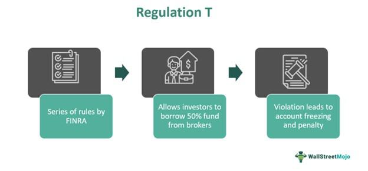

## Table of Contents

## What is Regulation T?

Regulation T, often called Reg T, is a rule set by the Federal Reserve in the United States. It controls how much money people and firms need to put down when they buy stocks or other securities on margin. Margin means borrowing money from a broker to buy more stocks than you could with your own money. Reg T says that you must pay at least 50% of the total cost of the stocks yourself. The other 50% can be borrowed from the broker.

This rule helps keep the stock market stable. It stops people from borrowing too much money to buy stocks, which can lead to big losses if the stock prices fall. By making sure people have enough of their own money in the game, Reg T helps prevent risky behavior that could harm the whole market. It's important for keeping things fair and safe for everyone involved in trading.

## Who does Regulation T apply to?

Regulation T applies to people and companies that want to buy stocks or other securities on margin. Margin means borrowing money from a broker to buy more stocks than you could with just your own money. So, if you want to use margin to buy stocks, Regulation T says you need to put down at least half of the money yourself. The other half can be borrowed from the broker.

This rule is important for everyone who trades stocks in the United States. It includes individual investors, big companies, and even professional traders. By making sure everyone follows this rule, Regulation T helps keep the stock market stable and fair for everyone. It stops people from taking too many risks with borrowed money, which can protect the market from big problems.

## What are the main purposes of Regulation T?

The main purpose of Regulation T is to keep the stock market stable. It does this by making sure that people and companies don't borrow too much money to buy stocks. When you want to buy stocks on margin, which means borrowing money from a broker, Regulation T says you need to pay at least half of the cost yourself. This rule helps stop people from taking big risks with borrowed money, which could cause big problems in the market if stock prices fall.

Another purpose of Regulation T is to make the stock market fair for everyone. By setting a rule that everyone has to follow, it makes sure that no one can get an unfair advantage by borrowing too much money. This helps keep the playing field level for all investors, whether they are individuals, big companies, or professional traders. By doing this, Regulation T helps protect everyone who trades in the stock market.

## How does Regulation T affect margin accounts?

Regulation T directly affects margin accounts by setting a rule on how much money you need to put down when you buy stocks on margin. Margin means borrowing money from your broker to buy more stocks than you could with just your own money. Regulation T says that you must pay at least 50% of the total cost of the stocks yourself. The other 50% can be borrowed from the broker. This rule makes sure that you don't borrow too much money, which can be risky if the stock prices go down.

By setting this rule, Regulation T helps keep the stock market stable. If everyone could borrow as much money as they wanted, it could lead to big problems if stock prices fall. By making sure you have enough of your own money in the game, Regulation T helps prevent risky behavior that could harm the whole market. This rule applies to everyone who uses a margin account, whether you're an individual investor, a big company, or a professional trader. It helps make the market fair and safe for everyone involved.

## What is the initial margin requirement under Regulation T?

The initial margin requirement under Regulation T is the amount of money you need to put down when you want to buy stocks on margin. Margin means borrowing money from a broker to buy more stocks than you could with just your own money. Regulation T says that you must pay at least 50% of the total cost of the stocks yourself. This means if you want to buy $10,000 worth of stocks, you need to come up with $5,000, and you can borrow the other $5,000 from your broker.

This rule is important because it helps keep the stock market stable. If you could borrow as much money as you wanted, it would be very risky. If stock prices fall, you could lose a lot of money that you borrowed. By making sure you have at least 50% of your own money in the game, Regulation T helps prevent risky behavior that could harm the whole market. This rule applies to everyone who wants to use a margin account, making the market fair and safe for all investors.

## What is the maintenance margin requirement and how does it differ from the initial margin?

The maintenance margin requirement is the minimum amount of money you need to keep in your margin account after you buy stocks on margin. It's like a safety net to make sure you don't lose too much money if the stock prices go down. Unlike the initial margin, which is the amount you need to put down when you first buy the stocks, the maintenance margin is about keeping enough money in your account as the stock prices change. The maintenance margin is usually set at around 25% of the total value of the stocks you bought, but this can vary depending on the rules of your broker.

The main difference between the initial margin and the maintenance margin is when they come into play. The initial margin is what you need to pay when you first buy the stocks on margin. Regulation T says this must be at least 50% of the total cost of the stocks. On the other hand, the maintenance margin is what you need to keep in your account after you've bought the stocks. If the value of your stocks goes down and your account falls below the maintenance margin, you'll get a margin call from your broker, asking you to add more money to your account to meet the maintenance margin requirement.

## Can you provide an example of how Regulation T impacts a stock purchase on margin?

Imagine you want to buy $10,000 worth of stocks on margin. Regulation T says you need to pay at least half of that amount, which is $5,000, out of your own pocket. The other $5,000 you can borrow from your broker. So, you put down $5,000 and borrow $5,000 to buy the stocks. This is the initial margin requirement set by Regulation T, and it helps make sure you don't borrow too much money, which can be risky.

After you buy the stocks, you need to keep an eye on the maintenance margin. Let's say the maintenance margin requirement is 25% of the total value of the stocks, which would be $2,500 for your $10,000 worth of stocks. If the stock prices go down and the value of your stocks drops to $8,000, your equity in the account (the value of the stocks minus what you owe the broker) would be $3,000. Since $3,000 is more than the $2,000 maintenance margin required for an $8,000 stock value, you're okay. But if the stock prices keep falling and your equity goes below the maintenance margin, you'll get a margin call from your broker, asking you to add more money to your account to meet the maintenance margin requirement.

## How do Regulation T requirements change during periods of high market volatility?

During times when the stock market is going up and down a lot, the Federal Reserve might change the rules of Regulation T to help keep things stable. They could make the initial margin requirement higher than the usual 50%. This means you would need to put down more of your own money when you buy stocks on margin. The idea is to make sure people don't borrow too much money and take big risks that could cause problems if stock prices suddenly drop.

The maintenance margin requirement might also change during these times. If the market is very volatile, the Federal Reserve or your broker might increase the maintenance margin to make sure you keep more money in your account. This helps protect you and the market from big losses if stock prices fall a lot. By making these changes, the goal is to keep the market fair and safe for everyone, even when things are unpredictable.

## What are the penalties for non-compliance with Regulation T?

If you don't follow Regulation T, you can get in big trouble. The Federal Reserve can fine you a lot of money. They can also stop you from trading stocks for a while. This is to make sure everyone plays by the rules and keeps the market safe and fair.

Brokers also have to follow Regulation T. If they don't, they can get fined too. They might even lose their license to work as a broker. This makes sure that brokers help keep the market stable and don't let people borrow too much money to buy stocks.

## How does Regulation T interact with other financial regulations like Regulation U and Regulation X?

Regulation T works together with other rules like Regulation U and Regulation X to keep the stock market safe and fair. Regulation U is about how much money banks can lend to people to buy stocks. It says banks can't lend more than a certain amount, which helps stop people from borrowing too much money. Regulation T and Regulation U both aim to control how much people can borrow to buy stocks, but Regulation T focuses on what you need to put down when you buy stocks on margin, while Regulation U is about the banks' side of things.

Regulation X is another rule that works with Regulation T. It stops people from borrowing money to buy stocks if they live outside the United States. This rule helps make sure that people from other countries don't mess up the U.S. stock market by borrowing too much money. So, Regulation T, Regulation U, and Regulation X all work together to make sure the stock market stays stable and fair for everyone, no matter where they live or how they're trying to buy stocks.

## What historical events led to the establishment and evolution of Regulation T?

Regulation T was created after the big stock market crash in 1929. That crash caused the Great Depression, which was a really tough time for everyone. Before the crash, people could borrow a lot of money to buy stocks, and when the prices fell, they lost a lot and couldn't pay back what they borrowed. This made the whole market crash. So, the government made Regulation T to stop this from happening again. It said people need to put down at least half of their own money when buying stocks on margin, which means borrowing money from a broker.

Over the years, Regulation T has changed a bit to keep up with the market. During times when the market was going up and down a lot, like in the 1970s and during the 2008 financial crisis, the Federal Reserve sometimes made the rules stricter. They did this to make sure people weren't borrowing too much money and taking big risks. By changing the rules when needed, Regulation T has helped keep the stock market stable and fair for everyone, even during tough times.

## How can investors use Regulation T strategically to optimize their investment portfolios?

Investors can use Regulation T to their advantage by understanding how it affects their margin accounts. When buying stocks on margin, Regulation T requires them to put down at least 50% of the stock's cost. This means investors need to have enough cash or securities in their account to meet this initial margin requirement. By carefully managing their cash and knowing how much they can borrow, investors can buy more stocks than they could with just their own money. This can help them grow their portfolios faster, but it's important to be careful because using margin also increases the risk if the stock prices go down.

Another way investors can use Regulation T strategically is by keeping an eye on the maintenance margin requirement. This is the minimum amount of equity they need to keep in their margin account after buying stocks. If the stock prices fall and their equity goes below this level, they'll get a margin call and need to add more money or sell some stocks. By staying aware of their account's value and the maintenance margin, investors can plan ahead and avoid margin calls. This helps them keep their investments safe and manage their portfolios more effectively, even during times when the market is going up and down a lot.

## References & Further Reading

[1]: ["Margin Requirements for Securities Transactions"](https://www.finra.org/rules-guidance/key-topics/margin-accounts) — Electronic Code of Federal Regulations

[2]: ["Algorithmic Trading and DMA: An Introduction to Direct Access Trading Strategies"](https://www.amazon.com/Algorithmic-Trading-DMA-introduction-strategies/dp/0956399207) by Barry Johnson

[3]: ["Securities Credit by Brokers and Dealers"](https://www.ecfr.gov/current/title-12/chapter-II/subchapter-A/part-220) — Federal Reserve Regulation T Overview

[4]: ["Regulation T Limitations on Buy and Sell Transactions"](https://www.investopedia.com/terms/r/regulationt.asp) — Financial Industry Regulatory Authority (FINRA) 

[5]: Hull, J. C. (2018). ["Options, Futures, and Other Derivatives"](https://www.semanticscholar.org/paper/Options%2C-Futures%2C-and-Other-Derivatives-Hull/89bdee500c8623864fc9eb7a471546aa713acc44) — Book providing insights into derivatives and the intricacies of margin requirements.