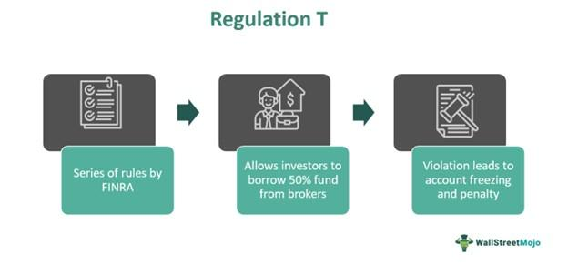

Algorithmic trading, often referred to as algo trading, utilizes sophisticated computer algorithms to automate the process of trading financial instruments. This high-frequency trading approach operates at remarkable speeds and is designed to execute trades based on a set of predetermined criteria, which can include timing, price, quantity, or any mathematical model. With the advent of technology, algo trading has substantially transformed the landscape of financial markets by increasing liquidity and efficiency but simultaneously introducing complex challenges that necessitate rigorous regulatory oversight.

In the United States, the Securities and Exchange Commission (SEC) is a pivotal regulatory body overseeing financial markets to ensure fairness, transparency, and protection for investors. A fundamental part of this regulatory framework is Regulation T, which is pivotal in maintaining control over credit and leverage in trading activities. While Regulation T originally targeted traditional trading activities, its principles now extend to affect algorithmic trading by governing aspects such as margin requirements and leverage limits.



This article explores the intricacies of Regulation T and its implications for algorithmic trading. It examines how this regulation shapes market practices and measures to protect investors in an environment increasingly dominated by automated trading platforms. Additionally, it considers the broader impact of regulatory shifts on algo trading, highlighting the importance of compliance and adaptive strategies for traders and financial institutions. By understanding these dynamic interactions, participants in financial markets can better navigate the evolving regulatory landscape influenced by algorithmic operations.

## Table of Contents

## Understanding Regulation T

Regulation T is a regulatory framework established by the Federal Reserve Board to manage and oversee margin requirements in the securities market. Its primary objective is to dictate how margin accounts are handled by brokerages, ensuring that investors do not overextend themselves through the use of excessive credit facilities. At its core, Regulation T specifies the minimum amount of equity that an investor must maintain in a margin account, thus controlling the level of leverage that can be used in trading activities.

Originally, Regulation T was designed to address margin trading in stocks and bonds, providing a standardized approach to credit extension in these areas. Despite its historical roots, the regulation has adapted to remain relevant in today's complex financial markets, which see substantial participation from [algorithmic trading](/wiki/algorithmic-trading) systems. With algorithmic trading heavily reliant on the ability to quickly enter and [exit](/wiki/exit-strategy) positions on margin, Regulation T's guidelines ensure that the risks associated with leverage are appropriately mitigated.

The essential aspect of Regulation T is its influence over the credit limit that brokerage firms can offer to their clients. By capping the credit available, Regulation T plays a crucial role in reducing systemic risk within the financial system. The regulation mandates that when purchasing securities on margin, investors typically must pay at least 50% of the purchase price with their own funds. This initial margin requirement effectively limits the proportion of borrowed funds, safeguarding both the investor and the financial institution from potential losses.

In summary, Regulation T is a vital component in the landscape of modern trading, particularly in its ability to maintain market stability and protect market participants from the inherent risks of leverage. Its impact on margin trading practices underscores the ongoing need for regulatory measures that address not only historical trading modalities but also contemporary challenges posed by advancements such as algorithmic trading.

## Role of the SEC in Algo Trading

The Securities and Exchange Commission (SEC) is tasked with a critical mandate that includes protecting investors, ensuring that markets are fair and efficient, and facilitating the formation of capital. In relation to algorithmic trading, the SEC plays a pivotal role by setting regulations designed to prevent the manipulation of markets and to maintain transparency and fairness within trading activities.

Algorithmic trading, characterized by its use of computer algorithms to make high-speed trading decisions, presents unique challenges in terms of regulation and oversight. Recognizing these challenges, the SEC has introduced a set of rules and regulations aimed at addressing potential risks associated with this form of trading. A primary area of focus for the SEC is the prevention of market manipulation, which can occur due to the rapid execution speeds and large volumes associated with algorithmic strategies. As such, regulations aim to curb practices that could lead to unfair advantages or create systemic risks in financial markets.

Furthermore, in light of advancements in trading technology, the SEC has tightened regulations around predictive analytics, which are often employed in algorithmic trading to forecast market trends and inform trading strategies. By enforcing transparency requirements and ensuring that predictive models do not exploit market vulnerabilities, the SEC seeks to reinforce equitable trading conditions.

Cybersecurity is another critical focus for the SEC in the context of algorithmic trading. The integration of sophisticated technology systems in trading platforms comes with inherent cybersecurity risks that could compromise market integrity. The SEC has responded with initiatives that require trading platforms to adopt stringent cybersecurity measures. This includes implementing robust defenses against cyber threats and safeguarding sensitive trading data from unauthorized access.

Overall, the SEC remains vigilant and adaptive to the evolving landscape of algorithmic trading. Its proactive approach in enhancing rules concerning predictive analytics and cybersecurity reflects a commitment to addressing technological advancements in trading while upholding its primary objectives of investor protection and market fairness.

## Regulation T's Impact on Algorithmic Trading

Regulation T, historically formulated to regulate margin trading, plays an indirect but crucial role in algorithmic trading by imposing restrictions on leverage. Leverage is a fundamental tool used by algorithmic traders to amplify transaction volumes. By setting margins, Regulation T effectively influences the risk exposure of trading entities engaged in high-frequency or algorithm-driven strategies.

Algorithmic trading strategies often depend on margin accounts to facilitate the processing of large numbers of transactions, maximizing potential returns while also magnifying potential losses. Regulation T limits the credit that brokerage firms can extend to traders, which in effect controls the degree of leverage that algo traders can utilize. This constraint necessitates comprehensive risk management practices to mitigate potential downsides associated with leveraged trading activities.

The integration of Regulation T with algorithmic trading strategies requires financial entities to develop robust compliance systems. These systems ensure adherence to margin requirements, which means that traders must regularly assess and adjust their leverage levels to remain within permissible limits. Failure to comply not only increases financial risk but also exposes traders to regulatory penalties.

Thus, the relationship between Regulation T and algorithmic trading highlights the necessity for stringent compliance protocols and risk management frameworks. These frameworks typically include real-time monitoring of trading positions, automatic adjustment of leverage ratios, and post-trade evaluations to identify any deviation from compliance standards. Moreover, technology-driven solutions such as [machine learning](/wiki/machine-learning) models are increasingly being employed to predict market conditions and adapt trading strategies accordingly, ensuring that leverage use aligns with regulatory requirements and operational risk appetite.

Overall, while Regulation T directly governs margin trading, its influence extends significantly into the algorithmic trading sphere, making it an essential [factor](/wiki/factor-investing) for traders to consider in their strategic planning and operational execution.

## Compliance and Risk Management in Algo Trading

Compliance with Regulation T is essential within the broader framework of risk management that algorithmic traders need to employ. Algorithmic trading, by its nature, involves high-speed and high-[volume](/wiki/volume-trading-strategy) transactions that can significantly amplify both market opportunities and risks. Given these factors, brokers must enforce robust control mechanisms to manage the complexities and potential pitfalls associated with algorithmic orders.

A key aspect of managing algorithmic trading risk involves implementing per-order checks. These checks are critical to ensuring that each order complies with predefined trading parameters and regulatory requirements. Such checks can include limits on order size, price deviation, and execution speed. By enforcing these constraints, brokers can mitigate risks such as excessive market impact and unintended execution errors.

Post-trade analysis also plays a vital role in effective risk management for algorithmic trading. This involves scrutinizing executed trades to identify irregular trading patterns or anomalies that could indicate problems such as potential manipulation or technical glitches. Post-trade analysis can encompass a range of activities, including transaction cost analysis (TCA), which evaluates the effectiveness of the trade execution process, and compliance checks to ensure adherence to Regulation T, focusing on the leverage and credit levels extended to clients.

Effective risk management frameworks often utilize technological solutions, such as machine learning algorithms, to enhance the detection of anomalous trading activities. Python, a versatile programming language, can be used to develop these solutions. For instance, algorithmic traders might employ a machine learning model like a Support Vector Machine (SVM) or a clustering algorithm to identify patterns that deviate from historical trading behavior:

```python
from sklearn.svm import OneClassSVM
import numpy as np

# Sample feature vectors for trades
trades = np.array([[0.1, 0.2], [0.2, 0.1], [0.15, 0.15], [10.0, 10.0]])  # Including an outlier

# Training the one-class SVM
clf = OneClassSVM(gamma='auto').fit(trades)

# Predicting which trades are anomalies
predictions = clf.predict(trades)
```

In this example, the algorithm learns what constitutes "normal" trading behavior from historical data, allowing it to flag anomalies that may require further investigation.

In conclusion, effective compliance with Regulation T and an integrated risk management approach are crucial for participants in algorithmic trading, ensuring both the mitigation of potential risks and the promotion of market stability.

## Future Trends and Regulatory Developments

The financial landscape is in constant flux, driven by technological advancements that necessitate ongoing regulatory updates. This constant evolution is particularly evident in the domain of algorithmic trading, where the Securities and Exchange Commission (SEC) has intensified its focus on implementing safeguards to bolster market integrity and investor protection.

Recent trends indicate that the SEC is prioritizing stronger oversight of algorithms and cybersecurity. For instance, the commission's efforts to refine regulations around predictive analytics underscore a broader commitment to ensure algorithms do not facilitate market manipulation or unfair advantages. This is a significant shift, as algorithmic trading strategies rely heavily on predictive models that can potentially disrupt market equilibrium if not properly monitored. In this context, the SEC's deeper scrutiny aims to enforce transparency and accountability among market participants.

Additionally, cybersecurity has emerged as a critical focal point for the SEC. With algorithmic trading platforms increasingly targeted by cyber threats, maintaining robust cybersecurity measures is indispensable. Regulatory initiatives are directing firms to adopt comprehensive cyber defense strategies that anticipate and mitigate such threats, which are crucial for maintaining the reliability of trading platforms and protecting sensitive financial data.

Traders and financial institutions must remain alert and responsive to these evolving regulatory demands to maintain compliance and market competitiveness. This involves not only adjusting to new regulations but also fostering adaptive strategies that preemptively address regulatory changes. For trading entities, this means integrating advanced compliance technologies and frameworks to guarantee adherence to regulations while optimizing trading efficiency.

A forward-looking approach requires regular updates to risk management systems and investment in technology that supports compliance automation. Algorithmic trading firms are increasingly leveraging [artificial intelligence](/wiki/ai-artificial-intelligence) and machine learning tools to enhance their regulatory compliance capabilities. By doing so, they can swiftly adapt to new rules and anticipate future regulatory landscapes, ensuring both the safeguarding of their operations and the continuity of their competitive advantages.

In conclusion, the trajectory of financial regulation is characterized by a steady push towards incorporating technological advancements within its framework. The SEC's sustained efforts to regulate algorithmic trading practices exemplify a drive towards creating a more transparent and secure trading environment. Traders and institutions that prioritize continuous adaptation and vigilant compliance will be best positioned to thrive in this dynamic fiscal ecosystem.

## Conclusion

Regulation T, established by the Federal Reserve Board, was initially designed to govern margin requirements for traditional securities trading. Despite being historic in its origin, this regulation remains a cornerstone in the current trading ecosystem, significantly impacted by the rise of algorithmic trading. In a landscape increasingly driven by high-frequency transactions and sophisticated algorithms, the limitations imposed by Regulation T on margin borrowing and leverage continue to be critical. These rules help mitigate the systemic risks that can arise from excessive leveraging within algorithmic strategies, thereby promoting stability and investor protection.

The Securities and Exchange Commission (SEC) plays a pivotal role in adapting regulatory frameworks to technological advancements in trading. The SEC’s commitment to leveraging technology is evident in its regulatory measures aimed at ensuring transparency and fairness in trading activities. Its initiatives, which address predictive analytics and cybersecurity, demonstrate a proactive stance that not only safeguards investor interests but also upholds the integrity of financial markets. 

In this complex environment, a deep understanding of Regulation T and associated regulations is indispensable for trading entities. For firms engaged in algorithmic trading, compliance is not merely a legal obligation but a strategic imperative to manage risks and maintain competitiveness. Financial institutions and traders must continuously monitor regulatory developments and adapt accordingly to navigate the evolving algorithmic trading landscape effectively. By doing so, they can ensure adherence to regulatory requirements while leveraging technological innovations to optimize trading performance.

## References & Further Reading

[1]: ["Margin Requirements for Stocks Bought on Margin"](https://www.schwab.com/learn/story/basics-buying-on-margin-whats-margin-trading) - Federal Reserve Board: Regulation T

[2]: Hasbrouck, J. (2003). ["Intraday Price Formation in U.S. Equity Markets."](https://onlinelibrary.wiley.com/doi/10.1046/j.1540-6261.2003.00609.x) The Journal of Finance, 58(6), 2375-2406.

[3]: Gomber, P., Arndt, B., Lutat, M., & Uhle, T. (2011). ["High-Frequency Trading."](https://papers.ssrn.com/sol3/papers.cfm?abstract_id=1858626) Business & Information Systems Engineering, 3(2), 103-106.

[4]: Aldridge, I. (2013). ["High-Frequency Trading: A Practical Guide to Algorithmic Strategies and Trading Systems."](https://www.wiley.com/en-us/High+Frequency+Trading%3A+A+Practical+Guide+to+Algorithmic+Strategies+and+Trading+Systems%2C+2nd+Edition-p-9781118343500) Wiley Finance.

[5]: Lewis, M. (2014). ["Flash Boys: A Wall Street Revolt."](https://en.wikipedia.org/wiki/Flash_Boys) W.W. Norton & Company.

[6]: U.S. Securities and Exchange Commission. ["Regulation SCI (Systems Compliance and Integrity)."](https://www.sec.gov/files/rules/final/2014/34-73639.pdf)