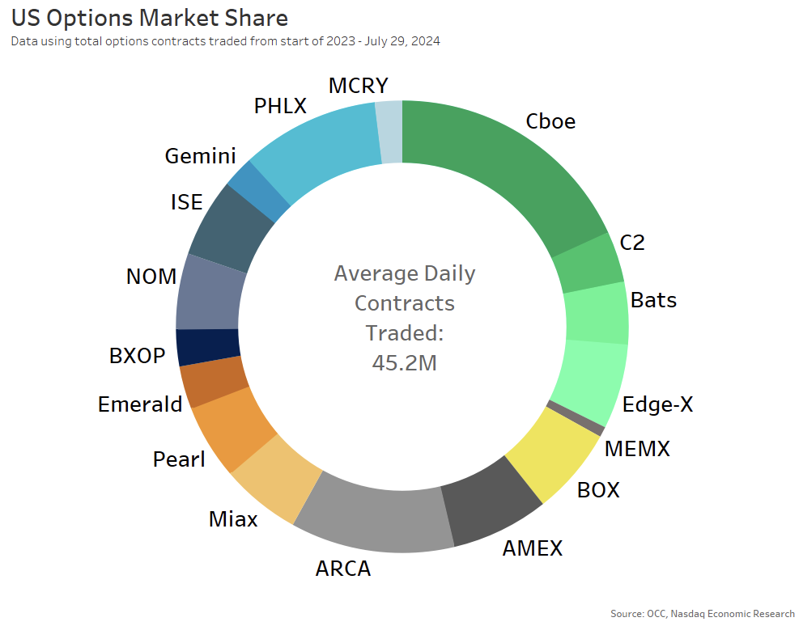

## Table of Contents

## What are options in the context of the US financial market?

Options are financial products that give you the right, but not the obligation, to buy or sell an asset at a certain price before a certain date. In the US financial market, these assets are often stocks, but they can also be other things like commodities or currencies. When you buy an option, you're buying a contract. This contract gives you the chance to make a move on the asset without having to own it right away.

There are two main types of options: calls and puts. A call option lets you buy the asset at the set price, while a put option lets you sell it at that price. People use options for different reasons. Some use them to bet on whether the price of an asset will go up or down. Others use them to protect their investments from big price swings. Options can be complex, but they're a key part of how the US financial market works.

## Who regulates the options market in the United States?

The options market in the United States is mainly regulated by the Securities and Exchange Commission (SEC) and the Commodity Futures Trading Commission (CFTC). The SEC oversees options that are based on stocks and other securities, making sure that trading is fair and that investors are protected. They set rules about how options can be traded and make sure that everyone follows those rules.

The CFTC, on the other hand, focuses on options that are based on commodities, like oil or wheat. They work to prevent fraud and make sure that the markets for these options run smoothly. Both the SEC and CFTC work together to keep the options market safe and reliable for everyone who uses it.

## What is the role of the Securities and Exchange Commission (SEC) in options market regulation?

The Securities and Exchange Commission (SEC) plays a big role in making sure the options market in the United States works fairly and safely. They focus on options that are tied to stocks and other securities. The SEC's main job is to protect investors by setting rules that everyone in the market must follow. These rules help prevent fraud and other bad behavior, so people can trust that the market is honest.

The SEC also makes sure that the options market runs smoothly. They watch over how options are traded and make sure that the information about options is clear and easy to understand. By doing this, the SEC helps keep the market stable and helps investors make smart choices. Overall, the SEC's work helps make the options market a safer place for everyone involved.

## How does the Financial Industry Regulatory Authority (FINRA) contribute to options market oversight?

The Financial Industry Regulatory Authority (FINRA) helps keep an eye on the options market to make sure everything is done right. They work alongside the SEC to make sure that brokers and dealers who trade options follow the rules. FINRA checks that these professionals are honest and fair in their dealings. They also make sure that these firms have enough money to cover any risks they take on when trading options.

Besides checking on brokers and dealers, FINRA also educates investors about options. They provide information and tools to help people understand how options work and the risks involved. By doing this, FINRA helps investors make smarter choices and protects them from making big mistakes. Overall, FINRA plays a key role in keeping the options market safe and trustworthy for everyone.

## What are the key regulations that govern the trading of options in the US?

The main rules that control how options are traded in the US come from the Securities and Exchange Commission (SEC) and the Financial Industry Regulatory Authority (FINRA). The SEC makes sure that options tied to stocks and other securities are traded fairly. They set rules to stop fraud and make sure everyone follows the same guidelines. This helps keep the market honest and protects people who invest in options. The SEC also watches over how options are traded to make sure everything runs smoothly and that information about options is clear and easy to understand.

FINRA works with the SEC to make sure that brokers and dealers who trade options do so in an honest and fair way. They check that these professionals have enough money to cover any risks they take on when trading options. FINRA also helps educate investors about options, giving them the information and tools they need to understand how options work and the risks involved. By doing this, FINRA helps investors make better choices and keeps the options market safe and trustworthy for everyone.

## How do options exchanges in the US ensure fair trading practices?

Options exchanges in the US work hard to make sure trading is fair for everyone. They do this by setting strict rules that all traders have to follow. These rules help stop people from cheating or doing things that could hurt other traders. The exchanges also keep a close watch on all trades to make sure no one is breaking the rules. If someone does break the rules, the exchanges can punish them to keep the market fair.

Another way options exchanges ensure fair trading is by making sure everyone has the same information. They share important details about options quickly and clearly so that no one has an unfair advantage. This helps level the playing field and makes sure that all traders can make smart choices based on the same facts. By doing these things, options exchanges help keep the market honest and protect everyone who trades options.

## What are the requirements for individuals or firms to trade options in the US?

To trade options in the US, individuals need to have a brokerage account with a firm that is approved to trade options. They also need to meet certain financial and experience requirements set by the brokerage firm. This is because trading options can be risky, so firms want to make sure that people understand what they're doing. Usually, individuals need to fill out an options trading application and might need to show that they have some knowledge about options or have enough money in their account.

For firms, the requirements are a bit more complex. They need to be registered with the SEC and be members of FINRA. Firms also have to follow strict rules about how they handle options trading, including having enough money to cover any risks. They need to have systems in place to monitor trading and make sure everything is done fairly. This helps keep the market safe and trustworthy for everyone involved.

## How are options market manipulations detected and prevented?

Options market manipulations are detected and prevented through a mix of rules, technology, and oversight. The SEC and FINRA keep a close eye on trading to spot any strange behavior. They use computer programs to watch for patterns that might show someone is trying to cheat. If they see something that looks off, they can start an investigation to find out what's going on. This helps catch people who might be trying to manipulate the market and keeps things fair for everyone.

Brokers and exchanges also play a big role in stopping market manipulation. They have their own rules and systems to watch for cheating. For example, they might limit how much someone can trade or set rules about how prices can move. If someone breaks these rules, the brokers and exchanges can take action, like stopping that person from trading or reporting them to the SEC or FINRA. By working together, all these groups help make sure the options market stays honest and safe.

## What impact do regulatory changes have on options trading strategies?

Regulatory changes can have a big effect on how people trade options. When the rules change, it might make some strategies that used to work well less useful or even against the new rules. For example, if the SEC decides to limit how much someone can trade in a day, traders might have to find new ways to make their moves. This can be hard because they have to learn new strategies or change the ones they already use. It's like playing a game where the rules keep changing, and you have to keep up to stay in the game.

On the other hand, regulatory changes can also open up new chances for traders. New rules might make it easier to use certain strategies or create new ones that weren't possible before. For instance, if the rules make it easier to trade options on new types of assets, traders might find new ways to make money. But it's important for traders to keep an eye on these changes and be ready to adapt. Staying informed and being flexible can help them take advantage of new opportunities while still following the rules.

## How do regulatory bodies address technological advancements in options trading?

Regulatory bodies like the SEC and FINRA keep up with technological advancements in options trading by making new rules and updating old ones. They watch how new technology is used in trading and make sure it's fair and safe for everyone. For example, if there's a new computer program that helps traders make faster trades, the regulators will check to see if it gives some people an unfair advantage. They might then set rules to make sure everyone has a fair shot at using the new technology.

Regulators also work with technology experts to understand how new tools work and how they might affect the market. They might hold meetings or workshops to learn more about these technologies and get advice on how to handle them. This helps them stay ahead of the game and make sure that the options market stays honest and trustworthy, even as things change and new tools come along.

## What are the international implications of US options market regulations?

US options market regulations can affect how people trade options in other countries. When the US changes its rules, it can make other countries think about changing their rules too. This is because many big options markets are in the US, and what happens there can influence the whole world. For example, if the US makes new rules to stop cheating, other countries might want to do the same to keep their markets fair and safe. This can lead to more similar rules around the world, making it easier for people to trade options across borders.

Sometimes, different rules in the US and other countries can make things tricky for people who trade options internationally. If the rules are too different, it might be hard for traders to follow all of them at the same time. This can slow down trading or make it more expensive. But when countries work together and share ideas about how to make their rules better, it can help make the options market safer and more fair for everyone, no matter where they are.

## How do experts assess the effectiveness of current regulatory frameworks for the US options market?

Experts look at the effectiveness of the current regulatory frameworks for the US options market by checking if they keep the market fair and safe. They see if the rules from the SEC and FINRA are stopping cheating and making sure everyone follows the same guidelines. They also look at how well the rules help people understand options and the risks involved. If the market is running smoothly and people feel safe trading, experts might say the regulations are working well. But if there are still problems like fraud or if people are losing money because they don't understand the rules, experts might think the regulations need to be better.

Another way experts assess the effectiveness is by looking at how the regulations handle new technology. They want to see if the rules can keep up with new ways of trading options. If the regulations are flexible and can change when new tools come out, experts might think they are effective. But if the rules are too strict or don't change with technology, it might make trading harder and less fair. So, experts keep an eye on how well the rules are working and suggest changes to make the options market even better.

## References & Further Reading

[1]: McGowan, M. (2010). ["The Rise of Computerized High Frequency Trading: Use and Controversy."](https://scholarship.law.duke.edu/dltr/vol9/iss1/15/).pdf) University of Pennsylvania Journal of Business Law.

[2]: Duchin, R., & Levy, H. (2011). ["The Algorithmic Trading Arms Race – Regulatory Issues in the U.S. Options Market."](https://sites.google.com/view/randuchin) Schulich School of Business.

[3]: Lopez de Prado, M. (2018). ["Advances in Financial Machine Learning."](https://www.amazon.com/Advances-Financial-Machine-Learning-Marcos/dp/1119482089) Wiley.

[4]: Cumming, D., & Johan, S. (2013). ["The Problems with High-Frequency Trading."](https://onlinelibrary.wiley.com/doi/abs/10.1002/sej.1265) Financial Analysts Journal.

[5]: Securities and Exchange Commission (SEC). ["Algorithmic Trading Examination Risk Alert."](https://www.sec.gov/files/Algo_Trading_Report_2020.pdf)

[6]: Financial Industry Regulatory Authority (FINRA). ["Report on Algorithmic Trading."](https://www.finra.org/rules-guidance/key-topics/algorithmic-trading)

[7]: Commodity Futures Trading Commission (CFTC). ["Regulation Automated Trading (Reg AT)."](https://www.cftc.gov/sites/default/files/idc/groups/public/@newsroom/documents/file/federalregister112415.pdf)