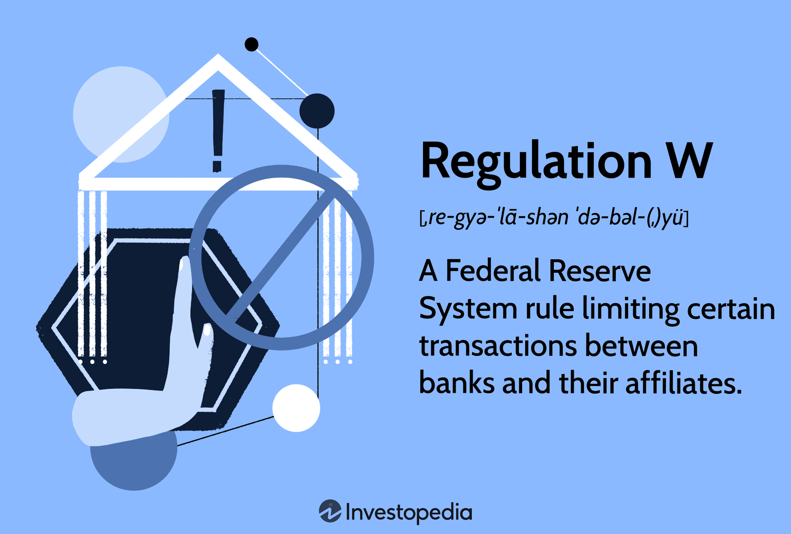

In today's complex financial ecosystem, understanding the regulatory landscape is crucial for effective financial management and strategic planning. This article explores the intricate relationship between financial transactions, banking regulations, Regulation W, and algorithmic trading, shedding light on how these elements interact in the modern financial sector.

Regulation W is a pivotal piece of legislation within the U.S. Federal Reserve System, designed to limit certain types of transactions between banks and their affiliates. The primary objective of this regulation is to prevent excess risk-taking that could jeopardize the solvency and stability of banks, ensuring the overall health of the financial system. By delineating specific transaction types and setting quantitative limits, Regulation W plays a significant role in safeguarding the stability and integrity of financial institutions.



Algorithmic trading represents another transformative force in financial markets, leveraging sophisticated computer algorithms to execute trades at high speeds and volumes. This practice introduces both opportunities and challenges, as the ability to rapidly trade can enhance market liquidity and efficiency but also exacerbate volatility or trigger systemic risks. Consequently, understanding how banking regulations, such as Regulation W, influence algorithmic trading is essential for traders and financial institutions aiming to operate both lawfully and strategically within the market.

This article provides a comprehensive overview of Regulation W, examining its implications for financial transactions and offering considerations for those engaged in algorithmic trading. By exploring these facets, readers will gain a deeper understanding of how regulatory frameworks shape financial markets and how they can effectively navigate these structures. Key insights will be offered on maintaining compliance while embracing innovations, ultimately benefiting institutional stability and market transparency.

## Table of Contents

## Understanding Financial Transactions in Banking

Financial transactions are fundamental to banking operations, encompassing the exchange, transfer, or management of money and financial assets. These transactions vary significantly, from basic activities like deposits and withdrawals to sophisticated operations involving derivative trades. The inherent complexity and potential impact on the financial system necessitate comprehensive oversight to protect consumers and uphold market stability.

Regulatory measures play a critical role in governing financial transactions, ensuring adherence to standardized protocols and guidelines. These frameworks are essential to preserving trust and integrity within the banking sector. For instance, regulations often require rigorous documentation processes, capital adequacy standards, and risk management practices to prevent misleading or risky financial activities.

The advancement of technology has dramatically influenced modern banking transactions. Emerging trends such as [algorithmic trading](/wiki/algorithmic-trading) and fintech innovations are reshaping the financial landscape. Algorithmic trading, for instance, relies on algorithms to execute trades at speeds and volumes beyond human capability. This advancement improves market efficiency but also requires significant regulatory measures to prevent disruptive effects on financial stability.

Key considerations in managing financial transactions include security, transparency, compliance, and efficiency. Security measures are imperative to protect sensitive data and financial integrity. Advanced encryption technologies and cybersecurity protocols are typical methods employed to safeguard transactions. Transparency is equally vital, allowing for clear oversight and accountability, thus preventing fraudulent activities and promoting fair trading practices.

Compliance with banking regulations not only underpins transactional security and transparency but also enhances efficiency. Adhering to regulatory guidelines ensures that financial operations are streamlined according to legal standards, reducing risks and operational costs associated with non-compliance. Moreover, efficient transaction processes are critical for customer satisfaction and overall market fluidity.

As banking operations continue to evolve, the dynamic relationship between technology, regulation, and financial transactions becomes increasingly significant. Financial institutions must adapt to the changing environment by implementing robust systems that prioritize security, transparency, and compliance, while leveraging technological advancements to optimize transaction efficiency.

## An Overview of Banking Regulations

Banking regulations are critical for fostering stability and transparency within the financial system. They are composed of principles and rules set by governmental agencies and are meticulously crafted to mitigate the risk of financial crises while safeguarding consumer interests. These regulations form the backbone of the financial system and are essential for maintaining its integrity.

Key regulatory frameworks in the United States include the Dodd-Frank Wall Street Reform and Consumer Protection Act and the Sarbanes-Oxley Act. The Dodd-Frank Act, enacted in response to the 2008 financial crisis, introduced comprehensive reforms aimed at reducing systemic risk and protecting consumers. It established the Financial Stability Oversight Council and the Consumer Financial Protection Bureau, among other entities, to oversee and regulate financial institutions and markets. The Sarbanes-Oxley Act, primarily targeting corporate governance and financial information disclosure, was introduced to address the corporate scandals of the early 2000s by enforcing stricter standards for all U.S. public company boards, management, and public accounting firms.

Moreover, significant provisions under the Federal Reserve include Regulation W, which governs transactions between banks and their affiliates to minimize risks associated with such dealings. Regulation W sets quantitative limits on certain transactions and requires banks to maintain adequate collateral for some transactions to ensure financial stability.

Regulators such as the Federal Reserve, the Federal Deposit Insurance Corporation (FDIC), and the Office of the Comptroller of the Currency (OCC) play crucial roles in enforcing these regulations. The Federal Reserve, as the central banking system of the United States, is instrumental in implementing monetary policy and regulating financial institutions. The FDIC insures deposits in banks and thrift institutions, promoting public confidence in the financial system. Meanwhile, the OCC is responsible for chartering, regulating, and supervising all national banks and federal savings associations.

Compliance with banking regulations is a continuous process that necessitates financial institutions to establish rigorous internal controls. These controls are imperative for ensuring adherence to regulatory requirements and are typically verified through regular audits. Such audits assess the financial institution's operations, ensuring that they align with the prescribed regulations and identifying potential areas of risk.

The evolution of modern banking regulations has been profoundly influenced by past financial crises. Each crisis has highlighted vulnerabilities within the financial system, prompting regulatory bodies to revise and strengthen regulatory measures. The response to these crises underscores the necessity for adaptive regulatory frameworks that can respond to the dynamic nature of global financial markets. This ongoing evolution emphasizes the importance of readiness within regulatory regimes to address emerging risks and challenges effectively.

The complexity of the current financial environment requires that regulators be vigilant and adaptive, continually assessing the adequacy of existing regulations while considering the implications of financial innovations and global economic shifts. This adaptability is crucial to maintaining the integrity and stability of the financial system, thereby safeguarding not only financial institutions but also consumers and the broader economy.

## The Role of Regulation W in Financial Transactions

Regulation W, as part of the Federal Reserve’s regulatory framework, focuses on transactions between banks and their affiliates, aiming to reduce potential risks associated with these dealings. Initially implemented to bolster financial stability, this regulation addresses the need to minimize undue financial exposures that banks can face through intricate financial practices with affiliated entities. 

One core aspect of Regulation W is its establishment of quantitative limits on covered transactions. These limits ensure that banks maintain a solvent position and prevent excessive risk transfer to insured depository institutions. By limiting the extent of transactions and demanding collateral in some cases, Regulation W helps maintain the financial integrity of both individual entities and the broader banking system. Specifically, the regulation restricts a bank’s covered transactions with any single affiliate to 10% of the bank's capital stock and surplus, and a bank's aggregate covered transactions with all affiliates to 20% of that capital stock and surplus.

Moreover, understanding Regulation W is vital for banks aiming to sustain compliance and prevent regulatory penalties, which can be both financially costly and detrimental to reputation. The regulation is instrumental in protecting the financial system from systemic risks, facilitating a robust framework within which banks operate. The scope of entities regarded as affiliates encompasses any company controlled by the same set of shareholders, ensuring a comprehensive oversight of transactions that might rearrange risk inappropriately within affiliated groups.

Under the Dodd-Frank Wall Street Reform and Consumer Protection Act, Regulation W has expanded to cover additional transaction types and incorporate more extensive definitions of what constitutes a covered transaction. This expansion reflects a response to evolving financial practices and market conditions that require adaptive regulatory measures. Banks are required to meticulously track and report these transactions, ensuring transparency and adherence to established limits and conditions.

In conclusion, Regulation W plays a crucial role in financial transactions by not only mitigating undue risk within the banking sector but also fostering a stable financial environment. Through clearly defined boundaries and requirements, it seeks to prevent the adverse effects of intra-group transactions that might elevate risk levels to unacceptable standards.

## Algorithmic Trading and Its Regulatory Implications

Algorithmic trading, also known as algo-trading, relies on computerized algorithms to execute trades with remarkable speed and precision. This technique enables market participants to capitalize on price differentials and profit from short-term fluctuations, often executing thousands of trades in milliseconds. The primary allure of algorithmic trading lies in its ability to model complex strategies and minimize human error, thereby facilitating efficient market operations.

However, the proliferation of algorithmic trading poses notable challenges for regulatory frameworks, primarily due to the associated market risks. These risks include potential market manipulation, system disruptions, and exacerbated market [volatility](/wiki/volatility-trading-strategies). Regulatory authorities thus focus on developing robust oversight mechanisms to counteract these challenges. For instance, measures are implemented to detect manipulation techniques such as spoofing and layering, where traders deceive the market about supply and demand through false orders.

Moreover, the integration of algorithmic trading within the existing regulatory architecture, including Regulation W, demands careful consideration. Regulation W, part of the Federal Reserve's Prudential Regulations, although primarily governing bank-affiliate transactions, indirectly impacts algorithmic trading by delineating permissible transaction parameters for financial institutions. This means algorithmic trades must adhere to constraints regarding transaction types and risk exposure limits, thus influencing the strategies that traders can employ.

For example, Python can be used to model simple algorithmic trading strategies that adhere to regulatory limits:

```python
import pandas as pd
import numpy as np

# Example: Simple Moving Average Crossover Strategy
def moving_average_crossover(data, short_window, long_window):
    signals = pd.DataFrame(index=data.index)
    signals['price'] = data['price']
    signals['short_mavg'] = data['price'].rolling(window=short_window, min_periods=1).mean()
    signals['long_mavg'] = data['price'].rolling(window=long_window, min_periods=1).mean()
    signals['signal'] = 0.0
    signals['signal'][short_window:] = np.where(signals['short_mavg'][short_window:] 
                                                > signals['long_mavg'][short_window:], 1.0, 0.0)
    signals['positions'] = signals['signal'].diff()
    return signals
```

Traders and financial institutions must therefore maintain an acute awareness of regulatory developments. Compliance with these regulations involves adopting stringent internal protocols to prevent any infringement and establishing real-time monitoring systems for algorithmic activities. Failure to comply can result in legal repercussions and reputational damage.

In sum, while algorithmic trading offers significant opportunities for financial gains, its integration into modern markets requires a delicate balance of innovation and regulatory compliance. Continuous advancements in both trading technologies and regulatory measures are essential to safeguarding market integrity and upholding ethical trading standards.

## Navigating Regulatory Challenges in Banking and Trading

Navigating the regulatory challenges in banking and trading is a critical concern for financial institutions operating in today's dynamic financial landscape. Effective compliance with regulatory requirements is essential for ensuring stability, transparency, and integrity within the financial system.

Financial institutions must adopt a proactive approach to compliance. This involves employing advanced technological solutions to efficiently monitor and report transactions as per regulatory standards. Technologies such as [machine learning](/wiki/machine-learning) and [artificial intelligence](/wiki/ai-artificial-intelligence) can be utilized to analyze large volumes of transaction data, identify patterns, and ensure adherence to compliance protocols. By implementing automated systems, institutions can reduce human error and enhance the speed and accuracy of their compliance processes.

Stakeholders in banking and trading must cultivate a strong culture of compliance. This encompasses providing ongoing education and training for employees to keep them informed about new and evolving regulations. A well-informed workforce is crucial for maintaining compliance and effectively addressing regulatory challenges. Training programs can cover various aspects of regulatory requirements, equipping employees with the knowledge and skills needed to adapt to changes in the regulatory environment.

Engaging in collaboration with regulatory bodies is another vital strategy for financial institutions. Regular communication with regulators can help institutions understand regulatory expectations better and ensure that their business practices align with these expectations. Open dialogue with regulatory authorities can also provide institutions with insights into potential regulatory changes, allowing them to adjust their strategies proactively and avoid costly sanctions.

Ultimately, maintaining robust compliance mechanisms benefits not only individual financial institutions but also bolsters the overall resilience and integrity of the financial system. By ensuring stringent adherence to regulations, institutions play a pivotal role in fostering trust and stability within the market. Strong compliance practices mitigate risks, enhance the reputation of financial entities, and contribute to the sound functioning of the broader financial ecosystem.

In conclusion, embracing technology, fostering a culture of compliance, and maintaining open communication with regulatory bodies are essential strategies for navigating the complex regulatory landscape in banking and trading successfully. These measures ensure that financial institutions operate lawfully and ethically while supporting the broader goals of market stability and consumer protection.

## Conclusion

The integration of advanced financial transactions, stringent regulatory frameworks, and cutting-edge trading technologies such as algorithmic trading is integral to the structure of today's financial landscape. Each component plays a distinct role in sustaining the system’s stability and efficiency.

Compliance with banking regulations, notably those like Regulation W within the U.S. Federal Reserve system, is essential for maintaining institutional and systemic stability. Such regulations are designed to safeguard against financial risks and protect consumer interests, thus ensuring a resilient and trustworthy banking environment. Financial institutions must remain consistently aware of and adhere to these legal requirements, facilitating their operations within a secure and stable financial framework.

Algorithmic trading, characterized by its use of sophisticated algorithms to execute trades at high speed, provides significant opportunities for profit by capitalizing on market efficiencies. However, these advancements come with increased regulatory oversight due to potential associated risks, such as market manipulation or excessive volatility. As such, strict compliance with relevant regulations is necessary to ensure ethical and lawful trading practices. This balance is crucial for fostering innovation without compromising market integrity.

Looking to the future, the ongoing evolution of regulations presents financial entities with the challenge and opportunity to remain adaptable and vigilant. Regulatory landscapes will continue to evolve with emerging market trends and technological advancements, necessitating a proactive approach by financial institutions. By prioritizing transparency, fairness, and stability, these institutions contribute to a robust and resilient financial system, capable of sustaining the pressures of modern financial markets.

## References & Further Reading

[1]: ["Advances in Financial Machine Learning"](https://www.amazon.com/Advances-Financial-Machine-Learning-Marcos/dp/1119482089) by Marcos Lopez de Prado

[2]: Bergstra, J., Bardenet, R., Bengio, Y., & Kégl, B. (2011). ["Algorithms for Hyper-Parameter Optimization."](https://dl.acm.org/doi/10.5555/2986459.2986743) Advances in Neural Information Processing Systems 24.

[3]: ["Finance and the Good Society"](https://www.amazon.com/Finance-Good-Society-Robert-Shiller/dp/0691154880) by Robert J. Shiller

[4]: ["Quantitative Trading: How to Build Your Own Algorithmic Trading Business"](https://github.com/LucindaYa/quant-resources/blob/master/Quantitative%20Trading%20How%20to%20Build%20Your%20Own%20Algorithmic%20Trading%20Business.pdf) by Ernest P. Chan

[5]: ["Evidence-Based Technical Analysis: Applying the Scientific Method and Statistical Inference to Trading Signals"](https://www.amazon.com/Evidence-Based-Technical-Analysis-Scientific-Statistical/dp/0470008741) by David Aronson

[6]: ["Algorithmic Trading: Winning Strategies and Their Rationale"](https://www.wiley.com/en-us/Algorithmic+Trading%3A+Winning+Strategies+and+Their+Rationale-p-9781118460146) by Ernie Chan

[7]: Mehrling, Perry. ["The New Lombard Street: How the Fed Became the Dealer of Last Resort"](https://www.jstor.org/stable/j.ctt7sgxz)

[8]: ["The Dodd-Frank Act: A Cheat Sheet"](https://www.riskdata.com/wp-content/uploads/The-Dodd-Frank-Act_Morrison-Foerster.pdf) by Shearman & Sterling LLP

[9]: ["Machine Learning for Algorithmic Trading"](https://github.com/stefan-jansen/machine-learning-for-trading) by Stefan Jansen