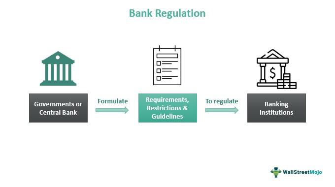

The financial landscape is continually evolving, driven by technological innovations and regulatory measures that shape market dynamics. Among these, Regulation Y, enforced by the Federal Reserve Board, has emerged as a critical framework for maintaining corporate governance within bank holding companies and state-member banks. Its significance lies not only in ensuring the operational safety and soundness of these institutions but also in upholding broader financial stability.

This article examines the intricacies of Regulation Y, assessing its implications for bank holding companies, state-member banks, and the increasingly prominent field of algorithmic trading. We intend to provide a comprehensive understanding of the basic tenets of Regulation Y, its operational impact, and its intersection with current advancements in financial technology, particularly as they relate to algorithmic trading practices.



The relationship between banking regulations and technological advancements represents a critical focal point for market participants. Algorithmic trading, characterized by the use of sophisticated algorithms and quantitative models to execute trades at high speed and volume, has revolutionized financial markets. As such, a thorough understanding of the relevant regulations is essential for those engaged in, or affected by, these trading strategies.

With the rise of algorithmic trading, understanding and navigating the regulatory landscape that includes Regulation Y becomes indispensable. This article aims to provide an overarching view of how Regulation Y is applied and its relevance to algorithmic trading practices. The goal is to equip market participants with the knowledge needed to align their operations with contemporary regulatory standards while effectively leveraging technological advancements.

## Table of Contents

## Understanding Regulation Y

Regulation Y is a comprehensive set of rules released by the Federal Reserve, aimed at overseeing the operations of bank holding companies and the specific activities of state-member banks. Originating from the Bank Holding Company Act of 1956, Regulation Y has undergone numerous amendments to ensure these financial entities maintain prudent and secure operations.

A fundamental aspect of Regulation Y is its emphasis on capital adequacy. This regulation mandates that bank holding companies maintain minimum capital reserve ratios to effectively manage risks. Capital adequacy is crucial as it ensures that financial institutions have a sufficient buffer to absorb potential losses, thus safeguarding their solvency. The regulation specifies the minimum capital-to-asset ratios that these institutions must adhere to, ensuring that they remain stable even in adverse economic conditions.

In addition to capital adequacy, Regulation Y delineates various transactions that necessitate Federal Reserve approval. This includes mergers and acquisitions involving bank holding companies. By requiring these approvals, the Federal Reserve can scrutinize proposed transactions to assess their potential impact on the financial system. The aim is to prevent any actions that might compromise financial stability, such as the excessive concentration of market power or the creation of systemically risky institutions.

Through these stipulations, Regulation Y endeavors to create a framework that promotes financial stability and minimizes systemic risks. By ensuring that banks operate with adequate capital and undergoing regulatory scrutiny for significant transactions, the regulation helps maintain a balanced and secure banking environment.

## Regulation Y and Algorithmic Trading

Algorithmic trading involves employing sophisticated algorithms and quantitative models to execute trades at high speed and [volume](/wiki/volume-trading-strategy), significantly transforming traditional financial trading methods. This transformation has extended to the banking sector, prompting a reassessment of existing regulatory frameworks like Regulation Y.

Regulation Y, though primarily designed for the governance and risk management of bank holding companies, holds significance for [algorithmic trading](/wiki/algorithmic-trading) activities conducted by these financial entities. Its core principles are indirectly pertinent to the oversight of algorithmic trading, particularly concerning risk management protocols and capital adequacy requirements. Regulation Y stipulates that bank holding companies must maintain certain capital reserves ratios to effectively manage risks, an aspect crucial for sustaining financial health amidst high-frequency trading activities.

Algorithmic trading can introduce significant financial risks due to its speed and volume. These risks include market [volatility](/wiki/volatility-trading-strategies) amplification and potential [liquidity](/wiki/liquidity-risk-premium) shortages. The principles laid out in Regulation Y ensure that banking organizations implement robust risk management practices, critical when engaging in algorithmic trading. Capital requirements enforced under Regulation Y encourage financial institutions to hold sufficient reserves, which acts as a buffer against unexpected market fluctuations. 

For algorithmic trading operations, risk management can involve the creation of advanced algorithms capable of adjusting trading strategies in response to rapid market changes. A simplified representation of an algorithm's behavior might be expressed in Python code as follows:

```python
def adaptive_trading_strategy(market_conditions):
    if market_conditions['volatility'] > threshold:
        adjust_position_size(reduce=True)
    elif market_conditions['liquidity'] < threshold:
        increase_reserve_funds()
    # Further adjustments based on predictive analytics
    return execute_trades()
```

This type of adaptive approach is consistent with Regulation Y's emphasis on risk management and might be integrated into broader compliance efforts within bank holding companies. By ensuring adherence to Regulation Y, banks can engage in algorithmic trading without compromising their financial stability, safeguarding against risks associated with high-speed transactions.

## Transactions and Cybersecurity under Regulation Y

Regulation Y plays a crucial role in the operational frameworks of bank holding companies by specifying which transactions do not require prior Federal Reserve approval, thus enhancing operational efficiency for well-managed institutions. This regulatory provision allows these entities to undertake certain transactions autonomously, provided they meet specific criteria outlined by the Federal Reserve. The primary goal is to ensure that the banks operate efficiently while maintaining adequate oversight and control mechanisms to prevent systemic risks and promote stability in the financial system.

The regulation is continually evolving to address modern challenges, with cybersecurity representing a significant concern. In response to increasing cyber threats in the financial sector, Regulation Y has been updated to require banks to report significant cyber incidents that could potentially affect their operational stability and the broader financial network. This requirement aims to mitigate risks associated with cyber-attacks, which can lead to data breaches, financial losses, and reputational damage.

By enforcing stringent cybersecurity measures, Regulation Y mandates that banks implement robust information security frameworks. This includes developing incident response plans, conducting regular risk assessments, and establishing protocols for reporting and managing cyber threats. These measures ensure that, even as banks engage in high-speed, high-volume algorithmic trading, they maintain vigilance against cyber threats that could compromise their operations and erode investor trust.

Ultimately, the integration of cybersecurity considerations within Regulation Y strengthens the resilience of financial institutions. It encourages banks to adopt proactive measures to safeguard their digital infrastructure, thereby ensuring that their trading activities and core operations remain secure and reliable amidst evolving technological landscapes.

## Conclusion

Regulation Y is pivotal for the governance of bank holding companies and their subsidiaries, providing a structured framework that promotes sound financial practices. This framework is essential in maintaining operational integrity and ensuring that these entities are equipped to manage risks effectively. The integration of algorithmic trading into financial markets has introduced additional layers of complexity, underlining the need for rigorous compliance with Regulation Y. By adhering to these regulations, banks can navigate the challenges posed by high-frequency trading while safeguarding systemic stability.

The application of Regulation Y principles ensures that banks align their trading operations with established risk management protocols and capital adequacy standards. Such compliance not only mitigates potential financial risks but also enhances the overall resilience of the financial system. The ability to effectively understand and implement Regulation Y is crucial for institutions engaged in algorithmic trading, as it enables them to maintain a responsible role within the financial markets.

In summary, Regulation Y is integral to maintaining the robustness and stability of financial institutions engaged in sophisticated trading methodologies. By ensuring adherence to regulatory standards, it supports the continued growth and sustainability of financial markets amidst technological advancements and evolving trading practices. Understanding and compliance are paramount for institutions to contribute positively to the financial system's strength and resilience.

## References & Further Reading

[1]: ["Regulation Y (12 CFR 225): Bank Holding Companies and Change in Bank Control"](https://www.ecfr.gov/current/title-12/chapter-II/subchapter-A/part-225) - Board of Governors of the Federal Reserve System.

[2]: Bishop, B., & McDermott, B. (2018). ["The Impact of Regulation on Algorithmic Trading"](https://www.researchgate.net/publication/378548435_Algorithmic_Trading_and_AI_A_Review_of_Strategies_and_Market_Impact) - Journal of Financial Regulation, Volume 4, Issue 1.

[3]: Narang, R. K. (2013). ["Inside the Black Box: A Simple Guide to Quantitative and High Frequency Trading,"](https://onlinelibrary.wiley.com/doi/book/10.1002/9781118662717) 2nd Edition. Wiley.

[4]: Aldridge, I. (2013). ["High-Frequency Trading: A Practical Guide to Algorithmic Strategies and Trading Systems"](https://www.amazon.com/High-Frequency-Trading-Practical-Algorithmic-Strategies/dp/1118343506). Wiley.

[5]: Allen, F., & Carletti, E. (2010). ["An Overview of the Crisis: Causes, Consequences, and Solutions."](https://onlinelibrary.wiley.com/doi/abs/10.1111/j.1468-2443.2009.01103.x) The Review of Financial Studies, Volume 13, Issue 1.

[6]: Carpineti, L. (2021). ["Advanced Algorithmic Trading Strategies"](https://www.quantstart.com/advanced-algorithmic-trading-ebook/) - SSRN Electronic Journal.