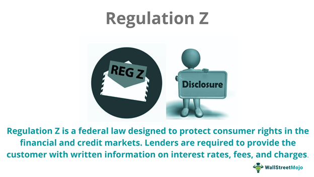

The world of finance is undergoing profound changes, primarily driven by technological advancements that are altering the foundations of investing and trading. Central to this transformation is algorithmic trading, or algo trading, which leverages sophisticated computer algorithms to execute trades with remarkable speed and precision. These algorithms are programmed to follow specific instructions, enabling high-frequency trading across various financial markets. As a significant force, algo trading is reshaping how financial transactions are conducted, offering benefits such as reduced transaction costs and enhanced efficiency.

Simultaneously, the financial industry is governed by various regulatory frameworks designed to protect consumer interests. One such regulation is the Truth in Lending Act (TILA), along with its associated Regulation Z. This regulation mandates transparency and fairness in consumer credit transactions, ensuring that lenders disclose critical credit terms clearly and consistently. It encompasses a wide range of credit products including home mortgages and credit cards, but does not extend to business loans.

The intersection of algorithmic trading and Regulation Z presents an intriguing dynamic in financial markets. While Regulation Z primarily focuses on consumer credit protection, its principles of transparency and fair practices may indirectly influence the strategies employed in algorithmic trading, especially those involving consumer credit instruments. Understanding how these regulations intersect is crucial for navigating the evolving landscape of financial markets.

In this context, the interplay between automated trading systems and consumer protection regulations raises important questions about the future. The challenges and opportunities presented by these developments necessitate a continuous evaluation of regulatory frameworks to ensure they remain effective in an increasingly automated environment. As finance continues to evolve, adapting regulatory measures to safeguard consumer interests while fostering innovation remains a key priority.

## Table of Contents

## Understanding TILA and Regulation Z

Regulation Z, a critical component of the Truth in Lending Act (TILA), was established to offer protection to consumers against deceptive lending practices. It mandates that lenders furnish borrowers with transparent and standardized details regarding credit terms to facilitate better consumer understanding and comparison among financial products. This transparency is crucial to addressing issues of asymmetrical information between lenders and borrowers, where borrowers may lack access to relevant details essential for their decision-making process.

Under Regulation Z, several key protections are afforded to consumers. One prominent feature is the disclosure requirement; lenders are obligated to clearly present both the interest rates and associated finance charges. This clarity enables consumers to evaluate the true cost of borrowing and compare it effectively against other credit offers, ensuring a competitive market that operates in the consumers' best interest. Additionally, Regulation Z provides consumers with the right to rescind, or cancel, certain credit transactions. This right typically applies to specific types of loans, such as home equity loans, giving consumers a three-day period during which they can withdraw from the agreement without incurring penalties.

The scope of Regulation Z is comprehensive yet deliberately restricted to focus on individual consumer credit lines. It encompasses various forms of credit, including home mortgages, credit cards, and installment loans. These are areas where consumers are most vulnerable to the complexities of financial contracts and thus benefit from the regulation's protective measures. However, Regulation Z explicitly excludes business-related loans from its purview, recognizing that commercial entities typically have greater access to resources and expertise to navigate lending transactions.

Overall, Regulation Z plays a vital role in promoting transparent lending practices that empower consumers, fostering an equitable financial marketplace. Its regulations ensure that consumers have the necessary information to make informed financial commitments, thus enhancing consumer confidence and stability within the credit market.

## The Rise of Algorithmic Trading

Algorithmic trading employs sophisticated computer algorithms to execute trades at high speeds, relying on preset criteria and instructions. This approach significantly transforms traditional trading methodologies, offering notable benefits. One primary advantage is the reduction in transaction costs. By automating the trading process, [algorithmic trading](/wiki/algorithmic-trading) eliminates the need for manual intervention, thereby lowering fees associated with human trading activities. Additionally, algorithmic trading enhances trading efficiency. It allows for the rapid execution of trades which reduces the time between order placement and completion, leading to more timely and potentially profitable transactions.

Furthermore, algorithmic trading enables the [backtesting](/wiki/backtesting) of trading strategies using historical data. By simulating trades with past market data, traders can evaluate the potential success of their strategies before applying them in real-time markets. This process helps in refining strategies, minimizing risks, and optimizing performance based on historical trends and patterns.

Despite these advantages, algorithmic trading comes with certain challenges and risks due to the complexity and autonomous operation of these algorithms. High-frequency trading, a subset of algorithmic trading, demonstrates an ability to execute millions of orders per second, requiring sophisticated risk management strategies to prevent market manipulation and systemic failures. The autonomous nature of these algorithms can lead to unforeseen market behaviors, magnifying [volatility](/wiki/volatility-trading-strategies) and the risk of flash crashes.

In this context, the role of regulations, including Regulation Z, becomes essential in safeguarding consumer interests. Although Regulation Z mainly addresses consumer credit, it emphasizes transparency and fair practices, principles that are crucial in the broader financial markets impacted by automated trading systems. Ensuring that algorithmic strategies adhere to such regulatory standards helps protect consumers by promoting responsible trading practices and maintaining market integrity.

## Regulation Z's Impact on Algo Trading

Regulation Z, part of the Truth in Lending Act, is primarily concerned with ensuring transparency and fairness in consumer credit transactions. Although it does not directly govern algorithmic trading, its emphasis on consumer protection and transparent financial practices can have indirect effects on algo trading strategies, particularly those involving consumer credit instruments.

By mandating clear disclosure of credit terms, Regulation Z facilitates informed decision-making. This transparency is vital in an environment where decisions are increasingly underpinned by automated systems. Algorithms, which rely on preset criteria to execute trades, can be significantly influenced by the availability of transparent and standardized credit information. When credit terms are consistently articulated, algorithms can more accurately assess risk and devise strategies that align with consumer interests, thereby promoting fair practices.

Moreover, the regulation's emphasis on fair practices may indirectly guide algorithm designers to incorporate compliance checks and ethical considerations into their systems. Algorithms used in trading can be programmed to flag transactions that do not meet certain regulatory criteria, ensuring that the trading strategy adheres to legal standards. For example, an algorithm could be designed to evaluate whether the disclosed interest rates and credit terms align with Regulation Z’s requirements before executing trades. This pre-emptive compliance check can mitigate the risk of engaging in transactions that might exploit regulatory loopholes or deceive consumers.

In summary, while Regulation Z is not directly applicable to algorithmic trading, its principles of transparency and fairness resonate within the financial markets, influencing how algorithms are developed and deployed in transactions involving consumer credit products. By ensuring clear credit term disclosures, the regulation supports a robust and informed trading environment in today’s technology-driven financial world.

## Challenges and Considerations

Integrating Regulation Z norms into algorithmic trading involves navigating several complex challenges, particularly in terms of compliance with intricate financial regulations. Regulation Z is designed to protect consumers by mandating clear disclosures on credit terms, making it vital for automatic trading systems that handle consumer-related financial instruments to adhere strictly to these requirements.

One of the main challenges is the continuous monitoring and updating of algorithms to ensure compliance. As regulations evolve, trading algorithms must be frequently updated to reflect any changes. This requires robust compliance systems capable of automatically adjusting algorithms to maintain regulatory adherence. Moreover, ensuring these algorithms can adapt to legal amendments without manual intervention is crucial in maintaining operational efficiency.

Another significant challenge lies in ensuring transparency in how algorithms make decisions, particularly when these decisions involve credit products and consumer investments. Algorithmic trading systems often operate as "black boxes", meaning their decision-making processes are not easily interpretable by humans. To address this, the development of algorithms with explainable AI (XAI) capabilities is essential. These algorithms must provide clarity on decision processes, enabling stakeholders to understand the factors influencing trading actions related to credit products. 

Furthermore, integrating Regulation Z into algorithmic trading requires ensuring that the disclosed information aligns with the consumer's understanding and comparison, which may involve refining natural language processing components of trading software. The algorithms should generate disclosures that are not only legally compliant but also easily comprehensible by consumers. This could involve using [machine learning](/wiki/machine-learning) models to test readability and comprehension of disclosure texts.

Incorporating these considerations into algorithmic trading systems necessitates an interdisciplinary approach, combining expertise in finance, regulation, [artificial intelligence](/wiki/ai-artificial-intelligence), and software development. Such integration helps maintain consumer protection standards as automated trading continues to grow in complexity and prevalence.

## Future Outlook: Regulation and Technology

As financial technology continues to advance, the regulatory framework must adapt to ensure that innovation progresses without compromising consumer protection. Algorithmic trading, a prominent aspect of modern finance, presents unique challenges that regulations must address. The expanding role of algorithmic trading in consumer credit markets necessitates new regulatory measures that specifically tackle the intricacies of automated financial transactions.

Future regulations may focus on increasing transparency and accountability in algorithmic trading by mandating detailed disclosures of their operational mechanisms. These regulations could require algorithm developers and financial institutions to provide comprehensive reports on the parameters that guide trading algorithms, as well as any predictive models employed. Such transparency would allow regulatory bodies to better assess the potential risks and impacts on consumer credit markets, ensuring practices align with consumer protection objectives.

Collaboration among regulatory bodies, financial institutions, and technology companies is crucial to develop policies that foster fair trading practices. Regulatory bodies such as the Securities and Exchange Commission (SEC) in the United States, and international counterparts, must work with financial institutions and tech companies to gain a deeper understanding of algorithmic strategies. This cooperation can facilitate the creation of guidelines that not only prevent harmful practices but also encourage responsible innovation.

The integration of advanced technologies such as artificial intelligence and machine learning in algorithmic trading requires that regulations remain dynamic. Machine learning models, for instance, adapt and evolve based on new data, which could lead to unforeseen behaviors in trading algorithms. Regulatory frameworks need to incorporate provisions for continuous monitoring and reassessment of these models to ensure they remain compliant with consumer protection standards.

Moreover, the use of sandbox environments, where financial institutions can test new algorithms under the supervision of regulators, might become more prevalent. These controlled settings would allow for experimentation with innovative trading technologies while minimizing risks to the actual markets.

In summary, the future of financial regulations concerning algorithmic trading in consumer credit markets hinges on adaptability, transparency, and collaboration. As technology shapes the financial landscape, regulatory efforts must be robust yet flexible, ensuring consumer protection and fostering ethical trading environments.

## Conclusion

The intersection of TILA Regulation Z and algorithmic trading highlights the necessity of robust regulatory frameworks for maintaining safe and ethical financial markets. As technological advancements continue to reshape financial landscapes, regulatory frameworks must adapt to protect consumers effectively. These adaptations are not just essential for managing the complexities introduced by algorithmic trading but are also crucial for fostering sustained trust among market participants.

Stakeholder vigilance is paramount to ensuring these changes indeed benefit consumers. Financial institutions, regulatory bodies, and technology firms must collaborate to establish regulations that uphold transparency and fairness. Given the increasingly algorithm-driven nature of financial markets, stakeholders must ensure that algorithms are designed with adherence to consumer protection principles from the outset. Such principles include transparent credit disclosures and unbiased decision-making processes.

While the blend of technology and finance offers numerous benefits, it also poses significant risks that demand vigilant regulatory oversight. The ongoing efforts to integrate evolving technological capabilities with consumer protection laws like TILA Regulation Z will play a pivotal role in shaping the future of finance. By doing so, we can pave the way for a financial environment that values ethical practices and consumer trust, ultimately reinforcing the integrity of the market as a whole.

## References & Further Reading

[1]: Board of Governors of the Federal Reserve System. ["Consumer Credit Protection Act (Truth in Lending Act)."](https://www.federalreserve.gov/newsevents/pressreleases/bcreg20241004b.htm)

[2]: Securities and Exchange Commission. ["Algorithmic Trading: Introduction and Overview."](https://www.sec.gov/)

[3]: ["Regulation Z and Credit Card Act Compliance"](https://www.consumerfinance.gov/rules-policy/regulations/1026/) - Consumer Financial Protection Bureau

[4]: L'Habitant, F.S. (2004). ["Hedge Funds: Quantitative Insights."](https://www.wiley.com/en-us/Hedge+Funds%3A+Quantitative+Insights-p-9780470687772) John Wiley & Sons.

[5]: Cartea, Á., Jaimungal, S., & Penalva, J. (2015). ["Algorithmic and High-Frequency Trading."](https://assets.cambridge.org/97811070/91146/frontmatter/9781107091146_frontmatter.pdf) Cambridge University Press.