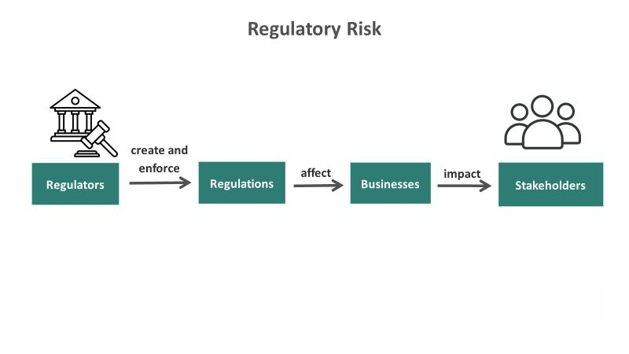

The automotive industry is one of the most heavily regulated sectors globally, with a complex framework of vehicle laws and automotive regulations that dictate the design, safety, environmental impact, and sales practices of automobiles. These regulations are crucial for ensuring consumer protection and fostering environmental sustainability. In recent years, the industry has also seen the emergence of algorithmic trading as a significant factor, influencing market dynamics and operational strategies.

Vehicle laws govern a wide array of aspects in the automotive sector, from emissions standards and safety features to advertising practices and lifecycle management. These laws set the standards for manufacturers in developing vehicles that meet regulatory requirements while satisfying consumer demands. As advancements in technology introduce new variables, such as autonomous vehicles, regulators must develop and adapt laws to ensure these innovations are safely and effectively integrated into everyday life.



Automotive regulations impact the industry economically by setting standards related to fuel efficiency, emissions, and sales conduct. For example, the Federal Trade Commission (FTC) regulates automotive sales practices through rules like the CARS rule, which is designed to protect consumers from deceptive practices. Such regulations ensure transparency while increasing production costs for manufacturers, influencing both vehicle pricing and market competition.

The rise of algorithmic trading has introduced an innovative dimension to the automotive market. By utilizing automated, data-driven strategies, algorithmic trading affects the pricing of key commodities like oil and metals, which are essential for vehicle manufacturing. The integration of artificial intelligence (AI) and machine learning platforms offers insights for optimizing supply chain management and inventory control across the industry. However, as these trading strategies disrupt traditional operations, they also present regulatory challenges, necessitating new compliance frameworks to harmonize algorithmic trading with existing market regulations.

Global challenges and opportunities are apparent as the automotive industry strives to unify different regulatory standards worldwide, enhancing efficiency in manufacturing and sales. Technological advancements in fields such as electric and autonomous vehicles create the need for adaptable regulations, offering opportunities for sustainability and safety improvements. The industry's future will likely involve increased sustainability measures, enhanced safety standards, and the strategic use of algorithmic trading to boost operational effectiveness.

In conclusion, the evolving regulatory landscape presents both challenges and opportunities for all stakeholders involved in the automotive industry. Keeping abreast of these regulatory changes is essential for manufacturers, dealers, and investors to navigate successfully in the market. As technology continues to intersect with regulation, the automotive industry must remain agile in adapting to new demands, ensuring sustainable growth and advancement.

## Table of Contents

## Vehicle Laws Impacting the Automotive Industry

Vehicle laws significantly influence the automotive industry's approach to design, safety, and environmental responsibility. These regulations are critical to ensuring consumer protection and promoting sustainability across the industry.

One of the fundamental areas of vehicle laws is emissions standards. These regulations limit the [volume](/wiki/volume-trading-strategy) of pollutants that vehicles can emit, directly affecting engine design and fuel use. For instance, the European Union's Euro 6 standards impose strict limits on nitrogen oxides and particulate matter, which has led manufacturers to develop advanced emission control technologies such as selective catalytic reduction and particulate filters.

Safety features are another focal point of vehicle laws. Regulations mandate the incorporation of specific technologies designed to protect passengers and enhance driver awareness. Examples include airbags, electronic stability control, and anti-lock braking systems. In the United States, the National Highway Traffic Safety Administration (NHTSA) provides standards that automakers must comply with to ensure vehicles obtain a safety rating suitable for market release.

Legislation also aims to prevent deceptive sales practices within the automotive industry. Measures are implemented to ensure transparency in vehicle history reporting and pricing. The Federal Trade Commission's (FTC) Used Car Rule, for example, requires dealers to display a Buyers Guide on used vehicles, clearly outlining warranty information and other significant data.

The rise of technologies such as autonomous vehicles (AVs) has necessitated the development of new legal frameworks to govern their use on public roads. These vehicles operate using complex algorithms and require consistent input from sensors and cameras to navigate safely and legally. Consequently, new regulations address issues such as liability in the event of accidents, data privacy, and cybersecurity. In regions like California, AV manufacturers must comply with specific testing and deployment requirements outlined by the state's Department of Motor Vehicles (DMV), ensuring road safety and public confidence.

In summary, vehicle laws are indispensable in promoting consumer safety and environmental sustainability, influencing key aspects of automotive design, technology integration, and market transparency. They ensure that the automotive industry remains aligned with contemporary safety standards and environmental goals.

## Automotive Regulations and Their Economic Impact

Automotive regulations establish vital standards that significantly influence the economic dynamics of the industry by dictating parameters for fuel efficiency and emissions. These regulations are vital for limiting environmental impact and promoting sustainable practices in vehicle manufacturing. Countries often develop distinct sets of regulations, but efforts toward international harmonization are ongoing to ease the economic burden on manufacturers operating globally.

Fuel efficiency standards often center around improving a vehicle's miles-per-gallon (MPG) ratio, aiming to reduce fuel consumption and greenhouse gas emissions. These standards not only impact vehicle design but also compel manufacturers to invest in research and development, facilitating the production of more eco-friendly vehicles. The Corporate Average Fuel Economy (CAFE) standards in the United States are an example, significantly impacting the industry's approach to vehicle engineering and production processes.

Similarly, emissions regulations require automotive manufacturers to limit the pollutants released by their vehicles. The European Union's Euro emissions standards, for instance, mandate the reduction of key air pollutants such as nitrogen oxides (NOx) and particulate matter (PM). Compliance with stringent emissions standards affects vehicle pricing, driving up production costs due to the need for advanced emission-control technologies. Consequently, these costs are often passed on to consumers, influencing market dynamics and potentially affecting consumer choice.

Consumer protection regulations such as the Federal Trade Commission's (FTC) CARS rule in the United States are designed to encourage transparency within the automotive market. These regulations prevent deceptive sales practices, ensuring that consumers receive accurate information about vehicle pricing and condition. Legal frameworks such as this contribute to fair market practices, thereby fostering consumer trust and promoting a stable market environment.

The economic impact extends to market competition, where compliance costs can elevate the barriers to entry, particularly for smaller manufacturers lacking the capital to invest in necessary technological upgrades. Larger automotive firms, often better equipped to absorb these costs, may thus gain a competitive edge, potentially leading to market consolidation.

Manufacturers must account for these economic implications when developing market strategies, considering factors like production cost increment and pricing changes. Balancing regulatory compliance with market competitiveness is crucial for thriving in this tightly regulated sector.

## Algorithmic Trading and the Automotive Market

Algorithmic trading is increasingly influencing the automotive market by harnessing automated and data-driven strategies to optimize the trading of commodities vital to automotive manufacturing, such as oil and metals. The integration of advanced technologies like Artificial Intelligence (AI) and [machine learning](/wiki/machine-learning) within these trading platforms enables companies to discern intricate market trends, thereby facilitating more effective supply chain management and inventory control. This capability is crucial for the automotive industry, where commodity prices can significantly affect production costs and pricing strategies.

The use of [algorithmic trading](/wiki/algorithmic-trading) in the automotive sector is characterized by the rapid analysis of complex datasets to predict price movements. For instance, machine learning algorithms assess historical data, current market conditions, and macroeconomic indicators to forecast future trends, enabling companies to make informed purchasing and hedging decisions. Python, commonly used in algorithmic trading, offers powerful libraries such as NumPy, pandas, and Scikit-learn, which allow for efficient data manipulation and predictive analytics. A basic predictive model might look like this:

```python
import pandas as pd
from sklearn.model_selection import train_test_split
from sklearn.ensemble import RandomForestRegressor

# Example: Predicting future commodity prices
data = pd.read_csv('commodity_prices.csv')
X = data.drop(['Future Price'], axis=1)
y = data['Future Price']

X_train, X_test, y_train, y_test = train_test_split(X, y, test_size=0.2, random_state=42)
model = RandomForestRegressor()
model.fit(X_train, y_train)

# Predict future prices
predictions = model.predict(X_test)
```

However, as algorithmic trading becomes more prevalent, regulatory challenges emerge. Traditional market operations, governed by established legal frameworks, may not yet accommodate the unique complexities introduced by automated trading. The need for new compliance frameworks is evident to ensure market stability and protect against practices like market manipulation. Regulations must evolve to address issues such as the transparency of algorithmic trading strategies, the potential for flash crashes, and the fairness of high-frequency trading practices, which can disproportionately benefit those with access to superior technological resources.

In conclusion, while algorithmic trading offers significant benefits through enhanced efficiency and insights, it also presents regulatory challenges that must be meticulously managed to maintain a fair and stable market. As these automated systems continue to evolve, the development of robust regulatory mechanisms will be critical in balancing innovation with market integrity.

## Global Challenges and Opportunities

The global automotive industry is confronted with the complex task of aligning diverse regulatory frameworks across international borders, which can impede the seamless manufacture and sale of vehicles. Harmonizing these regulations is essential to reduce production costs, improve efficiency, and ensure that vehicles meet safety and environmental standards globally. A coordinated approach allows manufacturers to optimize their operations and consumers to benefit from consistent quality and safety expectations.

Technological advancements, particularly in electric and autonomous vehicles, present significant opportunities for the automotive sector. Electric vehicles (EVs) offer a sustainable alternative to traditional internal combustion engine vehicles, reducing dependency on fossil fuels and decreasing greenhouse gas emissions. This transition necessitates a shift in regulatory measures to support the development of charging infrastructure and incentivize EV adoption through subsidies and tax breaks. Autonomous vehicles, meanwhile, promise to revolutionize transport by enhancing road safety and reducing traffic congestion. Adapting regulations to accommodate these new technologies involves establishing standards for cybersecurity, vehicle-to-infrastructure communication, and safety protocols.

Future prospects for the automotive industry entail a focus on sustainability, improved safety measures, and the integration of sophisticated technologies, such as algorithmic trading. Emphasizing sustainability can be achieved by promoting the circular economy within automotive manufacturing, enhancing recycling processes, and developing eco-friendly materials. Safety measures can be improved through the continuous advancement of vehicle designs and the implementation of active safety systems such as collision avoidance technologies.

The role of algorithmic trading in the automotive market is growing, providing opportunities to optimize supply chain management. By using data-driven strategies, companies can make informed decisions about purchasing and resource allocation, leading to enhanced operational efficiency and cost savings. As algorithmic trading continues to intersect with conventional market practices, it becomes crucial to develop comprehensive compliance frameworks that address these new dynamics. This ongoing evolution requires industry stakeholders to remain adaptable and forward-thinking, positioning themselves to take advantage of emerging trends and technologies in the global automotive landscape.

## Conclusion

The automotive industry's regulatory environment is continually evolving, presenting both challenges and opportunities for stakeholders. These vehicle laws and automotive regulations directly influence design, safety, sustainability, and economic dynamics. For manufacturers, staying informed about these changes is not just advisable but essential. A nuanced understanding allows them to integrate new compliance requirements into the production process, mitigating potential risks associated with non-compliance while enabling the adaptation to innovative technologies such as electric and autonomous vehicles.

Dealers, too, face an evolving landscape where consumer protection regulations and fair sales practices must be prioritized to maintain market competitiveness. Keeping abreast of these developments ensures transparency and fosters trust with consumers. Moreover, investors who navigate the shifting regulatory and technological milieu successfully stand to benefit from new market opportunities, particularly those arising from advancements in algorithmic trading and data analytics that enhance operational efficiencies.

The intersection of regulation and technology continues to deepen, compelling the automotive industry to remain agile in the face of emerging demands. Opportunities lie not only in adapting to current regulatory frameworks but also in anticipating future trends that emphasize sustainability and safety. As regulations evolve alongside technological advancements, stakeholders are tasked with leveraging these changes to fuel sustainable growth in the industry. This adaptability will be crucial in harnessing the full potential of innovative technologies while ensuring compliance with dynamic regulatory landscapes.

## References & Further Reading

[1]: ["Federal Trade Commission: Vehicle Sales"](https://www.ftc.gov/business-guidance/resources/ftc-cars-rule-combating-auto-retail-scams-dealers-guide) - Federal Trade Commission.

[2]: ["National Highway Traffic Safety Administration (NHTSA) - Vehicle Safety"](https://www.nhtsa.gov/vehicle-safety-research) - National Highway Traffic Safety Administration.

[3]: ["Euro 6 Emissions Standards"](https://en.wikipedia.org/wiki/European_emission_standards) - DieselNet.

[4]: ["Corporate Average Fuel Economy (CAFE) Standards"](https://www.nhtsa.gov/laws-regulations/corporate-average-fuel-economy) - National Highway Traffic Safety Administration.

[5]: ["Algorithms for Hyper-Parameter Optimization"](https://papers.nips.cc/paper/4443-algorithms-for-hyper-parameter-optimization.pdf) - Bergstra, J., Bardenet, R., Bengio, Y., & Kégl, B.

[6]: ["Machine Learning for Algorithmic Trading"](https://github.com/PacktPublishing/Machine-Learning-for-Algorithmic-Trading-Second-Edition) - Stefan Jansen.

[7]: ["Quantitative Trading: How to Build Your Own Algorithmic Trading Business"](https://books.google.com/books/about/Quantitative_Trading.html?id=j70yEAAAQBAJ) - Ernest P. Chan.