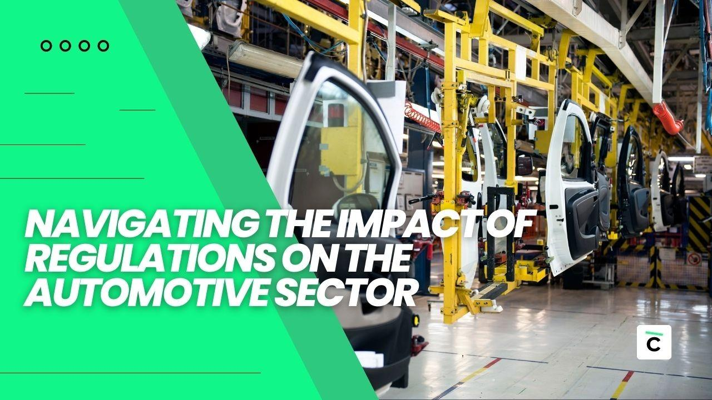

## Table of Contents

## What are the basic regulations that affect the automotive industry?

The automotive industry is subject to many regulations that aim to ensure safety, environmental protection, and fair competition. Governments around the world set rules about how cars should be made, what they can emit, and how they should perform in crashes. For example, in the United States, the National Highway Traffic Safety Administration (NHTSA) sets standards for vehicle safety, while the Environmental Protection Agency (EPA) regulates emissions. These regulations help to make sure that cars are safe for drivers and good for the environment.

Another important aspect of automotive regulations is related to trade and competition. Countries often have rules that control how cars can be imported and sold within their borders. These rules can include tariffs, which are taxes on imported goods, and standards that foreign cars must meet to be sold locally. The goal is to protect local car makers and ensure a level playing field for all companies. Additionally, antitrust laws prevent large car companies from unfairly controlling the market, promoting competition and innovation in the industry.

Overall, these regulations play a crucial role in shaping the automotive industry. They influence how cars are designed, produced, and sold, and they help to balance the interests of safety, environmental protection, and economic fairness. While regulations can sometimes be seen as a burden by car manufacturers, they are essential for maintaining a healthy and sustainable automotive sector.

## How do emissions standards vary by country and impact car manufacturers?

Emissions standards are rules that tell car makers how much pollution their cars can make. These rules are different in every country. For example, in the United States, the Environmental Protection Agency (EPA) sets strict limits on what cars can emit. In Europe, the rules are set by the European Union and can be even stricter. In places like China and India, the standards are getting stricter over time, but they started out less strict than in the U.S. or Europe. Each country's rules make car makers design cars differently to meet the local standards.

These different emissions standards affect car manufacturers a lot. They have to make different versions of their cars for different countries. This can be expensive because they need to do more research and change their factories to build cars that meet all the different rules. Sometimes, car makers have to use special technology in some countries but not in others. This can make cars more expensive in places with stricter rules. But, it also pushes car makers to come up with new ideas and technology to make cleaner cars everywhere.

## What safety regulations must automotive companies comply with globally?

Automotive companies have to follow many safety rules all around the world. These rules make sure cars are safe for people to drive and ride in. In the United States, the National Highway Traffic Safety Administration (NHTSA) sets rules about things like seat belts, airbags, and how cars should act in crashes. In Europe, the European Union has its own rules that cars must follow to be sold there. These rules can be a bit different, but they all aim to keep people safe.

In other parts of the world, like Japan and Australia, there are also strict safety rules. Japan has rules about how strong car bodies should be and how well cars should protect people in crashes. Australia has its own set of rules that cars must meet to be sold there. Even though the rules can be different in each place, car companies have to make sure their cars meet all these standards. This can be hard because they might need to change their cars a bit for each country, but it's important for keeping everyone safe.

## How have fuel efficiency standards evolved over the past decade?

Over the past decade, fuel efficiency standards have become much stricter around the world. Governments have been pushing car makers to make cars that use less gas. In the United States, the Corporate Average Fuel Economy (CAFE) standards have been getting tougher. By 2025, cars sold in the U.S. need to get about 54.5 miles per gallon on average. This is a big jump from the standards a decade ago, which were around 27.5 miles per gallon for cars. The goal is to save gas and help the environment by reducing how much pollution cars make.

In Europe, the European Union has also been making their fuel efficiency rules stricter. By 2021, new cars sold in the EU had to emit no more than 95 grams of CO2 per kilometer on average. This is a big change from 2010, when the limit was 130 grams per kilometer. Other countries like China and Japan have been doing the same thing, making their rules stricter over time. These changes are pushing car companies to make more efficient cars, like hybrids and electric vehicles, to meet the new standards.

## What are the key differences between U.S. and European automotive regulations?

The main differences between U.S. and European automotive regulations are in areas like safety, emissions, and fuel efficiency. In the U.S., the National Highway Traffic Safety Administration (NHTSA) sets safety rules, while the Environmental Protection Agency (EPA) handles emissions and fuel efficiency standards. For example, U.S. cars need to meet the Corporate Average Fuel Economy (CAFE) standards, which aim for an average of 54.5 miles per gallon by 2025. In Europe, the European Union sets its own rules. European cars have to follow strict emission limits, like 95 grams of CO2 per kilometer by 2021, and they have different safety tests that focus on crash protection and pedestrian safety.

Another key difference is how these regulations are enforced and updated. In the U.S., standards can change based on political decisions and public pressure, which can lead to some uncertainty for car makers. For example, the CAFE standards have been debated and adjusted over time. In Europe, the rules tend to be more stable and planned out years in advance, giving car makers a clearer idea of what to expect. This can make it easier for them to plan and invest in new technologies. Both regions push for cleaner and safer cars, but they do it in different ways that reflect their own priorities and systems.

## How do trade policies and tariffs influence the automotive industry?

Trade policies and tariffs can have a big impact on the automotive industry. Tariffs are taxes that countries put on cars and car parts that come from other countries. When a country puts a high tariff on imported cars, it can make them more expensive than cars made locally. This can help protect local car makers by making it harder for foreign cars to compete. For example, if the U.S. puts a high tariff on cars from Europe, American car buyers might choose to buy American cars instead because they are cheaper. This can help U.S. car companies sell more cars at home.

On the other hand, tariffs can also make things harder for car makers. If a country puts tariffs on car parts, it can make it more expensive for car companies to build their cars. This is because many cars are made with parts from all over the world. For example, a car made in Japan might use parts from Germany and the U.S. If Japan puts tariffs on these parts, it can raise the cost of making cars in Japan. This can lead to higher prices for cars or lower profits for car companies. Trade policies can also affect where car companies choose to build their factories. If a country has low tariffs and good trade deals, it might be a more attractive place to build cars.

## What role does the Corporate Average Fuel Economy (CAFE) standard play in the U.S. automotive market?

The Corporate Average Fuel Economy (CAFE) standard is a big rule in the U.S. that tells car companies how much gas their cars can use on average. It's set by the government to make cars use less gas and help the environment. The CAFE standard says that by 2025, the cars sold in the U.S. need to get about 54.5 miles per gallon on average. This is a lot better than before, when cars only had to get around 27.5 miles per gallon. Car companies have to make sure all their cars together meet this average, so they might make some cars that use less gas and some that use more, but overall, they have to hit the target.

This rule pushes car companies to make more efficient cars, like hybrids and electric vehicles. It can be hard for them because they have to change how they make cars and spend money on new technology. But it's good for the environment because it means less gas is used and fewer bad gases are put into the air. The CAFE standard also affects what kinds of cars people can buy. If a car company can't meet the standard, they might have to pay a fine, so they try to sell more efficient cars. This can make it easier for people to find and buy cars that save gas and help the planet.

## How are autonomous vehicle regulations shaping the future of the automotive industry?

Autonomous vehicle regulations are playing a big role in shaping the future of the automotive industry. These rules are being made by governments to make sure self-driving cars are safe and can work well with other cars on the road. In the U.S., places like California and Arizona are testing self-driving cars and making rules about how they should be tested and used. These rules help car companies know what they need to do to make their self-driving cars safe and legal. They also help make sure that as more self-driving cars come onto the roads, everyone can drive safely together.

These regulations are pushing car companies to spend a lot of money on new technology and testing. They need to make sure their self-driving cars can handle all sorts of situations, like bad weather or busy city streets. This can be hard and expensive, but it's important for making self-driving cars that people can trust. As the rules get clearer and more countries start making their own, we'll see more self-driving cars on the roads. This could change how we think about driving and even how cities are built, making the future of the automotive industry very different from what it is now.

## What are the implications of the European Union’s General Safety Regulation (GSR) for car manufacturers?

The European Union's General Safety Regulation (GSR) sets strict rules that car manufacturers must follow to make sure their cars are safe. These rules include things like making sure cars have automatic emergency braking systems, lane departure warnings, and systems to help drivers stay awake. Car makers have to add these safety features to their cars sold in the EU. This can make cars more expensive to make because they need to add new technology and test it a lot to make sure it works well. But it also helps make roads safer for everyone.

These regulations push car companies to think about safety in new ways. They might need to change how they design their cars and spend more money on research and development. This can be hard for smaller car makers who don't have as much money to spend on new technology. But it's good for everyone because it means cars are safer and fewer people get hurt in accidents. Over time, as these safety features become common, they might even become expected in other parts of the world too.

## How do cybersecurity regulations impact connected and autonomous vehicles?

Cybersecurity regulations are really important for connected and autonomous vehicles. These rules make sure that cars with internet and self-driving features are safe from hackers. Hackers could try to take over a car's systems and cause accidents or steal information. So, governments are making rules to stop this from happening. For example, in the U.S., the National Highway Traffic Safety Administration (NHTSA) has guidelines that car makers need to follow to keep their cars safe from cyber attacks. These rules say that car companies need to protect the car's software and data, and they need to be ready to fix any security problems quickly.

These regulations can be hard for car companies because they need to spend a lot of money on making their cars secure. They have to hire experts in cybersecurity and use special technology to protect the cars. This can make cars more expensive to make and buy. But it's really important because it keeps people safe and protects their privacy. As more cars become connected and self-driving, these rules will become even more important. They help make sure that the future of driving is safe and secure for everyone.

## What are the challenges and opportunities presented by the transition to electric vehicles under current regulations?

The transition to electric vehicles (EVs) under current regulations presents several challenges for car makers. One big challenge is meeting the strict emissions and fuel efficiency standards set by governments around the world. These rules push car companies to make more EVs, but making electric cars is different and can be expensive. Car makers need to build new factories or change old ones to make EVs, and they have to spend a lot on research to make better batteries and charging systems. Another challenge is that the rules can be different in each country, so car companies have to make different versions of their cars for different places. This can make things complicated and costly.

But there are also big opportunities with the move to electric vehicles. As more people want to buy EVs because of the new rules, car companies can sell more of these cars and make more money. Governments often give money or tax breaks to people who buy electric cars, which can help car makers sell more EVs. Also, making electric cars can help car companies be seen as leaders in new technology and be good for the environment. This can make people like their brand more. If car companies can figure out how to make EVs well and cheaply, they can do really well in the future as more and more people switch to electric cars.

## How are global regulations on materials and recycling affecting automotive production and design?

Global regulations on materials and recycling are changing how cars are made and designed. These rules say that car makers have to use materials that are good for the environment and can be recycled easily. For example, they might have to use less plastic that can't be recycled and more metal or other materials that can be reused. This can make it harder for car companies because they have to find new ways to make their cars. They might need to change how they build cars and spend more money on finding the right materials. But these rules also help make the world cleaner by reducing waste and pollution from old cars.

These regulations also push car makers to think about the whole life of a car, from when it's made to when it's taken apart at the end. They have to plan how to take cars apart and recycle the parts. This can be a challenge because it means they need to design cars in a way that makes them easy to take apart. But it's also a chance for car companies to be leaders in green technology. If they can make cars that are easy to recycle, they can be seen as good for the environment. This can make people want to buy their cars more and help the planet at the same time.

## References & Further Reading

[1]: ["Federal Trade Commission: Vehicle Sales"](https://www.ftc.gov/business-guidance/resources/ftc-cars-rule-combating-auto-retail-scams-dealers-guide) - Federal Trade Commission.

[2]: ["National Highway Traffic Safety Administration (NHTSA) - Vehicle Safety"](https://www.nhtsa.gov/vehicle-safety-research) - National Highway Traffic Safety Administration.

[3]: ["Euro 6 Emissions Standards"](https://en.wikipedia.org/wiki/European_emission_standards) - DieselNet.

[4]: ["Corporate Average Fuel Economy (CAFE) Standards"](https://www.nhtsa.gov/laws-regulations/corporate-average-fuel-economy) - National Highway Traffic Safety Administration.

[5]: ["Algorithms for Hyper-Parameter Optimization"](https://papers.nips.cc/paper/4443-algorithms-for-hyper-parameter-optimization.pdf) - Bergstra, J., Bardenet, R., Bengio, Y., & Kégl, B.

[6]: ["Machine Learning for Algorithmic Trading"](https://github.com/PacktPublishing/Machine-Learning-for-Algorithmic-Trading-Second-Edition) - Stefan Jansen.

[7]: ["Quantitative Trading: How to Build Your Own Algorithmic Trading Business"](https://books.google.com/books/about/Quantitative_Trading.html?id=j70yEAAAQBAJ) - Ernest P. Chan.