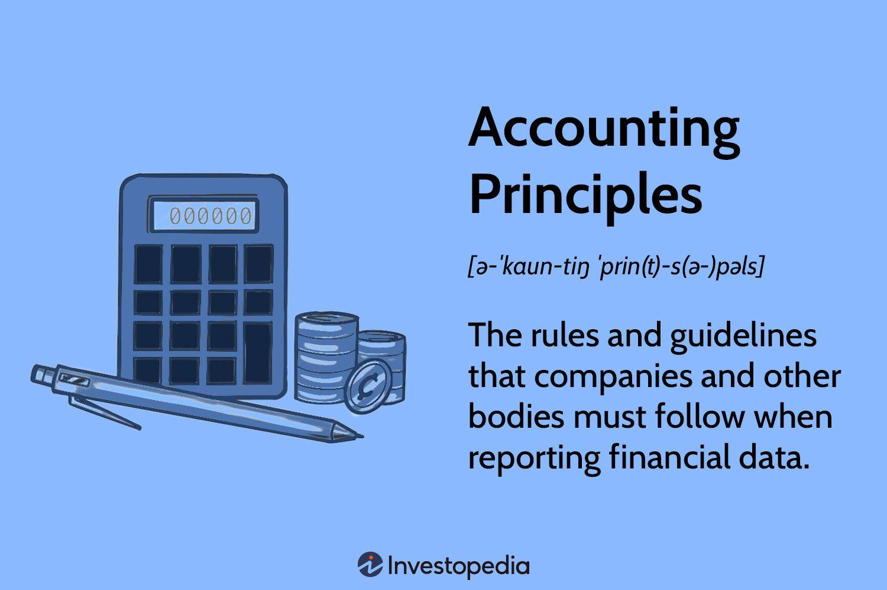

The integration of regulatory accounting principles (RAP) with algorithmic trading represents a pivotal focus in the landscape of financial markets. As algorithmic trading has become a dominant force, managing vast transaction volumes with minimal human intervention, understanding the underlying accounting frameworks has become increasingly important. Regulatory Accounting Principles were initially designed to assist financial institutions, specifically savings and loan associations, in meeting capital requirements by allowing them to depict a stronger financial position. The ramifications of these principles, which were partly implicated in the savings and loan crisis of the late 1980s, underscore the need to comprehend RAP within a historical context to appreciate its impact today.

Algorithmic trading, which leverages computational algorithms to execute trades at speeds and complexities beyond human capability, thrives on precise financial data and stringent regulatory adherence. Therefore, embedding RAP within algorithmic systems becomes a necessity to ensure compliance with financial regulations and enhance the accuracy of trading mechanisms. This fusion of accounting principles with advanced trading technologies aids in maintaining the integrity of financial data and facilitates the meticulous reporting required in financial markets.



This article investigates the role of RAP in shaping algorithmic trading practices, examining how these accounting guidelines are integrated into trading algorithms to ensure financial precision and regulatory conformity. Through this exploration, best practices for navigating the intersection of RAP and algorithmic trading are highlighted, offering insights into optimizing financial operations and achieving compliance in an evolving trading environment. Understanding this integration is essential for financial professionals aiming to leverage algorithmic trading while meeting regulatory requirements effectively.

## Table of Contents

## What Are Regulatory Accounting Principles (RAP)?

Regulatory Accounting Principles (RAP) were established as a framework to assist savings and loan associations, particularly during a period marked by financial instability in the banking sector. These principles were initially crafted to help these institutions meet specific regulatory capital requirements, a critical factor for their ongoing operations and solvency.

One of the core aspects of RAP was its ability to permit institutions with reduced net worth to maintain operations by allowing the artificial enhancement of reported profits. This was achieved through various accounting techniques and adjustments that diverged from traditionally accepted accounting practices. For example, RAP allowed for the capitalization of intangible assets or the deferral of certain losses, enabling institutions to present a more favorable financial position than what may have been genuinely reflective of their economic reality.

However, this flexibility in accounting treatment under RAP was not without consequence. The looseness of these principles eventually contributed to the savings and loan crisis of the late 1980s. During this crisis, many financial institutions that had relied heavily on RAP to report inflated profits and capital adequacy faced significant financial challenges when the underlying economic conditions could no longer support such optimistic financial presentations. The mismatch between reported financial health and actual fiscal stability led to widespread insolvency and regulatory intervention.

Understanding the historical shortcomings of RAP offers a crucial perspective on its application—or misapplication—in contemporary finance. This awareness emphasizes the importance of robust and realistic accounting frameworks, particularly in sectors where the temptation to favorably manipulate financial outcomes can be strong. The lessons learned from the RAP experience continue to inform the development of modern regulatory accounting standards, stressing the need for transparency, accuracy, and alignment with the true fiscal state of financial entities.

## Understanding Algorithmic Trading

Algorithmic trading involves the use of automated systems to [carry](/wiki/carry-trading) out trade executions based on pre-defined strategies and market data analysis. This type of trading system leverages algorithms to scan market conditions, assess trading signals, and execute orders at optimal prices, ideally without human intervention.

At the core of [algorithmic trading](/wiki/algorithmic-trading) is the reliance on financial data accuracy and real-time market monitoring. Algorithms need up-to-the-millisecond data to make decisions that are as informed and timely as possible. For instance, a slight delay in data might lead to a significant slippage or missed trading opportunity. Real-time monitoring ensures that the algorithms can modify their strategies dynamically, based on new information or sudden market shifts.

The integration of speed and efficiency in executing trades is a hallmark of algorithmic trading. Trading algorithms are designed to identify trading opportunities swiftly and execute actions almost instantaneously. This capacity has made algorithmic trading an indispensable element of contemporary financial markets, where the ability to process large volumes of trades quickly and accurately is crucial.

Despite these advancements, the challenge of linking accurate data with trading strategies persists. Data integrity and precision are paramount, as algorithms can only be as effective as the data they process. Furthermore, financial markets inherently involve uncertainty and [volatility](/wiki/volatility-trading-strategies); thus, continuous data validation and refinement of strategy models are necessary to maintain optimal algorithm performance.

In algorithmic trading, programming languages like Python are often employed to develop sophisticated trading algorithms. For example, the following simple Python code snippet outlines how one might begin setting up an algorithmic trading strategy using a popular library such as pandas for data manipulation:

```python
import pandas as pd

# Fetch market data
data = pd.read_csv('market_data.csv')

# Define a simple moving average strategy
data['SMA_50'] = data['Close'].rolling(window=50).mean()
data['SMA_200'] = data['Close'].rolling(window=200).mean()

# Generate signal
data['Signal'] = 0
data.loc[data['SMA_50'] > data['SMA_200'], 'Signal'] = 1
data.loc[data['SMA_50'] < data['SMA_200'], 'Signal'] = -1

# Output trading decisions
print(data[['Date', 'Close', 'Signal']])
```

In this script, a simple moving average crossover strategy is implemented, where the 'Signal' column dictates buying when the 50-day moving average surpasses the 200-day moving average, and selling otherwise. This serves as a foundational model, which can be enhanced in complexity by incorporating additional indicators for more robust trading systems.

Overall, mastering the integration of data accuracy within algorithmic trading is both a challenge and an opportunity. It involves continuous adaptation to market changes, verification of data validity, and refinement of the algorithms' predictive capabilities to optimize trading success.

## The Intersection of RAP and Algorithmic Trading

Algorithmic trading systems necessitate a solid foundation of accounting practices to ensure precise financial reporting and compliance with regulatory standards. Regulatory Accounting Principles (RAP) provide a framework that, when effectively integrated into algorithmic trading models, enhances both the accuracy of trading actions and adherence to regulatory requirements. 

In trading contexts, understanding RAP is paramount for compliance and strategic economic planning. RAP offers a set of guidelines that help in standardizing financial reporting, thus enabling institutions to maintain transparency in transactions. This transparency is crucial for algorithmic trading, as these systems rely heavily on accurate and real-time financial data. Algorithms programmed under the guidance of RAP are more likely to produce correct interpretations of financial conditions and ensure that trading operations align with legal standards.

Incorporating RAP within algorithmic models necessitates detailed attention to how financial accounts are maintained and reported. By embedding RAP into trading systems, financial institutions can preemptively identify discrepancies in financial data that could otherwise lead to significant operational and regulatory challenges. Furthermore, employing RAP-integrated algorithms aids financial analysts and traders in making more informed decisions, thus contributing to strategic economic planning.

However, strategies that misinterpret RAP principles or fail to adapt them to algorithmic contexts can lead to substantial financial and regulatory risks. For instance, if an algorithm bases its trading decisions on erroneous financial data due to improper RAP application, this can result in unexpected losses and potential regulatory penalties. Therefore, it is crucial for developers and financial experts to work collaboratively in ensuring that algorithmic strategies are consistently aligned with current accounting standards.

In conclusion, the intersection of RAP and algorithmic trading underscores the importance of robust accounting practices within automated trading platforms. Aligning these practices with algorithmic strategies not only optimizes financial performance but also mitigates the risks associated with non-compliance and financial inaccuracies. As financial markets evolve, the continuous integration and refinement of RAP principles in algorithmic trading will be vital in maintaining transparency and achieving optimal economic outcomes.

## Challenges and Considerations

The integration of diverse accounting standards from various jurisdictions into algorithmic trading models presents notable challenges. Financial markets operate under different regulatory frameworks, each with its own accounting principles and disclosure requirements. This heterogeneity complicates the development and implementation of algorithmic trading systems that must adhere to the regulatory accounting principles (RAP) relevant to each jurisdiction. As a result, traders and developers must ensure that algorithms are flexible and robust enough to adapt to these varying standards while maintaining compliance and financial accuracy.

Maintaining data integrity and accuracy is essential for the success of algorithmic trading. Algorithms heavily rely on real-time data to execute trades with precision. Any discrepancies or inaccuracies in data can lead to suboptimal trading decisions, financial losses, and potential violations of regulatory standards. To address this, systems must incorporate stringent data validation mechanisms. For instance, implementing checksum algorithms can help verify the integrity of incoming data. Additionally, employing redundancy and cross-verification from multiple data sources can further enhance data reliability.

Algorithmic trading environments are dynamic, with market conditions and financial instruments constantly evolving. As such, regular updates and refinement of trading algorithms are necessary. Developers must continuously monitor the performance of algorithms and make adjustments to address changes in market volatility, transaction costs, and other economic factors. This iterative process helps maintain the competitive edge of trading systems and ensures alignment with current financial conditions.

Mitigating risks associated with algorithm misinterpretation requires advanced data validation and simulation practices. Before deployment, algorithms should undergo rigorous [backtesting](/wiki/backtesting) using historical data to evaluate their performance under different market scenarios. Stress testing can help assess how algorithms behave during extreme market conditions, thus identifying potential risks. Simulation platforms can recreate market environments for testing the robustness of trading strategies, allowing developers to refine algorithms before they are used in real trading situations.

In conclusion, effectively navigating the challenges associated with varied accounting standards, data integrity, and algorithm updates is critical for optimizing algorithmic trading systems. A strategic approach to integrating RAP within trading algorithms not only ensures compliance but also enhances financial decision-making and risk management.

## Conclusion

Regulatory Accounting Principles (RAP) are critical in shaping the financial reporting frameworks within algorithmic trading platforms. By effectively aligning accounting systems with these trading strategies, both transparency and operational efficiency can be significantly enhanced. This alignment is crucial for optimizing financial operations, as it ensures that the data driving algorithmic decisions is both accurate and compliant with regulatory standards.

The dynamic nature of financial markets, coupled with the ever-evolving accounting standards, necessitates continuous education and adaptation. Participants in algorithmic trading must remain informed about changes in regulatory requirements and advances in accounting methodologies to maintain compliance and optimize trading strategies. This ongoing learning process is vital for navigating the complexities of the interaction between regulatory frameworks and automated trading environments.

Strategically integrating RAP principles into algorithmic strategies can facilitate comprehensive risk management. This integration is essential for identifying, assessing, and mitigating potential financial and regulatory risks that may arise from algorithm misinterpretations or inaccuracies in financial reporting. Furthermore, this approach can lead to maximized financial returns by ensuring that trading strategies are built on a foundation of accurate, reliable data that complies with the prevailing regulatory standards.

In conclusion, RAPs are indispensable for sound financial governance within algorithmic trading platforms. Their integration not only supports compliance but also enhances the overall effectiveness and reliability of automated trading strategies. As financial markets continue to evolve, those adept at harmonizing accounting principles with technological advancements will be best positioned to seize opportunities and manage risks effectively.

## References & Further Reading

[1]: White, L. J. (1991). ["The S&L Debacle: Public Policy Lessons for Bank and Thrift Regulation."](https://archive.org/details/sldebaclepublic00whit) Oxford University Press.

[2]: Benos, E., & Sagade, S. (2016). ["Price Discovery and the Cross-Section of High-Frequency Trading."](https://papers.ssrn.com/sol3/papers.cfm?abstract_id=2184302) Bank of England Working Paper No. 586.

[3]: Jarrow, R. A., & Protter, P. (2010). ["A Short History of Stochastic Integration and Mathematical Finance: The Early Years, 1880-1970."](https://www.ma.imperial.ac.uk/~ajacquie/IC_AMDP/IC_AMDP_Docs/Literature/Jarrow_Protter_History_Stochastic_Integration.pdf) Mathematical Finance, 20(1), 1-29.

[4]: Hendershott, T., Jones, C. M., & Menkveld, A. J. (2011). ["Does Algorithmic Trading Improve Liquidity?"](https://onlinelibrary.wiley.com/doi/full/10.1111/j.1540-6261.2010.01624.x) The Review of Financial Studies, 24(8), 2523-2554.

[5]: Biais, B., Foucault, T., & Moinas, S. (2015). ["Equilibrium Algorithmic Trading."](https://www.sciencedirect.com/science/article/abs/pii/S0304405X15000288) The Review of Economic Studies, 82(2), 481-511.