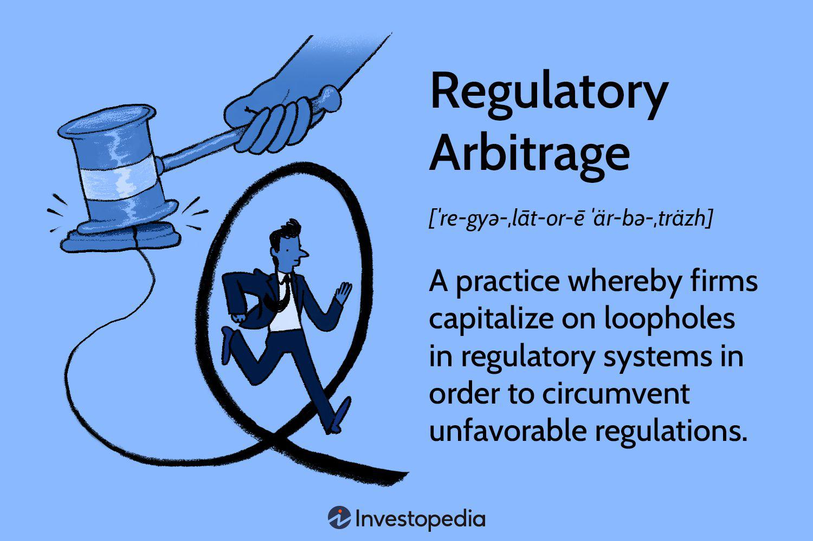

## Table of Contents

## What is regulatory arbitrage?

Regulatory arbitrage is when businesses or people take advantage of differences in rules between different places or systems. They do this to get a better deal or to avoid strict rules. For example, a company might move its operations to a country with lower taxes or fewer regulations. This way, they can make more money or have fewer restrictions on what they can do.

This practice can lead to problems. It can make it harder for governments to control businesses and can create unfair competition. Companies that use regulatory arbitrage might have an advantage over those that follow stricter rules. This can also lead to a "race to the bottom," where countries lower their standards to attract businesses, which can harm workers, consumers, and the environment.

## Why do companies engage in regulatory arbitrage?

Companies engage in regulatory arbitrage mainly to save money and gain a competitive edge. By moving their operations to places with lower taxes or fewer regulations, they can reduce their costs. For example, if a company moves to a country with lower corporate taxes, it keeps more of its profits. This extra money can be used to grow the business, pay higher dividends to shareholders, or invest in new projects. It's like shopping around for the best deal, but instead of buying a product, they're choosing where to do business.

Another reason is to avoid strict rules that might limit what they can do. Some places have tight regulations on things like labor, the environment, or data privacy. By moving to a place with looser rules, a company can operate more freely. This can be especially appealing for industries like finance or tech, where regulations can be complex and costly to follow. However, this practice can lead to problems, like unfair competition and a race to the bottom where countries lower their standards to attract businesses.

## Can you provide a simple example of regulatory arbitrage?

Imagine there are two countries, Country A and Country B. Country A has high taxes on businesses, while Country B has low taxes. A company that makes toys decides to move its factory from Country A to Country B. By doing this, the toy company pays less in taxes and keeps more of its money. This is an example of regulatory arbitrage because the company is taking advantage of the difference in tax rules between the two countries.

This move helps the toy company save money, but it can also cause problems. Other companies in Country A that can't move might feel it's unfair. They still have to pay high taxes, which could make it harder for them to compete. Also, Country A might lose jobs and tax money when companies leave. So, while regulatory arbitrage can help one company, it can create bigger issues for countries and other businesses.

## What are the different types of regulatory arbitrage?

Regulatory arbitrage can take different forms, but they all involve using differences in rules to gain an advantage. One type is tax arbitrage, where companies move to places with lower taxes to keep more of their money. For example, a business might set up in a country with a low corporate tax rate to save on taxes. Another type is regulatory environment arbitrage, where companies choose to operate in countries with fewer rules. This can help them avoid costs and restrictions that might come with stricter regulations on things like labor, the environment, or data privacy.

Another form is financial regulatory arbitrage, where companies or investors take advantage of different financial rules in different places. For example, they might move money to a country with less strict banking rules to do things they can't do at home. Lastly, there's product regulatory arbitrage, where companies sell products in places with fewer rules on safety or quality. This can let them sell products that might not be allowed in stricter markets. Each type of regulatory arbitrage helps companies save money or operate more freely, but it can also create unfair competition and other problems.

## How does regulatory arbitrage affect financial markets?

Regulatory arbitrage can make financial markets more complex and harder to control. When companies or investors move money to places with fewer rules, it can be harder for regulators to keep track of what's happening. This can lead to more risk in the financial system because some people might take bigger chances in places with less oversight. It can also create unfair advantages. Companies that use regulatory arbitrage might make more money than those that follow stricter rules, which can lead to unfair competition and less trust in the market.

On the other hand, regulatory arbitrage can also push countries to improve their rules. When companies move to places with better regulations, other countries might see the benefits and try to catch up. This can lead to better rules overall, making financial markets safer and more fair. But it's a tricky balance. While regulatory arbitrage can drive positive changes, it can also cause problems if it's not managed well.

## What are the ethical implications of regulatory arbitrage?

Regulatory arbitrage raises big ethical questions. When companies move to places with fewer rules to save money or avoid restrictions, it can feel unfair. Other companies that stay and follow the strict rules might struggle to compete. This can hurt workers, the environment, and even whole countries that lose jobs and money when businesses leave. It's like some companies are playing by different rules, which can make people lose trust in the system.

On the other hand, regulatory arbitrage can also push countries to improve their rules. If companies move to places with better regulations, other countries might see the benefits and try to catch up. This can lead to better rules overall, making things safer and more fair for everyone. But it's a tricky balance. While regulatory arbitrage can drive positive changes, it can also cause big problems if it's not managed well. So, it's important to think about the ethical side and find ways to make sure everyone plays by rules that are fair and good for society.

## How do regulators attempt to combat regulatory arbitrage?

Regulators try to stop regulatory arbitrage by making rules more alike across different places. They work together with other countries to set common standards. This way, companies can't just move to places with fewer rules to save money or avoid restrictions. For example, international groups like the OECD help countries agree on things like tax rules, so companies can't easily move to lower-tax places. By making rules more similar, regulators hope to make it harder for companies to take advantage of differences.

Another way regulators fight regulatory arbitrage is by keeping a close eye on what companies are doing. They might check if companies are moving for good reasons or just to dodge rules. If they find companies are moving to avoid regulations, they can take action. This might mean making the rules even stricter or punishing companies that break them. By watching closely and acting when needed, regulators try to make sure companies play fair and follow the rules, no matter where they are.

## Can you discuss a historical case where regulatory arbitrage had significant impacts?

One famous case of regulatory arbitrage happened with the Enron scandal in the early 2000s. Enron was a big energy company that used a trick called "special purpose entities" to hide its debts and make its profits look bigger. They did this by setting up these entities in places with fewer rules, like the Cayman Islands. By moving money around and using these places with lighter regulations, Enron made it hard for people to see what was really going on. This let them fool investors and keep their stock prices high, even though the company was in big trouble.

The Enron scandal had huge impacts. When people found out what Enron was doing, the company went bankrupt, and thousands of people lost their jobs. It also shook people's trust in the stock market and big companies. After Enron, the government made new rules to stop this kind of regulatory arbitrage. They passed laws like the Sarbanes-Oxley Act, which made companies report their finances more clearly and honestly. This case showed how dangerous regulatory arbitrage can be and why it's important to have strong rules to protect everyone.

## What are the legal risks associated with regulatory arbitrage?

When companies use regulatory arbitrage, they can face big legal risks. If they move to places with fewer rules to save money or avoid restrictions, they might break laws in their home country. For example, if a company moves money to a place with less strict banking rules, they could be breaking rules about moving money across borders. If they get caught, they might have to pay big fines or even go to jail. This can hurt the company's reputation and make it hard for them to do business in the future.

Regulators are always watching for companies that use regulatory arbitrage. They might work together with other countries to catch companies that are trying to dodge rules. If regulators find out a company is using regulatory arbitrage to do something wrong, they can take action. This might mean making the rules stricter or punishing the company. So, while regulatory arbitrage might seem like a good way to save money, the legal risks can be very serious and costly.

## How does regulatory arbitrage influence global financial regulation?

Regulatory arbitrage makes it hard for countries to keep their financial rules strong. When companies move to places with fewer rules to save money or avoid restrictions, it can start a race to the bottom. Countries might lower their standards to attract these companies, which can make the whole financial system less safe. This is why countries work together to make their rules more alike. Groups like the OECD help set common standards so companies can't easily move to places with lighter regulations. By making rules more similar, regulators hope to stop companies from taking advantage of differences and keep the financial system fair and safe.

On the other hand, regulatory arbitrage can also push countries to make their rules better. When companies move to places with better regulations, other countries might see the benefits and try to catch up. This can lead to stronger rules overall, making financial markets safer and more fair for everyone. But it's a tricky balance. While regulatory arbitrage can drive positive changes, it can also cause big problems if it's not managed well. So, regulators need to keep a close eye on what companies are doing and make sure everyone plays by rules that are good for society.

## What role does technology play in facilitating regulatory arbitrage?

Technology makes it easier for companies to use regulatory arbitrage. With the internet and computers, companies can move money and data around the world quickly. They can set up businesses in different countries without even leaving their office. This means they can take advantage of places with fewer rules more easily. For example, a company might use technology to move its data to a country with less strict privacy laws. This can save them money and let them do things they can't do at home.

But technology also helps regulators fight back. They use computers and data to watch what companies are doing. They can track money moving across borders and see if companies are trying to dodge rules. This makes it harder for companies to use regulatory arbitrage without getting caught. So, while technology can make regulatory arbitrage easier, it also helps regulators keep an eye on things and make sure companies play fair.

## What advanced strategies are used in regulatory arbitrage by expert practitioners?

Expert practitioners in regulatory arbitrage often use advanced strategies like setting up complex financial structures. They might create special purpose entities in different countries to take advantage of different rules. For example, they might use these entities to move money around and hide debts or profits. This can make it hard for regulators to see what's really going on. They might also use technology to quickly move data and money across borders, taking advantage of places with fewer rules on things like privacy or taxes.

Another strategy is to use loopholes in the rules. Expert practitioners look for small differences between countries' regulations and use them to their advantage. They might move parts of their business to a country with a specific rule that helps them save money or avoid restrictions. They also keep a close eye on changes in regulations and move quickly to take advantage of new opportunities. This requires a deep understanding of the rules in many places and the ability to act fast when things change.

These strategies can be very effective, but they also come with big risks. If regulators catch companies using these advanced tactics, they might face big fines or even jail time. The companies' reputations can also be hurt, making it hard for them to do business in the future. So, while these strategies can help companies save money and gain an edge, they need to be very careful and make sure they're not breaking any laws.

## References & Further Reading

[1]: Zohar, I., Giladi, R., & Lorenz, J. (2017). ["Regulatory Arbitrage and the Economics of Financial Regulation."](https://www.sciencedirect.com/science/article/pii/S0304405X1830237X) In Advances in Human Factors in Cybersecurity, Springer.

[2]: Biais, B., Foucault, T., & Moinas, S. (2015). ["Equilibrium Fast Trading."](https://www.sciencedirect.com/science/article/abs/pii/S0304405X15000288) The Review of Financial Studies, 28(7), 1810-1857.

[3]: Marcos, C. (2013). ["Regulatory Arbitrage in Practice: The Case of Derivatives Trading in the United States and Europe."](https://link.springer.com/chapter/10.1007/978-3-030-70530-5_8) International Review of Administrative Sciences, 79(4), 681-702.

[4]: Easley, D., López de Prado, M. M., & O'Hara, M. (2012). ["The Volume Clock: Insights into the High-Frequency Paradigm."](https://papers.ssrn.com/sol3/papers.cfm?abstract_id=2034858) The Review of Financial Studies, 25(5), 1457-1493.

[5]: Cumming, D. J., & Johan, S. A. (2013). ["High Frequency Trading and Market Quality."](https://abdn.elsevierpure.com/en/publications/venture-capital-and-private-equity-contracting-an-international-p) Journal of Financial Markets, 16(4), 611-641.