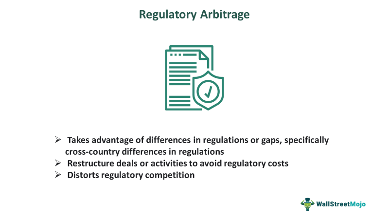

Regulatory arbitrage and algorithmic trading have become integral components of the contemporary financial market landscape. Algorithmic trading leverages computer algorithms to execute trades at speeds and volumes unattainable by human traders. These algorithms analyze market data in real-time, allowing for rapid decision-making and precise trade execution, thus offering significant advantages in terms of market liquidity and price discovery.

Regulatory arbitrage, on the other hand, involves the strategic manipulation of disparate regulatory frameworks to minimize burdens or maximize profitability. This practice takes advantage of varying regulations across regions or countries, allowing financial entities to operate more efficiently or cost-effectively. However, it raises ethical questions as it often undermines the spirit of the regulations designed to maintain orderly and transparent markets.



This article examines the interplay between regulatory arbitrage and algorithmic trading, focusing on their collective impact on financial markets and the inherent challenges they present. In doing so, it aims to shed light on the necessity of balancing innovation in financial strategies with the evolving regulatory landscape to ensure market stability and integrity.

## Table of Contents

## Understanding Regulatory Arbitrage

Regulatory arbitrage refers to the strategic exploitation of differences in regulatory frameworks to achieve optimal financial outcomes. This practice can arise when institutions or individuals capitalize on the disparities between jurisdictions, thereby minimizing regulatory burdens or enhancing profitability. Although regulatory arbitrage can stimulate financial innovation and efficiency, it can also lead to ethical concerns, as it often circumvents the protective intentions of financial regulations.

The concept of regulatory arbitrage is frequently associated with the use of tax havens, where corporations shift profits to low-tax jurisdictions to reduce their overall tax liability. Another common example includes exploiting regulatory discrepancies in capital requirements, where financial institutions might relocate operations to jurisdictions with less stringent capital reserve mandates, thereby releasing more capital for potentially riskier investments.

This phenomenon raises significant ethical and systemic challenges. The ability of firms to maneuver through or around regulations can undermine regulatory authorities' efforts to maintain market stability, protect consumers, or ensure fair competition. This potential undermining underscores the critical need for the continuous evolution of regulatory frameworks. Regulators are tasked with the intricate challenge of closing loopholes that facilitate such arbitrage while accommodating legitimate financial innovation and growth.

To balance these needs, more adaptable and harmonized regulatory approaches may be required, potentially involving international cooperation and agreements. These changes would aim to reduce regulatory fragmentation and lessen the incentives for regulatory [arbitrage](/wiki/arbitrage), promoting a more equitable and stable global financial environment.

## Algorithmic Trading and Its Influence

Algorithmic trading, characterized by the use of computer algorithms to automate the execution of trades, has fundamentally altered the landscape of modern financial markets. By leveraging intricate mathematical models and sophisticated software systems, [algorithmic trading](/wiki/algorithmic-trading) enables the rapid execution of trades, often within fractions of a second. This rapid execution enhances market [liquidity](/wiki/liquidity-risk-premium), ensuring that there are always buyers and sellers in the market, and contributes significantly to improving price discovery mechanisms as it allows prices to reflect all available information promptly.

One of the primary advantages of algorithmic trading is its ability to handle large volumes of trades efficiently. Algorithms can monitor multiple markets and securities simultaneously, executing trades based on predefined criteria without the need for human intervention. This efficiency can result in reduced transaction costs and improved accuracy in trade execution.

Despite its advantages, algorithmic trading introduces complexities that necessitate robust risk management and adherence to regulatory frameworks. The potential for market manipulation, such as creating artificial volumes or misleading price signals, is a significant concern. Consequently, regulatory bodies continuously work to update frameworks to prevent such scenarios. Strategies like circuit breakers and stringent compliance checks are implemented to mitigate risks associated with algorithmic trading.

Furthermore, as technology progresses, algorithmic trading strategies need to evolve to maintain their effectiveness. Incorporating cutting-edge technologies such as [machine learning](/wiki/machine-learning) and [artificial intelligence](/wiki/ai-artificial-intelligence) can enhance algorithm adaptability to market conditions. These technologies enable the development of self-learning algorithms that adjust parameters based on historical data and predictive analytics, offering traders a more intelligent approach to the ever-changing market dynamics. As such, algorithmic trading remains a critical component of modern finance, balancing the benefits of technology with the necessity for risk management and regulatory compliance.

## Types of Arbitrage Strategies

Arbitrage strategies in financial trading exploit price differences across various markets and financial instruments. These strategies rely on advanced algorithms and technology to efficiently identify and execute profitable opportunities. Understanding the different types of arbitrage strategies is essential for traders aiming to capitalize on market inefficiencies.

Spatial Arbitrage involves purchasing and selling the same security in different markets to profit from price discrepancies. Imagine a scenario where a security is priced differently on two separate exchanges. Traders can buy the security on the exchange with the lower price and sell it on the one with the higher price, thus capturing the spread as profit. Spatial arbitrage requires quick execution and is heavily dependent on low-latency trading systems to capitalize on these fleeting opportunities.

Statistical Arbitrage utilizes mathematical and statistical models to spot pricing anomalies between correlated securities. This approach typically involves trading a basket of securities and relies on mean reversion principles. The basic idea is that prices that deviate from their expected statistical relationship will eventually revert to the mean. Implementing [statistical arbitrage](/wiki/statistical-arbitrage) often involves complex algorithms that can analyze large datasets to predict these return dynamics effectively.

Index Arbitrage takes advantage of price differences between stock index futures and their constituent underlying stocks. When disparities arise between the futures price and the theoretical value of the index, traders can simultaneously buy or sell the futures contract and take the opposite position in the underlying stocks, profiting from the convergence of prices. The formula for theoretical futures price $F$ often used is: 
$$

F = S \times e^{(r - d) \times t} 
$$
where $S$ is the spot price of the index, $r$ is the risk-free interest rate, $d$ is the dividend yield, and $t$ is the time to maturity. Precision and speed are crucial, as these price differences can rapidly close due to arbitrage activities.

Merger Arbitrage, also known as risk arbitrage, focuses on trading stocks of companies involved in mergers or acquisitions. The strategy exploits the price movement of the target company’s stock, which tends to increase when a merger announcement is made, yet usually stays below the acquisition price. Traders anticipate the completion of the merger and thus purchase the target company’s stock, betting that the deal will conclude at the proposed offer price. This type of arbitrage requires thorough due diligence to evaluate the probability of the merger's success and to manage the associated risks. 

These arbitrage strategies can lead to significant profits, but they require sophisticated technology and a deep understanding of market mechanics and risks. Each strategy has its unique challenges and requires continuous adaptation to changing market conditions and advancements in trading technology.

## The Role of Technology in Arbitrage Trading

Technology has significantly transformed the landscape of arbitrage trading, primarily through advancements that enable high-frequency trading ([HFT](/wiki/high-frequency-trading-strategies)). HFT leverages technology to execute trades at exceptionally high speeds, often within milliseconds, which is crucial for capitalizing on brief pricing inefficiencies across markets. The cornerstone of effective arbitrage trading lies in the capacity for real-time data collection and automated trade execution. These processes eliminate human delays in decision-making, allowing traders to exploit even minute price discrepancies efficiently.

The role of advanced computing resources in arbitrage trading cannot be overstated. High-performance computing systems process vast amounts of market data rapidly, facilitating the quick identification of arbitrage opportunities. Sophisticated algorithms are developed to analyze complex market trends and execute trades based on pre-programmed criteria. For instance, algorithms may use statistical models to predict price movements or detect correlations between different financial instruments.

Consider the following pseudo-code example demonstrating a simple statistical arbitrage strategy algorithm:
```python
import numpy as np

# Prices of correlated assets
asset1_prices = np.array([100, 102, 101, 104, 102])
asset2_prices = np.array([50, 52, 51, 53, 52])

# Calculate the spread
spread = asset1_prices - 2 * asset2_prices

# Mean and standard deviation of the spread
spread_mean = np.mean(spread)
spread_std = np.std(spread)

# Trade signals
for i in range(len(spread)):
    if spread[i] < spread_mean - spread_std:
        print(f"Buy asset1 and sell asset2 at index {i}")
    elif spread[i] > spread_mean + spread_std:
        print(f"Sell asset1 and buy asset2 at index {i}")
```

Continuous technology upgrades are essential in maintaining competitiveness within the fast-paced financial markets. As computational technologies evolve, so too must the infrastructures supporting arbitrage strategies. These upgrades ensure that systems remain capable of handling increasing volumes of data and executing trades with minimal latency.

In conclusion, technology plays a fundamental role in arbitrage trading, offering the speed, precision, and capacity necessary to thrive in competitive market environments. As markets and technologies advance, the integration of these innovations remains integral to the sustained success and evolution of arbitrage strategies.

## Challenges in Arbitrage Algorithmic Trading

Arbitrage algorithmic trading, while offering numerous opportunities for profit, encounters several significant challenges that must be managed effectively to optimize outcomes. A primary concern is latency; even milliseconds of delay can nullify potential arbitrage opportunities. High-frequency trading (HFT) systems rely on rapid execution speeds to capitalize on minuscule price discrepancies, requiring state-of-the-art hardware and proximity to financial exchanges to reduce latency. For instance, a delay as small as one millisecond could make the difference between a profitable trade and a missed opportunity.

Another critical challenge is transaction costs. Arbitrage strategies typically involve a high [volume](/wiki/volume-trading-strategy) of trades, which can lead to substantial commissions and fees. These costs can erode profit margins, making efficient cost management essential. The relationship between successful arbitrage and transaction costs can be represented as:

$$
\text{Net Profit} = (\text{Price Difference} \times \text{Trade Volume}) - \text{Transaction Costs}
$$

Therefore, minimizing these costs is crucial for maintaining profitability.

Market impact presents another formidable challenge. Large trades executed within short time frames can influence market prices, negating the initial price advantage and reducing potential profits. This impact necessitates sophisticated trading algorithms that can manage execution sizes strategically and mitigate market disturbances.

Moreover, compliance with regulations is paramount in avoiding legal issues. The dynamic nature of global financial markets results in frequently evolving regulations, posing compliance challenges for firms engaged in arbitrage. Maintaining a robust legal framework and adhering to these regulations is essential to sustainable operations. Firms must continually update their practices to comply with new rules and guidelines, often requiring expert legal consultation and automated compliance systems.

Thus, successful arbitrage algorithmic trading demands a comprehensive approach, incorporating cutting-edge technology, cost efficiency, strategic trade execution, and stringent regulatory compliance to navigate these challenges effectively.

## Conclusion

Regulatory arbitrage and algorithmic trading represent influential yet intricate components of modern financial markets. These strategies provide significant opportunities for profit, exploiting regulatory mismatches or leveraging the speed and efficiency of computers in trading. However, the potential gains come with substantial challenges that necessitate meticulous management.

One of the primary concerns is compliance with financial regulations, which are continually evolving to address new market complexities. Engaging in regulatory arbitrage without violating legal boundaries requires a deep understanding of both domestic and international financial laws. Companies must navigate these regulations carefully to minimize legal risks and ensure ethical operations.

Risk management is another crucial aspect of these strategies. Algorithmic trading, due to its automated nature, can magnify risks rapidly if not properly controlled. Robust risk management practices, such as implementing stringent algorithm testing and monitoring systems, are imperative to prevent adverse market impacts. These systems help detect anomalies or malfunctions that could lead to unintended trades or market destabilization.

The dynamic nature of technology and financial regulations demands ongoing dialogue between market participants, regulators, and technologists. As technology continues to advance, ensuring that innovations align with regulatory frameworks is critical to maintaining market integrity and investor trust. Open communication can aid in crafting regulations that foster innovation while safeguarding against systemic risks.

Balancing innovation and compliance is a continuous endeavor. Market participants must remain agile to adapt to technological and regulatory changes, employing strategies that align with the goals of financial stability and growth.

## Frequently Asked Questions

### What is arbitrage algorithmic trading?

Arbitrage algorithmic trading is a financial strategy where computer algorithms automatically execute trades to exploit price discrepancies in different markets or securities. This approach leverages speed, precision, and the ability to process vast amounts of data in real-time to identify and capitalize on arbitrage opportunities. The goal is to achieve profits through price differences with minimal risk. Algorithmic trading systems are designed to rapidly execute transactions across multiple platforms, ensuring that opportunities are seized before the market adjusts.

### What are the main types of arbitrage strategies?

Arbitrage strategies are designed to exploit price differentials in various forms. The primary types include:

1. **Spatial Arbitrage**: This involves purchasing and selling the same asset in different markets where it is listed at varying prices. The strategy capitalizes on geographical price mismatches.

2. **Statistical Arbitrage**: Employing sophisticated mathematical models and statistical techniques, this strategy identifies price disparities between correlated securities, executing trades accordingly.

3. **Index Arbitrage**: This method exploits pricing inefficiencies between stock index futures and the underlying stocks. Traders profit by arbitrating the discrepancies between the index and the component securities.

4. **Merger Arbitrage**: In this strategy, traders invest in companies involved in mergers or acquisitions, predicting price movements based on the anticipated success of the transactions.

### How does arbitrage algorithmic trading work?

Arbitrage algorithmic trading operates by using advanced algorithms to detect pricing inefficiencies. These algorithms analyze vast quantities of market data, identifying opportunities to buy low and sell high across different markets. Once an opportunity is detected, the algorithm executes trades within milliseconds, capitalizing on the price differences. For example, consider an exchange rate differential where currency $A$ is undervalued in one market compared to another. The algorithm would buy currency $A$ in the cheaper market and sell it in the more expensive market, profiting from the discrepancy. The entire process—from detection to execution—is automated, ensuring maximum efficiency and minimal delay.

### What technology is required for arbitrage algorithmic trading?

Arbitrage algorithmic trading necessitates a robust technological infrastructure, including:

- **High-Frequency Trading Systems**: These systems are capable of executing trades in fractions of a second, crucial for exploiting fleeting arbitrage opportunities.

- **Real-Time Data Feeds**: Access to live market data streams is essential for continuously monitoring price movements across different venues.

- **Advanced Computational Resources**: High-performance computers equipped with powerful processors and memory handle complex calculations and data processing swiftly.

- **Sophisticated Algorithms**: Algorithms incorporating statistical models and machine learning are integral for identifying profitable trades and adapting to dynamic market conditions.

### What are the challenges in arbitrage algorithmic trading?

While potentially lucrative, arbitrage algorithmic trading faces several challenges:

- **Latency**: Even minimal lag between data reception and trade execution can result in missed opportunities. Technical infrastructure must minimize latency to capitalize on rapid market changes.

- **Transaction Costs**: Fees associated with trading can erode profit margins. Efficient cost management is crucial to maintain profitability.

- **Market Impact**: Large trades might inadvertently affect market prices, diminishing potential gains.

- **Regulation**: Adherence to financial regulations is mandatory to avoid legal penalties. As regulatory landscapes evolve, staying compliant poses a continuous challenge.

Managing these challenges requires continuous optimization of algorithms, technology, and strategic approaches to trading.

## References & Further Reading

[1]: ["Advances in Financial Machine Learning"](https://www.amazon.com/Advances-Financial-Machine-Learning-Marcos/dp/1119482089) by Marcos Lopez de Prado

[2]: Gomber, P., Arndt, B., Lutat, M., & Uhle, T. (2011). "High-Frequency Trading." *SSRN Electronic Journal*. [https://doi.org/10.2139/ssrn.1858626](https://papers.ssrn.com/sol3/papers.cfm?abstract_id=1858626)

[3]: ["Algorithmic Trading and DMA: An introduction to direct access trading strategies"](https://www.amazon.com/Algorithmic-Trading-DMA-introduction-strategies/dp/0956399207) by Barry Johnson

[4]: Zingales, L. (2004). “The Costs and Benefits of Financial Market Regulation.” *European Corporate Governance Institute*. [https://doi.org/10.2139/ssrn.536682](https://papers.ssrn.com/sol3/papers.cfm?abstract_id=536682)

[5]: Harris, L. (2003). ["Trading and Exchanges: Market Microstructure for Practitioners"](https://www.amazon.com/Trading-Exchanges-Market-Microstructure-Practitioners/dp/0195144708) Oxford University Press.

[6]: Fox, M. B., & White, H. (2015). “High-Frequency Trading: Background, Concerns, and Regulatory Responses.” *Annual Review of Financial Economics*, 7(1), 301-320. [https://doi.org/10.1146/annurev-financial-111914-041839](https://doi.org/10.1146/annurev-financial-111914-041839)