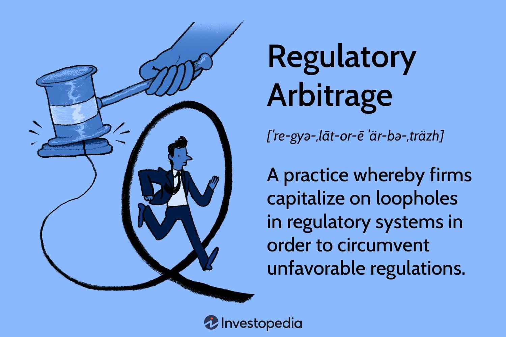

## Table of Contents

## What is regulatory arbitrage?

Regulatory arbitrage is when businesses take advantage of differences in rules between different places or industries. They do this to save money, reduce restrictions, or gain other benefits. For example, a company might move some of its operations to a country with less strict financial regulations to avoid high costs or tight controls at home.

This practice can lead to problems. It can make it harder for governments to control businesses and protect consumers. When companies move to places with weaker rules, it can create unfair competition. This can also lead to a "race to the bottom," where countries keep lowering their standards to attract businesses, which can harm overall safety and fairness in the market.

## How does regulatory arbitrage work?

Regulatory arbitrage happens when companies find and use differences in rules between different places or industries. They do this to save money, avoid strict rules, or get other benefits. For example, a bank might move some of its business to a country with lighter financial rules. This way, the bank can do things that might not be allowed or would be more expensive in its home country.

This practice can cause problems. It can make it hard for governments to keep businesses in check and protect people. When companies move to places with weaker rules, it can make competition unfair. Other companies that follow the stricter rules might lose out. This can also start a "race to the bottom," where countries keep lowering their standards to attract businesses. This can make things less safe and fair for everyone.

## What are some common examples of regulatory arbitrage?

One common example of regulatory [arbitrage](/wiki/arbitrage) is in the financial sector. Banks and other financial firms sometimes move their operations to countries with lighter regulations. This lets them do things like taking bigger risks or charging higher fees that might not be allowed back home. For instance, a bank might set up a branch in a country with less strict rules on how much money they need to keep on hand. This can help the bank make more money, but it can also be riskier for customers and the economy.

Another example is in the tech industry. Big tech companies often use regulatory arbitrage by storing user data in countries with weaker privacy laws. This can help them avoid strict data protection rules in their home countries. For example, a company might keep its data servers in a country where the government doesn't require strong privacy protections. This can make it easier for the company to collect and use data, but it can also put users' privacy at risk.

In the pharmaceutical industry, companies might use regulatory arbitrage by conducting clinical trials in countries with less strict rules. This can speed up the process of getting new drugs approved and onto the market. For example, a drug company might choose to do its trials in a country where it's easier to get approval for testing on humans. While this can help get new treatments to patients faster, it can also raise safety concerns if the trials are not as thorough as they would be in countries with stricter regulations.

## Why do companies engage in regulatory arbitrage?

Companies engage in regulatory arbitrage mainly to save money and gain more freedom in how they run their business. By moving operations to places with lighter rules, they can cut costs. For example, they might pay less in taxes or avoid fees that come with strict regulations. This can make their products or services cheaper, helping them compete better in the market. Also, by choosing places with fewer rules, companies can do things that might be restricted at home, like taking bigger financial risks or collecting more data from customers.

But it's not just about money and freedom. Sometimes, companies use regulatory arbitrage to get their products to market faster. For instance, in the drug industry, a company might do its tests in a country where it's easier to get approval for human trials. This can speed up the process of bringing new medicines to patients. However, while this can help companies grow and innovate, it can also lead to problems. It can make it harder for governments to protect consumers and ensure fair competition, and it might put people's safety or privacy at risk.

## What are the potential benefits of regulatory arbitrage for businesses?

Companies use regulatory arbitrage to save money and have more freedom in how they run their business. By moving to places with lighter rules, they can cut costs. For example, they might pay less in taxes or avoid fees that come with strict regulations. This can make their products or services cheaper, helping them compete better in the market. Also, by choosing places with fewer rules, companies can do things that might be restricted at home, like taking bigger financial risks or collecting more data from customers.

Another benefit is that regulatory arbitrage can help companies get their products to market faster. For instance, in the drug industry, a company might do its tests in a country where it's easier to get approval for human trials. This can speed up the process of bringing new medicines to patients. By using regulatory arbitrage, businesses can grow and innovate more quickly, which can be good for them and their customers.

## What are the risks associated with regulatory arbitrage?

Regulatory arbitrage can be risky for everyone involved. When companies move to places with weaker rules, it can be hard for governments to keep them in check and protect people. This can make it unfair for other companies that follow the stricter rules. They might lose out in the competition because they have to spend more money or follow more rules. Also, when companies move to countries with lighter regulations, it can start a "race to the bottom." This is when countries keep lowering their standards to attract businesses. This can make things less safe and fair for everyone.

Another big risk is that regulatory arbitrage can put people's safety and privacy at risk. For example, if a bank moves to a country with less strict rules, it might take bigger risks with people's money. This can be dangerous for customers and the whole economy. In the tech world, companies might store user data in countries with weaker privacy laws. This can make it easier for the company to collect and use data, but it can also put users' privacy at risk. Overall, while regulatory arbitrage can help businesses save money and grow faster, it can also lead to big problems for consumers and the market.

## How do regulators attempt to combat regulatory arbitrage?

Regulators try to stop regulatory arbitrage by making rules more similar across different places. They work together with other countries to create common standards. This way, companies can't just move to a place with lighter rules to avoid strict ones at home. For example, in the financial world, countries might agree on rules about how much money banks need to keep on hand. This makes it harder for banks to move to countries with weaker rules to take bigger risks.

Regulators also keep a close eye on companies to make sure they follow the rules. They might use special teams to check if companies are trying to use regulatory arbitrage. If they find a company breaking the rules, they can fine them or make them follow the stricter rules. This can make companies think twice before trying to take advantage of differences in regulations. By working together and watching companies closely, regulators try to make the market fair and safe for everyone.

## Can you explain a case study where regulatory arbitrage had a significant impact?

One big example of regulatory arbitrage happened with the company Enron in the early 2000s. Enron used a type of regulatory arbitrage called "special purpose entities" (SPEs) to hide its debts and make its financial situation look better than it really was. By setting up these SPEs in places with less strict rules, Enron was able to keep a lot of its debt off its main financial reports. This made it look like the company was doing much better than it actually was. Investors thought Enron was a safe and profitable company, so they kept putting money into it.

But in the end, Enron's use of regulatory arbitrage led to one of the biggest corporate scandals in history. When the truth about Enron's debts came out, the company's stock price crashed, and it went bankrupt. This caused a lot of people to lose their jobs and their savings. The Enron scandal showed how dangerous regulatory arbitrage can be. It made it clear that when companies use these tricks to get around the rules, it can hurt a lot of people and shake trust in the whole market. After the Enron scandal, the U.S. government made new rules to try to stop this kind of regulatory arbitrage from happening again.

## What are the ethical considerations surrounding regulatory arbitrage?

Regulatory arbitrage raises big ethical questions. Companies use it to save money and grow faster, but they do this by moving to places with weaker rules. This can be unfair to other companies that follow the stricter rules. It can also be bad for people who might lose their jobs or savings if a company takes too many risks. When companies use regulatory arbitrage, they are often putting their own profits ahead of what's good for society. This can make people question if it's right for companies to use these tricks to get around the rules.

Also, regulatory arbitrage can harm people's safety and privacy. For example, if a bank moves to a country with less strict rules, it might take bigger risks with people's money. This can be dangerous for customers and the whole economy. In the tech world, companies might store user data in countries with weaker privacy laws. This can make it easier for the company to collect and use data, but it can also put users' privacy at risk. So, while regulatory arbitrage can help businesses, it can also lead to big problems for consumers and the market. This raises the question of whether it's ethical for companies to use regulatory arbitrage to gain an advantage.

## How does regulatory arbitrage affect global financial markets?

Regulatory arbitrage can shake up global financial markets in big ways. When companies move their business to places with lighter rules, it can make the market less fair. Companies that follow the stricter rules might lose out because they have to spend more money or follow more rules. This can lead to a "race to the bottom," where countries keep lowering their standards to attract businesses. This can make the whole market less safe and fair for everyone. It can also make it hard for governments to keep an eye on companies and protect people.

Another way regulatory arbitrage affects global financial markets is by making them riskier. For example, if banks move to countries with less strict rules, they might take bigger risks with people's money. This can be dangerous for customers and the whole economy. When one big company takes too many risks and fails, it can cause problems for other companies and the market. This can shake people's trust in the market and make it harder for everyone to do business. So, while regulatory arbitrage can help some companies grow faster, it can also lead to big problems for the global financial markets.

## What role does technology play in facilitating regulatory arbitrage?

Technology makes it easier for companies to use regulatory arbitrage. With the internet, companies can move their business to different countries quickly. They can set up servers or offices in places with lighter rules without having to move their whole company. This lets them take advantage of weaker regulations on things like data privacy or financial rules. For example, a tech company might store user data in a country with less strict privacy laws. This can help them collect and use more data without following the strict rules in their home country.

Technology also helps companies find and use differences in rules. They can use special software to keep track of regulations in different places and figure out where they can save money or avoid strict rules. This makes it easier for them to move their business to the best spots for regulatory arbitrage. But while technology helps companies grow and innovate, it can also make it harder for governments to protect people and keep the market fair. When companies use technology to get around the rules, it can lead to big problems for everyone.

## What future trends might influence the practice of regulatory arbitrage?

In the future, technology will keep making it easier for companies to use regulatory arbitrage. As more businesses move online, they can quickly set up in different countries with lighter rules. This could lead to more companies using regulatory arbitrage to save money and avoid strict rules. Also, new technologies like blockchain and AI might help companies find and use differences in regulations even better. This could make regulatory arbitrage more common and harder for governments to stop.

At the same time, governments might try to fight back against regulatory arbitrage. They could work together to make rules more similar across different places. This would make it harder for companies to move to countries with weaker rules. Also, as people become more aware of the risks of regulatory arbitrage, there might be more pressure on companies to follow the rules. This could lead to new laws and stricter enforcement to stop companies from using regulatory arbitrage to gain an unfair advantage.

## What are the challenges in arbitrage algorithmic trading?

Arbitrage [algorithmic trading](/wiki/algorithmic-trading), while offering numerous opportunities for profit, encounters several significant challenges that must be managed effectively to optimize outcomes. A primary concern is latency; even milliseconds of delay can nullify potential arbitrage opportunities. High-frequency trading ([HFT](/wiki/high-frequency-trading-strategies)) systems rely on rapid execution speeds to capitalize on minuscule price discrepancies, requiring state-of-the-art hardware and proximity to financial exchanges to reduce latency. For instance, a delay as small as one millisecond could make the difference between a profitable trade and a missed opportunity.

Another critical challenge is transaction costs. Arbitrage strategies typically involve a high [volume](/wiki/volume-trading-strategy) of trades, which can lead to substantial commissions and fees. These costs can erode profit margins, making efficient cost management essential. The relationship between successful arbitrage and transaction costs can be represented as:

$$
\text{Net Profit} = (\text{Price Difference} \times \text{Trade Volume}) - \text{Transaction Costs}
$$

Therefore, minimizing these costs is crucial for maintaining profitability.

Market impact presents another formidable challenge. Large trades executed within short time frames can influence market prices, negating the initial price advantage and reducing potential profits. This impact necessitates sophisticated trading algorithms that can manage execution sizes strategically and mitigate market disturbances.

Moreover, compliance with regulations is paramount in avoiding legal issues. The dynamic nature of global financial markets results in frequently evolving regulations, posing compliance challenges for firms engaged in arbitrage. Maintaining a robust legal framework and adhering to these regulations is essential to sustainable operations. Firms must continually update their practices to comply with new rules and guidelines, often requiring expert legal consultation and automated compliance systems.

Thus, successful arbitrage algorithmic trading demands a comprehensive approach, incorporating cutting-edge technology, cost efficiency, strategic trade execution, and stringent regulatory compliance to navigate these challenges effectively.

## References & Further Reading

[1]: ["Advances in Financial Machine Learning"](https://www.amazon.com/Advances-Financial-Machine-Learning-Marcos/dp/1119482089) by Marcos Lopez de Prado

[2]: Gomber, P., Arndt, B., Lutat, M., & Uhle, T. (2011). "High-Frequency Trading." *SSRN Electronic Journal*. [https://doi.org/10.2139/ssrn.1858626](https://papers.ssrn.com/sol3/papers.cfm?abstract_id=1858626)

[3]: ["Algorithmic Trading and DMA: An introduction to direct access trading strategies"](https://www.amazon.com/Algorithmic-Trading-DMA-introduction-strategies/dp/0956399207) by Barry Johnson

[4]: Zingales, L. (2004). “The Costs and Benefits of Financial Market Regulation.” *European Corporate Governance Institute*. [https://doi.org/10.2139/ssrn.536682](https://papers.ssrn.com/sol3/papers.cfm?abstract_id=536682)

[5]: Harris, L. (2003). ["Trading and Exchanges: Market Microstructure for Practitioners"](https://www.amazon.com/Trading-Exchanges-Market-Microstructure-Practitioners/dp/0195144708) Oxford University Press.

[6]: Fox, M. B., & White, H. (2015). “High-Frequency Trading: Background, Concerns, and Regulatory Responses.” *Annual Review of Financial Economics*, 7(1), 301-320. [https://doi.org/10.1146/annurev-financial-111914-041839](https://doi.org/10.1146/annurev-financial-111914-041839)