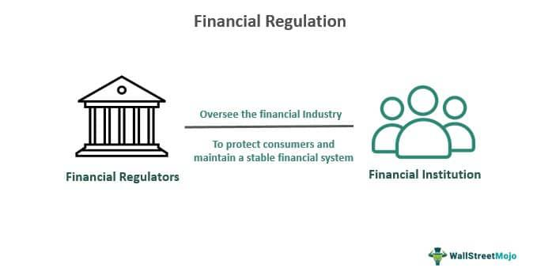

The financial landscape is witnessing tremendous change, significantly driven by advancements in technology. Critical components of this evolving scenario include financial regulation, regulatory assets, utility accounting, and algorithmic trading. Financial regulation forms the backbone of a secure and transparent financial ecosystem, establishing rules and laws that oversee financial markets and institutions. It ensures the integrity, stability, and protection of consumers in the financial system.

Regulatory assets and utility accounting play vital roles in managing the financial intricacies of public utilities. The concept of regulatory assets enables utilities to defer certain expenses, recognizing them over time instead of immediately. This is an essential practice in maintaining accurate and stable financial statements and revenue recognition for utility companies.

Algorithmic trading has revolutionized financial markets by employing sophisticated computer systems to execute trades based on predefined criteria like timing, price, and volume—thereby increasing efficiency and reducing transaction costs and the need for human intervention. However, this technological advancement also introduces challenges, particularly in terms of compliance and risk management, emphasizing the need for robust regulatory frameworks and strategic oversight.

To navigate the complexities and opportunities within the current financial landscape, it is crucial for market participants to develop a thorough understanding of these interconnected areas. Awareness of ongoing trends and regulatory advancements is essential for ensuring sustained success and stability in financial markets, both today and in the future.

## Table of Contents

## Understanding Financial Regulation

Financial regulation consists of laws and rules that govern financial institutions and markets with the aim of maintaining integrity, stability, and consumer protection. This regulatory framework is crucial for ensuring orderly and fair operations within financial markets, addressing systemic risks that could lead to economic crises.

Key regulatory bodies in the United States include the Securities and Exchange Commission (SEC) and the Commodity Futures Trading Commission (CFTC). The SEC is responsible for protecting investors, maintaining fair and efficient markets, and facilitating capital formation. It oversees the securities markets, ensuring transparent trading and reducing the risk of fraud. The CFTC, on the other hand, regulates the derivatives markets, including futures, options, and swaps, focusing on minimizing systemic risks and protecting market participants from abusive practices.

Regulation's primary importance lies in preventing market abuses that can undermine confidence in financial systems. It ensures that these markets operate in a fair, efficient, and transparent manner. For example, regulations such as the Dodd-Frank Wall Street Reform and Consumer Protection Act have introduced comprehensive changes to financial regulation following the 2008 financial crisis, including stricter controls on banks and the establishment of new regulatory agencies like the Consumer Financial Protection Bureau (CFPB).

Furthermore, financial regulation aims to address systemic risks that could trigger financial crises. These risks involve the failure of major financial institutions, which could lead to broader economic disruption as seen in past crises. Regulatory measures often include capital adequacy requirements, stress testing, and enhanced supervision of large financial institutions to ensure they can withstand economic shocks without requiring government bailouts.

Overall, understanding and complying with financial regulations is essential for both financial institutions and market participants. It fosters market confidence, protects consumers, and ensures financial stability, which is crucial for the sustainable growth of the global economy.

## What is a Regulatory Asset?

A regulatory asset is an accounting mechanism that allows utilities to defer certain expenses and recognize them over a period, instead of incurring the immediate cost. This practice is pivotal for managing the financial health of utility companies and plays a significant role in how these companies report revenue and financial performance.

Regulatory assets stem from the need to balance the [books](/wiki/algo-trading-books) while adhering to regulatory guidelines. They allow utilities to align their expenses with the revenue they generate, particularly when those expenses are incurred for long-term benefit projects, such as infrastructure upgrades or energy efficiency programs. By deferring costs, utilities can mitigate the impact on their financial statements, presenting a smoother financial profile over time.

The Governmental Accounting Standards Board (GASB) provides comprehensive guidelines for recording regulatory assets. These guidelines ensure consistency and transparency in financial reporting, facilitating better decision-making by regulators and stakeholders. For instance, GASB Statement No. 62 outlines how entities should account for the costs of all regulated operations, helping utilities properly defer and recover costs over time.

An example of regulatory assets in practice includes deferred costs associated with energy efficiency programs. These programs often require significant upfront investment but yield savings and efficiencies for many years. By classifying these costs as regulatory assets, utilities can spread the expense over the lifecycle of the program, aligning financial recognition with the ongoing benefits realized by the consumers and the utility itself.

Additionally, regulatory assets also impact the rate-setting process. Utilities are often granted the ability to earn a return on these deferred expenses, ultimately affecting the rates charged to consumers. This interplay ensures that costs are fairly distributed over time, shielding consumers from dramatic rate increases while allowing utilities to recover their investments.

In conclusion, regulatory assets are a fundamental component of utility accounting, enabling long-term financial planning and stability. They facilitate the deferred recognition of costs, ensuring both utilities and consumers experience a balanced financial approach over the lifespan of critical utility projects.

## Utility Accounting Explained

Utility accounting is distinct from traditional business accounting, primarily because it caters to the specific operations and regulatory frameworks governing utility entities. Unlike standard businesses, utilities operate within a structured environment characterized by unique long-term asset management and cost recovery mechanisms.

In utility accounting, the matching of expenses with revenues is critical. This approach not only ensures a balanced financial outlook but also allows utilities to sustain their operations without imposing [volatility](/wiki/volatility-trading-strategies) on their financial statements. The financial stability achieved through this method positions utilities to allocate charges over extended periods, particularly in the context of infrastructure investments and maintenance.

One fundamental aspect of utility accounting is the treatment of depreciation. For utilities, depreciation reflects the gradual consumption of an asset's value over its useful life. Accurately calculating and recording depreciation is essential not only for financial reporting but also for regulatory compliance purposes. The typical method employed is straight-line depreciation, which spreads the cost of an asset evenly across its useful life. The formula used is:

$$
\text{Depreciation Expense} = \frac{\text{Cost of Asset} - \text{Salvage Value}}{\text{Useful Life}}
$$

Asset capitalization is another critical component. Utility companies often invest heavily in infrastructure projects, which require substantial capital expenditure. These costs are capitalized rather than expensed immediately, reflecting them as long-term assets. This method aids in the alignment of expenses with the benefits derived from the assets over time, ensuring that financial statements accurately depict the company's economic position.

Deferred costs are also integral to utility accounting. These costs arise when expenditures are incurred but benefit future periods. By deferring these costs, utilities can amortize them over subsequent accounting periods, smoothing financial impacts and supporting regulatory compliance. Regulatory bodies closely examine these deferrals to ensure they align with the intended purpose and benefit ratepayers.

Maintaining transparency in utility accounting is vital. Regulators and stakeholders depend on accurate and clear financial reports to assess the utility's operational status and its adherence to authorized return rates. The transparency provided through proper accounting practices ensures that utilities can justify their pricing and cost recovery mechanisms.

In summary, utility accounting encompasses a specialized approach with an emphasis on stable financial management, regulatory compliance, and transparency. These elements collectively support utilities in achieving their goal of providing essential services while adhering to regulatory expectations and delivering value to stakeholders and the community.

## Algorithmic Trading: The Basics

Algorithmic trading employs sophisticated computer systems to automate the execution of trades based on predefined criteria such as timing, price, and [volume](/wiki/volume-trading-strategy). This method leverages historical data and mathematical models to identify trading opportunities and make instantaneous decisions, thus increasing the efficiency and effectiveness of trading processes.

One of the primary advantages of [algorithmic trading](/wiki/algorithmic-trading) is the reduction in transaction costs. By minimizing human intervention, the systems can quickly identify and act upon market signals, leading to a more streamlined trading process. This speed also enables trading at optimal prices, further reducing costs. Additionally, the absence of human emotion in trading decisions eliminates biases, consistently applying the trading strategy without succumbing to psychological pressures.

Despite these benefits, algorithm trading presents challenges, mainly regarding market disruption risks. High-frequency trading, a subset of algorithmic trading, has been scrutinized for creating volatility and potential systemic risks. Therefore, market participants must develop and implement robust risk management strategies to mitigate such risks. These strategies often include real-time monitoring and the ability to swiftly deactivate algorithms that exhibit erratic behavior.

Algorithmic trading is subject to several regulatory frameworks designed to protect market integrity. The Market Access Rule by the Securities and Exchange Commission (SEC) mandates that broker-dealers implementing algorithms must ensure adequate risk controls are in place to prevent trading errors. Similarly, the Commodity Futures Trading Commission (CFTC) provides guidelines to oversee the use of algorithms in futures markets, emphasizing transparency and accountability.

Overall, while algorithmic trading enhances market efficiency and reduces human errors, it necessitates careful risk management and strict adherence to regulatory standards. By navigating these complexities, financial institutions can effectively leverage algorithmic trading to achieve a competitive edge.

## Regulations Influencing Algorithmic Trading

Algorithmic trading, known for its speed and efficiency, is governed by a framework of regulations designed to maintain market integrity and curtail fraudulent activities. This section outlines key regulations that traders and financial institutions must consider to ensure compliance and safeguard market operations.

The Commodity Futures Trading Commission (CFTC) introduced Regulation Automated Trading (Reg AT) to address concerns associated with the rise of automated trading systems. Reg AT emphasizes risk management practices and enhances transparency in digital trading environments. It aims to mitigate risks by mandating rigorous controls over the development, testing, deployment, and maintenance of trading algorithms and systems. Key provisions include:

1. **Registration and Supervision:** Entities engaged in automated trading must register, ensuring they are subjected to regulatory oversight, which is vital for maintaining discipline and accountability.

2. **Algorithm Development and Testing:** Firms are required to establish protocols for thoroughly testing trading algorithms before deployment. This reduces the risk of errors that could jeopardize market stability.

3. **Systematic Monitoring and Reporting:** Continuous monitoring of trading activities is required, along with reporting any significant disruptions or anomalies. This ensures that any issues can be addressed promptly, minimizing their potential impact.

4. **Enhanced Compliance and Transparency:** Reg AT promotes the use of compliance measures, including maintaining logs and records that can be audited by regulators. Transparency in algorithmic operations discourages manipulative practices such as spoofing, where traders place fake orders to influence prices.

Simultaneously, the Securities and Exchange Commission (SEC) imposes the Market Access Rule (Rule 15c3-5), necessitating the implementation of risk controls to prevent erroneous trades and ensure compliance with applicable regulatory standards. Notable requirements include:

- **Pre-Trade Risk Management:** Firms must have measures in place to prevent unauthorized access and to ensure trades adhere to predefined risk parameters before execution.

- **Financial and Operational Risk Controls:** Measures must be implemented to monitor the financial exposure of trades and operational constraints, including credit and capital thresholds.

- **Emergency Procedures and Fail-Safes:** The Market Access Rule mandates the implementation of robust disaster recovery and business continuity plans. These plans are designed to ensure operational resilience in the event of system failures or external disruptions.

Adhering to these regulations is paramount for any entity involved in algorithmic trading. Failure to comply can result in severe penalties and reputational damage. Developing compliant algorithmic systems requires a thorough understanding of these regulatory frameworks and the implementation of comprehensive internal controls. This, in turn, fosters a more secure and reliable trading environment, reflecting the broader goal of safeguarding the financial markets from systemic risks and manipulative practices.

## Compliance and Risk Management in Algo Trading

Compliance in algorithmic trading entails strict adherence to established registration, reporting, and operational guidelines set forth by various regulatory bodies. These guidelines are designed to ensure transparency, integrity, and fairness in financial markets. A core aspect of compliance involves maintaining effective risk management controls, which include pre-trade risk limits. These limits help prevent excessive exposure by setting maximum allowable thresholds for trades based on criteria such as trading volume or price volatility.

Ongoing monitoring is another vital component of risk management. It involves continuously assessing algorithm performance and market conditions in real-time to detect any anomalies or malfunctions promptly. This helps in swiftly addressing potential issues before they escalate into significant problems. Moreover, having a disaster recovery plan is essential to ensure business continuity and minimize disruptions in the event of system failures or external shocks.

Firms engaging in algorithmic trading must ensure that their algorithms do not participate in manipulative practices such as spoofing or layering. Spoofing involves placing deceptive orders with the intention of canceling them before execution to create artificial market movement. Layering, similarly, involves creating a false impression of demand or supply. Detecting and preventing these activities require robust systems for monitoring order placements and cancellations.

Implementing strong internal controls and governance frameworks is imperative for maintaining compliance and operational integrity in algorithmic trading. This can include regular audits, thorough documentation of trading strategies and the decision-making process, and establishing clear lines of accountability within the organization. Internal controls ensure that all activities align with regulatory requirements and organizational policies, thereby safeguarding against errors, fraud, and other operational risks.

By maintaining diligent compliance practices and comprehensive risk management strategies, firms can navigate the complexities of algorithmic trading effectively, leveraging its efficiencies while mitigating associated risks.

## Conclusion

The intersections of financial regulation, regulatory assets, utility accounting, and algorithmic trading form a complex yet navigable landscape. Understanding and adhering to regulatory requirements is crucial for maintaining stability and achieving success in financial markets. Regulatory frameworks exist to ensure that markets are transparent, efficient, and fair, safeguarding against systemic risks and protecting consumer interests. As financial markets continue to evolve, particularly with technological advancements, aligning activities with regulatory mandates becomes imperative.

By integrating robust risk management and compliance strategies, firms can effectively leverage technology advancements while minimizing associated risks. For example, in algorithmic trading, implementing pre-trade risk controls and continuous monitoring can mitigate risks related to market disruptions or algorithmic failures. Similarly, in utility accounting, following standardized practices in financial reporting ensures transparency and accuracy, which are vital for regulatory compliance and financial stability.

Staying informed and proactive in adapting to regulatory changes is pivotal in the continually evolving financial ecosystem. As regulators update rules to address new challenges, firms must ensure ongoing compliance by keeping abreast of these changes and adapting their internal processes accordingly. This includes investing in technology and human resources to meet new compliance requirements and fostering a culture of ethical behavior and accountability. By doing so, firms not only avoid legal and financial repercussions but also gain a competitive advantage through increased trust and legitimacy in the market.

## References & Further Reading

[1]: U.S. Securities and Exchange Commission (SEC). ["The Laws That Govern the Securities Industry"](https://www.sec.gov/rules-regulations/statutes-regulations)

[2]: Commodity Futures Trading Commission (CFTC). ["About the CFTC"](https://www.cftc.gov/About/AboutTheCommission)

[3]: Governmental Accounting Standards Board (GASB). ["GASB Statement No. 62"](https://gasb.org/page/pronouncement?pageId=/standards-and-guidance/pronouncements/summary-statement-no-62.html&isStaticPage=true)

[4]: SEC. ["Dodd-Frank Wall Street Reform and Consumer Protection Act"](https://www.govinfo.gov/content/pkg/PLAW-111publ203/pdf/PLAW-111publ203.pdf)

[5]: Lopez de Prado, Marcos. ["Advances in Financial Machine Learning"](https://www.amazon.com/Advances-Financial-Machine-Learning-Marcos/dp/1119482089)

[6]: SEC. ["Rule 15c3-5: Market Access"](https://www.sec.gov/files/rules/final/2010/34-63241.pdf)

[7]: Commodity Futures Trading Commission (CFTC). ["Regulation Automated Trading"](https://www.cftc.gov/PressRoom/PressReleases/7283-15)