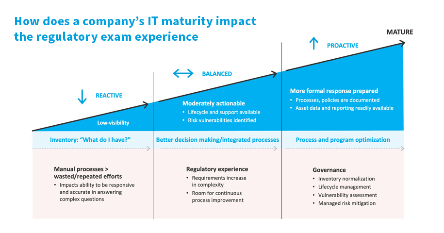

## Table of Contents

## What is a regulatory asset?

A regulatory asset is something a company records on its books when it expects to recover certain costs from its customers in the future. This often happens in industries like utilities, where the government or a regulatory body controls what the company can charge. For example, if a utility company spends money on a new power plant, they might not be able to charge customers for it right away. Instead, they record it as a regulatory asset, expecting to recover that money over time through future rates.

Regulatory assets are important because they help companies manage their finances and plan for the future. They show that the company has made investments or incurred costs that will be paid back by customers eventually. This can affect how investors and analysts view the company's financial health. However, there's always a risk that the regulatory body might not allow the company to recover these costs, which could impact the company's finances.

## How does a regulatory asset differ from other types of assets?

A regulatory asset is different from other types of assets because it's based on the expectation of future recovery of costs from customers, rather than something the company already owns or can use right away. For example, a company might have a building or a machine, which are physical assets they can use to make money now. But a regulatory asset is more like a promise that the company will get money back later for something they've already spent on.

Other assets, like cash or inventory, can be turned into money more quickly. They are tangible and directly contribute to the company's operations. On the other hand, a regulatory asset depends on decisions made by regulators. If the regulators change their minds, the company might not get the money back, making regulatory assets riskier than other types of assets. This uncertainty is a big difference between regulatory assets and more traditional assets.

## What are the common examples of regulatory assets?

Regulatory assets often come from costs that a company can't charge customers right away. For example, a utility company might spend a lot of money to build a new power plant. They can't charge customers for this right away, so they record it as a regulatory asset. This means they expect to get the money back over time through higher rates in the future. Another common example is when a company has to pay for environmental cleanup. If the regulators say they can recover these costs from customers later, the company records it as a regulatory asset.

Sometimes, regulatory assets also come from costs that are hard to predict, like changes in laws or new safety rules. For instance, if a new law says that a company has to spend money on better safety equipment, they might not be able to charge customers for it immediately. So, they record it as a regulatory asset, hoping to recover the money through future rates. These examples show how regulatory assets are about costs that a company expects to get back from customers over time, but it all depends on what the regulators decide.

## Why are regulatory assets important in regulated industries?

Regulatory assets are really important in industries like utilities and energy because they help companies plan for the future. When a company spends money on things like building a new power plant or cleaning up the environment, they can't always charge customers right away. So, they record these costs as regulatory assets. This means they expect to get the money back over time through higher rates. It helps the company keep track of what they've spent and what they expect to get back, which is important for managing their money and making plans.

These assets also matter because they show how much the company depends on what regulators decide. If the regulators change their minds and don't let the company charge customers for these costs, the company might lose money. This makes regulatory assets a bit risky, but they are still important because they help companies show investors and others that they have made investments that they expect to pay off in the future. So, regulatory assets are a key part of how regulated companies manage their finances and plan for the future.

## How are regulatory assets created?

Regulatory assets are created when a company in a regulated industry spends money on something but can't charge their customers for it right away. For example, a utility company might build a new power plant. They can't start charging customers for the cost of the plant immediately, so they record it as a regulatory asset. This means they expect to get the money back over time through higher rates in the future. It's like a promise that they will recover the costs they've already spent.

The creation of regulatory assets depends on what the regulators decide. If the regulators say the company can charge customers for these costs later, then the company can record it as a regulatory asset. For instance, if a new law requires the company to spend money on better safety equipment, they might not be able to charge customers for it right away. So, they record it as a regulatory asset, hoping to recover the money through future rates. This way, regulatory assets help companies keep track of what they've spent and what they expect to get back, which is important for planning and managing their money.

## What role do regulatory bodies play in managing regulatory assets?

Regulatory bodies are really important when it comes to managing regulatory assets. They decide if a company can charge customers for the costs they've spent on things like building a new power plant or cleaning up the environment. If the regulators say yes, the company can record these costs as regulatory assets, expecting to get the money back over time through higher rates. This means the company can plan better because they know they'll get their money back eventually.

But, the decisions of regulatory bodies can also make things tricky. If the regulators change their minds or decide the company can't charge customers for these costs, the company might lose money. This makes regulatory assets a bit risky. So, the company has to keep a close eye on what the regulators are doing and be ready to adjust their plans. This is why regulatory bodies play a big role in how companies manage their regulatory assets.

## How do regulatory assets impact the financial statements of a company?

Regulatory assets show up on a company's financial statements as something they expect to get money back for in the future. When a company spends money on things like building a new power plant or cleaning up the environment, they can't always charge customers right away. So, they record these costs as regulatory assets. This means they expect to get the money back over time through higher rates. On the balance sheet, these assets make the company look like it has more value because they represent money the company expects to receive later.

However, regulatory assets can also make the financial statements a bit tricky. They depend on what the regulators decide. If the regulators change their minds and don't let the company charge customers for these costs, the company might lose money. This can make the company's financial statements look less healthy than they seemed before. So, when people look at the financial statements, they have to think about the risk that comes with regulatory assets and how it might affect the company's money in the future.

## What are the accounting treatments for regulatory assets?

When a company in a regulated industry spends money on something but can't charge customers right away, they record it as a regulatory asset. This means they expect to get the money back over time through higher rates. On the balance sheet, regulatory assets are shown as an asset because they represent money the company expects to receive in the future. The company records these costs as an asset instead of an expense right away, which helps them match the costs with the future income they expect to get from customers.

The accounting treatment for regulatory assets follows specific rules set by accounting standards like Generally Accepted Accounting Principles (GAAP). These rules say that a company can only record a cost as a regulatory asset if the regulators have said they can charge customers for it later. If the regulators change their minds, the company might have to write off the regulatory asset, which means they have to take it off their books and record it as a loss. This can affect the company's financial statements and make them look less healthy. So, it's important for the company to keep track of what the regulators are doing and be ready to adjust their accounting if needed.

## How do changes in regulations affect existing regulatory assets?

When the rules change, it can really shake things up for a company's regulatory assets. If the regulators decide that the company can't charge customers for costs they've already spent on things like building a new power plant or cleaning up the environment, the company might have to take those costs off their books. This means they can't count on getting that money back anymore, and they might have to record it as a loss. This can make the company's financial statements look a lot worse than before.

But it's not always bad news. Sometimes, changes in regulations can actually help a company. If the new rules let the company charge more or charge for things they couldn't before, they might be able to turn those regulatory assets into real money sooner. This can make their financial statements look better and help them plan for the future. So, it's really important for companies to keep an eye on what the regulators are doing and be ready to adjust their plans.

## What are the challenges associated with managing regulatory assets?

Managing regulatory assets can be tough because they depend a lot on what regulators decide. If the regulators change their minds and say the company can't charge customers for the costs they've spent, the company might have to write off those assets. This means they can't count on getting that money back, and it can make their financial statements look worse. It's like planning a big party and then finding out you can't charge your guests for the food you already bought. It can really mess up your plans and your money.

Another challenge is that regulatory assets can be hard to predict. Companies have to guess what the regulators will do in the future, and that's not easy. If they guess wrong, it can hurt their finances. Plus, keeping track of all the rules and changes can be a lot of work. It's like trying to follow a recipe that keeps changing while you're cooking. You have to stay on your toes and be ready to adjust your plans at any time.

## How can companies optimize the use of regulatory assets to improve their financial performance?

Companies can improve their financial performance by carefully planning how they use their regulatory assets. They should work closely with regulators to make sure they can charge customers for the costs they've spent on things like building new power plants or cleaning up the environment. By doing this, they can turn those costs into real money over time, which helps them plan better and keep their finances stable. It's like making sure you can sell the tickets to a big event you're planning, so you know you'll get your money back.

Another way to optimize regulatory assets is by keeping a close eye on changes in regulations. If the rules change, companies need to be ready to adjust their plans quickly. This means they might need to speed up how they charge customers for certain costs or find new ways to recover money if the old ways don't work anymore. By staying on top of these changes, companies can make the most of their regulatory assets and keep their financial performance strong. It's like being ready to change the route of a road trip if there's a sudden detour.

## What future trends might influence the development and management of regulatory assets?

In the future, changes in laws and rules could really shake things up for how companies handle their regulatory assets. If governments start caring more about the environment, they might make new rules that let companies charge customers for green projects. This could mean more regulatory assets for things like solar panels or electric cars. But if the rules get stricter and harder to follow, it might be tougher for companies to get the money back for what they've spent. They'll need to keep a close eye on these changes and be ready to adjust their plans.

Technology could also play a big role. New tools and systems might help companies keep better track of their regulatory assets and make smarter decisions about how to use them. For example, if there are new ways to predict what regulators might do, companies could plan better and maybe even turn their regulatory assets into real money faster. But technology can also bring new challenges, like cyber threats that could mess up their plans. So, companies will need to stay on top of both the opportunities and the risks that come with new technology.

## What is Utility Accounting Explained?

Utility accounting is distinct from traditional business accounting, primarily because it caters to the specific operations and regulatory frameworks governing utility entities. Unlike standard businesses, utilities operate within a structured environment characterized by unique long-term asset management and cost recovery mechanisms.

In utility accounting, the matching of expenses with revenues is critical. This approach not only ensures a balanced financial outlook but also allows utilities to sustain their operations without imposing [volatility](/wiki/volatility-trading-strategies) on their financial statements. The financial stability achieved through this method positions utilities to allocate charges over extended periods, particularly in the context of infrastructure investments and maintenance.

One fundamental aspect of utility accounting is the treatment of depreciation. For utilities, depreciation reflects the gradual consumption of an asset's value over its useful life. Accurately calculating and recording depreciation is essential not only for financial reporting but also for regulatory compliance purposes. The typical method employed is straight-line depreciation, which spreads the cost of an asset evenly across its useful life. The formula used is:

$$
\text{Depreciation Expense} = \frac{\text{Cost of Asset} - \text{Salvage Value}}{\text{Useful Life}}
$$

Asset capitalization is another critical component. Utility companies often invest heavily in infrastructure projects, which require substantial capital expenditure. These costs are capitalized rather than expensed immediately, reflecting them as long-term assets. This method aids in the alignment of expenses with the benefits derived from the assets over time, ensuring that financial statements accurately depict the company's economic position.

Deferred costs are also integral to utility accounting. These costs arise when expenditures are incurred but benefit future periods. By deferring these costs, utilities can amortize them over subsequent accounting periods, smoothing financial impacts and supporting regulatory compliance. Regulatory bodies closely examine these deferrals to ensure they align with the intended purpose and benefit ratepayers.

Maintaining transparency in utility accounting is vital. Regulators and stakeholders depend on accurate and clear financial reports to assess the utility's operational status and its adherence to authorized return rates. The transparency provided through proper accounting practices ensures that utilities can justify their pricing and cost recovery mechanisms.

In summary, utility accounting encompasses a specialized approach with an emphasis on stable financial management, regulatory compliance, and transparency. These elements collectively support utilities in achieving their goal of providing essential services while adhering to regulatory expectations and delivering value to stakeholders and the community.

## References & Further Reading

[1]: U.S. Securities and Exchange Commission (SEC). ["The Laws That Govern the Securities Industry"](https://www.sec.gov/rules-regulations/statutes-regulations)

[2]: Commodity Futures Trading Commission (CFTC). ["About the CFTC"](https://www.cftc.gov/About/AboutTheCommission)

[3]: Governmental Accounting Standards Board (GASB). ["GASB Statement No. 62"](https://gasb.org/page/pronouncement?pageId=/standards-and-guidance/pronouncements/summary-statement-no-62.html&isStaticPage=true)

[4]: SEC. ["Dodd-Frank Wall Street Reform and Consumer Protection Act"](https://www.govinfo.gov/content/pkg/PLAW-111publ203/pdf/PLAW-111publ203.pdf)

[5]: Lopez de Prado, Marcos. ["Advances in Financial Machine Learning"](https://www.amazon.com/Advances-Financial-Machine-Learning-Marcos/dp/1119482089)

[6]: SEC. ["Rule 15c3-5: Market Access"](https://www.sec.gov/files/rules/final/2010/34-63241.pdf)

[7]: Commodity Futures Trading Commission (CFTC). ["Regulation Automated Trading"](https://www.cftc.gov/PressRoom/PressReleases/7283-15)