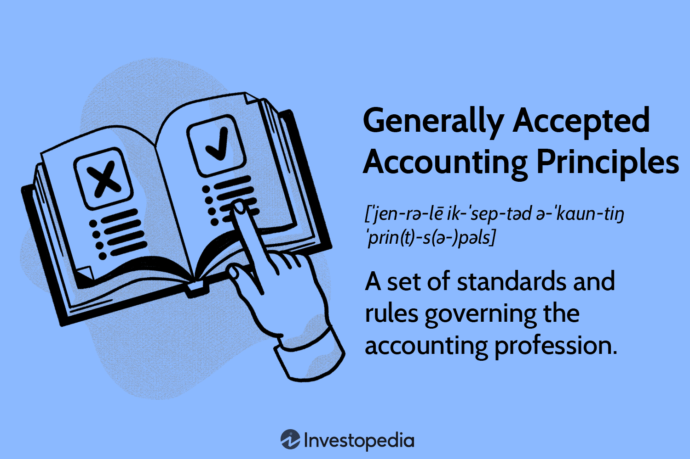

## Table of Contents

## What is GAAP and why is it important?

GAAP stands for Generally Accepted Accounting Principles. It's a set of rules that companies in the United States follow when they do their accounting. These rules help make sure that everyone is doing their accounting the same way, so it's easier to compare different companies' financial information.

GAAP is important because it helps keep things fair and clear. When all companies follow the same rules, investors and other people who look at financial statements can trust the information they see. This makes it easier for people to make good decisions about where to put their money or how to run their businesses.

## Which regulatory body primarily enforces GAAP in the United States?

The main group that makes sure companies follow GAAP in the United States is the Securities and Exchange Commission (SEC). The SEC is a government agency that watches over the stock market and protects people who invest money. They make sure that public companies, which are companies that anyone can buy shares in, follow GAAP when they report their financial information.

The SEC doesn't create GAAP rules itself. Instead, it works with another group called the Financial Accounting Standards Board (FASB). The FASB is the one that actually makes the GAAP rules. The SEC then makes sure that companies follow these rules. This teamwork helps keep financial reporting clear and trustworthy for everyone.

## What is the role of the Financial Accounting Standards Board (FASB) in relation to GAAP?

The Financial Accounting Standards Board (FASB) is the group that makes the rules for GAAP. They decide what the accounting standards should be so that all companies in the United States follow the same guidelines when they report their financial information. This helps make sure that everyone's financial statements are clear and easy to understand.

The FASB works hard to keep these rules up to date. They listen to feedback from businesses, accountants, and investors to make sure the rules are fair and useful. By setting these standards, the FASB helps make financial reporting more reliable and trustworthy for everyone who looks at a company's financial statements.

## How does the Securities and Exchange Commission (SEC) interact with GAAP?

The Securities and Exchange Commission (SEC) is like a watchdog that makes sure companies follow GAAP. They don't make the rules themselves, but they check to see if public companies, which are companies that people can buy shares in, are doing their accounting the right way according to GAAP. This helps keep things fair and honest in the stock market.

The SEC works closely with the Financial Accounting Standards Board (FASB), which is the group that actually makes the GAAP rules. The SEC looks at the rules that FASB creates and then makes sure that companies are following them. By doing this, the SEC helps make sure that investors can trust the financial information they see from companies, which is really important for making good decisions about where to put their money.

## What are the key differences between GAAP and IFRS?

GAAP and IFRS are both sets of rules for how companies do their accounting, but they are used in different parts of the world. GAAP, which stands for Generally Accepted Accounting Principles, is mainly used in the United States. IFRS, which stands for International Financial Reporting Standards, is used by many countries around the world. One big difference is how they treat inventory. GAAP allows companies to use a method called LIFO (Last In, First Out) to figure out the cost of their inventory, but IFRS does not allow LIFO. Instead, IFRS uses methods like FIFO (First In, First Out) or the weighted average cost method.

Another difference is how they handle the value of assets and liabilities. Under GAAP, companies often use historical cost to value their assets, which means they use the price they paid for the asset. IFRS allows companies to use fair value, which means they can update the value of the asset to what it's worth now. This can make a big difference in how a company's financial health looks on paper. Also, IFRS tends to be more principles-based, which means it gives companies more flexibility in how they apply the rules, while GAAP is more rules-based, which means it gives more specific instructions on what to do.

## How do regulatory bodies ensure compliance with GAAP?

Regulatory bodies like the Securities and Exchange Commission (SEC) play a big role in making sure companies follow GAAP. The SEC watches over public companies, which are companies that people can buy shares in. They check the financial reports these companies send out to make sure they are following the GAAP rules. If a company isn't following the rules, the SEC can step in and take action, like making the company fix their reports or even taking legal action against them. This helps keep the financial information honest and trustworthy for everyone who looks at it.

The SEC works closely with the Financial Accounting Standards Board (FASB), which is the group that makes the GAAP rules. The SEC doesn't make the rules itself, but it uses the rules that FASB creates to check on companies. This teamwork is important because it helps make sure the rules are clear and fair. By enforcing these rules, the SEC helps investors feel confident that the financial statements they see are accurate and that they can make good decisions about where to put their money.

## What are the consequences for companies that fail to comply with GAAP?

If a company doesn't follow GAAP, they can get into big trouble. The Securities and Exchange Commission (SEC) is the group that watches over public companies to make sure they follow the rules. If the SEC finds out a company isn't following GAAP, they can make the company fix their financial reports. This means the company has to go back and change their numbers to make them right. It can be a lot of work and can make the company look bad to investors and the public.

The SEC can also take legal action against the company. This could mean fines, which are like penalties that the company has to pay. Sometimes, the people in charge of the company, like the CEO or CFO, can get in trouble too. They might have to pay fines or even go to jail if they did something really wrong on purpose. All of this can hurt the company's reputation and make it harder for them to do business in the future.

## Can you explain the process of GAAP standard setting and updates?

The process of setting and updating GAAP standards is done by the Financial Accounting Standards Board (FASB). They start by looking at different issues in accounting that need new rules or changes to old ones. They talk to a lot of people, like businesses, accountants, and investors, to get their ideas. After gathering all this information, the FASB writes a new rule or changes an old one. They then share this with everyone to get more feedback. Once they think it's ready, they vote on it. If most of the board agrees, the new rule becomes part of GAAP.

Once a new rule is part of GAAP, the FASB keeps an eye on it to see if it's working well. They listen to what people say about the rule and see if there are any problems. If they find out that the rule needs to be changed, they start the process all over again. This way, GAAP stays up to date and helps make sure that financial reporting is fair and clear for everyone.

## How do international regulatory bodies influence GAAP?

International regulatory bodies like the International Accounting Standards Board (IASB) create rules called International Financial Reporting Standards (IFRS). These rules are used by many countries around the world. Even though GAAP is mainly used in the United States, the people who make GAAP rules, like the Financial Accounting Standards Board (FASB), pay attention to what the IASB is doing. They talk to each other and sometimes work together to make sure their rules are similar. This helps make it easier for companies in different countries to compare their financial information.

Sometimes, the Securities and Exchange Commission (SEC) in the U.S. looks at what other countries are doing with their accounting rules. If they see that a lot of other countries are using IFRS and it's working well, they might think about making changes to GAAP. This way, they can keep up with what's happening around the world and make sure that U.S. companies can work well with companies from other countries. By keeping an eye on international standards, the SEC and FASB help make sure that GAAP stays useful and fair for everyone.

## What role do auditors play in enforcing GAAP?

Auditors are like financial detectives who check a company's books to make sure they are following GAAP. They go through all the numbers and records to see if everything is done the right way. If they find something wrong, they tell the company to fix it. This helps keep the financial information honest and clear for everyone who looks at it.

Auditors also write a report after they finish their check. This report says whether the company's financial statements follow GAAP. If the auditors find big problems, they might say the statements don't follow GAAP, which can be bad news for the company. By doing all this, auditors help make sure that companies stick to the rules and that investors can trust the financial information they see.

## How have recent changes in technology and business practices affected GAAP enforcement?

Recent changes in technology and business practices have made GAAP enforcement more complicated but also more efficient. New technology like data analytics and artificial intelligence helps auditors check a company's numbers faster and more thoroughly. They can look at huge amounts of data to find mistakes or strange things that might mean the company isn't following GAAP. This makes it easier to catch problems early. But, technology also means businesses are doing things in new ways, like using cryptocurrencies or having more complex financial products. This can make it harder for auditors to figure out if everything is being done right according to GAAP.

Also, the way businesses work has changed a lot. More companies are working online and across different countries, which means they have to deal with different accounting rules. This can make it tricky to make sure everyone is following GAAP. But, because of these changes, the people who make GAAP rules, like the Financial Accounting Standards Board (FASB), are always updating them to keep up. They talk to businesses and auditors to understand new practices and make sure the rules stay fair and clear. This helps keep GAAP strong even as the world of business keeps changing.

## What are the future challenges and potential reforms for GAAP enforcement?

The future of GAAP enforcement will face many challenges as business and technology keep changing. One big challenge is keeping up with new ways of doing business, like using cryptocurrencies or dealing with more complex financial products. These new things can make it hard for auditors to check if companies are following GAAP rules. Also, more companies are working across different countries, which means they have to deal with different accounting rules. This can make it tricky to make sure everyone is following GAAP. Another challenge is making sure that the rules stay fair and clear as new technology, like data analytics and artificial intelligence, changes how auditors do their job.

To meet these challenges, there might be some changes to how GAAP is enforced. The Financial Accounting Standards Board (FASB) and the Securities and Exchange Commission (SEC) might need to update the rules more often to keep up with new business practices. They could also use new technology to help auditors check companies' numbers faster and more accurately. Another possible change is working more closely with international groups to make GAAP more similar to other accounting standards like IFRS. This would make it easier for companies in different countries to compare their financial information. By making these changes, GAAP can stay strong and useful even as the world of business keeps changing.

## References & Further Reading

[1]: Financial Accounting Standards Board (FASB). ["About the FASB."](https://fasb.org/about-us/about-the-fasb)

[2]: Securities and Exchange Commission (SEC). ["What We Do."](https://www.sec.gov/about/mission)

[3]: "Generally Accepted Accounting Principles (GAAP)." [Investopedia.](https://www.investopedia.com/terms/g/gaap.asp)

[4]: Cumming, D. J., & Johan, S. A. (2017). ["The Problems with High-Frequency Trading."](https://onlinelibrary.wiley.com/doi/abs/10.1002/sej.1265) 

[5]: International Organization of Securities Commissions (IOSCO). ["The Impact of High-Frequency Trading."](https://www.iosco.org/library/pubdocs/pdf/IOSCOPD354.pdf)

[6]: Zohar, M., & Ashkenazi, T. (2020). ["The Impact of Algorithmic Trading on Securities Regulation."](https://virginialawreview.org/wp-content/uploads/2020/12/Yadav_Online.pdf)

[7]: Markets in Financial Instruments Directive II (MiFID II). ["Official Journal of the European Union."](https://eur-lex.europa.eu/legal-content/EN/TXT/?uri=celex%3A32014L0065)

[8]: Lopez de Prado, M. (2018). ["Advances in Financial Machine Learning."](https://www.amazon.com/Advances-Financial-Machine-Learning-Marcos/dp/1119482089) Wiley.

[9]: United States Government Accountability Office (GAO). ["GAO's Study on the Flash Crash of May 6, 2010."](https://www.gao.gov/)