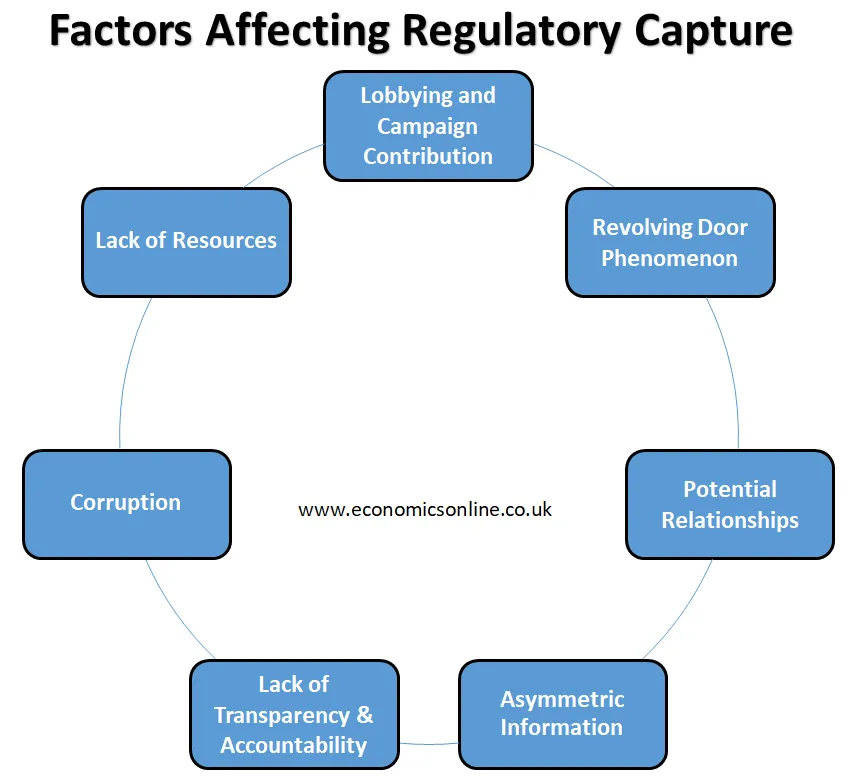

## Table of Contents

## What is regulatory capture?

Regulatory capture happens when a government agency, which is supposed to control and regulate a certain industry, ends up being influenced or controlled by that industry instead. This means the agency might make rules that favor the industry more than the public. It's like when the watchdog becomes friends with the people it's supposed to watch, and stops barking at them.

This can happen for different reasons. Sometimes, people from the industry get jobs in the regulatory agency, so they know the industry well but might also be biased towards it. Other times, the industry might have a lot of money and power, and they use this to influence the agency's decisions. When regulatory capture happens, it can lead to bad outcomes for the public, like higher prices or less safety, because the rules aren't being made to protect people anymore.

## How does regulatory capture occur?

Regulatory capture happens when the people or companies that a government agency is supposed to watch over start to control the agency instead. This can start when people from the industry get jobs at the agency. They know a lot about the industry, which can be good, but they might also want to help their old friends and companies more than the public. They might make rules that are easier for the industry to follow, even if those rules aren't the best for everyone else.

Another way regulatory capture can happen is when the industry has a lot of money and power. They can use this to influence the agency. They might give money to politicians who can then tell the agency what to do. Or they might spend a lot on ads and lobbyists to make the agency think their way is best. When this happens, the agency might start making rules that help the industry make more money, even if those rules aren't safe or fair for everyone else.

## What are the main theories explaining regulatory capture?

One main theory explaining regulatory capture is the "revolving door" theory. This theory says that people often move between jobs in the industry and jobs in the regulatory agency. When someone from the industry gets a job at the agency, they might still want to help their old friends and companies. They know a lot about the industry, which can be good, but they might make rules that are easier for the industry to follow, even if those rules aren't the best for the public. This can lead to the agency being more focused on helping the industry than on protecting people.

Another theory is about the power and money that industries have. This theory says that industries with a lot of money can influence the regulatory agency. They might give money to politicians who can then tell the agency what to do. Or they might spend a lot on ads and lobbyists to make the agency think their way is best. When this happens, the agency might start making rules that help the industry make more money, even if those rules aren't safe or fair for everyone else. This kind of influence can make the agency forget its main job of protecting the public.

## Can you provide a simple example of regulatory capture?

Imagine a city where the government has an agency that's supposed to make sure taxi companies follow the rules. The taxi companies are powerful and have a lot of money. They start giving money to politicians who can tell the agency what to do. They also hire people who used to work at the agency to help them. Now, the agency starts making rules that are easier for the taxi companies to follow, like not checking their cars as often or letting them charge more money. This is bad for people who use taxis because the taxis might not be safe, and they have to pay more.

In another example, think about a big company that makes medicine. The government has an agency that's supposed to make sure the medicine is safe and not too expensive. But people from the medicine company start getting jobs at the agency. They know a lot about making medicine, but they also want to help their old company. So, the agency starts making rules that let the medicine company charge more money for their medicine. This is bad for people who need the medicine because it becomes too expensive for them to buy.

## What are the consequences of regulatory capture for the economy and society?

When regulatory capture happens, it can hurt the economy and society a lot. The rules that are supposed to protect people and keep things fair start to help the big companies instead. This can make prices go up because the companies can charge more without anyone stopping them. It can also make it hard for new companies to start up because the rules are made to help the big companies stay on top. This means less competition, and when there's less competition, prices can go up even more, and people don't get as many choices.

Society also suffers because the rules might not be as safe as they should be. If the agency is more focused on helping the companies than on keeping people safe, they might not check things as often or as well as they should. This can lead to accidents or health problems because the products or services aren't safe enough. In the end, people lose trust in the government and the agencies that are supposed to protect them, which can make everything harder to fix.

## How can regulatory capture be identified in practice?

You can spot regulatory capture if you see that the rules made by the agency seem to help the companies they are supposed to watch more than the public. For example, if the agency makes rules that let companies charge more money or don't check their products as often, that might be a sign. Another way to see it is if people who used to work for the companies start working for the agency, and then the rules start to change in ways that help their old companies. This kind of "revolving door" can be a big hint that something is wrong.

Also, if the companies have a lot of power and money and they are spending it to influence the politicians who control the agency, that's another sign of regulatory capture. You might see the companies giving money to politicians or hiring lobbyists to talk to the agency. When the rules start to favor the companies more than the public, and it looks like the agency isn't doing its job to protect people, that's a good clue that regulatory capture might be happening.

## What measures can be taken to prevent or mitigate regulatory capture?

To stop or lessen regulatory capture, it's important to keep a close eye on the people who work at the regulatory agencies. One way to do this is by making rules about who can work at these agencies. For example, there could be rules that stop people from working at the agency if they used to work for the companies it watches. This can help make sure the agency stays fair and focuses on helping the public instead of the companies. Another way is to make sure the agency has enough money and power to do its job well, so it doesn't have to rely on the companies it's supposed to watch.

It's also important to make sure the public knows what's going on. If people can see what the agency is doing, they can speak up if they think the rules are unfair. This can be done by making the agency share information about its decisions and letting people comment on new rules before they are made. Also, having different groups and experts watch the agency can help spot problems early. If everyone works together to keep things fair, it can be harder for regulatory capture to happen.

## Can you discuss a historical case of regulatory capture?

A famous example of regulatory capture happened in the United States with the Interstate Commerce Commission (ICC). The ICC was created in 1887 to control the railroad industry and make sure it was fair for everyone. But over time, the people who worked at the ICC started to be too friendly with the railroad companies. Many of the people who worked at the ICC used to work for the railroads, and they knew them well. This made it hard for the ICC to make rules that were tough on the railroads. Instead, the ICC started making rules that helped the big railroad companies stay powerful and charge high prices.

This kind of regulatory capture hurt farmers and small businesses who needed the railroads to move their goods. They had to pay a lot of money to the railroads, and they couldn't do much about it because the ICC wasn't helping them. It took a long time for people to realize what was happening, but eventually, the government made new rules to stop this kind of capture from happening again. The ICC was replaced by other agencies that were supposed to be better at watching over the railroads and making sure they followed fair rules.

## How does regulatory capture differ across various industries?

Regulatory capture can look different in different industries because each industry has its own way of working and its own kind of power. In the banking industry, for example, big banks might have a lot of money to spend on lobbyists and giving money to politicians. This can make the agencies that watch over banks make rules that are easier for the banks to follow, even if those rules aren't the best for people who use the banks. In the energy industry, big companies might have a lot of technical knowledge, and when people from those companies start working at the regulatory agency, they might make rules that help the energy companies more than the public.

In the pharmaceutical industry, regulatory capture might happen when the agency that checks if medicines are safe and not too expensive starts making rules that let companies charge more money for their medicines. This can happen because the people at the agency used to work for the medicine companies or because the companies have a lot of money to influence politicians. Each industry can have its own kind of regulatory capture, but the end result is often the same: the rules start to help the companies more than the people they are supposed to protect.

## What role do lobbying and campaign contributions play in regulatory capture?

Lobbying and campaign contributions are big reasons why regulatory capture can happen. Lobbying is when companies pay people to talk to politicians and the regulatory agency to try to make the rules easier for them. These lobbyists can have a lot of power because they know a lot about the industry and can spend a lot of time talking to the people who make the rules. When companies spend a lot of money on lobbyists, it can make the agency think their way is best, even if it's not good for the public. This can lead to rules that help the companies make more money, but might not be safe or fair for everyone else.

Campaign contributions are another way companies can influence the agency. When companies give money to politicians, those politicians might start to think the way the companies want them to. Politicians can then tell the regulatory agency what to do, and the agency might listen because they want to keep the politicians happy. This can make the agency forget its main job of protecting the public and start making rules that help the companies instead. In the end, lobbying and campaign contributions can make the agency more focused on helping the companies than on keeping things safe and fair for everyone.

## How do international regulatory frameworks influence or combat regulatory capture?

International regulatory frameworks can help fight regulatory capture by setting global rules that countries and their agencies have to follow. These rules are made by groups like the World Trade Organization or the International Monetary Fund. They try to make sure that everyone plays fair and that big companies can't use their power to influence local agencies too much. By having these global rules, it's harder for companies to capture a single country's agency because they have to follow the international rules too.

But sometimes, international frameworks can also make regulatory capture worse. If the global rules are made by people who used to work for big companies, or if the companies have a lot of power in the groups that make the rules, then the global rules might help the companies more than the public. This can make it easier for regulatory capture to happen in different countries because the international rules might already be set up to help the big companies. So, while international frameworks can help stop regulatory capture, they can also make it harder to fight if they are not set up the right way.

## What are the latest research findings on regulatory capture and its impacts?

Recent research on regulatory capture has found that it can have big effects on industries and people. One study looked at how regulatory capture in the banking industry can lead to more risk-taking by banks. When the agencies that are supposed to watch over banks are too friendly with them, the banks might take bigger risks because they know the agency won't stop them. This can lead to big problems, like the financial crisis in 2008, where many banks failed and people lost a lot of money. The study showed that when regulatory capture happens, it can make the whole economy less stable and hurt a lot of people.

Another recent finding is about how regulatory capture can affect new technology and innovation. In the tech industry, big companies might use their power to influence the agencies that make the rules. This can make it hard for new, smaller companies to start up because the rules might be made to help the big companies stay on top. A study showed that when this happens, it can slow down new ideas and make it harder for people to get new and better products. In the end, regulatory capture can stop the economy from growing and make life harder for people who want to start new businesses.

## References & Further Reading

[1]: Stigler, G. J. (1971). ["The Theory of Economic Regulation."](https://www.semanticscholar.org/paper/The-Theory-of-Economic-Regulation-Stigler/331d34d5220d838e563de90785cc83ea6f80d538) The Bell Journal of Economics and Management Science, 2(1), 3-21.

[2]: Carpenter, D. (2014). ["Reputation and Power: Organizational Image and Pharmaceutical Regulation at the FDA."](https://www.jstor.org/stable/j.ctt7t5st) Princeton University Press.

[3]: Johnson, S. & Kwak, J. (2010). ["13 Bankers: The Wall Street Takeover and the Next Financial Meltdown."](https://www.emerald.com/insight/content/doi/10.1108/17422041111149543/full/html) Vintage.

[4]: Laffont, J.-J., & Tirole, J. (1991). ["The Politics of Government Decision-Making: A Theory of Regulatory Capture."](https://academic.oup.com/qje/article-abstract/106/4/1089/1873396) The Quarterly Journal of Economics, 106(4), 1089-1127.

[5]: Baker, A. (2010). ["Restraining Regulatory Capture? Anglo-America, Crisis Politics, and Trajectories of Change in Global Financial Governance."](https://onlinelibrary.wiley.com/doi/10.1111/j.1468-2346.2010.00903.x) Global Policy, 4(3), 325–337.

[6]: Mehrling, P. (2010). ["The New Lombard Street: How the Fed Became the Dealer of Last Resort."](https://www.jstor.org/stable/j.ctt7sgxz) Princeton University Press.