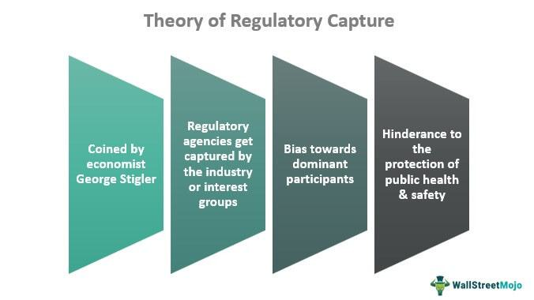

Regulatory capture is a significant phenomenon within regulatory economics, occurring when regulatory agencies, established to act in the public interest, are instead dominated by the industries they are meant to oversee. This concept, rooted in public choice theory, suggests that over time, entities regulated by a public agency can assert an undue level of influence over the agency's actions, often manipulating regulatory frameworks to benefit the industry at the expense of broader societal welfare.

Understanding regulatory capture is crucial to recognizing the intricate ways in which industries can shape regulations to their advantage. This influence is especially poignant in sectors where the financial stakes are high, and the cost of compliance is significant. Regulatory capture can lead to inefficiencies in the market and undermine the intended purpose of regulations, which is to protect consumers, ensure fairness, and maintain competitive markets.

This article examines the practical manifestations of regulatory capture, offering examples from both traditional government regulation and the rapidly evolving area of algorithmic trading. In areas such as finance, the transformation from stringent oversight to periods of deregulation has often been linked to regulatory capture, with profound implications for the economy and financial markets. The 2008 financial crisis serves as a notable illustration of how weakened regulations, influenced by industry insiders, can result in systemic failures with widespread repercussions.

By shedding light on this complex issue, the article aims to explore real-world cases where regulatory capture has occurred, providing insights into its mechanisms and the implications for policy-making and regulatory oversight. Through understanding these dynamics, stakeholders can better advocate for reforms that promote transparency, accountability, and a more equitable regulatory environment.

## Table of Contents

## Understanding Regulatory Capture

Regulatory capture is a phenomenon where regulatory agencies, established to safeguard public interest, fall under the influential sway of the very industries they are supposed to regulate. This concept, first articulated by economist George Stigler, underscores a fundamental imbalance between industry influence and public interest. Stigler's theory posits that while regulatory agencies ostensibly exist to impose controls and monitor compliance, they are susceptible to being manipulated or dominated by industry insiders who can skew regulations to favor industry interests over public welfare.

The mechanics of regulatory capture are driven by a distinct dynamic: the benefits of regulatory influence are typically concentrated among a few powerful industry players, while the associated costs are diffused across a broad public that finds it challenging to organize collectively against such influences. This asymmetry enables industries to exert disproportionate influence on regulatory agencies, often offering benefits such as economic resources, access to industry expertise, and the prospect of lucrative post-regulatory careers for agency officials.

In practice, regulatory capture manifests when agencies implement policies that curtail competition, endorse monopolistic practices, or otherwise advance industry-specific objectives, often under the guise of public interest. The tendency of agencies to favor industry demands can be attributed to several factors, including close personal and professional relationships between regulators and industry leaders, as well as the technical complexities of the industries themselves, which can obscure the true intentions and ramifications of regulatory decisions.

Understanding the mechanisms through which regulatory capture operates allows policymakers and stakeholders to devise strategies aimed at mitigating its impact. Potential solutions include enforcing stricter transparency measures, rotating agency personnel to minimize longstanding relationships with industry, and enhancing public participation in the regulatory process. By addressing the root causes of regulatory capture, it is possible to steer regulatory agencies back toward their foundational mission: serving the public interest above all.

## Examples of Regulatory Capture

The phenomenon of regulatory capture can be observed in various sectors, illustrating how industries can manipulate regulatory frameworks for their advantage. One of the earliest instances of regulatory capture occurred within the U.S. transportation industry, particularly affecting the railroad sector. During the late 19th and early 20th centuries, railroad companies wielded substantial influence over regulatory bodies such as the Interstate Commerce Commission (ICC). Established to curb monopolistic practices and protect public interests, the ICC gradually became subject to the railroad industry's influence, prioritizing the sector's interests over effective regulation. This led to ineffective oversight, allowing rail companies to continue practicing rate discrimination and other anti-competitive behaviors, stifling fair competition and innovation.

The financial sector provides another stark illustration of regulatory capture, particularly evident in the events leading up to the 2008 financial crisis. Over the years, the deregulatory movements which gained [momentum](/wiki/momentum) in the late 20th century significantly weakened oversight mechanisms in the banking and finance industries. Institutions like the Securities and Exchange Commission (SEC) were pressured by industry leaders to relax rules, culminating in the dismantling of protective measures such as the Glass-Steagall Act. The result was an environment that enabled overly risky financial practices and the accumulation of systemic risks, ultimately contributing to the global financial meltdown.

In more recent times, regulatory capture can be seen in the oil and gas sectors, where regulatory agencies often align more closely with established industry players than with smaller entrants or environmental interests. These agencies, perhaps due to the revolving door phenomenon where personnel move between industry and regulatory positions, may craft policies and regulations that inadvertently protect the market dominion of incumbent firms. This potentially results in a lack of competitive dynamism and underregulated environmental impacts, disadvantaging newer, potentially more innovative, or environmentally focused companies.

Beyond these industries, other regulatory agencies such as the Federal Aviation Administration (FAA), Securities and Exchange Commission (SEC), and Food and Drug Administration (FDA) have also been cited in cases of regulatory capture. For instance, the FAA has at times been criticized for having too close a relationship with aircraft manufacturers, leading to questions of compromised safety standards. Similarly, the SEC's historical under-regulation of derivatives and complex financial instruments highlights periods overshadowed by industry influence rather than independent oversight. The FDA, often navigating between public health interests and pharmaceutical lobbying, showcases how captured regulation can delay the introduction of generic drugs, affecting drug pricing and availability.

These illustrative cases demonstrate how regulatory capture can skew agency priorities away from protecting public interests, fostering environments where industry interests dominate and public welfare might be compromised. An improved understanding of these examples emphasizes the necessity for more transparent and accountable regulatory frameworks to balance industry innovation with public good.

## Regulatory Capture in Algorithmic Trading

Algorithmic trading, which involves using computer algorithms to execute trades at high speeds and volumes, poses substantial regulatory challenges. Its intricate and fast-paced nature makes it difficult for regulators to keep pace with technological advancements, leading to potential gaps in oversight. Regulatory capture becomes a risk when industry insiders who possess extensive knowledge and influence within financial markets shape the policies of regulatory bodies. 

In the context of the U.S., the Securities and Exchange Commission (SEC) and the Commodity Futures Trading Commission (CFTC) are the primary regulators overseeing [algorithmic trading](/wiki/algorithmic-trading). However, these agencies often face limitations in enforcing stringent regulations due to the deep entrenchment of industry experts within the regulatory framework. Such experts may prioritize industry efficiency and profit-making over fair practice and broader market stability.

Regulatory capture in algorithmic trading can lead to market manipulation, where firms exploit these high-frequency tactics to gain unfair advantages. For example, cases have emerged where algorithms engage in "quote stuffing," a manipulation strategy that involves rapidly placing and canceling large numbers of orders to create confusion and slow down competitors. This can artificially inflate or deflate market prices, affecting the fairness and transparency of financial markets.

Moreover, the role of the CFTC is critical in managing futures and options markets, yet its regulations can inadvertently create barriers to entry. Smaller firms might struggle to comply with complex regulations designed with larger players in mind, leading to reduced competition and innovation. This concentration of power can also result in reduced market [liquidity](/wiki/liquidity-risk-premium) and increased [volatility](/wiki/volatility-trading-strategies), as fewer participants dominate trading activities.

To illustrate, the aftermath of the 2010 "Flash Crash," where the Dow Jones Industrial Average plummeted nearly 1,000 points in minutes, highlighted the need for enhanced oversight of algorithmic trading practices. Following the event, regulatory bodies acknowledged the role that inadequate checks contributed to the market's rapid destabilization. Steps were taken to introduce circuit breakers and other mechanisms to curb extreme volatility caused by high-frequency trading. However, critics argue that these measures often serve as band-aid solutions rather than addressing the underlying issues of regulatory capture and inefficacy.

Addressing regulatory capture in algorithmic trading requires a multifaceted approach, which includes fostering greater transparency and accountability in the decision-making processes of financial regulators. Enhancing technological capabilities within agencies like the SEC and CFTC can help align their regulatory frameworks with the evolving nature of algorithmic trading. Furthermore, engaging a broader spectrum of stakeholders in policy formulation, including consumer advocacy groups and smaller financial entities, may provide a counterbalance to the influence of dominant market players.

In conclusion, the regulatory challenges posed by algorithmic trading underscore the complexities of safeguarding financial markets in a digital age. To mitigate the risks of regulatory capture, it is essential to promote a balanced approach that considers both the innovative potential of algorithmic trading and the need for rigorous regulatory oversight.

## Criticism and Counterarguments

Critics of regulatory capture argue that while it is a significant concern, it is not an inevitable consequence of regulation. Indeed, certain industries, notably fossil fuels, have at times experienced decreased profitability, which some interpret as evidence that regulatory capture does not always occur successfully or effectively. This suggests that, despite attempts by industries to exert influence over regulatory bodies, these efforts do not always yield the desired outcomes.

Regulatory capture theory presupposes that industries will always find a way to manipulate regulatory frameworks to their advantage. However, this assumption does not account for all regulatory outcomes. In some cases, regulatory agencies have successfully resisted industry pressures and enacted policies that align more closely with public interest. For example, significant regulatory actions, such as the Clean Air Act and Clean Water Act in the United States, have imposed substantial constraints on industrial activities, pushing companies to innovate and adapt rather than merely manipulate the regulatory environment to their favor. The resultant regulatory landscape, characterized by stringent emissions standards, has not resulted in a straightforward case of capture, as evidenced by ongoing compliance efforts and litigation.

Moreover, regulatory capture's applicability varies across different contexts, influenced by factors such as political will, governance capacity, and public awareness. Agencies with high levels of transparency and accountability mechanisms may be less susceptible to influence. For instance, regulatory bodies that involve diverse stakeholders in decision-making processes are often better aligned with public interest objectives as opposed to predominantly industry-focused organizations.

Another criticism is based on the dynamic nature of regulation. The continuous evolution of industry practices and technological advancements often require adaptive regulatory approaches. Agencies that effectively balance flexibility with rigorous oversight can mitigate capture risks. This adaptability can result in regulatory frameworks that nurture innovation while safeguarding public welfare.

Finally, it is essential to acknowledge that regulatory capture theories might underestimate the complexity of regulatory environments. They often overlook the agency and resource constraints faced by regulators, suggesting a more adversarial industry-regulator dynamic than what often exists. Recognizing regulatory capture's limitations, therefore, provides a more balanced perspective on how regulatory agencies operate and highlights the importance of policy design that emphasizes accountability and public engagement. This acknowledgment opens up new pathways for undermining potential capture avenues and enhancing the efficacy of regulatory frameworks.

## Conclusion

Regulatory capture remains a pernicious challenge that significantly impacts the equilibrium between public interest and industrial power. This phenomenon can compromise the integrity and effectiveness of regulatory frameworks, leading to policies that favor entrenched industry players rather than the populace. Understanding the mechanics of regulatory capture is essential for developing strategies that promote fairness in regulatory practices. Key elements include the symbiotic relationships between regulators and industries, often characterized by revolving doors where former industry executives occupy regulatory positions and vice versa. This dynamic can lead to biased decision-making, ultimately skewing regulations.

To combat regulatory capture effectively, it is imperative to implement measures that foster transparency and accountability. Policymakers can benefit from systems that ensure open dialogue and documentation of regulatory processes, enhancing public oversight and minimizing conflicts of interest. Additionally, empowering external watchdogs or auditors can provide an independent check on regulatory agencies, ensuring they adhere to their mandates without undue influence. There is a need for innovative approaches that rethink how regulations are crafted and enforced, possibly integrating advanced technologies like blockchain for a tamper-evident trail of regulatory actions.

The discussion of real-world cases highlights the tangible impacts of regulatory capture and serves as a catalyst for reform. By examining these instances critically, stakeholders can identify vulnerabilities within the regulatory structure and implement targeted reforms. These insights aim to spark broader dialogue and encourage concerted efforts to mitigate regulatory capture, aligning regulatory practices more closely with the public good and promoting more resilient and equitable governance structures.

## References & Further Reading

[1]: Stigler, G. J. (1971). ["The Theory of Economic Regulation."](https://www.semanticscholar.org/paper/The-Theory-of-Economic-Regulation-Stigler/331d34d5220d838e563de90785cc83ea6f80d538) The Bell Journal of Economics and Management Science, 2(1), 3-21.

[2]: Carpenter, D. (2014). ["Reputation and Power: Organizational Image and Pharmaceutical Regulation at the FDA."](https://www.jstor.org/stable/j.ctt7t5st) Princeton University Press.

[3]: Johnson, S. & Kwak, J. (2010). ["13 Bankers: The Wall Street Takeover and the Next Financial Meltdown."](https://www.emerald.com/insight/content/doi/10.1108/17422041111149543/full/html) Vintage.

[4]: Laffont, J.-J., & Tirole, J. (1991). ["The Politics of Government Decision-Making: A Theory of Regulatory Capture."](https://academic.oup.com/qje/article-abstract/106/4/1089/1873396) The Quarterly Journal of Economics, 106(4), 1089-1127.

[5]: Baker, A. (2010). ["Restraining Regulatory Capture? Anglo-America, Crisis Politics, and Trajectories of Change in Global Financial Governance."](https://onlinelibrary.wiley.com/doi/10.1111/j.1468-2346.2010.00903.x) Global Policy, 4(3), 325–337.

[6]: Mehrling, P. (2010). ["The New Lombard Street: How the Fed Became the Dealer of Last Resort."](https://www.jstor.org/stable/j.ctt7sgxz) Princeton University Press.