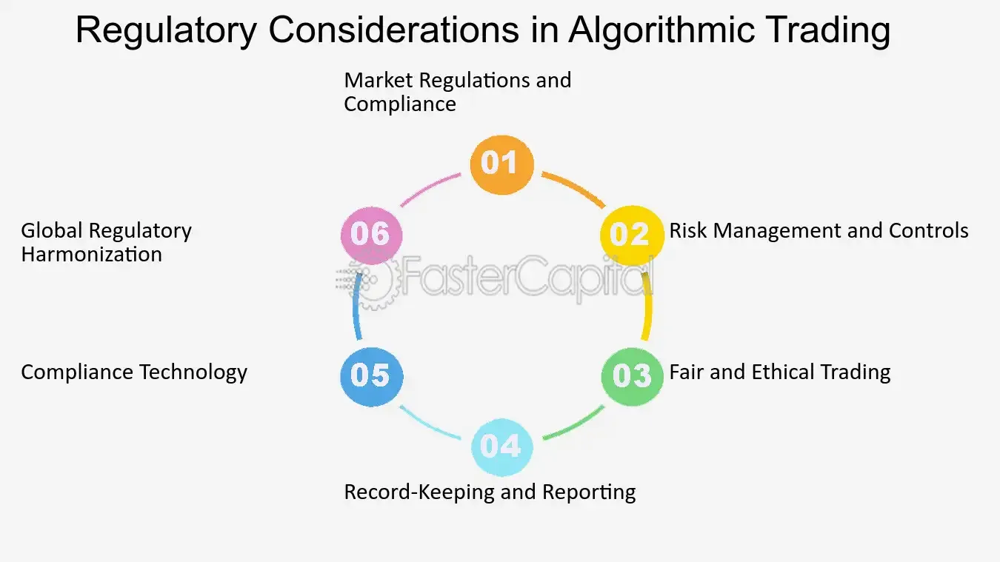

## Table of Contents

## What is regulatory compliance in the context of algo trading?

Regulatory compliance in algo trading means following the rules and laws set by financial authorities when using computer programs to trade in financial markets. These rules are made to make sure that trading is fair, markets are safe, and investors are protected. Algo trading can be very fast and use a lot of data, so it's important for those who use it to keep up with the rules and make sure their trading systems do what the law says.

The rules can cover many things, like how trades are made, how data is used, and how much risk is allowed. For example, there might be rules about how quickly trades can be made or how much of the market one trader can control. Companies that do algo trading need to have good systems in place to check that they are following these rules. If they don't, they could get in trouble with the law, which could mean fines or even being banned from trading.

## Why is regulatory compliance important for algo trading?

Regulatory compliance is important for algo trading because it helps keep the financial markets fair and safe for everyone. When people use computer programs to trade quickly and automatically, there's a risk that they might do things that are not fair or could hurt the market. Rules make sure that everyone plays by the same rules and that no one can cheat or take advantage of others. This is good for the whole market because it builds trust and makes people feel safe about investing their money.

Also, following the rules helps protect investors. Algo trading can be complicated and fast, and if something goes wrong, it could lead to big losses. By making sure that trading systems follow the rules, regulators can help stop bad things from happening. This means that people who invest their money can feel more secure knowing that there are checks in place to look after their interests. In the end, regulatory compliance is key to keeping the financial system working well and protecting everyone involved.

## What are the key regulatory bodies overseeing algo trading?

In the United States, the main regulatory body for algo trading is the Securities and Exchange Commission (SEC). The SEC makes rules to keep the stock market fair and safe. They check that companies doing algo trading are following these rules. Another important group is the Commodity Futures Trading Commission (CFTC), which looks after trading in things like oil and wheat. They also have rules to make sure algo trading in these markets is done the right way.

In Europe, the main regulatory body is the European Securities and Markets Authority (ESMA). ESMA works to make sure that financial markets in Europe are stable and that investors are protected. They set rules for algo trading to stop it from causing problems in the market. In the United Kingdom, the Financial Conduct Authority (FCA) is in charge of making sure that algo trading follows the rules. They work to keep the market fair and protect people who invest their money.

## What are the basic compliance requirements for algo trading firms?

Algo trading firms need to follow certain rules to make sure they are doing things the right way. One big rule is that they have to keep good records of all their trades. This means they need to save information about when trades happen, how much is traded, and who is trading. This helps regulators check that everything is fair and that no one is cheating. Another rule is that firms need to have systems in place to watch their trading. These systems should be able to spot any strange trading patterns or mistakes and stop them before they cause problems.

Also, algo trading firms have to make sure their computer programs follow the rules. This means they need to test their programs a lot to make sure they work the way they should and don't break any laws. Firms also need to have plans for what to do if something goes wrong with their trading. This could mean having backup systems or ways to quickly stop trading if needed. By following these rules, algo trading firms help keep the market safe and fair for everyone.

## How do regulations differ across countries for algo trading?

Regulations for algo trading can be different from one country to another. In the United States, the Securities and Exchange Commission (SEC) and the Commodity Futures Trading Commission (CFTC) set the rules. They focus on making sure trades are fair and markets are safe. For example, the SEC might have rules about how fast trades can happen or how much of the market one trader can control. The CFTC looks after trading in things like oil and wheat and makes sure algo trading in these markets follows the rules too.

In Europe, the European Securities and Markets Authority (ESMA) is the main body that sets rules for algo trading. They want to keep the markets stable and protect investors. For instance, ESMA might have rules about how algo trading systems should be tested to make sure they work right. In the United Kingdom, the Financial Conduct Authority (FCA) makes sure algo trading follows the rules to keep the market fair. Each country's rules can be a bit different, but they all aim to keep trading fair and safe.

## What are the common challenges faced by algo trading firms in maintaining compliance?

One big challenge for algo trading firms is keeping up with all the rules that keep changing. Rules can be different in each country, and they can change often. This means firms have to always be learning about new rules and making sure their trading systems follow them. It's like trying to hit a moving target because just when they think they've got everything right, the rules might change again. This can be hard and take a lot of time and money.

Another challenge is making sure their computer programs work the right way and don't break any rules. Algo trading uses complex math and fast computers, and even a small mistake can cause big problems. Firms need to test their systems a lot to make sure they work right and follow the rules. But testing everything takes a lot of work, and it's hard to check every possible thing that could go wrong. Plus, they have to keep an eye on their trading all the time to spot any strange patterns or mistakes quickly.

Keeping good records is also a challenge. Regulators want to see detailed information about every trade, and firms need to save this information and be ready to show it if asked. This means they need good systems for keeping records, and they have to make sure these systems are safe and can't be messed with. All these challenges together make it tough for algo trading firms to stay compliant, but it's really important for keeping the markets fair and safe.

## How can algo trading firms implement effective compliance programs?

Algo trading firms can implement effective compliance programs by first setting up a strong system to keep track of all the rules they need to follow. They should have a team of people who know a lot about the rules and can help make sure the firm is doing everything right. This team can watch the news and updates from regulators to make sure they know about any new rules or changes. They can also train everyone in the firm about what the rules are and why they're important. Having clear rules and guidelines inside the firm helps everyone know what to do and makes it easier to follow the outside rules.

Another important part of a good compliance program is having the right technology. Firms need to use special software that can watch their trading all the time and spot any strange patterns or mistakes. This software can help make sure the firm's trading systems are working the right way and following the rules. They should also test their trading systems a lot to make sure they're working correctly and not breaking any laws. By combining a knowledgeable team with the right technology, algo trading firms can stay on top of compliance and keep their trading fair and safe.

## What technologies are available to help with regulatory compliance in algo trading?

There are several technologies that can help algo trading firms with regulatory compliance. One key technology is compliance monitoring software. This software keeps an eye on all the trades happening and can spot if anything looks strange or wrong. It helps make sure that the firm's trading follows the rules by watching for patterns that might break the law. Another helpful technology is trade surveillance systems. These systems record all the details about each trade, like when it happened and how much was traded. This information is important for showing to regulators if they ask to see it.

Another technology that is very useful is algo testing platforms. These platforms let firms test their trading programs a lot to make sure they work the right way and don't break any rules. By testing the programs, firms can find and fix any mistakes before they cause problems. Also, risk management systems are important. These systems help firms understand and control the risks they take when trading. By using these technologies together, algo trading firms can make sure they are following the rules and keeping the market safe and fair.

## How does regulatory compliance impact the development and deployment of trading algorithms?

Regulatory compliance has a big effect on how trading algorithms are made and used. When algo trading firms build their trading programs, they need to make sure these programs follow all the rules set by financial regulators. This means they have to think about the rules right from the start and build the programs in a way that makes sure they don't break any laws. For example, they need to set up limits on how fast the program can trade or how much of the market it can control. This can make the process of making the algorithms slower and more complicated because they have to keep checking that everything is done the right way.

Once the trading algorithms are ready, firms need to test them a lot before they can use them in the real market. This testing is important to make sure the programs work correctly and don't break any rules. Firms also need to keep watching their algorithms all the time to spot any strange behavior or mistakes quickly. This ongoing monitoring adds more work and costs to running the algorithms. But it's really important because if the firm doesn't follow the rules, they could get in trouble with the law, which could mean big fines or even being banned from trading. So, regulatory compliance makes the whole process of developing and using trading algorithms more careful and detailed.

## What are the penalties for non-compliance in algo trading?

If algo trading firms don't follow the rules, they can get into big trouble. Regulators like the SEC in the U.S. or ESMA in Europe can give out fines that can be very large. These fines can hurt the firm's money a lot. Besides fines, firms might also have to pay back any money they made by breaking the rules. This is called disgorgement. Sometimes, the people in charge at the firm can be punished too. They might not be allowed to work in the financial industry anymore, or they could even go to jail if what they did was really bad.

Also, if a firm breaks the rules, it can harm their reputation. People might not trust them anymore, which can make it hard for the firm to do business. Other firms might not want to work with them, and investors might take their money out. In really bad cases, regulators can stop the firm from trading altogether. This means the firm can't do any trading until they fix their problems and prove they will follow the rules in the future. So, it's really important for algo trading firms to stay compliant to avoid these big penalties.

## How do emerging technologies like AI and machine learning affect regulatory compliance in algo trading?

Emerging technologies like AI and [machine learning](/wiki/machine-learning) are changing how algo trading firms deal with regulatory compliance. These technologies can help firms watch their trading better and spot problems faster. For example, AI can look at huge amounts of data to find strange patterns or mistakes that might break the rules. This makes it easier for firms to follow the rules because they can fix problems before they get big. But these technologies also bring new challenges. They can be very complicated, and it's hard to understand exactly how they make decisions. This makes it tough for regulators to check if everything is being done the right way.

Because of these new technologies, the rules for algo trading might need to change. Regulators are trying to figure out how to make sure AI and machine learning are used safely and fairly. They might need to make new rules or change the old ones to keep up with how fast things are moving. This means algo trading firms have to keep learning about new rules and making sure their AI systems follow them. Even though AI and machine learning can help with compliance, they also make it more important for firms to be careful and always ready to adapt to new rules.

## What future trends can we expect in regulatory compliance for algo trading?

In the future, regulatory compliance for algo trading will likely see more use of technology like AI and machine learning. These tools will help firms watch their trading better and spot any problems quickly. This means firms can follow the rules more easily and keep the market fair and safe. But, because these technologies are so new and complex, regulators might need to make new rules or change the old ones to make sure everything is done the right way. This could mean more work for algo trading firms to keep up with the rules and make sure their systems are working correctly.

Another trend we might see is more cooperation between regulators around the world. As algo trading happens across different countries, it's important for regulators to work together to make sure the rules are the same everywhere. This can help stop firms from moving to places with weaker rules to avoid following the law. Also, as the markets keep changing, regulators might start using more real-time data to watch trading. This means they can see what's happening in the market right away and act quickly if they spot any problems. This could make compliance harder for firms, but it would also help keep the market safer and fairer for everyone.

## References & Further Reading

[1]: U.S. Commodity Futures Trading Commission. ["Regulation Automated Trading (Reg AT)."](https://www.federalregister.gov/documents/2020/07/15/2020-14383/regulation-automated-trading-withdrawal) 

[2]: U.S. Securities and Exchange Commission. ["Market Access Rule, Rule 15c3-5."](https://www.ecfr.gov/current/title-17/chapter-II/part-240/subpart-A/subject-group-ECFR541343e5c1fa459/section-240.15c3-5)

[3]: Office of the Comptroller of the Currency. ["Model Risk Management Guidance."](https://www.occ.gov/publications-and-resources/publications/comptrollers-handbook/files/model-risk-management/pub-ch-model-risk.pdf)

[4]: Aldridge, I., & Krawciw, S. (2017). ["Real-Time Risk: What Investors Should Know About Fintech, High-Frequency Trading, and Flash Crashes."](https://www.researchgate.net/publication/388424155_A_New_Era_in_Fintech_and_Insurrect_using_AI) Wiley.

[5]: Narang, R. (2013). ["Inside the Black Box: A Simple Guide to Quantitative and High Frequency Trading."](https://onlinelibrary.wiley.com/doi/book/10.1002/9781118662717) Wiley.

[6]: Lopez de Prado, M. (2018). ["Advances in Financial Machine Learning."](https://books.google.com/books/about/Advances_in_Financial_Machine_Learning.html?id=oU9KDwAAQBAJ) Wiley.

[7]: Pardo, R. (2008). ["The Evaluation and Optimization of Trading Strategies."](https://onlinelibrary.wiley.com/doi/book/10.1002/9781119196969) Wiley.