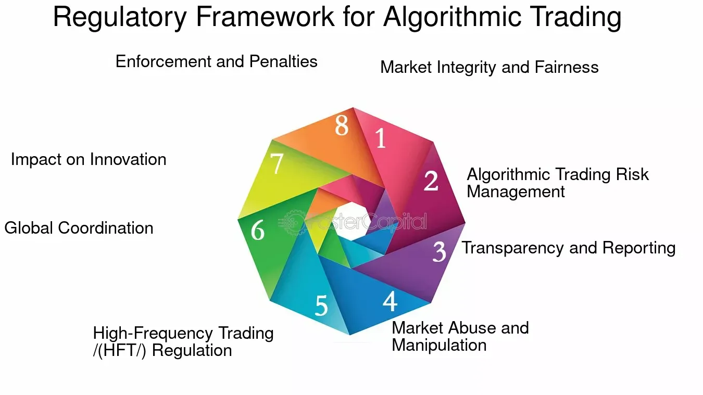

## Table of Contents

## What are trading algorithms?

Trading algorithms are computer programs that use math and rules to buy and sell things like stocks or cryptocurrencies automatically. They look at lots of data, like prices and news, and make decisions faster than people can. This helps traders make money by taking advantage of small changes in the market that might be hard for a person to notice.

These algorithms can be simple or very complex. Simple ones might just follow a basic rule, like buying a stock when its price goes down to a certain level. More complex algorithms might use artificial intelligence to predict what the market will do next. They can trade all the time, even when the market is closed, because they don't need to sleep or take breaks like people do. This makes them very useful for traders who want to make the most of every opportunity in the market.

## What is the role of regulatory bodies in financial markets?

Regulatory bodies in financial markets are like referees in a game. They make sure everyone plays by the rules and that the game is fair. These bodies create and enforce rules that companies and traders must follow. This helps protect people who invest their money in things like stocks or bonds. Without these rules, some people might cheat or take advantage of others, which could hurt the whole market.

These organizations also watch the market closely to spot any problems early. If they see something wrong, like a company lying about its money or someone trying to cheat, they can step in and stop it. This helps keep the market stable and trustworthy. People feel safer putting their money into the market when they know there's someone watching out for them.

## How do regulations affect the development of trading algorithms?

Regulations can slow down the development of trading algorithms because they add rules that developers must follow. For example, some rules might limit how fast an algorithm can trade or what kind of information it can use. This means developers have to spend more time making sure their algorithms follow these rules, which can delay the release of new algorithms.

On the other hand, regulations can also help improve trading algorithms. By setting clear rules, regulators make sure that everyone in the market plays fairly. This can lead to more trust in the market, which is good for everyone. Developers might also find new ways to make their algorithms better while still following the rules, which can lead to more advanced and reliable trading tools.

## What are some key regulations that impact trading algorithms?

One key regulation that impacts trading algorithms is the "Market Abuse Regulation" (MAR). This rule is meant to stop people from cheating in the market. It says that algorithms can't use inside information or try to trick the market. This means developers have to be careful about what information their algorithms use and how they trade. If they break this rule, they could get in big trouble.

Another important regulation is the "MiFID II" (Markets in Financial Instruments Directive II). This rule makes sure that trading is fair and open. It says that algorithms have to report their trades and can't hide what they're doing. This means developers have to build systems that keep track of everything and share it with regulators. It can make developing algorithms more complicated, but it also helps keep the market honest.

Lastly, the "Regulation on Algorithmic Trading" requires that firms using algorithms have strong systems in place to manage risks. This means they need to test their algorithms a lot to make sure they don't cause big problems in the market. It can slow down the development process, but it also makes sure that algorithms are safe and reliable.

## How do regulations like MiFID II influence algorithmic trading in Europe?

MiFID II, which stands for Markets in Financial Instruments Directive II, has a big impact on algorithmic trading in Europe. It makes sure that trading is fair and open by requiring algorithms to report all their trades. This means that firms using algorithms have to keep detailed records and share them with regulators. It can make developing these algorithms more complicated because developers have to build systems that track everything. But it also helps keep the market honest and trustworthy, which is good for everyone.

Another way MiFID II influences algorithmic trading is by trying to stop people from cheating. The regulation says that algorithms can't use inside information or try to trick the market. This means developers have to be very careful about what information their algorithms use and how they trade. If they don't follow these rules, they could face big fines or other penalties. So, while MiFID II can slow down the development of new algorithms, it also helps make sure that trading in Europe is fair and safe for everyone.

## What are the differences in regulatory approaches to algorithmic trading between the U.S. and Europe?

In the U.S., the main regulatory body for algorithmic trading is the Securities and Exchange Commission (SEC). The SEC focuses a lot on preventing market manipulation and ensuring that trading is fair. They have rules like the "Regulation NMS" which aims to protect investors and maintain fair, orderly, and efficient markets. The SEC also requires firms to have strong systems in place to manage risks, similar to Europe's rules. However, the U.S. approach tends to be more focused on specific rules and enforcement actions to catch and punish those who break them.

In Europe, the approach to regulating algorithmic trading is a bit different. The main regulation is MiFID II, which is more about transparency and reporting. European regulators want to make sure that all trades are recorded and shared with them, so they can keep an eye on the market and stop any cheating. MiFID II also has rules to prevent market abuse, but it puts a big emphasis on firms having good systems to manage risks and report their activities. Overall, Europe's approach is more about setting up systems to prevent problems before they happen, rather than just punishing them after.

Both the U.S. and Europe want to make sure that algorithmic trading is safe and fair, but they go about it in different ways. The U.S. focuses more on specific rules and enforcement, while Europe focuses more on transparency and risk management. These differences can affect how firms develop and use trading algorithms in each region.

## How do regulations aim to prevent market manipulation by trading algorithms?

Regulations aim to stop market manipulation by trading algorithms by setting strict rules that everyone must follow. In the U.S., the SEC has rules like Regulation NMS that make sure trading is fair and orderly. They watch the market closely and can punish anyone who tries to cheat. This means that firms using algorithms have to be very careful about how they trade and what information they use. If they break the rules, they could face big fines or other penalties. By having these strict rules and watching the market, the SEC helps prevent algorithms from being used to trick the market.

In Europe, MiFID II is the main regulation that works to stop market manipulation. It requires firms to report all their trades so that regulators can see everything that's happening. This transparency helps them spot any cheating early. MiFID II also says that algorithms can't use inside information or try to trick the market. Firms have to have strong systems to manage risks and make sure their algorithms don't cause problems. By focusing on transparency and risk management, European regulators help prevent market manipulation and keep trading fair for everyone.

## What are the compliance requirements for firms using trading algorithms?

Firms using trading algorithms have to follow a lot of rules to make sure they are doing things the right way. In the U.S., the SEC says that firms need to have strong systems to manage risks. This means they have to test their algorithms a lot to make sure they don't cause big problems in the market. They also have to keep detailed records of all their trades and be ready to share them with the SEC if asked. If they don't follow these rules, they could get in big trouble, like paying fines or even going to court.

In Europe, the rules are a bit different but still important. MiFID II says that firms have to report all their trades to the regulators. This helps the regulators keep an eye on the market and stop any cheating. Firms also have to make sure their algorithms don't use inside information or try to trick the market. They need to have good systems to manage risks and make sure everything is fair. By following these rules, firms help keep the market safe and trustworthy for everyone.

## How have regulations changed the operational aspects of trading algorithms?

Regulations have made it harder for firms to use trading algorithms because they have to follow more rules. For example, in the U.S., the SEC says firms need to test their algorithms a lot to make sure they don't cause big problems. They also have to keep detailed records of all their trades and be ready to share them with the SEC. This means firms have to spend more time and money making sure their algorithms follow all the rules. It can slow down how fast they can trade and make things more complicated.

In Europe, MiFID II has changed how firms use trading algorithms too. They have to report all their trades to the regulators so they can watch the market and stop any cheating. This means firms need to build systems that track everything they do. They also have to make sure their algorithms don't use inside information or try to trick the market. While this can make things more complicated, it also helps keep trading fair and safe for everyone.

## What are the challenges firms face in adapting their algorithms to new regulations?

Firms face a lot of challenges when they have to change their algorithms to follow new rules. One big challenge is that it takes a lot of time and money to make sure their algorithms follow all the new rules. They have to test their algorithms over and over to make sure they don't cause problems in the market. This can slow down how fast they can trade and make things more complicated for them. It's like having to redo a lot of work just to make sure everything is okay with the new rules.

Another challenge is keeping up with all the changes in the rules. Rules can change a lot, and firms have to keep updating their algorithms to stay in line. This means they always have to be learning about new rules and figuring out how to make their algorithms work with them. It can be hard to keep everything straight and make sure they're doing everything right. But it's important because if they don't follow the rules, they could get in big trouble, like paying fines or even going to court.

## How do regulatory changes affect the performance and profitability of trading algorithms?

Regulatory changes can make it harder for trading algorithms to perform well and make money. When new rules come out, firms have to spend a lot of time and money to change their algorithms to follow them. This means they might not be able to trade as fast or as often as before. They have to test their algorithms a lot to make sure they don't cause problems in the market. All this extra work can slow them down and make it harder to take advantage of opportunities in the market, which can hurt their profits.

On the other hand, following the rules can also help trading algorithms in the long run. When firms follow the rules, it helps keep the market fair and trustworthy. This can make more people want to invest, which can lead to more chances for trading algorithms to make money. While it might be hard at first to adapt to new rules, doing it right can help firms build a good reputation and keep their trading going strong over time.

## What future regulatory trends might impact the development of trading algorithms?

In the future, more rules might come out that focus on making sure trading algorithms are safe and fair. Regulators might want to use more technology to watch the market and catch any cheating faster. This could mean firms have to use special systems that report everything they do in real-time. It might also mean more rules about what kind of information algorithms can use, to stop them from using inside information or trying to trick the market. All these new rules could make it harder and more expensive for firms to develop new algorithms, but it would also help keep the market honest and safe for everyone.

Another trend could be more rules about how algorithms use artificial intelligence (AI). As AI gets better, regulators might want to make sure it's used in a way that's fair and doesn't cause problems. This could mean firms have to explain how their AI works and prove it's not going to do anything risky. It might also mean more testing and checking to make sure AI algorithms follow all the rules. While this could slow down how fast firms can use new AI technology, it would also help make sure that trading stays safe and reliable as technology changes.

## References & Further Reading

[1]: Aldridge, I. (2013). ["High-Frequency Trading: A Practical Guide to Algorithmic Strategies and Trading Systems"](https://www.amazon.com/High-Frequency-Trading-Practical-Algorithmic-Strategies/dp/1118343506). Wiley.

[2]: Cartea, Á., Jaimungal, S., & Penalva, J. (2015). ["Algorithmic and High-Frequency Trading"](https://assets.cambridge.org/97811070/91146/frontmatter/9781107091146_frontmatter.pdf). Cambridge University Press.

[3]: Gomber, P., Arndt, B., Lutat, M., & Uhle, T. (2011). ["High-Frequency Trading"](https://papers.ssrn.com/sol3/papers.cfm?abstract_id=1858626). Wirtschaftsinformatik, 53(2), 89-99.

[4]: European Securities and Markets Authority (ESMA). (2012). ["Guidelines on Systems and Controls in an Automated Trading Environment for Trading Platforms, Investment Firms and Competent Authorities"](https://www.esma.europa.eu/document/guidelines-systems-and-controls-in-automated-trading-environment-trading-platforms).

[5]: U.S. Securities and Exchange Commission (SEC). ["Concept Release on Equity Market Structure"](https://www.sec.gov/rules-regulations/2010/01/concept-release-equity-market-structure). (2010).

[6]: Narang, R. K. (2013). ["Inside the Black Box: A Simple Guide to Quantitative and High-Frequency Trading"](https://onlinelibrary.wiley.com/doi/book/10.1002/9781118662717). Wiley.

[7]: Biais, B., Foucault, T., & Moinas, S. (2015). ["Equilibrium Fast Trading"](https://www.sciencedirect.com/science/article/pii/S0304405X15000288). The Review of Financial Studies, 28(7), 2119-2154.