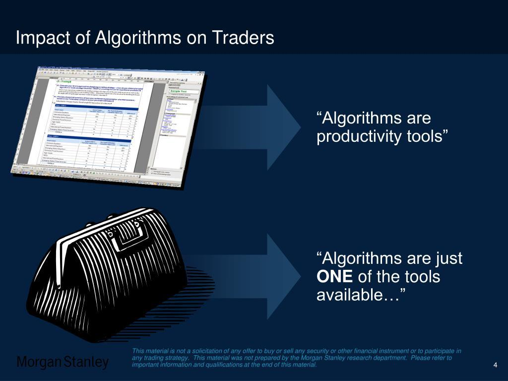

Algorithmic trading, often referred to as Algo Trading, represents a transformative approach in financial markets, where computer algorithms execute trading strategies automatically. This automation aims to improve efficiency by minimizing human error, swift execution, and often optimizing trading outcomes by leveraging high-speed data analysis. With its widespread adoption, Algo Trading has increasingly become a pivotal component of modern financial systems.

As algorithmic trading proliferates, it has brought about significant regulatory scrutiny. Regulatory bodies are concerned with potential risks, such as market manipulation, extreme volatility, and systemic risks associated with the scale and speed of algorithmic operations. The complexity and opacity of these algorithms pose unique challenges for regulators striving to ensure market fairness, transparency, and stability.

This article investigates the multifaceted regulatory landscape impacting Algo Trading across different jurisdictions. It highlights how key regulatory authorities, such as the U.S. Securities and Exchange Commission (SEC) and the European Securities and Markets Authority (ESMA), have implemented guidelines to manage these technological advancements. Moreover, understanding the diverse approaches adopted by countries provides essential insights for navigating these regulations effectively.

Furthermore, the regulatory measures directly affect trading firms and broader financial markets. Compliance introduces both operational costs and opportunities for innovation in developing algorithms that meet regulatory standards. These implications underline the necessity for traders and stakeholders to grasp regulatory requirements and adapt to the evolving landscape.

In summary, as technology in algorithmic trading continues to evolve, the understanding of its regulatory impacts is crucial. This exploration aims to provide a clearer view of the regulatory influences on Algo Trading and their effects on the financial ecosystem.

## Table of Contents

## The Growth of Algorithmic Trading

Algorithmic trading, commonly referred to as Algo Trading, has fundamentally transformed financial markets by automating trading strategies through complex computer algorithms. This automation enhances market efficiency by executing orders at speeds and frequencies unattainable through human intervention, thereby reducing the likelihood of human errors. Consequently, Algo Trading now constitutes a considerable portion of the trading volume on major international exchanges. 

The contribution of Algo Trading to [liquidity](/wiki/liquidity-risk-premium) and price discovery cannot be overstated. By processing vast amounts of data and reacting to market changes in milliseconds, algorithms ensure tighter spreads and more competitive pricing for traders and investors alike. This efficiency facilitates capital allocation, contributing to a more dynamic and responsive market environment.

However, the rapid expansion of Algo Trading presents significant challenges. As the frequency of trades increases, so does the complexity of algorithms employed, which can inadvertently amplify systemic market risks. High-frequency trading ([HFT](/wiki/high-frequency-trading-strategies)), a subset of Algo Trading characterized by extremely rapid order execution, is often associated with increased [volatility](/wiki/volatility-trading-strategies). The speed and [volume](/wiki/volume-trading-strategy) of trades challenge existing regulatory frameworks, raising concerns about market stability and fairness.

The sheer volume of transactions conducted by algorithms can sometimes lead to "flash crashes," where asset prices plummet and recover in a brief period, destabilizing markets momentarily. Furthermore, complex algorithms can interact in unforeseen ways, potentially leading to unintended market outcomes. Regulators face the daunting task of keeping up with these technological advancements to ensure a level playing field and prevent market manipulation.

In summary, while Algo Trading is instrumental in driving market efficiency and reducing transaction costs, its growth also necessitates robust regulatory oversight to mitigate emergent risks and maintain market integrity. The interplay between technological innovation and regulation remains a crucial area for ongoing collaboration and evolution in financial markets.

## Regulatory Landscape

Algorithmic trading, also known as Algo Trading, has grown significantly, prompting various jurisdictions to establish regulatory frameworks tailored to this trading method. Different countries have adopted diverse strategies to oversee and regulate [algorithmic trading](/wiki/algorithmic-trading) activities. 

In the United States, the Securities and Exchange Commission (SEC) plays a crucial role in regulating Algo Trading. The SEC requires firms to adhere to protocols that foster market fairness, transparency, and stability. These include maintaining audit trails of algorithmic activities and implementing risk management systems to mitigate the potential for market abuse and systemic risk.

Europe's regulatory environment, under the European Securities and Markets Authority (ESMA), emphasizes stringent guidelines to oversee algorithmic trading practices across member states. ESMA's regulatory framework mandates that trading firms ensure their algorithms are reliable and robust. Measures must be in place to test algorithms under different market conditions, and comprehensive risk management structures are necessary to avert market disruption. This harmonized approach contributes to maintaining a level playing field across the European Union's trading markets.

In Asia, the Hong Kong Monetary Authority (HKMA) and the Securities and Futures Commission (SFC) have issued guidance on algorithmic trading. These guidelines stress the importance of robust internal controls to manage algorithmic trading risks. The HKMA and SFC focus on ensuring that the algorithms deployed in Hong Kong's financial markets are subject to rigorous risk assessment and monitoring procedures. Consequently, firms are expected to actively oversee their trading systems to prevent unauthorized market maneuvers and ensure operational integrity.

In summary, the regulatory landscape for algorithmic trading is diverse yet cohesive in its objectives. While different jurisdictions adopt specific approaches tailored to their markets, the underlying focus remains consistent: ensuring market fairness, transparency, and stability. These regulations aim to safeguard against the inherent risks of algorithmic trading and promote confidence in financial markets worldwide.

## Impact of Regulations

Regulations in the field of algorithmic trading are primarily designed to mitigate extreme market volatility and curb systemic risks, ensuring the market operates smoothly and efficiently. One of the central requirements laid out by regulatory bodies is the implementation of robust risk management systems by trading firms. These systems are critical in monitoring and controlling the potential impacts of trading algorithms, thereby reducing the likelihood of unintended market disruptions.

To enhance accountability and transparency, regulators mandate the maintenance of algorithm audit trails. These audits record data about the algorithms' operations, providing a comprehensive history for analysis. This traceability is crucial in identifying and rectifying anomalies or faults in trading activities, ultimately safeguarding the integrity of financial markets.

However, adherence to these regulations can lead to increased operational costs for trading firms. The need to establish advanced risk management infrastructure, coupled with the requirement for continuous monitoring and reporting, necessitates significant investment in both technology and human resources. Firms must allocate budgets for compliance teams and invest in training staff to understand and effectively implement regulatory measures.

On the positive side, proper regulation fosters market integrity and bolsters investor confidence. By ensuring that trading algorithms operate within defined safety parameters, these regulations reassure investors that their investments are protected from undue risk and manipulation. This trust can lead to increased market participation, promoting greater liquidity and stability across financial markets.

Additionally, well-enforced regulations can encourage the development of innovative solutions that ensure compliance while enhancing trading efficiency. As trading firms strive to meet regulatory standards, they have the opportunity to adopt new technologies and methodologies that can further advance the capabilities of algorithmic trading systems.

## Challenges and Opportunities

One of the primary challenges in the domain of algorithmic trading is the rapid pace of technological advancement. As trading strategies evolve with increasing complexity, regulators and financial institutions must continuously update their rules and systems to ensure that algorithmic trading remains both secure and effective. This dynamic environment demands a proactive approach to regulatory adaptation to preclude potential systemic risks and market disruptions.

To address these challenges, there exists a substantial opportunity for innovation. Technological advancements provide a fertile ground for the development of trading algorithms that are not only efficient but also fully compliant with regulatory standards. Developers can leverage emerging tools and technologies to create algorithms that adhere to risk management guidelines while achieving high performance in trade execution.

Moreover, as regulatory frameworks evolve, it's imperative to focus on educational initiatives to bridge the knowledge gap among traders. Educating traders about the latest regulatory requirements and the role of compliance in algorithmic trading can significantly enhance their ability to navigate complex financial markets. This educational effort can be bolstered by workshops, certifications, and training programs that distill intricate regulatory concepts into practical knowledge.

An adaptive regulatory environment complemented by continuous learning and technological innovation could lead to a financial ecosystem where algorithms contribute positively to market efficiency while maintaining integrity and investor confidence. This balanced approach can help mitigate the risks associated with high-frequency trading and complex algorithmic strategies, resulting in a more sustainable trading landscape.

## Conclusion

Effective regulation of Algo Trading is crucial to maintaining a balance between technological innovation and market stability. As algorithmic trading becomes more prevalent, the necessity for robust regulatory measures to manage the inherent risks and opportunities cannot be overstated. A multi-faceted approach involving continuous dialogue between regulators, trading firms, and technology developers is vital to achieve this balance. This collaboration will facilitate the development of frameworks that are both flexible enough to accommodate advancements in technology and stringent enough to ensure market integrity and protect investors.

As firms increasingly employ algorithms to execute trades at unprecedented speeds, adapting regulatory frameworks becomes essential. This adaptability is particularly important to address new risks such as systemic volatility and market manipulation, which can arise from high-frequency trading and the complexity of algorithms used. By continuously revising and updating regulatory measures, authorities can provide a stable and secure trading environment, thereby fostering trust and encouraging innovation.

Future regulations may also need to evolve to encompass AI and [machine learning](/wiki/machine-learning) technologies, which are progressively being integrated into trading algorithms. These technologies offer the potential for more sophisticated and predictive trading strategies, yet they also introduce new challenges in terms of transparency, accountability, and ethical considerations. As these technologies advance, regulatory bodies will need to ensure that guidelines are in place to address these unique challenges and prevent potential misuse.

In conclusion, the future of Algo Trading hinges on the ability of regulators, industry participants, and developers to work collaboratively towards creating a sustainable and resilient trading ecosystem. This involves not only keeping pace with technological advancements but also anticipating future trends and risks to ensure that the benefits of algorithmic trading are maximized while its risks are minimized.

## References & Further Reading

[1]: Aldridge, I. (2013). ["High-Frequency Trading: A Practical Guide to Algorithmic Strategies and Trading Systems"](https://www.amazon.com/High-Frequency-Trading-Practical-Algorithmic-Strategies/dp/1118343506). Wiley.

[2]: Cartea, Á., Jaimungal, S., & Penalva, J. (2015). ["Algorithmic and High-Frequency Trading"](https://assets.cambridge.org/97811070/91146/frontmatter/9781107091146_frontmatter.pdf). Cambridge University Press.

[3]: Gomber, P., Arndt, B., Lutat, M., & Uhle, T. (2011). ["High-Frequency Trading"](https://papers.ssrn.com/sol3/papers.cfm?abstract_id=1858626). Wirtschaftsinformatik, 53(2), 89-99.

[4]: European Securities and Markets Authority (ESMA). (2012). ["Guidelines on Systems and Controls in an Automated Trading Environment for Trading Platforms, Investment Firms and Competent Authorities"](https://www.esma.europa.eu/document/guidelines-systems-and-controls-in-automated-trading-environment-trading-platforms).

[5]: U.S. Securities and Exchange Commission (SEC). ["Concept Release on Equity Market Structure"](https://www.sec.gov/rules-regulations/2010/01/concept-release-equity-market-structure). (2010).

[6]: Narang, R. K. (2013). ["Inside the Black Box: A Simple Guide to Quantitative and High-Frequency Trading"](https://onlinelibrary.wiley.com/doi/book/10.1002/9781118662717). Wiley.

[7]: Biais, B., Foucault, T., & Moinas, S. (2015). ["Equilibrium Fast Trading"](https://www.sciencedirect.com/science/article/pii/S0304405X15000288). The Review of Financial Studies, 28(7), 2119-2154.