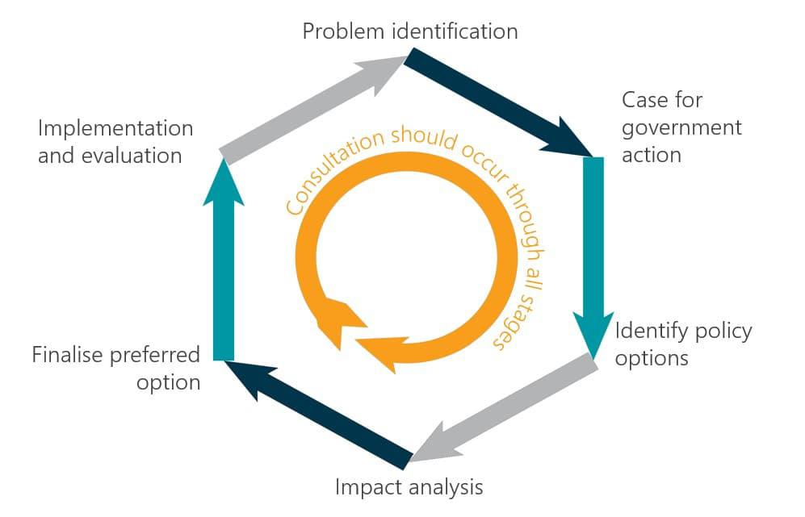

Algorithmic trading, commonly referred to as Algo Trading, has fundamentally reshaped financial markets by enhancing speed, precision, and efficiency in trade executions. Unlike manual trading, algorithmic trading utilizes complex algorithms and high-frequency trading strategies to systematically execute orders based on pre-defined criteria, offering a significant edge in terms of timing and volume control.

However, the rapid adoption and evolution of algorithmic trading have raised various regulatory concerns, predominantly revolving around issues of security, market integrity, and investor protection. The sophisticated nature of algorithmic strategies and their potential for high-speed market manipulations necessitate a comprehensive regulatory approach to mitigate associated risks.

This article examines the regulatory developments affecting algorithmic trading, emphasizing recent updates and their ramifications for diverse market stakeholders. These stakeholders, including traders, brokers, and algo providers, must navigate evolving regulations to sustain compliance and contribute to a secure trading environment. Recognizing the significance of these regulatory changes is paramount for all involved parties to adapt strategically and maintain effective participation in the financial markets. The overarching goal is to ensure that as algorithmic trading continues to advance, it does so within a framework that prioritizes ethical standards and market stability.

## Table of Contents

## The Need for Regulation in Algo Trading

Automation in financial markets through algorithmic trading has become widespread, prompting the need for structured regulatory measures. This demand is fueled by growing concerns about market manipulation, data security, and maintaining the integrity of financial markets. Algorithmic trading, with its high-speed operations, has the potential to disrupt markets if not properly regulated. Authorities have been compelled to adopt stricter oversight measures to mitigate these risks and protect market participants.

The primary goal of regulators is to formulate a balanced framework that allows algorithmic trading to flourish while simultaneously protecting participants from inherent risks. This involves crafting regulations that do not stifle innovation but ensure robust security, transparency, and accountability within trading systems. Regulators aim to strike a balance between encouraging technological advances and maintaining fair market practices.

Understanding the motives behind regulatory initiatives is crucial for stakeholders in algorithmic trading. Effective navigation and adaptation to these new requirements can minimize the risk of non-compliance. Regulatory frameworks focus on enhancing market integrity by preventing and addressing issues related to market manipulation. High-frequency trading strategies, which can potentially lead to flash crashes or other market anomalies, are under particular scrutiny.

Data security is another critical aspect driving the need for regulation. The increasing reliance on automated systems brings with it the threat of cyber-attacks and data breaches. Protecting sensitive information related to trading activities is paramount to maintaining market confidence. Regulators seek to enforce measures that ensure the confidentiality, integrity, and availability of data in automated trading environments.

In summary, the growing prevalence of [algorithmic trading](/wiki/algorithmic-trading) necessitates a regulatory framework that safeguards market integrity and participant security. By understanding and adhering to these regulations, market stakeholders can effectively manage the challenges of automation while leveraging its benefits for improved trading efficiency.

## Key Regulatory Measures and Their Implications

Recent developments in regulatory frameworks have placed algorithmic trading (algo trading) under scrutiny, with measures aimed at enhancing transparency, security, and accountability. Notably, the Securities and Exchange Board of India (SEBI) has instituted a comprehensive set of guidelines that outline specific requirements for various stakeholders in algo trading.

One of the primary measures mandates that brokers must obtain formal approval for the algorithms they deploy. This approval process ensures that the algorithms comply with regulatory standards and do not pose a risk to market stability. The requirement for prior approval is a significant step in maintaining market integrity, as it prevents the deployment of algorithms capable of manipulating market conditions or executing trades based on non-transparent criteria.

Additionally, specific restrictions have been placed on Application Programming Interface (API) access. These restrictions are designed to control and monitor the interaction of trading software with market systems, thereby curbing activities that could lead to unintentional market disruptions. By regulating API access, the authorities aim to limit the chances of erroneous trades and ensure that APIs are used in a manner that aligns with ethical trading practices.

A further critical measure is the introduction of unique identifiers for trades. By assigning a unique identifier to each transaction, regulatory bodies can effectively track and analyze trading activities. This level of traceability is crucial for detecting irregular patterns that could indicate market manipulation or other unethical activities. The use of unique trade identifiers enhances the transparency of market operations and provides a robust mechanism for auditing and regulatory review.

In addition to the measures directed at brokers, there is a heightened focus on the oversight of algo providers. The regulations push for more stringent compliance expectations from these entities, requiring them to register with relevant authorities and adhere to market standards. This increased oversight ensures that the algorithms designed and supplied meet the necessary ethical and technical criteria, thereby reducing the risk of market abuses.

Overall, these regulatory measures are instituted not only to prevent market disruption but also to ensure that trading strategies align with the ethical norms expected by regulatory bodies. By implementing these guidelines, authorities aim to foster a trading environment that balances innovation with the need for security and fairness in financial markets. Compliance with these regulatory measures is essential for the continuation of responsible and sustainable algo trading practices.

## Impact on Different Stakeholders

Algorithmic trading regulations have created specific impacts on various stakeholders in the financial market. 

Retail traders, for instance, benefit from enhanced security measures due to structured algorithm usage, which contributes to a safer trading environment. However, these traders face new challenges, such as complying with additional authentication and registration steps. This involves adapting to increased monitoring and verification processes, which are designed to protect individual investors while ensuring adherence to regulatory standards.

Stock brokers experience a heightened sense of responsibility in the regulatory landscape. They are expected to implement advanced grievance management systems and algorithm monitoring practices. This necessitates the development of sophisticated compliance infrastructures to guarantee that all algo trading activities adhere to prevailing legal and ethical standards. As a result, brokers are required to invest in technology and personnel that can effectively manage these demands, ensuring that their operations remain compliant.

Algo providers are witnessing greater recognition and legitimacy due to the evolving regulatory context, which demands that they adhere to new obligations. One significant requirement is their registration with stock exchanges, enhancing their accountability within the financial ecosystem. This development provides algo providers with structured guidelines that align their operations with market expectations, supporting a stable and sustainable trading environment.

Stock exchanges play a crucial role in this regulatory framework as they gain improved risk management capabilities. Their enhanced involvement in market surveillance and algorithm approval processes allows for more effective oversight and enforcement of trading practices. This not only mitigates potential disruptions but also reinforces the integrity and fairness of financial markets. These improved mechanisms enable exchanges to better manage risks associated with algorithmic trading, thereby protecting all market participants.

## Global Perspective on Algo Trading Regulations

Globally, regulatory bodies are confronting the dynamic challenges presented by algorithmic trading, seeking to uphold market integrity while fostering innovation. Robotics and [machine learning](/wiki/machine-learning) have transformed financial markets, necessitating comprehensive regulatory frameworks to manage risks such as market manipulation and systemic disruptions effectively.

In Asia, countries like India and Japan have been at the forefront of implementing robust regulatory measures. The Securities and Exchange Board of India (SEBI) has taken significant steps to impose regulations that balance innovation and protection through guidelines on algorithm approvals and operational transparency. Japan, under the Japan Exchange Group, has emphasized circuit breakers and stringent reporting requirements to mitigate risks associated with high-frequency trading.

The United States presents a more fragmented approach, with both federal and state-level regulations impacting algo trading. The Securities and Exchange Commission (SEC) and the Commodity Futures Trading Commission (CFTC) regulate different aspects of the market. The SEC has focused on increasing transparency and resilience through its Market Access Rule and Regulation SCI, which require trading platforms to enhance their systems' security and reliability. Meanwhile, the CFTC's focus includes risk management and oversight for futures and derivatives markets.

Europe has taken a comprehensive approach under the Markets in Financial Instruments Directive II (MiFID II), emphasizing market transparency, non-discriminatory access, and reporting obligations. MiFID II mandates rigorous algo testing, clear risk management protocols, and consistent monitoring to minimize potential market [volatility](/wiki/volatility-trading-strategies) and ensure fair competition.

These disparate regional strategies underline the necessity for a unified global regulatory approach given the cross-border nature of algorithmic trading. Financial authorities must collaborate internationally to harmonize rules, enabling seamless trading operations while maintaining robust market safeguards. This is imperative for combating regulatory [arbitrage](/wiki/arbitrage), where firms exploit minor regulatory divergences to gain advantage.

Market participants need to stay informed about these international regulatory trends to ensure comprehensive compliance. Failure to adapt to diverse regional regulations can result in legal complications, financial penalties, and damage to reputation. By actively engaging with the evolving regulatory landscape, participants can not only meet compliance requirements but also contribute to a secure, transparent, and equitable trading environment.

## Conclusion: Future of Algo Trading under Regulation

The evolving regulatory landscape for algorithmic trading is increasingly focused on achieving a balance between harnessing the potential benefits of automated trading systems and ensuring the market's overall stability and protection of investors. As regulations continue to develop, the future of algorithmic trading will likely become more structured and secure. This shift is poised to promote responsible innovation within the industry, fostering an environment where cutting-edge strategies can flourish without compromising market integrity.

Compliance with these regulatory frameworks will become essential for sustainable participation in algorithmic trading. Market participants, including traders, brokers, and algo providers, will need to stay informed and adapt to these requirements to avoid any legal or financial repercussions. By actively embracing these changes, stakeholders not only enhance their compliance but also position themselves to benefit from a more robust and equitable trading ecosystem.

The anticipated structural reforms are expected to lead to a more transparent and fair marketplace. With well-defined rules and heightened oversight, the risk of manipulative practices and systemic disruptions can be minimized. This progression allows for a trading environment where ethical standards are upheld, and the potential for technological advancements can be fully realized.

Moreover, as regulatory bodies worldwide strive for harmonization, the possibility for cross-border consistency in trading regulations grows. This global alignment could facilitate smoother international trading operations, benefiting market participants with diversified investments across various jurisdictions.

In conclusion, the future of algorithmic trading under regulation presents a promising outlook where innovation is encouraged, stability is prioritized, and investor protection is enhanced. By aligning their strategies with the evolving regulatory landscape, stakeholders can secure their participation in this transforming market while contributing to its integrity and resilience.

## References & Further Reading

[1]: Aldridge, I. (2013). ["High-Frequency Trading: A Practical Guide to Algorithmic Strategies and Trading Systems."](https://www.wiley.com/en-us/High+Frequency+Trading%3A+A+Practical+Guide+to+Algorithmic+Strategies+and+Trading+Systems%2C+2nd+Edition-p-9781118343500) Wiley.

[2]: Cartea, A., Jaimungal, S., & Penalva, J. (2015). ["Algorithmic and High-Frequency Trading."](https://assets.cambridge.org/97811070/91146/frontmatter/9781107091146_frontmatter.pdf) Cambridge University Press.

[3]: Securities and Exchange Board of India (SEBI) guidelines for algorithmic trading. [SEBI Official Website](https://www.sebi.gov.in/legal/circulars/mar-2012/broad-guidelines-on-algorithmic-trading_22471.html).

[4]: Markets in Financial Instruments Directive II (MiFID II). [European Securities and Markets Authority (ESMA) Guidelines](https://eur-lex.europa.eu/eli/dir/2014/65/oj/eng).

[5]: Securities and Exchange Commission (SEC) Market Access Rule, Rule 15c3-5. [SEC Official Website](https://www.sec.gov/files/rules/final/2010/34-63241.pdf).

[6]: Commodity Futures Trading Commission (CFTC) Regulations on Automated Trading. [CFTC Official Website](https://www.cftc.gov/PressRoom/PressReleases/7283-15).

[7]: Lopez de Prado, M. (2018). ["Advances in Financial Machine Learning."](https://archive.org/download/massimo_motta_competition_policy_theory_and_prabookfi-org/Marcos%20Lopez%20de%20Prado%20-%20Advances%20in%20Financial%20Machine%20Learning-Wiley%20%282018%29.pdf) Wiley.

[8]: Johnson, B. (2010). ["Algorithmic Trading & DMA: An introduction to direct access trading strategies."](https://archive.org/details/algorithmictradi0000john) 4Myeloma Press.