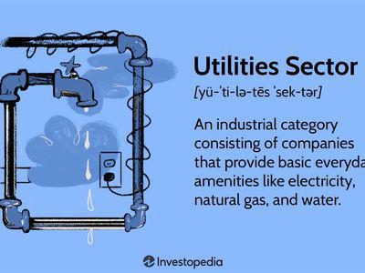

The utilities sector is a cornerstone of modern economies, underpinning daily life by providing indispensable services such as electricity and water. This sector's operations are integral to both residential well-being and economic productivity. It is heavily shaped by a complex web of regulations that govern pricing strategies, service quality, and environmental impacts. These regulations are primarily enacted to ensure affordable, reliable, and sustainable service delivery. However, they also pose challenges—for instance, balancing cost-effectiveness with environmental responsibilities and addressing the infrastructure needs of an evolving market.

In recent years, algorithmic trading has emerged as a transformative force in financial markets, extending its influence to commodities, including energy and natural resources—key components of the utilities sector. Algorithmic trading, through its ability to process vast datasets at high speeds, offers potential benefits such as increased market liquidity and improved pricing efficiency. However, it also introduces complexity into market dynamics, including concerns about volatility and market manipulation.



This article seeks to explore the economic impact of regulations on the utilities sector, with a particular focus on the growing role of algorithmic trading. By examining how regulatory frameworks shape market dynamics, the article aims to shed light on their implications for both investors and consumers within the utilities sector. Understanding these aspects is crucial for stakeholders looking to navigate the evolving regulatory and technological landscape. The interplay between regulation and technology could redefine utilities’ operations, influencing competitive dynamics and investment priorities.

## Table of Contents

## Regulatory Landscape of the Utilities Sector

Utilities in the United States operate under a complex regulatory framework shaped by federal, state, and municipal authorities. Among these, the Federal Energy Regulatory Commission (FERC) holds significant influence, particularly over interstate electricity, natural gas, and oil pipeline transportation. FERC is responsible for regulating the transmission and wholesale sale of electricity and gas in interstate commerce, thereby ensuring just and reasonable rates and the reliability of the grid. Additionally, FERC oversees the licensing of hydroelectric projects, contributing to both infrastructure and environmental considerations.

State and municipal regulatory bodies primarily regulate intrastate utility operations. This includes overseeing local electric and water services, as well as establishing service territories for utility companies. State public utility commissions (PUCs) play a pivotal role in determining pricing structures, often implementing rate cases to balance the financial viability of utility companies with consumer interests. These bodies enact regulations that significantly impact infrastructure development, pricing models, and corporate governance within the utilities sector.

One key aspect of the regulatory landscape is the establishment and enforcement of pricing regulations. These regulations are designed to prevent monopolistic pricing behavior, ensuring that utilities provide services at fair and accessible prices. Market competition laws complement these efforts by encouraging competitive practices in generation and supply, thereby enhancing service quality and fostering innovation.

Environmental policies are another critical component, aiming to mitigate the environmental impacts of utility operations. Such regulations often require utilities to adopt cleaner energy sources and implement sustainable practices, aligning with broader governmental climate goals. This is particularly relevant in the context of the Clean Air Act and states’ initiatives for renewable energy standards, which influence utility planning and operations.

Despite the benefits, critics argue that extensive regulations can increase operational costs and limit innovation. They contend that compliance with diverse and sometimes overlapping regulatory requirements can burden utility companies, lead to inefficiencies, and hinder their ability to integrate new technologies rapidly.

Significant regulatory bodies and policies in this context include the Environmental Protection Agency (EPA) for environmental rules, the Department of Energy (DOE) for energy policies, and state-level equivalents such as the California Public Utilities Commission (CPUC) and the New York State Public Service Commission (NYPSC). These entities and their policies work collectively to shape the utilities sector, ensuring that it meets public needs while addressing economic, environmental, and technological challenges.

In summary, the regulatory landscape of the utilities sector is characterized by a balance between ensuring reliable, affordable services and fostering sustainable practices, amid the ongoing challenge of accommodating technological advancements and market changes.

## Economic Impacts of Utilities Sector Regulations

Regulations play a crucial role in shaping the economic performance of utility companies by influencing their profit margins, investment incentives, and overall operational dynamics. One significant impact of these regulations is the constraints they impose on pricing models. Utility companies often operate within a framework of regulated pricing, which aims to protect consumers from volatile price swings while ensuring affordability. However, this can also limit the ability of companies to adapt to market changes, potentially affecting their profitability.

Investment incentives are also affected by regulatory policies. Regulations that mandate investments in infrastructure, such as renewable energy sources or pollution control technologies, require significant capital expenditures. While these investments can lead to long-term benefits, they may strain the financial resources of utility companies in the short term, impacting cash flow and profitability. Moreover, regulations that encourage or require such investments can deter market entry for smaller companies unable to meet these capital demands, thereby reducing competition.

Operational inefficiencies can also result from regulatory compliance requirements. For instance, adhering to stringent reporting and monitoring standards can increase administrative burdens and operational costs. While such regulations aim to ensure service quality and environmental protection, they can sometimes lead to redundant processes that do not directly contribute to improved service delivery.

Balancing regulation with innovation is critical for sustainable economic growth in the utilities sector. Regulations need to be designed flexibly to accommodate technological advancements and evolving market conditions. For example, the integration of smart grid technologies offers opportunities to enhance efficiency and reliability, but regulatory barriers can impede their adoption and scalability.

Economic models and case studies provide insight into these dynamics. A widely used model in regulatory economics is the Averch-Johnson (A-J) effect, which suggests that utility companies under rate-of-return regulation might overinvest in capital to maximize their allowed rate of return. This behavior can lead to inefficient capital allocation and ultimately affect consumer prices. However, empirical studies such as those analyzing deregulation efforts in various regions reveal the potential for increased competition and innovation, leading to better service offerings and lower costs for consumers.

Understanding the economic impacts of utility sector regulations can inform regulatory adjustments and potential reforms. Stakeholders, including policymakers, industry leaders, and consumer advocacy groups, need to consider these effects to develop regulations that not only protect consumers and the environment but also promote innovation and economic efficiency. The ongoing challenge is to find a regulatory balance that fosters competitive markets while ensuring that utility services remain reliable, affordable, and sustainable.

## Overview of Algorithmic Trading in the Utilities Sector

Algorithmic trading, often abbreviated as algo trading, involves the use of complex algorithms to facilitate rapid and efficient trading processes. In the utilities sector, this approach is gaining prominence, particularly in the short-term power and gas markets, where speed and precision are crucial for trading and [arbitrage](/wiki/arbitrage) opportunities.

### Principles of Algorithmic Trading

Algorithmic trading hinges on predefined criteria, such as timing, price, and quantity, to execute trades automatically. These algorithms are crafted to capitalize on market trends and patterns that might be imperceptible to human traders. The efficiency of algo trading is largely attributed to the following components:

1. **Speed and Automation**: Algorithms can process market data and execute trades much faster than humans, capitalizing on transient market conditions. 

   Example in Python:
   ```python
   def execute_trade(market_data, threshold):
       if market_data['price'] < threshold:
           return "BUY"
       elif market_data['price'] > threshold:
           return "SELL"
       return "HOLD"
   ```

2. **Complex Mathematics and Statistical Models**: Algorithms often utilize mathematical models and statistical methods to predict market movements. Techniques such as mean reversion, momentum strategies, and statistical arbitrage are common.

3. **Data-Driven Analysis**: Algorithms analyze large datasets to identify trends and execute trades. Machine learning models can be employed to enhance predictive accuracy.

### Applications in Energy and Utilities Markets

In the utilities sector, [algorithmic trading](/wiki/algorithmic-trading) is employed predominantly in short-term markets due to its ability to enhance [liquidity](/wiki/liquidity-risk-premium) and pricing efficiency. Key applications include:

- **Trading and Arbitrage**: Algorithms can identify price discrepancies in different markets or time frames, allowing for profitable arbitrage opportunities. For instance, prices in the intraday market may deviate from those in the day-ahead market, offering arbitrage possibilities.

- **Market Liquidity and Pricing Accuracy**: By enabling rapid trade execution, algorithmic trading contributes to better price discovery and increased market liquidity. This enhances overall market efficiency and reduces the bid-ask spread, benefiting both traders and consumers.

### Challenges and Considerations

However, algorithmic trading is not devoid of challenges. Key concerns include:

- **Increased Volatility**: The speed and volume of trades executed by algorithms can contribute to market volatility, especially if algorithms are misconfigured or react to erroneous data.

- **Market Manipulation Risks**: Without proper regulatory oversight, algorithmic trading can be exploited for manipulative practices, such as spoofing or layering. Ensuring transparency and accountability is crucial to mitigate these risks.

- **Technological Infrastructure**: Robust infrastructure capable of handling high-frequency trades is essential. Delays in execution or data transmission can lead to significant financial losses.

In conclusion, algorithmic trading represents a significant shift in the utilities sector, offering numerous benefits alongside inherent challenges. As this form of trading evolves, its impact on market dynamics, efficiency, and regulatory frameworks will likely continue to grow. Understanding these aspects is vital for stakeholders aiming to leverage algo trading effectively in the utilities market.

## Regulatory Considerations for Algorithmic Trading

Algorithmic trading, or algo trading, has become a significant component in financial markets, including the utilities sector. However, its rapid adoption and the complexities involved necessitate robust regulatory frameworks to safeguard market integrity and prevent manipulative activities. One prominent regulatory framework is the Markets in Financial Instruments Directive II (MiFID II) in the European Union. MiFID II mandates stringent requirements for risk management, algorithm testing, and reporting for firms engaged in algo trading. It requires firms to implement systems and controls to manage trading risks and mandates the disclosure of algo trading strategies to regulators. This transparency is designed to prevent market abuse and promote fair trading practices.

Emerging regulations, like the EU's Artificial Intelligence Act, are increasingly relevant as they dictate how algorithms, including those used in trading, can be developed, tested, and deployed. This legislative initiative seeks to set standards for AI applications, categorizing them based on risk and imposing varying levels of compliance requirements. For algo trading, this implies that firms must adhere to AI Act provisions to ensure that algorithms are transparent, secure, and do not lead to biased or unfair market outcomes.

In the United States, the Commodity Futures Trading Commission (CFTC) plays a pivotal role in regulating futures and derivatives markets, which includes algorithmic trading activities. CFTC regulations emphasize the prevention of market disruptions caused by high-frequency trading strategies and require firms to register and provide details about their trading algorithms. The agency implements rules to detect and mitigate potentially disruptive trading practices that could lead to market instability or manipulation.

Globally, the regulatory landscape for algo trading is evolving to address the dual concerns of facilitating technological innovations while maintaining robust oversight. Regulators across jurisdictions are increasingly focusing on responsibilities like algorithm testing, risk controls, and preventing potential conflicts of interest.

The implications for the utilities sector are significant. As algo trading becomes more entrenched in commodities and energy markets, regulatory compliance will shape how utility firms and trading companies utilize these technologies. Proper regulatory alignment can help mitigate the risks associated with algo trading while harnessing its benefits for enhanced market efficiency. For stakeholders in the utilities sector, staying informed and compliant with these evolving regulatory requirements is crucial for maintaining competitive advantage and avoiding regulatory penalties.

## Interplay Between Regulations, Algo Trading, and Market Dynamics

Regulations play a pivotal role in shaping how algorithmic trading functions within the utilities sector, affecting both operational efficiency and compliance mandates. Algorithmic trading (algo trading), known for its capability to execute trades at high speed and [volume](/wiki/volume-trading-strategy), is influenced by regulatory frameworks that seek to maintain market integrity, prevent manipulation, and ensure transparency. These regulations dictate operational strategies, risk management protocols, and reporting standards, which in turn affect how algo trading systems are developed and implemented in the utilities sector.

Algo trading holds the potential to address several regulatory challenges by improving market efficiency. It achieves this through enhanced liquidity and accurate pricing mechanisms, which are vital in markets characterized by complex supply and demand dynamics, such as electricity and gas. This increased efficiency can drive down transaction costs and reduce the bid-ask spread, creating a more competitive environment for market participants. Algorithms designed to optimize trading strategies can leverage vast datasets to predict market movements more accurately, thus facilitating more informed decision-making by investors.

However, the integration of algo trading into the utilities market also introduces new oversight and control challenges. The potential for market manipulation through strategies like spoofing and layering necessitates strict regulatory scrutiny. Regulators are tasked with ensuring that trading algorithms do not exploit market structures to create unfair advantages. Advanced monitoring tools and [machine learning](/wiki/machine-learning)-based anomaly detection systems are often employed by regulatory bodies to detect and mitigate such risks. Additionally, trade activity logs and algorithm auditing are becoming standard practices to uphold market integrity.

The interplay between regulations and technology is reshaping competitive dynamics and investment priorities in the utilities sector. As algorithmic trading reduces barriers to entry in financial markets, smaller entities can engage in trading activities that were once the domain of large institutions. This democratization of market participation can lead to more diverse market interactions and increased competition. Furthermore, companies that strategically invest in technology and compliance infrastructure can gain a competitive edge, allowing them to capitalize on evolving market conditions and regulatory landscapes.

Case studies offer illustrative insights into how companies successfully navigate this regulatory and technological convergence. For instance, a utility firm employing advanced algo trading systems and robust compliance frameworks may achieve enhanced operational efficiency and a superior risk-return profile compared to its peers. Such cases demonstrate the potential benefits of integrating regulatory compliance with technological innovation, underscoring the importance of strategic alignment between these core areas.

Looking ahead, several trends and strategic recommendations emerge. Anticipated advancements in AI and machine learning are expected to further influence algo trading strategies, offering more refined predictive analytics and automated decision-making. Companies should focus on developing adaptable algorithmic models that can quickly respond to regulatory changes and market shifts. Additionally, fostering collaboration between regulators, industry stakeholders, and technologists will be critical to balancing regulatory compliance with innovation.

The alignment of regulations with technological advances, such as algo trading, in the utilities sector can yield significant benefits, yet requires ongoing dialogue and policy evolution to keep pace with rapid market changes. Stakeholders who proactively engage in this dynamic landscape will likely secure competitive advantage and contribute to a more efficient and robust utilities market.

## Conclusion

The utilities sector operates at a pivotal junction where regulatory frameworks and technological advancements, such as algorithmic trading, converge. Understanding the economic impact of these regulations, coupled with the growing role of algorithmic trading, is essential for all stakeholders. These stakeholders include utility companies, investors, regulators, and consumers, each of whom is affected by how regulations and technology influence market dynamics and operational efficiencies.

Aligning regulations with technological advancements should be a strategic priority for fostering innovation and improving service quality while ensuring consumer protection. Proper alignment can lead to increased efficiency in operations, enhanced trading strategies, and a more resilient market structure. It is crucial to consider the rapid pace of technological change, which necessitates adaptive regulatory measures to harness benefits without compromising market integrity or consumer interests.

The intersection of regulations and technology also underscores the need for collaborative efforts among regulatory bodies, industry participants, and technologists. Such collaboration is vital for optimizing balance, creating an environment where innovation thrives alongside regulatory compliance. The exchange of knowledge and best practices can drive forward-looking, flexible regulatory policies that accommodate the emergent capabilities of algorithmic trading.

Looking ahead, ongoing research and policy development are imperative to keep pace with evolving markets. Regulators and industry players must remain vigilant and proactive, anticipating changes and developing strategies that mitigate risks while capitalizing on opportunities. This ensures that the utilities sector remains robust and capable of meeting future demands. 

The call to action is clear: stakeholders must engage in continuous dialogue and research, striving for a regulatory environment that effectively integrates technological advancements with economic objectives. This will enable a resilient and dynamic utilities sector capable of delivering optimal outcomes for all parties involved.

## References & Further Reading

[1]: Fama, E. F., & French, K. R. (1993). ["Common risk factors in the returns on stocks and bonds."](https://www.sciencedirect.com/science/article/pii/0304405X93900235) Journal of Financial Economics, 33(1).

[2]: Aldridge, I. (2013). ["High-Frequency Trading: A Practical Guide to Algorithmic Strategies and Trading Systems."](https://www.ahmetbeyefendi.com/wp-content/uploads/2020/07/High-Frequency-Trading-Irene-Aldridge.pdf) Wiley.

[3]: Cartea, Á., Jaimungal, S., & Penalva, J. (2015). ["Algorithmic and High-Frequency Trading."](https://assets.cambridge.org/97811070/91146/frontmatter/9781107091146_frontmatter.pdf) Cambridge University Press.

[4]: ["The Impact of Algorithmic Trading on Securities Markets."](https://www.sec.gov/files/Algo_Trading_Report_2020.pdf) (2011). Bank for International Settlements (BIS) - Committee on the Global Financial System.

[5]: Mishkin, F. S. (1997). ["The Causes and Propagation of Financial Instability: Lessons for Policymakers,"](https://www.kansascityfed.org/documents/3591/pdf-s97Mishk.pdf) National Bureau of Economic Research Working Paper No. 6399.

[6]: Smith, J. B., & Wilson, M. C. (2017). ["Energy Market Complexity and the Economics of Supply Security."](https://journals.publishing.umich.edu/tia/article/id/453/) Springer.