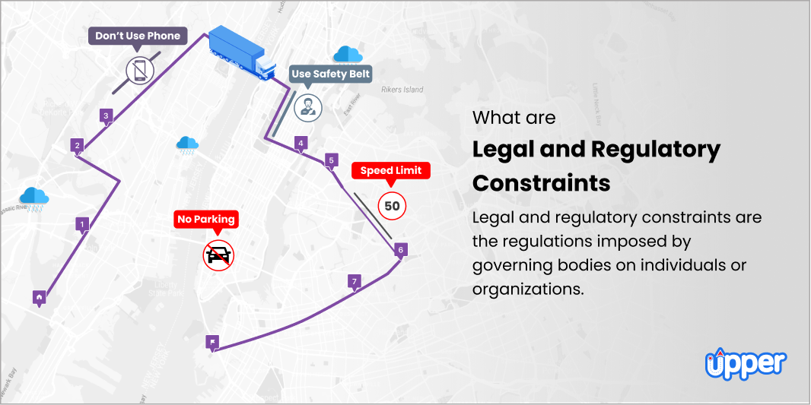

## Table of Contents

## What are regulatory limitations?

Regulatory limitations are rules set by government or other official bodies that tell companies and people what they can and can't do. These rules are made to keep things safe, fair, and good for the environment. For example, there might be rules about how much pollution a factory can make, or what information a company has to share with customers.

These limitations can affect how businesses work and grow. Sometimes, they can make it harder for companies to do things quickly or cheaply. But, they are important because they help protect people and the planet. Without these rules, companies might do things that are harmful just to make more money. So, while they can be a challenge, regulatory limitations are necessary for a healthy society.

## Why are regulatory limitations important?

Regulatory limitations are important because they help keep everyone safe and make sure things are fair. Imagine if there were no rules about how much pollution a factory can make. The air and water could get really dirty, and that would be bad for people's health. Or think about if companies could hide important information from customers. People might buy things that are not good for them without knowing it. So, these rules protect us and make sure companies do the right thing.

These limitations also help keep the playing field level for businesses. Without them, big companies might do whatever they want to make more money, even if it hurts smaller businesses or the environment. Regulatory limitations make sure everyone follows the same rules, which helps create a fair competition. This is good for the economy because it encourages businesses to find better ways to do things while still being safe and responsible.

## Who enforces regulatory limitations?

Regulatory limitations are enforced by government agencies. These agencies make sure that companies and people follow the rules. For example, in the United States, the Environmental Protection Agency (EPA) checks that factories do not pollute too much. If a factory breaks the rules, the EPA can make them stop or even fine them.

Sometimes, other groups help with enforcement too. For instance, local governments might check if businesses follow health and safety rules. If they find a problem, they can tell the business to fix it or shut it down. This teamwork helps make sure that regulatory limitations are followed everywhere.

## Can you give examples of common regulatory limitations?

One common regulatory limitation is about safety at work. Governments have rules that say companies must keep their workers safe. This means they have to give workers the right safety gear, like helmets or gloves, and make sure the workplace is not dangerous. If a company does not follow these rules, they can get in trouble and have to pay a fine.

Another example is about the environment. There are rules that say how much pollution factories can make. These rules help keep the air and water clean. If a factory makes too much pollution, they might have to pay a fine or even close down until they fix the problem. This helps protect nature and keep people healthy.

A third example is about what companies have to tell customers. There are rules that say companies must be honest about their products. They can't lie about what's in their products or how they work. If a company breaks these rules, they can get in trouble and might have to pay money back to customers or face other penalties. This helps make sure people can trust what they buy.

## How do regulatory limitations affect businesses?

Regulatory limitations can make it harder for businesses to do things quickly or cheaply. For example, if a factory has to follow strict rules about pollution, it might need to buy expensive equipment to clean the air or water. This can cost a lot of money and take time to set up. Also, if a business has to follow rules about what it can say to customers, it might need to change its advertising or labels. This can slow down how fast the business can bring new products to the market.

On the other hand, regulatory limitations can also help businesses in some ways. When all companies have to follow the same rules, it makes things fair. This means a small business has a better chance to compete with a big business because everyone plays by the same rules. Also, when customers know that businesses are following safety and honesty rules, they might trust the business more. This can help the business grow because people feel safe buying their products or services.

## What are the consequences of not following regulatory limitations?

If a business does not follow regulatory limitations, it can face serious consequences. Government agencies can find out if a business is breaking the rules through inspections or complaints. If they find out a business is not following the rules, they can make the business stop what it's doing or fix the problem. For example, if a factory is making too much pollution, the government might make it shut down until it cleans up.

The business might also have to pay a fine, which is like a punishment in money. The fine can be a lot of money, and it can hurt the business's finances. Sometimes, the business might even have to go to court, and if it loses, it could have to pay even more money or face other punishments. Not following regulatory limitations can also make customers lose trust in the business, which can hurt its reputation and make it hard to sell products or services.

## How can businesses stay informed about changes in regulatory limitations?

Businesses can stay informed about changes in regulatory limitations by regularly checking government websites. These websites often have the latest rules and updates. Businesses can also sign up for newsletters or alerts from government agencies. This way, they get emails or messages when there are new rules or changes to old ones. It's a good idea to have someone in the business whose job it is to keep an eye on these updates.

Another way businesses can stay informed is by joining industry groups or associations. These groups often share information about new rules that affect their members. They might have meetings or send out emails to keep everyone up to date. Businesses can also hire lawyers or consultants who know a lot about regulations. These experts can help the business understand the rules and make sure they are following them correctly.

## What role do international regulatory limitations play in global business?

International regulatory limitations are rules set by different countries that affect how businesses work around the world. These rules can be about things like trade, safety, and the environment. For example, if a company wants to sell its products in another country, it has to follow that country's rules. This can make it harder for the company because it has to learn and follow different rules in different places. But these rules are important because they help make sure that businesses are safe and fair no matter where they are.

Even though international regulatory limitations can be challenging, they also help businesses in some ways. When countries agree on rules together, it can make it easier for businesses to work in different places. For example, if many countries have the same safety rules, a company can make one product that works everywhere. This can save the company time and money. So, while international regulatory limitations can make things more complicated, they also help create a more stable and fair global market.

## How do regulatory limitations vary by industry?

Regulatory limitations can be very different depending on the industry. For example, in the food industry, there are strict rules about how food is made and what can be in it. These rules help make sure that the food is safe to eat and that companies tell the truth about what's in their products. In the healthcare industry, there are rules about how doctors and hospitals treat patients. These rules help keep patients safe and make sure they get the right care. Each industry has its own set of rules because different industries have different ways they can affect people's lives.

In the financial industry, there are rules about how banks and other companies handle money. These rules help make sure that people's money is safe and that companies are honest about what they do with it. In the energy industry, there are rules about how much pollution power plants can make. These rules help protect the environment and keep the air and water clean. So, while all industries have to follow some general rules, each one also has special rules that fit what they do.

## What are the challenges in complying with regulatory limitations?

Complying with regulatory limitations can be hard for businesses. One big challenge is that the rules can be very complicated. Businesses have to learn a lot of details and make sure they follow everything correctly. This can take a lot of time and money. They might need to hire special people, like lawyers or consultants, to help them understand the rules. If the business is small, it can be even harder because they might not have a lot of money to spend on this.

Another challenge is that the rules can change. Governments can make new rules or change old ones, and businesses have to keep up with these changes. This means they always have to be learning and adjusting how they do things. Sometimes, businesses that work in many different places have to follow different rules in each place. This can make it very confusing and hard to make sure they are doing everything right everywhere.

## How can technology assist in managing regulatory limitations?

Technology can help businesses manage regulatory limitations by making things easier and faster. For example, special software can keep track of all the rules a business has to follow. This software can remind the business when they need to do something, like fill out a report or get a new permit. It can also help the business keep records of everything they do, so they can show the government they are following the rules. This can save a lot of time and make it less likely that the business will miss something important.

Another way technology helps is by making it easier to share information. If a business works in many different places, technology can help them know about the rules in each place. They can use the internet to find out about new rules or changes to old ones. They can also use technology to talk to other businesses or experts who can help them understand the rules. This can make it easier for the business to stay up to date and make sure they are doing everything right.

## What future trends might impact regulatory limitations?

In the future, technology will play a bigger role in how regulatory limitations are made and followed. As more businesses use things like artificial intelligence and big data, governments might make new rules to make sure these technologies are used safely and fairly. For example, there could be rules about how companies can use people's personal information. Also, as more things become connected through the internet, like cars and home devices, there might be new rules to keep these things safe from hackers. This means businesses will need to keep up with these new rules and use technology to help them follow them.

Another trend that might change regulatory limitations is the focus on the environment. As more people worry about climate change, governments might make stricter rules about how much pollution businesses can make. This could mean new rules for industries like energy and transportation. Businesses will need to find new ways to make things that are good for the environment. At the same time, global trade might lead to more international rules, so businesses that work in many countries will need to follow rules from different places. This can make things more complicated, but it can also help create a fairer and safer world for everyone.

## References & Further Reading

[1]: Kirilenko, A., Kyle, A. S., Samadi, M., & Tuzun, T. (2017). ["The Flash Crash: High-Frequency Trading in an Electronic Market."](https://www.jstor.org/stable/26652722) The Journal of Law and Economics, 29(2), 317-348.

[2]: Gomber, P., Arndt, B., Lutat, M., & Uhle, T. (2011). ["High-Frequency Trading."](https://papers.ssrn.com/sol3/papers.cfm?abstract_id=1858626) In: Financial Markets and Exchanges. Springer, Berlin, Heidelberg.

[3]: SEC. (2010). ["Concept Release on Equity Market Structure."](https://www.sec.gov/rules-regulations/2010/01/concept-release-equity-market-structure) U.S. Securities and Exchange Commission.

[4]: Aldridge, I. (2013). ["High-Frequency Trading: A Practical Guide to Algorithmic Strategies and Trading Systems."](https://www.amazon.com/High-Frequency-Trading-Practical-Algorithmic-Strategies/dp/1118343506) Wiley.

[5]: Lewis, M. (2014). ["Flash Boys: A Wall Street Revolt."](https://en.wikipedia.org/wiki/Flash_Boys) W. W. Norton & Company.