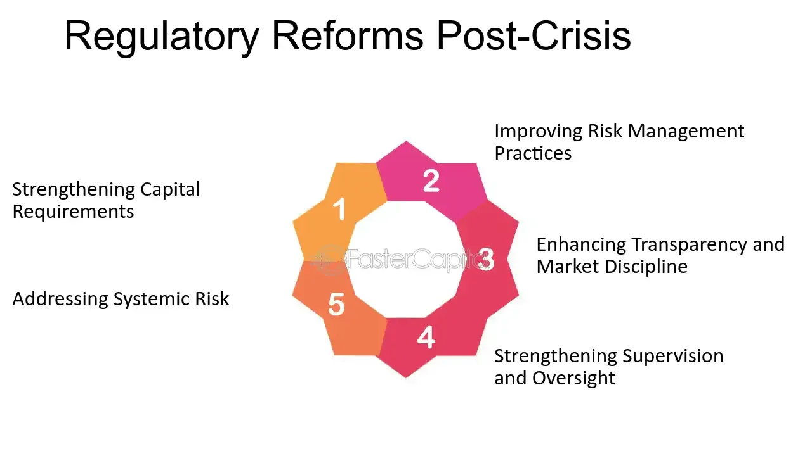

## Table of Contents

## What was the 2008 financial crisis?

The 2008 financial crisis was a big economic problem that started in the United States and affected the whole world. It began because many people couldn't pay back their home loans. Banks had given out too many loans to people who couldn't afford them, and these loans were often bundled into complex financial products. When people started defaulting on their loans, the value of these financial products dropped sharply, causing big losses for banks and other financial institutions.

As banks started to fail, it created a domino effect. Other banks and businesses that had invested in these risky financial products also started to lose money. This led to a major credit crunch, where banks stopped lending money to each other and to businesses. This caused many businesses to fail, and lots of people lost their jobs. Governments around the world had to step in with bailouts and other measures to try to stop the crisis from getting worse. The effects of the crisis were felt for years, with many people struggling to recover financially.

## Why were new regulatory measures introduced after the 2008 crisis?

New regulatory measures were introduced after the 2008 financial crisis because the old rules weren't good enough to stop the problems that caused the crisis. Banks and financial companies had taken too many risks, and when things went wrong, it hurt the whole economy. The government and other leaders realized they needed stricter rules to make sure this wouldn't happen again. These new rules were meant to keep banks from taking such big risks and to protect people's money better.

The new regulations focused on things like making banks hold more money in reserve, so they could handle losses better. They also made rules about how much risk banks could take and how they had to be more open about what they were doing. This was to make sure that everyone could see if banks were being too risky. By doing this, the hope was to create a safer and more stable financial system that would help prevent another big crisis from happening.

## What is the Dodd-Frank Wall Street Reform and Consumer Protection Act?

The Dodd-Frank Wall Street Reform and Consumer Protection Act is a law that was passed in the United States in 2010 to fix problems that led to the 2008 financial crisis. It was named after the two lawmakers who wrote it, Senator Chris Dodd and Representative Barney Frank. The main goal of the law was to make the financial system safer and to protect people from the kind of risky behavior by banks that caused the crisis. It did this by setting up new rules and agencies to watch over banks and other financial companies.

One important part of the Dodd-Frank Act is that it created the Consumer Financial Protection Bureau (CFPB). This agency helps protect people from unfair practices by banks and other financial companies. The law also made banks keep more money in reserve, so they could handle losses better. It set limits on the kinds of risky investments banks could make and required them to be more open about their activities. By doing all these things, the Dodd-Frank Act tried to make the financial system more stable and prevent another big crisis from happening.

## How does the Volcker Rule aim to prevent future financial crises?

The Volcker Rule is a part of the Dodd-Frank Act that tries to stop banks from taking big risks with people's money. It says that banks can't use their own money to make risky investments, like betting on stocks or buying certain kinds of financial products. This rule is meant to keep banks focused on safe activities like lending money to people and businesses, instead of gambling with their money.

By stopping banks from making these risky bets, the Volcker Rule aims to keep them from losing a lot of money all at once. If banks don't lose a lot of money, they are less likely to fail and cause a big problem for the whole economy. This helps make the financial system more stable and protects people's savings from being hurt by bank failures.

## What role does the Financial Stability Oversight Council (FSOC) play in post-crisis regulation?

The Financial Stability Oversight Council (FSOC) is a group set up by the Dodd-Frank Act to watch over the whole financial system and make sure it stays stable. The FSOC is made up of leaders from different government agencies that deal with money and the economy. Their job is to look for big risks that could hurt the whole financial system and to work together to stop those risks from becoming a problem.

The FSOC does this by keeping an eye on big financial companies and figuring out if they are doing things that could be dangerous. If they see a company taking too many risks, they can tell other agencies to take a closer look or even make the company follow stricter rules. By doing this, the FSOC helps to stop problems before they get too big and cause another financial crisis.

## How have capital requirements for banks changed since the crisis?

Since the 2008 financial crisis, banks now have to keep more money in reserve. This is called capital requirements. Before the crisis, banks didn't have to keep as much money set aside, which meant they could take bigger risks. But when things went wrong, they didn't have enough money to cover their losses. So, new rules were made to make sure banks have more money saved up. This way, if they lose money, they can still keep going and not cause a big problem for everyone.

These new rules are part of something called Basel III, which is a set of international standards that many countries follow. Basel III says that banks need to have a certain amount of high-quality capital, like cash or government bonds, to cover their risks. This makes banks stronger and less likely to fail. By having more money in reserve, banks can handle losses better and keep lending money to people and businesses, which helps keep the economy stable.

## What are stress tests and how are they used to ensure bank stability?

Stress tests are like check-ups for banks to see if they can handle tough times. They are used to make sure banks are strong enough to survive if the economy gets really bad. During a stress test, banks have to show how they would do if things like unemployment went up a lot, or if housing prices dropped a lot. By doing these tests, regulators can see if banks have enough money saved up to deal with these problems without going broke.

The results of stress tests help regulators decide if banks need to keep more money in reserve or if they need to change how they do business to be safer. If a bank doesn't pass the stress test, it might have to hold onto more cash or make other changes to get stronger. This way, stress tests help keep the whole financial system stable by making sure banks are ready for hard times.

## How has the regulation of derivatives markets evolved post-2008?

After the 2008 financial crisis, the way derivatives markets are regulated changed a lot. Derivatives are like bets on things like interest rates or stock prices. Before the crisis, these bets were often made in secret, and no one knew how much risk was out there. This made it hard to stop the crisis from happening. So, new rules were made to make derivatives markets safer. One big change was that many derivatives now have to be traded on public exchanges, where everyone can see what's happening. This makes it easier to spot if someone is taking too many risks.

Another important change was that companies that deal in derivatives have to put up more money to cover their bets. This is called clearing, and it helps make sure that if someone can't pay up, the money is there to cover the losses. Also, companies have to report more information about their derivatives deals to regulators. This helps keep an eye on the market and stop big problems before they start. By making these changes, the rules try to keep the derivatives markets from causing another big financial crisis.

## What impact has Basel III had on global banking regulations?

Basel III is a set of rules that countries all over the world follow to make sure banks are safer and more stable. It was made after the 2008 financial crisis to stop banks from taking too many risks. One big part of Basel III is that banks have to keep more money saved up, which is called capital. This money helps banks handle losses if things go wrong. Basel III also says banks need to have enough cash and easy-to-sell assets, like government bonds, to cover their needs during tough times. This is called [liquidity](/wiki/liquidity-risk-premium), and it helps banks keep going even if people want to take their money out all at once.

These rules have changed how banks work around the world. Banks now have to be more careful about the risks they take and make sure they have enough money to cover those risks. This has made banks stronger and less likely to fail. It also means banks might lend less money to risky projects, which can make the whole economy a bit slower but safer. Overall, Basel III has helped make the global financial system more stable and less likely to have another big crisis like the one in 2008.

## How do the new regulations affect smaller banks compared to larger institutions?

The new rules after the 2008 crisis have affected smaller banks differently than bigger banks. For smaller banks, these rules can be harder to follow. They might not have as much money to keep in reserve as the big banks, and the cost of following all the new rules can be a big burden. This means smaller banks might have to spend more time and money to make sure they are doing everything right. Sometimes, these costs can make it tough for smaller banks to compete with the bigger ones.

On the other hand, big banks have more resources to handle the new rules. They can hire more people to make sure they are following all the regulations, and they usually have more money to keep in reserve. But the new rules also mean big banks have to be more careful about the risks they take. This can limit what they can do and might make them less profitable. Still, the goal of these rules is to make all banks, big and small, safer and more stable, so the whole economy benefits.

## What criticisms have been leveled against the post-2008 regulatory measures?

Some people think the new rules after the 2008 crisis are too strict and make it hard for banks to do business. They say these rules slow down the economy because banks have to be very careful about the risks they take. This means they might not lend as much money to people and businesses, which can make it harder for the economy to grow. Critics also say that the rules are too complicated and expensive for smaller banks to follow, which can hurt them more than the big banks.

Another criticism is that the new rules might not stop another crisis from happening. Some people think the rules focus too much on the banks that caused the last crisis and don't pay enough attention to new risks that could come up. They worry that the rules might make banks take their risks in different ways that are harder to see, which could still cause big problems. Overall, while the rules aim to make the financial system safer, some people think they might not be the best way to do it.

## What future regulatory changes are being considered to further prevent financial crises?

People are thinking about new rules to stop future financial crises. One idea is to make banks have even more money saved up, so they can handle bigger losses if something bad happens. This could mean changing the rules about how much capital banks need to keep. Another idea is to watch new kinds of risks more closely, like risks from technology and cyber attacks. Banks are using more technology now, and if something goes wrong with it, it could cause big problems. So, new rules might focus on making sure banks are safe from these new risks.

Another thing people are talking about is making the rules simpler and easier for all banks to follow. Some people think the current rules are too hard to understand and too expensive for smaller banks. They want to make the rules clearer and less costly, so all banks can follow them without too much trouble. This could help make the whole financial system stronger and more stable. By thinking about these changes, people hope to keep the economy safe and prevent another big crisis like the one in 2008.

## What is the impact of Basel Regulations?

The Basel III regulations emerged as a pivotal response to deficiencies revealed by the 2008 financial crisis, establishing a global framework to enhance regulation, supervision, and risk management within the banking sector. Introduced by the Basel Committee on Banking Supervision, these regulations aimed to reinforce the banking system's resilience against financial and economic shocks.

One of the central features of Basel III is the enhancement of bank capital requirements. These regulations increased both the quality and quantity of capital that banks must hold. A significant measure was the augmentation of the Common Equity Tier 1 (CET1) capital ratio, a critical buffer to absorb financial losses. Basel III mandates that banks maintain a CET1 ratio of at least 4.5% of risk-weighted assets, a substantial increase from the previous requirement of 2%.

Additionally, Basel III introduced more stringent mandates on bank liquidity and leverage. The Liquidity Coverage Ratio (LCR) compels banks to maintain an adequate level of high-quality liquid assets (HQLA) to meet short-term obligations, ensuring they can withstand 30 days of stressed funding conditions. The LCR is defined as:

$$
\text{LCR} = \frac{\text{High-Quality Liquid Assets}}{\text{Net Cash Outflows over 30 days}}
$$

This formula ensures that banks can access enough liquid assets during periods of financial distress. Moreover, Basel III imposed the Net Stable Funding Ratio (NSFR) to promote longer-term resilience by requiring banks to fund their activities with stable sources of funding.

To mitigate excessive leverage, Basel III established a leverage ratio as a backstop to the risk-based capital requirements, ensuring that banks have a minimum level of capital relative to their total exposure. The leverage ratio is calculated as:

$$
\text{Leverage Ratio} = \frac{\text{Tier 1 Capital}}{\text{Total Exposure}}
$$

Banks are required to maintain a leverage ratio of at least 3%, restricting the amount of leverage they can employ.

These comprehensive measures aim to fortify the banking sector's capacity to endure periods of economic turmoil, rectify the vulnerabilities exposed by the financial crisis, and foster a more stable global financial environment. By bolstering capital quality and addressing liquidity and leverage concerns, Basel III significantly contributes to the overall stability and integrity of the international banking system.

## References & Further Reading

[1]: "Dodd-Frank Wall Street Reform and Consumer Protection Act." U.S. Commodity Futures Trading Commission. Retrieved from [https://www.cftc.gov/LawRegulation/DoddFrankAct/index.htm](https://www.cftc.gov/LawRegulation/DoddFrankAct/index.htm)

[2]: Basel Committee on Banking Supervision. (2011). "Basel III: A global regulatory framework for more resilient banks and banking systems." Bank for International Settlements. Retrieved from [https://www.bis.org/publ/bcbs189.htm](https://www.bis.org/publ/bcbs189.htm)

[3]: Lewis, Michael. (2015). "Flash Boys: A Wall Street Revolt." W. W. Norton & Company.

[4]: U.S. Securities and Exchange Commission. "High-Frequency Trading: Background and Current Issues." Retrieved from [https://www.sec.gov/spotlight/high-frequency-trading](https://en.wikipedia.org/wiki/Foreign_Corrupt_Practices_Act)

[5]: Haldane, A. G. (2012). "The Dog and the Frisbee." Federal Reserve Bank of Kansas City’s 36th economic policy symposium at Jackson Hole. Retrieved from [https://www.kansascityfed.org/publications/research/escp/symposiums/escp-2012](https://www.bis.org/review/r120905a.pdf)

[6]: Pirrong, C. (2011). "The Economics of Flash Orders and High Frequency Trading." Journal of Derivatives, 18(3), 27-38.