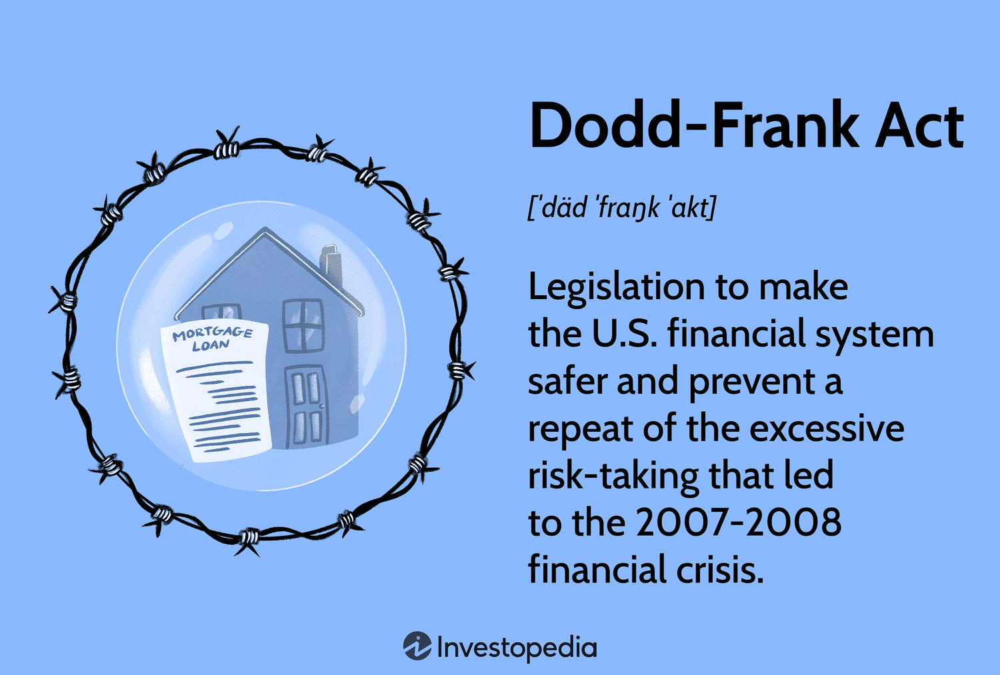

The 2008 financial crisis marked a significant turning point for the global financial system. This crisis, commonly associated with the collapse of the U.S. housing market, triggered a severe worldwide economic downturn. As housing prices plummeted, the effects rippled through the financial sector, exposing vulnerabilities within major global financial institutions. The crisis brought to light the consequences of high-risk mortgage lending practices and the widespread use of complex financial instruments like mortgage-backed securities.

In response, governments and regulatory bodies worldwide undertook comprehensive financial reforms to prevent such a catastrophe from recurring. These interventions were aimed at enhancing transparency, reducing systemic risk, and increasing accountability in the financial sector. Key legislative measures, such as the Dodd-Frank Wall Street Reform and Consumer Protection Act in the United States, were designed to provide a more robust regulatory framework.

This article examines these legislative responses and considers the evolution of financial markets in the post-crisis era. A notable development in this period is the expansion of algorithmic trading, which, while offering efficiencies in trade execution and data processing, has introduced new regulatory challenges. The article will also discuss how algorithmic trading necessitates ongoing adaptation of financial regulations to ensure market stability and integrity.

## Table of Contents

## The 2008 Financial Crisis and Its Causes

The 2008 financial crisis, often labeled the subprime mortgage crisis, was primarily triggered by a precipitous decline in housing prices across the United States. This decline exposed the vulnerabilities embedded within the financial system, particularly concerning major financial institutions, which faced the risk of imminent collapse. The roots of the crisis can be traced to risky mortgage lending practices, chiefly characterized by subprime loans provided to borrowers with lower creditworthiness.

Subprime mortgages were bundled into complex financial products known as mortgage-backed securities (MBS) and sold to investors worldwide. These securities promised high returns with the perceived safety of real estate backing. However, as housing prices began to fall, the default rates on these subprime loans surged, resulting in substantial losses for investors and financial institutions holding these securities. The intricate nature of MBS and other related financial instruments, such as collateralized debt obligations (CDOs), obscured the underlying risks and contributed to widespread uncertainty in financial markets.

An essential aspect amplifying the crisis was the global interconnectedness of financial markets. Many financial institutions across different countries had accumulated significant exposure to U.S. real estate through investments in MBS and CDOs. As the value of these securities crumbled, the crisis quickly transformed from a U.S. housing market issue into a global financial catastrophe. The liquidity freeze and credit crunch that ensued highlighted the systemic risks inherent in a highly interconnected financial ecosystem, revealing the urgent need for regulatory reforms to address these vulnerabilities and prevent future crises.

## Major Legislative Responses: Dodd-Frank and the EESA

The Dodd-Frank Wall Street Reform and Consumer Protection Act, enacted in 2010, was a pivotal legislative response to the 2008 financial crisis. It introduced a sweeping array of regulatory reforms aimed at mitigating the risk of future financial catastrophes and bolstering consumer protection. One of the fundamental elements of Dodd-Frank was the establishment of the Financial Stability Oversight Council (FSOC), tasked with identifying and addressing systemic risks within the financial system. Additionally, the Volcker Rule, a key provision within the act, restricted banks from engaging in proprietary trading and limited their investments in hedge funds and private equity, thereby aiming to separate commercial banking activities from high-risk investment strategies. 

The Dodd-Frank Act also paved the way for improved consumer protection through the creation of the Consumer Financial Protection Bureau (CFPB). The CFPB was endowed with the authority to enforce regulations on consumer financial products and services, ensuring transparency and fairness in the marketplace. Furthermore, the Act mandated increased oversight of credit rating agencies and introduced more stringent regulations for derivatives trading, including the requirement for many derivatives to be traded on exchanges and cleared through central counterparties.

Another significant legislative response was the Emergency Economic Stabilization Act (EESA) of 2008, which established the Troubled Asset Relief Program (TARP). TARP was designed to purchase distressed assets, particularly mortgage-backed securities, from banks to stabilize the financial system. The program infused [liquidity](/wiki/liquidity-risk-premium) into the banking sector, thereby averting the potential collapse of major financial institutions. By purchasing these troubled assets, the U.S. Treasury aimed to restore confidence in financial markets, ultimately aiming to reignite lending and economic growth.

Collectively, these legislative measures targeted enhancing transparency, reducing systemic risk, and increasing accountability within the financial sector. Critics of Dodd-Frank argue that while it imposed necessary safeguards, it also introduced complexities that may burden financial institutions and stifle economic growth. Conversely, proponents assert that these reforms are vital to preventing another widespread financial disaster. The continuous evaluation of these regulatory frameworks ensures their alignment with the evolving landscape of global finance.

## Impact of Basel Regulations

The Basel III regulations emerged as a pivotal response to deficiencies revealed by the 2008 financial crisis, establishing a global framework to enhance regulation, supervision, and risk management within the banking sector. Introduced by the Basel Committee on Banking Supervision, these regulations aimed to reinforce the banking system's resilience against financial and economic shocks.

One of the central features of Basel III is the enhancement of bank capital requirements. These regulations increased both the quality and quantity of capital that banks must hold. A significant measure was the augmentation of the Common Equity Tier 1 (CET1) capital ratio, a critical buffer to absorb financial losses. Basel III mandates that banks maintain a CET1 ratio of at least 4.5% of risk-weighted assets, a substantial increase from the previous requirement of 2%.

Additionally, Basel III introduced more stringent mandates on bank liquidity and leverage. The Liquidity Coverage Ratio (LCR) compels banks to maintain an adequate level of high-quality liquid assets (HQLA) to meet short-term obligations, ensuring they can withstand 30 days of stressed funding conditions. The LCR is defined as:

$$
\text{LCR} = \frac{\text{High-Quality Liquid Assets}}{\text{Net Cash Outflows over 30 days}}
$$

This formula ensures that banks can access enough liquid assets during periods of financial distress. Moreover, Basel III imposed the Net Stable Funding Ratio (NSFR) to promote longer-term resilience by requiring banks to fund their activities with stable sources of funding.

To mitigate excessive leverage, Basel III established a leverage ratio as a backstop to the risk-based capital requirements, ensuring that banks have a minimum level of capital relative to their total exposure. The leverage ratio is calculated as:

$$
\text{Leverage Ratio} = \frac{\text{Tier 1 Capital}}{\text{Total Exposure}}
$$

Banks are required to maintain a leverage ratio of at least 3%, restricting the amount of leverage they can employ.

These comprehensive measures aim to fortify the banking sector's capacity to endure periods of economic turmoil, rectify the vulnerabilities exposed by the financial crisis, and foster a more stable global financial environment. By bolstering capital quality and addressing liquidity and leverage concerns, Basel III significantly contributes to the overall stability and integrity of the international banking system.

## The Rise of Algorithmic Trading Post-Crisis

Algorithmic trading experienced significant growth following the 2008 financial crisis, largely due to its capacity to analyze and execute trades at a much faster pace than traditional methods. This technology leverages mathematical models and algorithms to make decisions based on large-[volume](/wiki/volume-trading-strategy) data analysis, enhancing efficiency in the trading process.

However, the rapid execution speeds that [algorithmic trading](/wiki/algorithmic-trading) introduces also pose new risks to financial market stability. One notable instance is the phenomenon known as a "flash crash," where markets experience highly volatile swings in a very short time frame, typically caused by automated, algorithm-based trading systems acting within milliseconds. These events have raised concerns regarding market stability and fairness, prompting scrutiny from regulatory bodies.

In response, regulators have developed measures to mitigate risks associated with high-frequency and algorithmic trading. Such measures aim to ensure these trading practices do not lead to disorderly markets or financial crises. For instance, circuit breakers and trading halts are mechanisms designed to temporarily pause trading during extreme [volatility](/wiki/volatility-trading-strategies), giving markets time to recalibrate and potentially reducing the impact of algorithmic errors.

Moreover, the necessity for greater oversight has led to the establishment of specific rules for high-frequency traders. These include requirements for traders to register and maintain records of their algorithms, as well as adhere to pre-trade risk controls. The Financial Industry Regulatory Authority (FINRA) and the U.S. Securities and Exchange Commission (SEC), among other global regulatory entities, have been instrumental in implementing these rules to safeguard market integrity.

As algorithmic trading continues to evolve, regulators and market participants must remain vigilant, adjusting existing policies and introducing new ones to address the challenges presented by advancements in trading technologies.

## Financial Regulations and Their Economic Impacts

Regulations such as the Dodd-Frank Act and Basel III have played a crucial role in stabilizing financial markets by curbing excessive risk-taking activities prevalent before the 2008 financial crisis. These regulatory frameworks aimed to enhance transparency, protect consumers, and ensure that financial institutions maintain adequate capital buffers against potential losses. By imposing stricter capital and liquidity requirements, Basel III has strengthened the resilience of banks, reducing the likelihood of systemic failures during periods of financial stress. For instance, Basel III recommends a minimum Common Equity Tier 1 (CET1) ratio of 4.5%, plus any applicable capital conservation buffers, to ensure banks hold a significant amount of high-quality capital.

However, these regulations have also brought about significant compliance costs for financial institutions. Meeting the stringent requirements of Dodd-Frank and Basel III necessitates substantial investments in compliance infrastructure, risk management systems, and reporting mechanisms. Smaller banks, in particular, may find these costs burdensome, as they often lack the resources of larger institutions. The operational complexity and increased administrative workload can constrain financial institutions' ability to focus on core banking activities.

Furthermore, there is ongoing debate regarding the impact of these regulations on economic growth. Critics argue that overly stringent regulations may stifle financial innovation and limit the availability of credit, particularly for small and medium enterprises (SMEs). This can potentially slow down economic growth, as access to financing is a key driver of business development and expansion. Balancing the necessity of regulation to safeguard the financial system with ensuring sufficient credit flow to support economic growth remains a complex policy challenge.

Proponents of regulation, however, maintain that the long-term stability and confidence in financial markets resulting from these reforms outweigh the short-term costs. They emphasize that preventing future financial crises, with their severe economic and social impacts, justifies the regulatory measures introduced post-crisis. Ultimately, the ongoing evaluation and adaptation of these regulatory frameworks are necessary to address the dynamic nature of financial markets and the continuous evolution of financial products and services.

## Future of Financial Regulation and Algorithmic Trading

As financial markets continue to evolve, so will the regulatory frameworks that govern them. The integration of advanced technologies, such as [artificial intelligence](/wiki/ai-artificial-intelligence) (AI) and [machine learning](/wiki/machine-learning), is transforming the landscape of trading. These technologies enhance the capacity for processing large datasets and executing trades with unprecedented precision and speed. However, this rapid technological advancement necessitates corresponding regulatory changes to address emerging risks and ensure market stability.

The increasing use of AI and machine learning in trading involves automating decision-making processes that were traditionally carried out by human traders. Automated trading systems, driven by sophisticated algorithms, can process vast amounts of market data in real time, identifying patterns and executing trades at speeds beyond human capability. This technological shift introduces advantages, such as improved efficiency and liquidity, but it also poses new challenges, particularly in the context of market volatility and the potential for systemic risk.

Regulatory bodies are increasingly focusing on the oversight of algorithmic and high-frequency trading ([HFT](/wiki/high-frequency-trading-strategies)) practices. One major concern is the occurrence of "flash crashes," where automated trading algorithms interact in ways that lead to rapid and significant market declines. Such events underscore the need for robust risk management systems and regulatory safeguards to prevent market destabilization.

To mitigate these risks, regulatory frameworks are likely to incorporate more stringent monitoring and reporting requirements. For instance, the implementation of circuit breakers and minimum resting times for orders are potential measures to prevent excessive volatility induced by algorithmic trading. Furthermore, regulators may require greater transparency regarding the algorithms used by trading firms, ensuring they adhere to standards designed to minimize the risk of market manipulation or disorderly trading activities.

The balance between innovation and stability is a central challenge for regulators. While it is crucial to encourage technological advancements that can contribute to market efficiency and competitiveness, it is equally important to establish regulatory provisions that maintain market integrity and protect investors. This balance will be achieved through ongoing dialogue between regulators, industry participants, and technology experts, fostering an environment where innovation can thrive without compromising the stability of financial systems.

In conclusion, the future of financial regulation will be shaped by the dual imperatives of embracing technological innovation and safeguarding market stability. As AI and machine learning continue to redefine the boundaries of trading, regulatory frameworks must evolve in tandem to address the associated risks and challenges, ensuring that financial markets remain secure and resilient amidst rapid technological change.

## Conclusion

The aftermath of the 2008 financial crisis has led to significant reforms in financial regulation. These measures, such as the Dodd-Frank Act in the United States and the Basel III international standards, have contributed to stabilizing financial markets by enhancing transparency, reducing systemic risks, and increasing the capital and liquidity requirements of banks. However, as the financial landscape evolves, particularly with the rise of algorithmic trading, new challenges have emerged. Algorithmic trading, which uses computer algorithms to execute trades rapidly, has introduced efficiencies but also raised concerns about market volatility and flash crashes.

As financial markets become increasingly complex, maintaining stability requires continuous evaluation and adaptation of regulatory policies. The dynamic nature of technology and trading strategies necessitates a regulatory framework that can effectively mitigate emerging risks without stifling innovation. Policymakers must strike a balance between encouraging technological advancements and safeguarding the financial system against potential disruptions. As such, it remains imperative for regulators to stay informed about technological trends and be proactive in implementing measures that ensure market integrity and stability.

## References & Further Reading

[1]: "Dodd-Frank Wall Street Reform and Consumer Protection Act." U.S. Commodity Futures Trading Commission. Retrieved from [https://www.cftc.gov/LawRegulation/DoddFrankAct/index.htm](https://www.cftc.gov/LawRegulation/DoddFrankAct/index.htm)

[2]: Basel Committee on Banking Supervision. (2011). "Basel III: A global regulatory framework for more resilient banks and banking systems." Bank for International Settlements. Retrieved from [https://www.bis.org/publ/bcbs189.htm](https://www.bis.org/publ/bcbs189.htm)

[3]: Lewis, Michael. (2015). "Flash Boys: A Wall Street Revolt." W. W. Norton & Company.

[4]: U.S. Securities and Exchange Commission. "High-Frequency Trading: Background and Current Issues." Retrieved from [https://www.sec.gov/spotlight/high-frequency-trading](https://en.wikipedia.org/wiki/Foreign_Corrupt_Practices_Act)

[5]: Haldane, A. G. (2012). "The Dog and the Frisbee." Federal Reserve Bank of Kansas City’s 36th economic policy symposium at Jackson Hole. Retrieved from [https://www.kansascityfed.org/publications/research/escp/symposiums/escp-2012](https://www.bis.org/review/r120905a.pdf)

[6]: Pirrong, C. (2011). "The Economics of Flash Orders and High Frequency Trading." Journal of Derivatives, 18(3), 27-38.