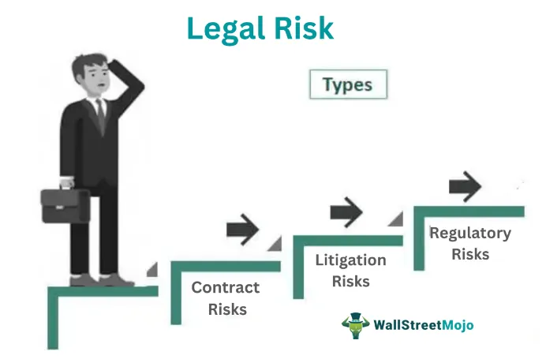

In today's rapidly evolving financial environment, businesses must navigate a complex landscape of risks, particularly concerning risk management, compliance risk, and regulatory risk in algorithmic trading (algo trading). Algorithmic trading, which leverages computer programs to automate trade execution in financial markets, has gained significant traction due to its ability to process large volumes of data and execute trades at speeds unmatched by human traders. This surge in technological advancements offers increased efficiency and speed but also introduces significant challenges regarding regulatory compliance and risk management.

Risk management in algorithmic trading includes handling the complexities associated with rapid trade execution, market volatility, and technological dependencies. Traditional risk management paradigms need to adapt to include considerations such as algorithmic errors, unexpected market behavior, and the amplification of risks due to high-frequency trading. Compliance and regulatory risks emerge as crucial factors since algo trading operates under stringent regulatory standards meant to enhance market fairness and integrity. Ensuring compliance requires navigating a web of laws and guidelines imposed by global regulatory bodies, which are continually evolving to keep pace with technological innovations.



This article carefully examines these critical aspects, offering insights into how organizations can effectively manage and mitigate these risks to ensure sustainable and secure trading practices. We will explore the definitions, implications, and management strategies for regulatory risk, compliance risk, and their specific impacts on algo trading enterprises. Key strategies, such as implementing rigorous risk controls, developing adaptive compliance frameworks, and investing in advanced technological solutions, are integral to thriving in this dynamic environment.

Thorough understanding and strategic management of these risks are essential for any entity engaged in algorithmic trading, from multinational financial institutions to emerging fintech firms. This exploration provides a comprehensive overview for anyone involved or interested in understanding the intersection of risk management and algorithmic trading, offering pathways to navigate the challenges inherent in this high-stakes domain.

## Table of Contents

## Understanding Risk Management in Algo Trading

Risk management is an essential element of trading strategies, especially in algorithmic trading (algo trading), where the intricacies and speed of transactions can result in significant risks. Algo trading utilizes sophisticated computer algorithms to automate trading processes, achieving enhanced efficiencies in executing trades. However, it simultaneously introduces several inherent risks, including market manipulation and technical failures.

Understanding these risks is crucial for developing effective risk management frameworks. Algo trading is predominantly associated with two key types of risks: operational risks and market risks. Operational risks refer to potential losses resulting from inadequate or failed internal processes, system failures, or human errors. Given the high dependency on technology in algo trading, the possibility of software bugs, hardware failures, or network issues represents a substantial operational risk. On the other hand, market risks involve the potential financial loss due to adverse changes in market prices. With the rapid transactions executed by algorithms, it becomes critical to anticipate and respond to market movements to prevent significant losses.

To mitigate these risks, it is imperative to incorporate robust risk controls into algo trading systems. Pre-trade risk assessments and real-time monitoring systems are fundamental elements in managing potential risks. Pre-trade risk assessments involve evaluating potential trade scenarios and their implications before executing trades. This could include setting predetermined price limits or [volume](/wiki/volume-trading-strategy) thresholds to prevent erroneous trades. Real-time monitoring systems offer continuous oversight of trading activities, facilitating the prompt detection and rectification of any irregularities or breaches of predetermined trading parameters.

Additionally, stress testing and scenario analysis play pivotal roles in assessing the resilience of trading systems under various market conditions. Stress testing involves evaluating how trading systems perform under extreme market conditions, such as sudden price fluctuations or increased market [volatility](/wiki/volatility-trading-strategies). Scenario analysis provides insights into how potential future events, such as economic announcements or geopolitical developments, might impact trading strategies. By simulating these conditions, trading firms can identify vulnerabilities and adapt their systems to withstand adverse situations effectively.

In conclusion, risk management in algo trading demands a comprehensive understanding of both operational and market risks, combined with the implementation of advanced risk controls and analytical strategies. These measures are crucial in safeguarding trading systems against potential disruptions and ensuring the sustained success of [algorithmic trading](/wiki/algorithmic-trading) operations.

## Regulatory Risk in Algo Trading

Regulatory risk represents the potential for a business to be adversely affected by changes in laws or regulations. In algorithmic trading, this type of risk is especially prominent as the landscape is heavily regulated to ensure market integrity and transparency. Regulatory bodies such as the Commodity Futures Trading Commission (CFTC), Securities and Exchange Commission (SEC), and the Office of the Comptroller of the Currency (OCC) have established a robust framework of rules that algorithmic traders must navigate.

One significant regulation is the CFTC's Regulation Automated Trading (Reg AT), which is designed to enhance regulatory oversight over automated trading activities. Reg AT mandates, among other requirements, enhanced risk controls, transparency measures, and compliance procedures for algorithmic traders. The SEC's Market Access Rule similarly requires financial institutions providing direct market access to implement adequate risk management controls and supervisory procedures to prevent erroneous trades.

Organizations engaged in algorithmic trading must continuously adapt to regulatory changes to mitigate regulatory risk and ensure uninterrupted operations. The ability to swiftly respond to regulatory modifications is key to avoiding legal penalties and maintaining operational efficiency. Effective management of regulatory risk involves a proactive approach, which includes monitoring legislative changes and assessing their implications for trading activities. Staying informed about new and evolving regulations allows organizations to anticipate potential impacts on their business models and adjust their strategies accordingly.

In conclusion, a keen understanding and management of regulatory risk are essential for algorithmic trading enterprises. Adapting to regulatory challenges while maintaining compliance not only secures business operations but also contributes to the broader objective of market stability and fairness.

## Compliance Risk in Algo Trading

Compliance risk refers to the potential for a company to experience legal penalties or financial losses as a result of failing to adhere to laws and regulations. In the context of algorithmic trading (algo trading), compliance risk involves adhering to the established rules and guidelines set by regulatory authorities such as the Securities and Exchange Commission (SEC) and the Commodity Futures Trading Commission (CFTC). The algorithmic nature of trading, which involves the automation of trading processes through computer algorithms, adds a layer of complexity to compliance, given the rapid and dynamic execution of trades and the sophisticated technologies employed.

Effective management of compliance risk in algo trading requires the integration of systematic checks and balances within the trading systems. This involves comprehensive documentation of trading algorithms and strategies, ensuring that all processes are transparent and auditable. Furthermore, ongoing training for personnel involved in algo trading is crucial to maintain an up-to-date understanding of applicable regulations and standards. This training should cover both the technical aspects of algorithm development and the regulatory framework governing trading activities.

Compliance frameworks are imperative to align trading practices with legislative requirements. Such frameworks typically include automated compliance checks that can prevent unauthorized trades, audit trails for transaction verification, and regular compliance assessments to identify and mitigate potential risks. These frameworks help ensure that trading strategies are not only financially optimal but also legally sound, thereby reducing the risk of sanctions or fines due to non-compliance.

The role of compliance departments is pivotal in overseeing that trading activities adhere to necessary legal and regulatory standards. These departments are responsible for implementing compliance strategies, performing systematic monitoring, and conducting periodic audits to ensure adherence to prescribed guidelines. By doing so, they help avoid breaches of compliance that could potentially lead to damaging financial penalties or legal challenges.

As algorithmic trading increasingly incorporates [artificial intelligence](/wiki/ai-artificial-intelligence) (AI) and [machine learning](/wiki/machine-learning), maintaining compliance becomes more challenging due to the evolving nature of regulatory standards. AI-driven trading systems must be designed to adapt in real-time to regulatory changes. This requires the development of algorithms capable of self-regulation and self-adjustment to align with updated compliance requirements. Consequently, continuous adaptation and vigilance are necessary, ensuring that systems are both innovative and compliant with current and future legislative expectations.

## Building a Robust Risk Management Framework

Developing a robust risk management framework is essential for mitigating both compliance and regulatory risks in algo trading environments. Key components of such a framework include well-defined governance structures, risk controls, monitoring systems, and effective communication channels. These elements work in tandem to ensure that the potential vulnerabilities within trading systems are identified and managed proactively.

Governance structures are foundational, involving the establishment of clear policies and procedures that outline risk management roles and responsibilities across the organization. This is often supported by board-level committees dedicated to risk management, ensuring that senior management remains engaged in and accountable for risk-related decision-making processes. Such oversight promotes a culture of risk awareness and responsibility at all organizational levels.

Risk controls must be robust and integrated at various stages of trading operations. Pre-trade risk controls involve strategies that assess and limit potential risks before transactions are executed. This can include setting limits on trade volumes and values or using algorithmic checks to prevent erroneous trades. Post-trade surveillance is equally crucial, as it examines trading activities after execution to detect and investigate any anomalies or suspicious behavior. Regular audits complement these controls by providing an independent review of risk management practices, ensuring ongoing compliance and effectiveness.

Incorporating advanced analytics and risk management software into this framework enables organizations to foresee, assess, and respond effectively to both internal and external risk factors. These tools can process large sets of trading data to identify patterns and predict potential risk scenarios. For instance, machine learning algorithms can be employed to enhance predictive capabilities and allow for real-time risk assessment. The following Python snippet demonstrates a simple risk prediction model using machine learning:

```python
from sklearn.model_selection import train_test_split
from sklearn.ensemble import RandomForestClassifier
from sklearn.metrics import accuracy_score
import pandas as pd

# Load trading data
data = pd.read_csv('trading_data.csv')
X = data.drop('risk_label', axis=1)
y = data['risk_label']

# Split the data
X_train, X_test, y_train, y_test = train_test_split(X, y, test_size=0.2, random_state=42)

# Train a Random Forest model
model = RandomForestClassifier(n_estimators=100, random_state=42)
model.fit(X_train, y_train)

# Predict and evaluate the model
predictions = model.predict(X_test)
print("Accuracy:", accuracy_score(y_test, predictions))
```

Effective communication within the organization is pivotal to support the information flow between departments, ensuring that risk-related information is disseminated accurately and swiftly. This helps in aligning different parts of the organization towards shared risk management goals and solutions.

A robust risk management framework is thus an intricate blend of governance, proactive controls, advanced technology, and open communication. These components seamlessly integrate to safeguard against compliance and regulatory risks, ultimately supporting sustainable and secure algo trading practices.

## Technological Impacts and Solutions

The integration of technology in trading, particularly through algorithmic systems, presents both opportunities and challenges for risk management and compliance. Advanced technologies facilitate the use of complex models that need continuous development, testing, and validation. This ensures their reliability under diverse market conditions and helps mitigate potential risks. These processes are crucial because algorithmic trading systems must adapt to rapidly changing market environments to remain effective and compliant with regulatory standards.

Machine learning (ML) algorithms and artificial intelligence (AI) significantly enhance risk management practices by providing predictive insights and advanced analytics capabilities. For example, ML models can analyze large datasets to identify patterns and predict potential market shifts, aiding in proactive risk mitigation. These technologies can be used to assess market volatility, detect anomalies, and optimize trading strategies in real-time. Here is a simple illustration of using a machine learning model for predictive analytics in Python:

```python
import numpy as np
from sklearn.ensemble import RandomForestRegressor
from sklearn.model_selection import train_test_split
from sklearn.metrics import mean_squared_error

# Sample data generation for market prices
np.random.seed(0)
X = np.random.rand(100, 5)  # Feature set representing market indicators
y = np.random.rand(100)     # Target variable representing market prices

# Splitting data into training and testing sets
X_train, X_test, y_train, y_test = train_test_split(X, y, test_size=0.2, random_state=42)

# Random Forest Regressor for predictive analytics
model = RandomForestRegressor(n_estimators=100, random_state=42)
model.fit(X_train, y_train)

# Making predictions and evaluating model performance
predictions = model.predict(X_test)
mse = mean_squared_error(y_test, predictions)
print("Mean Squared Error:", mse)
```

In addition to predictive analytics, technological solutions emphasizing disaster recovery and business continuity plans are vital. These solutions ensure trading systems remain operational during unforeseen disruptions, such as technical failures or extreme market events. Implementing such plans guarantees that trading activities can recover promptly, minimizing potential financial losses and maintaining market stability.

Regular updates and adopting cutting-edge technologies are essential to keep trading systems effective and competitive. Updates may involve software enhancements, security patches, and introducing new features to improve performance and compliance. As regulations evolve, trading systems must adapt to reflect new compliance standards, requiring continuous vigilance and adaptation.

Overall, the strategic integration of technology not only bolsters efficiency and risk management in trading but also secures compliance with regulatory requirements, ensuring sustainable and robust trading practices. By leveraging technological advancements, trading firms can optimize operations and mitigate risks, fostering a resilient and forward-thinking trading environment.

## Conclusion

Risk management, compliance risk, and regulatory risk are critical aspects of algorithmic trading that have the potential to impact business continuity and profitability considerably. Managing these risks effectively requires a comprehensive understanding and strategic approach to harness the advantages of algorithmic trading while mitigating the associated drawbacks. By adopting robust risk management frameworks, algo trading firms can secure their operations against unforeseen market changes or technical failures.

Successful algo trading firms maintain an adaptable and informed stance towards regulatory and compliance matters. This adaptability allows firms to respond proactively to changes in regulations while ensuring that trading operations remain aligned with current legal and ethical standards. This proactive approach not only minimizes the risk of financial penalties or market disruptions but also enhances the firm's reputation and trustworthiness in the eyes of regulators and investors.

One of the keys to securing long-term sustainability and operational success in algorithmic trading is to anticipate and adapt to regulatory changes. Regularly updating risk management strategies is crucial to staying ahead of regulatory developments and technological advancements. This involves continuous training for personnel, keeping abreast of emerging technologies, and incorporating advanced analytics to preemptively identify potential risk factors.

Ultimately, the integration of technology with strong governance and compliance practices is essential for navigating the complex landscape of risk management in algorithmic trading. By leveraging cutting-edge technologies, such as machine learning and artificial intelligence, firms can strengthen their predictive capabilities and enhance risk mitigation processes. Additionally, fostering a company culture centered around compliance and ethical trading ensures that all team members are dedicated to maintaining robust operational standards.

By effectively combining these elements, businesses can take full advantage of the efficiencies offered by algorithmic trading while safeguarding against its inherent risks. This comprehensive approach not only ensures compliance with regulatory requirements but also positions firms favorably in the competitive and fast-paced world of financial trading.

## References & Further Reading

[1]: Bergstra, J., Bardenet, R., Bengio, Y., & Kégl, B. (2011). ["Algorithms for Hyper-Parameter Optimization."](https://proceedings.neurips.cc/paper/2011/file/86e8f7ab32cfd12577bc2619bc635690-Paper.pdf) Advances in Neural Information Processing Systems 24.

[2]: ["Advances in Financial Machine Learning"](https://www.amazon.com/Advances-Financial-Machine-Learning-Marcos/dp/1119482089) by Marcos Lopez de Prado

[3]: ["Evidence-Based Technical Analysis: Applying the Scientific Method and Statistical Inference to Trading Signals"](https://www.amazon.com/Evidence-Based-Technical-Analysis-Scientific-Statistical/dp/0470008741) by David Aronson

[4]: ["Machine Learning for Algorithmic Trading"](https://github.com/PacktPublishing/Machine-Learning-for-Algorithmic-Trading-Second-Edition) by Stefan Jansen

[5]: ["Quantitative Trading: How to Build Your Own Algorithmic Trading Business"](https://books.google.com/books/about/Quantitative_Trading.html?id=j70yEAAAQBAJ) by Ernest P. Chan

[6]: Commodity Futures Trading Commission. ["Regulation Automated Trading (Reg AT)."](https://www.cftc.gov/PressRoom/PressReleases/7283-15)

[7]: Securities and Exchange Commission. ["SEC Market Access Rule."](https://www.sec.gov/files/rules/final/2010/34-63241.pdf)