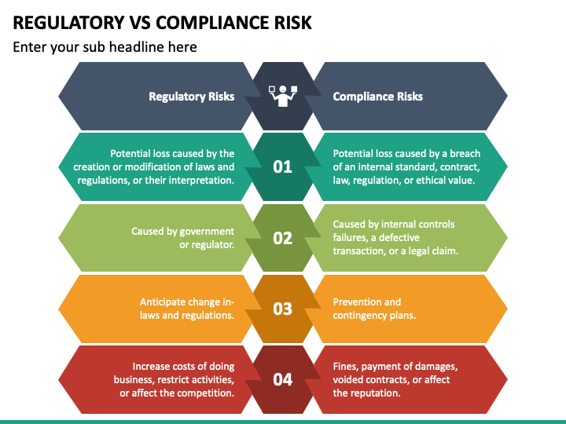

## Table of Contents

## What is regulatory risk?

Regulatory risk is the chance that new laws or changes in existing laws could hurt a business. For example, if a government decides to put stricter rules on how a company can operate, it might cost the company more money to follow these rules or even limit what the company can do. This can make it harder for the company to make profits or grow.

This kind of risk is common in industries like banking, healthcare, and energy, where governments often set many rules. Companies in these fields need to keep an eye on what lawmakers are doing and be ready to change how they work if new regulations come up. By understanding and preparing for regulatory risk, businesses can better handle the challenges that come with new laws and keep running smoothly.

## What is compliance risk?

Compliance risk is the chance that a company might break laws or rules that they have to follow. This can happen if the company doesn't know about the rules, doesn't follow them on purpose, or makes a mistake. If a company breaks these rules, they might have to pay fines, get in trouble with the government, or even lose their right to do business.

To manage compliance risk, companies need to keep up with changes in laws and make sure everyone in the company knows what they need to do. They often have special teams or departments that focus on making sure the company follows all the rules. By staying on top of compliance, companies can avoid problems and keep doing business without interruptions.

## How do regulatory risk and compliance risk differ?

Regulatory risk and compliance risk are related but different. Regulatory risk is about the chance that new laws or changes in laws could make it harder for a business to operate. For example, if a new law makes it more expensive for a company to do its work, that's a regulatory risk. It's about how changes in the rules might affect a business's ability to make money or grow.

On the other hand, compliance risk is about the chance that a company might break the rules that already exist. This can happen if the company doesn't know the rules, doesn't follow them on purpose, or makes a mistake. If a company breaks these rules, they might have to pay fines or face other penalties. Compliance risk is about making sure the company follows all the current laws and regulations.

Both types of risks are important for a business to manage. Regulatory risk focuses on preparing for future changes in the law, while compliance risk is about making sure the company is following the laws that are already in place. By understanding and managing both, a company can better protect itself from legal troubles and keep running smoothly.

## What are some common sources of regulatory risk?

Regulatory risk often comes from changes in laws made by governments. These changes can happen because of new political leaders, public pressure, or big events like financial crises or environmental disasters. For example, after a big oil spill, a government might make new rules to prevent future spills. These new rules can make it more expensive or difficult for companies in the oil industry to operate, which is a regulatory risk.

Another common source of regulatory risk is international laws and treaties. Companies that do business in many countries have to follow rules from different governments, and these rules can change. For example, if a country joins a new trade agreement, it might change the taxes or rules for importing and exporting goods. This can affect how much it costs for a company to sell its products in that country, creating a regulatory risk.

## What are typical examples of compliance risk?

Compliance risk can come from many different places. One common example is when a company doesn't follow rules about how it handles data. For instance, if a business collects information about its customers but doesn't keep it safe like the law says, it can get in big trouble. Another example is when a company doesn't follow rules about how it treats its workers. If a company pays its employees less than the minimum wage or makes them work too many hours, it can face fines and other penalties.

Another typical example of compliance risk is when a company doesn't follow rules about the environment. If a factory pollutes the air or water more than the law allows, it can be fined or even shut down. Also, in the financial world, if a bank doesn't follow rules about how it lends money or handles its customers' money, it can face serious consequences. These examples show how important it is for companies to know and follow all the rules that apply to them.

## How can businesses identify regulatory risks?

Businesses can identify regulatory risks by keeping a close eye on what lawmakers are doing. They need to watch for new laws or changes to old ones that could affect their work. This means reading news, government reports, and talking to experts who know about the laws. Companies can also join groups or hire people who specialize in understanding regulations. By doing these things, businesses can find out about new rules early and start planning how to handle them.

Another way businesses can spot regulatory risks is by looking at what's happening in their industry and the world. For example, if there's a big problem like a financial crisis or a health scare, governments might make new rules to stop it from happening again. Companies should think about how these events could lead to new laws and what those laws might mean for them. By staying alert and thinking ahead, businesses can better prepare for regulatory changes and keep running smoothly.

## What strategies can be used to mitigate compliance risks?

To mitigate compliance risks, businesses should first make sure everyone in the company knows the rules they need to follow. This means giving training to all employees so they understand what they can and can't do. Companies should also set up clear rules and guidelines that everyone has to follow. Having a special team or department that focuses on compliance can help keep everyone on track. This team can check regularly to make sure the company is following all the rules and fix any problems they find.

Another important strategy is to keep up with changes in the law. Laws can change often, so businesses need to stay informed about any new rules that might affect them. They can do this by reading news, government reports, and talking to experts. It's also a good idea to have a plan for what to do if the company breaks a rule by accident. This plan should include steps to fix the problem quickly and prevent it from happening again. By staying informed and prepared, businesses can lower their compliance risks and keep running smoothly.

## What role do regulatory bodies play in managing these risks?

Regulatory bodies are groups set up by governments to make and enforce rules for businesses. They help manage regulatory and compliance risks by keeping an eye on what companies are doing and making sure they follow the rules. For example, the Food and Drug Administration (FDA) in the United States makes sure that food and medicine are safe for people to use. If a company doesn't follow the FDA's rules, they can get in trouble and have to pay fines. By setting clear rules and checking that companies follow them, regulatory bodies help businesses know what they need to do to stay out of trouble.

Regulatory bodies also help manage risks by changing the rules when needed. If something big happens, like a financial crisis or a health scare, these groups can make new rules to stop it from happening again. This helps businesses prepare for changes and stay compliant. For example, after a big oil spill, a regulatory body might make new rules about how oil companies should work to protect the environment. By keeping the rules up to date, regulatory bodies help businesses manage their regulatory and compliance risks better.

## How does regulatory risk impact different industries?

Regulatory risk can impact different industries in big ways. For example, in the banking industry, if the government makes new rules about how much money banks have to keep in reserve, it can make it harder for banks to lend money to people and businesses. This can slow down the economy and make it harder for banks to make money. In the healthcare industry, new rules about how medicine is made or how doctors can treat patients can make it more expensive for hospitals and clinics to operate. This can lead to higher costs for patients and less money for healthcare providers.

In the energy industry, regulatory risk can come from rules about how companies can get oil or gas out of the ground or how they have to protect the environment. If new laws make it harder or more expensive to do these things, energy companies might have to spend more money or even stop working in certain areas. This can make energy more expensive for everyone and affect how much money these companies can make. Each industry has to keep an eye on what lawmakers are doing and be ready to change how they work if new regulations come up.

## What are the financial implications of failing to manage compliance risk?

If a company doesn't manage compliance risk well, it can face big money problems. They might have to pay fines if they break the rules. These fines can be very expensive and can hurt the company's profits. The company might also have to spend a lot of money to fix whatever they did wrong. This can mean hiring lawyers or making changes to how they work, which costs money and takes time. If the company keeps breaking the rules, they might even lose their right to do business, which can be a huge financial hit.

On top of fines and fixing problems, failing to manage compliance risk can hurt a company's reputation. If people find out that a company is breaking the rules, they might not want to do business with them anymore. This can mean losing customers and making less money. It can also make it harder for the company to get loans or attract investors, because nobody wants to give money to a company that might get in trouble with the law. All these things together can make it very hard for a company to stay in business if they don't take compliance risk seriously.

## How can technology help in managing regulatory and compliance risks?

Technology can help businesses manage regulatory and compliance risks by making it easier to keep track of rules and make sure everyone follows them. Special software can watch what's happening in the company and alert them if something might break the rules. This can help find problems early and fix them before they get worse. For example, if a company has to follow rules about how it keeps its customers' information safe, technology can check that the information is protected and let the company know if it's not.

Also, technology can help businesses stay up to date with new laws. There are tools that can gather information about changes in the law and send it right to the company. This means the company can find out about new rules quickly and start planning how to follow them. By using technology, businesses can spend less time worrying about breaking the rules and more time on doing their work well.

## What are advanced strategies for integrating regulatory and compliance risk management into corporate governance?

To integrate regulatory and compliance risk management into corporate governance, companies need to make it a part of their everyday work. This means setting up a clear plan for how the company will follow the rules and who will be in charge of making sure it happens. The board of directors should be involved in this plan, and they should check regularly to see how well the company is doing. By making regulatory and compliance risk management a big part of what the board does, the company can make sure everyone is working together to follow the rules.

Another important strategy is to use technology and data to help manage these risks. Companies can use special software to keep track of the rules and make sure everyone is following them. This software can also help the company see where they might have problems before they happen. By using technology, the company can make their plan for following the rules even better. This way, regulatory and compliance risk management becomes a key part of how the company works, helping them stay out of trouble and keep doing business smoothly.

## References & Further Reading

[1]: Bergstra, J., Bardenet, R., Bengio, Y., & Kégl, B. (2011). ["Algorithms for Hyper-Parameter Optimization."](https://proceedings.neurips.cc/paper/2011/file/86e8f7ab32cfd12577bc2619bc635690-Paper.pdf) Advances in Neural Information Processing Systems 24.

[2]: ["Advances in Financial Machine Learning"](https://www.amazon.com/Advances-Financial-Machine-Learning-Marcos/dp/1119482089) by Marcos Lopez de Prado

[3]: ["Evidence-Based Technical Analysis: Applying the Scientific Method and Statistical Inference to Trading Signals"](https://www.amazon.com/Evidence-Based-Technical-Analysis-Scientific-Statistical/dp/0470008741) by David Aronson

[4]: ["Machine Learning for Algorithmic Trading"](https://github.com/PacktPublishing/Machine-Learning-for-Algorithmic-Trading-Second-Edition) by Stefan Jansen

[5]: ["Quantitative Trading: How to Build Your Own Algorithmic Trading Business"](https://books.google.com/books/about/Quantitative_Trading.html?id=j70yEAAAQBAJ) by Ernest P. Chan

[6]: Commodity Futures Trading Commission. ["Regulation Automated Trading (Reg AT)."](https://www.cftc.gov/PressRoom/PressReleases/7283-15)

[7]: Securities and Exchange Commission. ["SEC Market Access Rule."](https://www.sec.gov/files/rules/final/2010/34-63241.pdf)