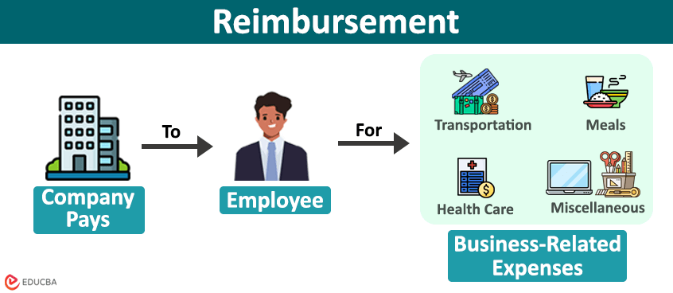

Understanding the processes of expense compensation and reimbursement is crucial in the complex financial landscape, particularly in algorithmic trading, where precision is essential. Algorithmic trading involves high-speed and automated transactions, necessitating meticulous financial oversight to ensure profitability. This article investigates how expense management intersects with financial processes in trading environments, focusing on enhancing efficiency and driving strategic growth.

Correctly accounting for expenses is critical in shaping trading strategies. Expenses incurred must be accurately recorded and managed to provide a clear picture of financial performance. In algorithmic trading, where decisions are made in fractions of a second, even minor miscalculations in expenses can affect overall profitability. Therefore, financial oversight must be embedded in trading algorithms to integrate cost analysis into decision-making processes, ensuring that strategies are both profitable and sustainable.



Integrating robust expense management within algorithmic trading frameworks offers opportunities for organizations to streamline operations and improve competitive advantage. Best practices in this integration include leveraging advanced accounting software capable of real-time expense tracking and reconciliation. Such tools not only reduce the likelihood of errors but also enhance financial transparency and accountability.

In conclusion, precise and accurate expense management is vital in algorithmic trading to maintain efficiency and achieve strategic growth. As financial landscapes continue to evolve, the strategic incorporation of expense management practices within trading algorithms can offer substantial gains in competitive advantage.

## Table of Contents

## Understanding Expense Compensation and Reimbursement

Expense compensation involves reimbursing individuals for expenses incurred on behalf of an organization, which is paramount for ensuring financial accuracy and operational efficiency. Unlike regular salary payments subject to taxation, reimbursements are typically non-taxable. This distinction arises from the fact that reimbursements are repayments for out-of-pocket expenses incurred in service to the organization, rather than earned income. As such, they must be excluded from gross income calculations, thereby affecting financial reporting and statements favorably by preserving cash flow and reducing taxable income.

Key areas frequently subject to reimbursement policies include travel, office supplies, and other business-related expenses. Travel reimbursements, for instance, can encompass transportation, accommodations, meals, and incidentals, strictly following the organization's travel policy. Office supplies, by contrast, often include everyday materials needed for effective job completion, ranging from stationery to computer peripherals. Correctly managing these reimbursements ensures that employees are not financially burdened by organizational activities, promoting morale and productivity.

Proper documentation is crucial for the legitimacy and accuracy of the expense reimbursement process. Each reimbursement claim must be accompanied by detailed receipts, invoices, and relevant proofs of transaction, thereby establishing a clear audit trail. This documentation serves dual purposes: it validates the expenditure's necessity and authenticity and also fulfills internal and external audit requirements. Clear, predefined policies guide employees on permissible expenses, aiding organizational governance and financial integrity.

Several types of reimbursement practices can be implemented, each with specific guidelines and implications for business operations. Fixed allowances, where employees receive predetermined sums for certain expense categories, simplify administration but may not account for actual expenditure variations. Variable reimbursements, however, require stringent monitoring and justify each claim with direct ties to incurred expenses.  Moreover, implementing digital expense management systems can streamline the reimbursement process through automation, reducing errors and accelerating financial processing.

In conclusion, the structured management of reimbursements significantly influences an organization's financial health and operational transparency. Organizations must balance policy simplicity and strict adherence to ensure fiscal responsibility and avoid financial discrepancies. As digital solutions and analytics become pervasive, leveraging these technologies in managing expense compensation can further enhance accuracy, efficiency, and strategic growth in financial practices.

## Financial Processes in Algorithmic Trading

Algorithmic trading, also known as algo-trading, employs complex algorithms and vast computing power to execute trades at speeds and frequencies that are impossible for human traders. The efficacy of [algorithmic trading](/wiki/algorithmic-trading) hinges on meticulous financial data and robust expense management systems. By leveraging precise financial information, traders can optimize their strategies, maximize profits, and mitigate potential risks.

A fundamental aspect of financial processes in algorithmic trading is the understanding of accrued expenses. Accrued expenses represent financial obligations that have been incurred but not yet paid. These include costs such as brokerage fees, interest on loans, or other trading-related expenses essential for maintaining effective trading operations. Accurately accounting for accrued expenses is crucial as they impact the financial statements, influencing the trader's ability to project cash flows and determine financial viability. Ensuring accurate recognition of these expenses helps maintain a clear picture of the company's financial health, which in turn aids in making informed trading decisions.

Integrating financial accounting into the algorithmic trading framework can significantly enhance trading strategies and forecast accuracy. Financial accounting provides a structured approach to recording, summarizing, and analyzing financial transactions, which is vital for optimizing trading models. By systematically incorporating accounting practices, traders can generate detailed financial reports that offer insights into operational performance. This information can subsequently inform algorithm adjustments and enhance market predictions, ultimately strengthening trading strategies.

Regulatory compliance is another critical aspect of financial processes in algorithmic trading. Financial markets are subject to stringent regulations aimed at maintaining market integrity and protecting investors. Therefore, adhering to regulatory standards in financial reporting is essential for compliance and strategic financial operations. This compliance includes accurate documentation of all transactions and strict adherence to accounting principles such as the Generally Accepted Accounting Principles (GAAP) or International Financial Reporting Standards (IFRS). Following these standards not only ensures legal compliance but also reinforces investor confidence and enhances market credibility.

Moreover, the successful integration of financial accounting with algorithmic trading supports informed financial decision-making. By leveraging comprehensive financial data, traders are better equipped to evaluate performance metrics and identify new investment opportunities. This integration also enables the application of sophisticated analytical tools and models that can predict market trends, optimize resource utilization, and improve trading efficiency. For instance, using Python along with libraries like Pandas and NumPy, traders can analyze large datasets to refine trading algorithms and enhance operational effectiveness.

In summary, the fusion of financial processes and algorithmic trading is instrumental in achieving trading success. By focusing on precise financial data, understanding accrued expenses, adhering to regulatory standards, and integrating accounting principles, traders can enhance their decision-making capabilities and maintain competitive advantages in rapidly evolving financial markets.

## Expense Management Strategies

Effective expense management is crucial for aligning expenditures with an organization's financial objectives, particularly within the dynamic environment of algorithmic trading. Implementing automation and advanced accounting tools plays a pivotal role in enhancing efficiency. These technologies significantly reduce manual errors in expense tracking, thereby streamlining the entire process. For instance, automated systems can categorize expenses, generate real-time reports, and provide comprehensive insights into spending patterns, all of which are essential for making informed financial decisions.

Regular audits and financial oversight are equally vital for maintaining the integrity of expense management processes. Auditing ensures that expense records are accurate and comply with established financial standards. It also identifies discrepancies or financial mismanagement, thus safeguarding the organization from potential financial pitfalls. By conducting periodic audits, organizations can ensure adherence to budgetary constraints and regulatory compliance.

Tailoring expense management strategies to specific industry needs, such as those found in algorithmic trading, is critical for achieving cost efficiency without compromising service quality. Algorithmic trading demands precision and rapid execution, thus incurring unique costs such as technology upgrades and data acquisition. Adapting expense strategies to account for these industry-specific demands can lead to better resource allocation and improved trading outcomes.

Strategic expense management also enhances transparency and improves financial reporting. Transparent financial practices foster trust among stakeholders and provide a clear picture of the organization’s financial health. Enhanced reporting capabilities, facilitated by advanced tools, allow for the detailed analysis of financial data, enabling organizations to refine their strategies and optimize financial performance.

Incorporating Python-based tools and frameworks can further optimize expense management strategies. For example, Python's data analysis libraries like Pandas and NumPy can process large datasets efficiently, providing meaningful insights into expense patterns. This analysis can support the development of predictive models to forecast future expenses, allowing organizations to plan and allocate resources effectively.

```python
import pandas as pd

# Sample code to analyze expenses using Python's Pandas
data = pd.read_csv('expenses.csv')
summary = data.groupby('Category').sum()
print(summary)
```

In conclusion, effective expense management encompasses a blend of automation, regular oversight, industry-specific tailoring, and strategic practices to enhance transparency and reporting. This comprehensive approach not only supports the financial robustness of algorithmic trading but also provides a competitive edge in the rapidly evolving financial landscape.

## Integration of Financial Accounting with Algorithmic Trading

Algorithmic trading can significantly benefit from the integration of financial accounting principles, which ensure efficient use of resources and drive strategic financial decision-making. A foundational aspect of this integration is maintaining accurate records and leveraging analytics to enhance decision-making in trading operations. By having precise financial data, traders can make informed decisions, optimize their strategies, and improve their market positioning.

Accrued expenses, which are liabilities recognized before cash payments are made, play a crucial role in this context. Effective management of these expenses allows traders to anticipate cash flow requirements and adjust strategies accordingly, enhancing both market positioning and financial performance. This proactive approach enables trading firms to strategically allocate resources and manage risk effectively.

Furthermore, integrating financial accounting with algorithmic trading opens new opportunities for strategic financial optimization. By employing advanced data analysis tools, trading costs can be meticulously managed and evaluated, giving companies a competitive edge. For instance, tools like Python libraries (e.g., Pandas, NumPy) can be used to process and analyze large datasets, allowing for real-time insights into trading costs and financial metrics. Here's an example of how a trading firm might use Python to evaluate trading costs:

```python
import pandas as pd

# Sample data of trades including trading costs
data = {
    'trade_id': [1, 2, 3, 4],
    'execution_price': [100.5, 101.0, 102.5, 100.7],
    'ticker': ['AAPL', 'GOOG', 'MSFT', 'TSLA'],
    'quantity': [10, 5, 7, 8],
    'trading_cost': [1.5, 1, 1.25, 1.8]
}

# Create a DataFrame
trades_df = pd.DataFrame(data)

# Calculate the cost per trade
trades_df['cost_per_trade'] = trades_df['execution_price'] * trades_df['quantity'] + trades_df['trading_cost']

# Calculate total trading cost
total_trading_cost = trades_df['cost_per_trade'].sum()

print("Total Trading Cost:", total_trading_cost)
```

This integration not only aids in managing direct trading costs but also supports comprehensive financial strategies, leading to improved financial performance and operational efficiency. Accurate financial accounting, combined with algorithmic trading, enhances predictability and control over trading activities, promoting overall organizational growth and success.

## Challenges and Considerations

One of the primary challenges in financial processes within algorithmic trading is the accurate recognition and management of expenses. This accuracy is crucial as financial manipulation or inaccuracies can result in significant financial and reputational risks. Effective management of expenses involves stringent processes to ensure every penny is accounted for correctly, thereby eliminating discrepancies and maintaining the integrity of financial reports.

Continuous monitoring of financial activities is essential to prevent any inadvertent errors or deliberate manipulation. By adhering strictly to established accounting standards, organizations can maintain robust financial systems that withstand scrutiny. These standards provide a framework for recording, classifying, and summarizing economic activities, and aligning with them ensures consistent and accurate financial reporting.

Integration of financial process management within trading frameworks presents data management and compliance challenges. As trading operations often involve vast amounts of data, ensuring that this data is accurately captured and processed in compliance with financial regulations is complex. Algorithmic trading systems must be designed with these compliance needs in mind, facilitating seamless data integration and management.

To mitigate these challenges, regular audits are critical. By routinely reviewing financial and operational data, audits can uncover discrepancies and suggest improvements. Additionally, updating accounting practices in line with evolving standards and technologies helps address deficiencies and optimize processes. For instance, leveraging advanced analytics and [machine learning](/wiki/machine-learning) can create predictive models for expense management, enhancing both efficiency and accuracy.

Python provides powerful libraries for building such models: 

```python
import pandas as pd
from sklearn.ensemble import RandomForestRegressor

# Example function to create a predictive expense model
def train_predictive_model(expense_data):
    # Assuming 'expense_data' is a DataFrame with 'date', 'expense' features
    expense_data['expense_lag'] = expense_data['expense'].shift(1)
    expense_data.dropna(inplace=True)

    # Features and target
    X = expense_data[['expense_lag']]
    y = expense_data['expense']

    # Model instantiation and training
    model = RandomForestRegressor(n_estimators=100)
    model.fit(X, y)

    return model

# Sample data preparation
expense_data = pd.DataFrame({'date': pd.date_range(start='1/1/2022', periods=100),
                             'expense': pd.np.random.rand(100) * 1000})

predictive_model = train_predictive_model(expense_data)
```

By employing such techniques, organizations can enhance their financial processes, ensuring accurate expense recognition and reporting, which is vital for optimizing algorithmic trading strategies and maintaining financial health.

## Conclusion

Accurate management of expenses and financial processes plays a vital role in the effectiveness of algorithmic trading strategies. Ensuring precision in expense compensation and reimbursement within robust financial frameworks enhances both transparency and operational efficiency. These elements are pivotal for maintaining accurate financial records, which influence strategic decisions and trading outcomes.

The integration of financial accounting principles with trading algorithms provides substantial competitive advantages. Through effective tracking and management of expenses, organizations can optimize resource allocation, leading to more informed trading strategies. This, coupled with real-time analytics, enables traders to adjust their strategies swiftly in response to market changes, translating into improved financial performance and market positioning.

As the financial ecosystem continues to evolve, it is essential for organizations to adapt their financial management practices. Technological advancements such as machine learning and [artificial intelligence](/wiki/ai-artificial-intelligence) are expected to revolutionize trading operations further, offering more sophisticated and predictive financial strategies. By embracing these innovations, businesses can expect to sustain growth and drive innovation consistently.

Future improvements in financial accounting and expense management will continue to shape new horizons in algorithmic trading. The advent of advanced tools will facilitate greater accuracy and speed in both accounting and trading processes. By remaining vigilant and proactive in adopting emerging technologies, organizations will be well-positioned to capitalize on the dynamic nature of global markets, paving the way for cutting-edge financial strategies and sustainable success.

## References & Further Reading

[1]: Bergstra, J., Bardenet, R., Bengio, Y., & Kégl, B. (2011). ["Algorithms for Hyper-Parameter Optimization."](https://dl.acm.org/doi/10.5555/2986459.2986743) Advances in Neural Information Processing Systems 24.

[2]: ["Advances in Financial Machine Learning"](https://www.amazon.com/Advances-Financial-Machine-Learning-Marcos/dp/1119482089) by Marcos Lopez de Prado

[3]: ["Evidence-Based Technical Analysis: Applying the Scientific Method and Statistical Inference to Trading Signals"](https://www.amazon.com/Evidence-Based-Technical-Analysis-Scientific-Statistical/dp/0470008741) by David Aronson

[4]: ["Machine Learning for Algorithmic Trading"](https://github.com/stefan-jansen/machine-learning-for-trading) by Stefan Jansen

[5]: ["Quantitative Trading: How to Build Your Own Algorithmic Trading Business"](https://www.amazon.com/Quantitative-Trading-Build-Algorithmic-Business/dp/1119800064) by Ernest P. Chan